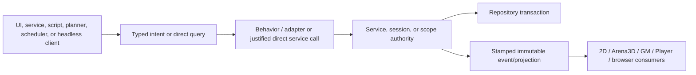

# Development Architecture Atlas

## Current-behavior contract and baseline

This Atlas is the current-behavior routing contract for feature work. The whole-product service audit was
reconciled with Main on 2026-08-27. The shared semantic-operation foundation and bounded process-local
bus delivery policy followed on 2026-08-28. Published Git history records each exact source baseline.
Source and focused tests win if a historical design brief disagrees with this Atlas.

The Atlas is shared development infrastructure. A feature body must update the affected page when
it changes a stable owner, command/event route, persistence mapping, thread handoff, revision rule,
safety invariant, or smallest focused test. The permanent Atlas task owns baseline organization and
validation; it does not own every future update.

The joined-observability core followed on 2026-08-29. It projects bounded owner-private lifecycle
evidence from the shared semantic-operation registry into an in-memory incident view and optional
diagnostic adapters. It does not replace feature authority, operation results, or the existing bus.

Current behavior and deferred design are deliberately separate. The following are **not current**:

- the [Metamorph design](<../design/Active Designs/Object Sing & Dance Factory__/METAMORPH-GALLERY.md>):
  one all-object Gallery, Slice only scope and Browse-first cards replaced in place by explicit Edit;
  the shared Slice/Talisman doorway and standalone Database Viewer retirement are designed, not implemented.
  Existing read services and domain writers retain authority. Current Slice editor source is not present
  in the supplied Main; the managed-handler fixture is not that implementation.

- a persisted Regions-layer `Show in 3D` property;
- the remaining planned `MapEditorScopeState` extractions and reusable fixture work from later
  Atlas bodies;
- semantic-operation migration of the six legacy Authoring pipeline tools and product routes not
  explicitly listed as current here; current families include manifest Script execution, Factory Object
  Save, bounded UnityFS conversion, Adventure CRUD/reviewed-step/encounter preparation, prepared-encounter
  runtime admission, current-combatant Move, and checked staged Present;
- Authoring and Workbench joined-observability presentation adoption, Scripted Walkthrough semantic
  adapters, and the deferred Player/browser endpoint, frame, and relay operation families;
- owner-specific lifecycle/stale-guard migrations identified during the bus compatibility audit.
- Operations Atlas Workboard projection, owner/runtime receipt helpers, and selective history migration;
  TA-01/TA-01A supply the contract/validator and TA-02 supplies the repository receipt store, compact current
  pointers, and deterministic read-only resolver;
- the DTDT v3 Shelf replacement described in
  `design/Active Designs/Talisman Shelf__/DTDT-V3-SHELF-DESIGN.md`; it will use only Shelf,
  Shelf Label, and Shelf Box, then remove every v1/v2 compatibility path. The current v1/v2 source and
  focused-test routes remain factual until that separately authorized application cutover lands.
- the registered `context-management/` module's future actual AI/TaliTalk destination, Adventure/Battle
  feature-screen capture, additional Assets targets, generic proposal-review UI, production action authorities,
  browser Shelf Context Workspace/SDK, generic Application Server Context transport, and later Object Factory
  capabilities; its AppServices composition, shared
  passive Monitors/Context presentation, reusable submit-time action boundary, read-only Created Things
  Character pilot, pure Adventure/Battle provider contract, and guarded Body Form Object Factory pilot
  are current, together with the bounded CM-08 structured-proposal coordinator and CM-09 shared guarded
  acceptance/lifecycle surface over the two agreed live pilots.

The historical 3D onboarding brief and dated/original architecture files are implementation history,
not current authority.

## Atlas routes

- [Action and consumer routing](action-routing.md) follows user intent through UI, bus, behavior,
  state/repository, and Authoring/GM/Player/Follow/Spawn consumers.
- [Events, revisions, threading, and lifecycle](events-threading.md) catalogs public events, stamps,
  stale-result rules, EDT/JavaFX/worker handoffs, and disposal.
- [Persistence and content lifecycle](persistence-and-content.md) covers Sources, User Assets,
  materialized rasters, captures, masks, revisions, save/reload, and data-loss invariants.
- [Service and command architecture](service-architecture.md) separates immediate service calls, bus
  delivery, state projection, correlated operations, cross-screen workflows, and current scriptability.
- [Focused-test routing](focused-tests.md) names the smallest authoritative tests for each seam.
- [Tassy managed handler runtime](<../design/Active Designs/Application Server/MANAGED-HANDLER-RUNTIME-DESIGN.md>)
  defines a component-agnostic installed-handler, private-child, readiness, replacement, and public-dispatch
  boundary plus Home's receipt-derived ready-handler shelf projection and root/technical-register route split.
  In hosted loopback mode, every newly selected bundle declares its relative-route/method access class;
  unmatched access is private, the root administrator class inherits the future ordinary-writer class, and only receipt-v1 selections
  retain the bounded legacy read/admin profile during the server cutover. Slice is the first example; no
  handler is installed or deployed yet.
- [Tassy Moonbeam delta publication](<../design/Active Designs/Application Server/MOONBEAM-DELTA-PUBLICATION-DESIGN.md>)
  defines the authenticated, headless, one-way Gallery/SRD SQLite update route. It is distinct from a
  Java server release and a component bundle; receiver installation remains a future server body.
- [Validation workflow](validation.md) defines the deterministic reference grammar, command, and
  update procedure for feature tasks.
- [Operations Atlas record contract](operations-contract.md) defines stable operations IDs, task/source/
  result/runtime separation, gates, capability routes, and the synthetic TA-01 conformance vectors.

The Operations Atlas contract is current development-validation infrastructure, not a live operational
store. Its checked-in examples are deterministic test vectors and make no claim about current tasks,
running processes, or application capability availability.
Current product behavior is grounded here, in the cited source and focused tests, and in the nearest
`package-info.java` contract. Remaining proposals live under `design/Active Designs/`; removed product
and historical design trees remain available through Git history rather than current filesystem links.

## Authority matrix

| Concern | Live authority | Durable authority | Read-only consumers |
| --- | --- | --- | --- |
| Application theme | `TalismanTheme` + UI defaults | `UserPrefs` / `ui.theme` | Settings/startup/Swing |
| Headed screen-test theme | `ForestScreenTestTheme` test extension | none | audited JUnit fixtures |
| Places/hierarchy | scope `TerrainRegion` graph | SQLite Place/version rows | 2D, 3D, GM, Player |
| Child footprints/links | Parent `TerrainRegion` | `place_footprint` | navigation, Regions layer |
| Ordered Layers | `TerrainRegion`/`RegionLayer` | Layer revisions/version order | render/project/capture |
| Immutable Sources | `RegionSource` + artifact | Source revisions/content | preview, scripts, Layers |
| Manifest Scripts | Authoring operation service | catalog + checked map commit | UI/headless clients |
| Typed raster payload | `RegionLayerRaster` subtype | content-addressed raster object | 2D/3D/GM/Player |
| Materialized Layer | `RegionLayer` | Layer revision + content SHA | render/project/capture |
| Selection | `MapEditorScopeState` | not workspace-persistent | Authoring/3D overlay |
| Saved/mask selection | `RegionLayer.selectionMaskIndex` | compact selection object | Authoring/3D overlay |
| Authoring revisions | `MapDocumentSession` | `map_version` | scope/runtime bridge |
| Composition readiness | `MapEditorScopeState` | not independently persisted | 2D/3D capture gates |
| Runtime pinned map | `MapRuntimeSessionService` | canonical map version | GM/Player projector |
| GM presentation state | `MapRuntimeSessionService` | session/prefs as applicable | GM projection |
| GM retained render manifest/assets | `GmControlRenderProjectionSource` + exact owner stamp | none | admitted private Control host |
| Player live presentation | `LivePlayerPresentation` | generation + frozen terrain | Player/browser frames |
| GM Present | `GmStagedPresentationOperationService` | checked live generation | UI/headless clients |
| 2D viewport | owning screen state | UI/session preference | owning screen |
| 3D camera and height | owning screen/view store | UI preferences | matching 3D consumer |
| Arena definitions | runtime session repository | `arena_game_object` | GM and safe Player subset |
| Arena Place presences | runtime session | `arena_game_object_presence` | GM and safe Player subset |
| Arena Groups/presences | runtime session | normalized Group tables | GM and safe Player subset |
| User Assets | Assets services | rows/files/presentation revision | browser, import, checked admission |
| Factory saves | `FactoryObjectOperationService` | ZOF or Native transaction | UI/headless clients |
| Core Morph catalog | `CoreMorphCatalogService` | validated current/version rows + content bytes |
  Object Factory browser/headless clients |
| Core Morph browser editor | `critter-editor.js` + hosted Core Morph read adapter + scoped Morph Editor |
  session draft only; no durable Core Morph revision mutation contract exists | Creature Factory Morph Editor |
| Native Forms | pure Object Factory compiler | none; offline bytes | direct/headless clients |
| Object Factory Template/motion | pure direct + transient | Native motion members | direct/Swing plus
  nested-Shelf Application Server projection |
| Object Factory runtime delivery | exact-current publication + existing composer/FK | none | Viewer, GM, Player, Walkthrough adapters |
| Local web application host | `ApplicationServerManifestStore` + loopback
  controller | owner source files | browser pages and local lifecycle clients |
| Body Form draft | typed session + Native Package | versioned component graph | Swing projection |
| UnityFS bundles | Assets converter | provenance parent + OBJ package | direct/headless clients |
| Universal VTT preview/import | `UniversalVttImportPanel` + `PersistentMapImportWorkflow` | none until explicit checked commit | canonical preview or imported Place |
| Universal VTT persistent candidate | `CanonicalToPersistentMapMapper` | none; provisional Sources lack owned artifacts | later checked import commit |
| Universal VTT persistent commit | `PersistentMapImportService` | immutable content objects + one map version | new Place with raster, Sources, constructed Features |
| Constructed spatial Features | `SpatialFeature` + `RegionLayer` | normalized Feature rows, elevated points, Layer/Source metadata | native 2D editor and immutable 3D scene snapshots |
| Types and Created Things | workspace + projection | Type associations, game objects, Places, effective media | tree/inspector |
| Character/Creature instance sheet | `GameObjectService` + `CharacterSheetService` | versioned reviewed YAML + immutable Type links | Guided Builder, Stats & Edit, Generative facts |
| Adventures | app service + repository + review | aggregate/reference/History/Relationship rows | UI/headless clients |
| Easy Tale | toolkit-neutral service/materializer/timeline projection + repository | immutable corpus,
  exact receipts, source-addressed review state, versioned narrative rows, named lane sets | bounded owner
  reads → DTDT Focus UI; headless/local checked clients |
| Operation lifecycle | service + `SemanticOperationRegistry` | registry metadata only | all clients |
| Operation domain result | feature service/session | feature repository | addressed clients |
| Operation observation | registry decorator + incident hub | bounded process memory | local diagnostics |
| Context proposals | `ContextProposalService` + guarded originating screen + registered feature authority | none; bounded process memory | review UI and exact caller |
| Bus delivery policy | `TalismanBusTopicPolicies` + `BusService` | none; process-local only | live clients |
| Bus delivery diagnostics | bounded `BusDeliveryDiagnostic` | bounded diagnostic adapters | Workbench |
| Project persistence | document/runtime repositories | verified project SQLite | sessions and migration |

The Creature Factory Morph Editor is a read-projected editor over the selected immutable Core Morph revision.
`critter-editor.js` remains the production page entry; `six-view-texture-mapping.js` owns the Factory selection
projection and mount lease; `morph-puppeteer-editor.js` owns host-local editor interaction and presentation-draft
lifecycle. Authenticated `coreMorphCatalog()` / `coreMorph(morphId)` reads terminate at
`CoreMorphCatalogService`. Selection and mount epochs reject stale or abandoned reads, and page disposal aborts
pending mount work before an editor instance can become page-owned. The editor may retain explicit session
draft state and presentation memory. Initial current-catalog hydration atomically replaces an untouched legacy
fallback in the shared Shader/Object projection, retains the selected source identity and explicit Webs, and
preserves only a compatible genuine draft or an intervening edit. There is currently no authoritative Core
Morph revision Save or Save-as route; BODY_FORM capture/save routes are not Core Morph persistence and must
not be repurposed for that gap.

`AuthoringScriptOperationService` owns the first landed manifest Script operation family. It gives the
existing UI adapter and direct/headless clients one immutable request and addressed lifecycle/result
contract while `MapEditorScopeState` and the document service retain worker, revision, commit, history,
persistence, and publication authority. The six legacy pipeline tools remain outside that contract.

`ObservingSemanticOperationRegistry` passively decorates the one AppServices registry. It returns the
delegate's exact values before projecting a bounded `SemanticOperationObservation`; projection failure
cannot change operation admission, publication, cancellation, lookup, or terminal truth. The incident hub
orders evidence by the operation's snapshot sequence, never evicts active operations, retains only bounded
terminal summaries for a fixed TTL, and exposes drop/stale/expiry counters rather than hiding missing
evidence. `SemanticOperationSafeJoin` is an opaque salted process-local correlation token, not operation
identity, authority, idempotency, recovery, or a cross-process key.

## Control manual Context consumer — GCS-01 increment

The private /control/ page now consumes the existing GM-admitted Copy/Paste routes. One page bootstrap
leases a volatile Tally Talk Box; Java `GmControlContextExchangeService` and its existing codec/delta remain
all disclosure, schema and proposal-comparison authority. The browser renders Java-admitted labels verbatim,
exports exact canonical bytes and forwards pasted text unchanged. It never constructs application-context
payloads or evaluates proposals. The generic Shelf Context SDK remains deferred.

The gateway checks both exchange workspace stamps against the server-created caller binding. The Controller
rechecks current App/GM admission, CSRF and resource-manifest digest after input and before encoded private
output. A fresh owner snapshot is compared before Copy/Paste results become usable. No Apply or feature action
is registered; production authorization rows remain empty while exact per-presence action revisions are absent.
See [the increment review](<../design/Active Designs/GM Control Screen/CONTROL-CONTEXT-REVIEW.md>).

## Ownership layers

Views may retain local presentation controls such as zoom, splitter position, surface mode, and
camera. `DTDTSplitter` owns declared anchored-side pixel stability while `WorkspaceLayoutService`
owns named UI-only snapshots. Neither bypasses the behavior/session boundary for document or runtime
mutations.

## Revision families

Do not compare unrelated counters as though they were one clock:

- `workingRevision` changes for each authoring working-snapshot mutation.
- `documentVersion` changes only after a successful durable repository store.
- `compositionRevision` changes after the matching working revision is installed for rendering.
- composition request IDs order asynchronous working-snapshot publication.
- `selectionRevision` orders transient selection state.
- `RegionLayer.revision` and `RegionLayerRaster.revision` invalidate Layer/render caches.
- `ScriptRegistry.catalogRevision` orders complete bundled-plus-user package catalog snapshots.
- script dependency fingerprints protect declared inputs/outputs without rejecting display-only edits.
- runtime object and Group revisions order immutable GM/Player projections.
- 3D capture, presentation, composition, scene, camera, and build generations protect distinct stages.
- Player `liveGeneration` identifies explicit presentation publication, not authoring working state.

## Cross-cutting invariants

1. **Player privacy:** Player payload types contain no authoring Sources, hidden Layers, provenance,
   GM controls, unrevealed state, or private text topics.
2. **Follow vs Spawn:** Follow consumes complete stamped source presentation and matching camera.
   Spawn accepts one complete safe bundle, detaches, and owns independent Place/view/camera state.
3. **Read-only Arena3D terrain:** Arena3D never mutates Heightmap, Terrain, Selection, or document
   history. GM object/cohort gestures emit typed runtime commands only after stamped acceptance.
4. **Durable-before-public:** runtime canonical versions advance after successful map persistence;
   structural changes remain pinned until explicit reconciliation.
5. **No partial async commit:** stale, cancelled, failed, or conflicting Script, Geo Tables, selection,
   capture, and persistence work must not install partial output.
6. **Source preservation:** imported and captured artifacts are immutable, content-addressed, and
   admitted before a document revision can reference them. Explicit Heightmap export creates or
   replaces only a managed Place Source through exact target/name/usage guards; it never writes an
   external provenance file, and uncommitted admission retracts its artifact.
   `JavaGuessHeightmapScript` produces only the typed Heightmap Layer; explicit Water Map extraction
   belongs to `JavaExtractWaterScript`, which stages one managed PNG Source without Python/Pillow.
7. **Capture preservation:** a stale/unreadable parent recipe cannot erase the last successful child
   Layer, Source, raster, or selection payload.
8. **Undo/Redo:** one coherent document operation is one history entry; a new edit after Undo clears
   Redo. Runtime object/group history is separate and bounded.
9. **Playback:** paused or restarted clocks drop inactive wall time. Active in-process delay is drained
   in bounded steps; reload does not simulate offline movement.
10. **Extension trust:** imported Python runs in a child process but is not an operating-system sandbox;
    imported Java is explicitly trusted in-process code. Both runtimes can publish only declared
    protocol outputs, which remain subject to the existing isolated validation and checked commit.
11. **Lifecycle:** every scope/window closes subscriptions, timers, executors, leases, and JavaFX scene
    resources; reconstruction does not retain disposed component trees.
12. **Adventure review:** planning packages only bounded allowlisted, revision-stamped context. No
    Adventure or canonical entity mutates until the user approves a current plan and invokes one
    app-service-owned semantic step. Only a Character composite may retain exact Assets child components
    and partial committed truth; atomic steps never do. Placeholder Places carry no entity identity and
    never imply geometry.
13. **Semantic-operation truth:** acceptance, bus delivery, progress presentation, cancellation request,
    and committed result are distinct. Screens may attach or reconstruct but never become required
    operation machinery. The registry owns bounded lifecycle reporting only; feature services retain
    authorization, work, revisions, persistence, review, privacy, and exact domain-result authority.
14. **Bus delivery truth:** mutation commands, UI requests, retained state, and transient events have
    explicit trusted policy. The bus never retries business work, and delivery diagnostics never imply
    acceptance, commit, cancellation, rollback, or success. Current production startup uses owner query
    or subscribe-then-request convergence; no production topic opts into core retained state.
15. **Context handoff truth:** each Ask AI/Open in TaliTalk submit installs one admitted immutable
    snapshot through the application service before constructing the canonical payload. Destination
    acceptance is handoff truth only; it cannot claim provider completion, an answer, or mutation.
16. **Context proposal ownership:** a screen may confirm only an opaque proposal receipt it prepared while
    still available. Foreign-screen, stale-snapshot, hidden, and closed-owner confirmation fail closed;
    close disposes pending confirmation without dispatch. A response contract never grants authority.
17. **Application Server ownership:** `0.0.0.0:3002` is the sole shared LAN web host. Page/capability
    registration never creates feature authority; owner assets hot-reload as one exact digest snapshot,
    source-controlled component version/new-feature metadata projects read-only to Home and About, and a
    rapid Creature receipt may replace only that page's complete asset/metadata projection. A selected
    managed component may run only as a Tassy-supervised private loopback child behind its registered public
    prefix; Tassy owns package admission/lifecycle/dispatch while the component owns request semantics. Its
    operational state is not a domain store, and the existing project SQLite remains the durable authority.
    Database writers share the one fail-closed OS lease, and legacy `8766` remains untouched until an
    explicit parity/rollback cutover receipt is approved. The separate Talisman Online Server profile binds
    only to loopback `4220`, admits one exact immutable project backup read-only, projects one bounded real
    Seasons catalog, keeps lifecycle recovery in a fixed SSH Operator command, and adds no authority to the
    shared LAN host.

## Coverage map

| Area | Primary owner route | Atlas page |
| --- | --- | --- |
| Authoring and navigation | Map Editor views → bus → behaviors → scope/session | action routing |
| Heightmap/Terrain/Geo | Layer/canvas → commands → scope/coordinator commits | action routing |
| Script Manager/extensions | request → operation service → runner → checked commit | action/events |
| Image-derived Scripts | bundled manifest → Java handler → staged result → scope commit | action routing |
| Masks and selections | canvas/layer view → selection commands → scope/history | action routing |
| Parent Capture | Layers view → capture commands → isolated commit | content lifecycle |
| User Assets | Asset Manager → monitor behavior → service/repository | content lifecycle |
| Factory ZOF | workspace → `FactoryObjectOperationService` → Object library transaction | all pages |
| Native Form | recipe → pure compiled artifacts | service architecture / focused tests |
| Object Factory Template/motion | pure creature compile/edit → exact Native Save; browser compendium is
  disposable projection only | all pages |
| Object Factory Body Form | typed edit → OF-01 compile → OF-02 requalify → Swing state | all pages |
| UnityFS conversion | local source → Assets operation → checked commit | all pages |
| Universal VTT preview | Asset Manager VTT tab → reader → canonical document → local viewer | action routing / events-threading |
| Service/command architecture | AppServices → services/behaviors → repositories/results | service architecture |
| Process-local bus | trusted catalog → bus policy → exact live recipients | service/events |
| GM runtime | runtime views → runtime bus → behavior/session | action routing |
| Player/Follow/Spawn | safe projection → bundle/view/window owner | action routing |
| Arena3D | EDT capture → worker mesh → JavaFX controller | events/threading |
| Runtime objects/groups | GM views → runtime commands → runtime session/store | action routing |
| Adventure Authoring | Contents → selected object or review → canonical services | all pages |
| SQLite storage | document/runtime repositories → normalized schema | content lifecycle |
| Critter Image Creation | controller → service → Creature resolver → roles | all pages |
| Application Server | lifecycle → loopback adapter → hot typed manifest → owner bundle/capability |
  all pages |

## Control browser increment: retained and saved layout

The Control client now binds its existing retained Shelf host to the public composed-memory v2 store
and the existing GM-private optimistic preference route. This is browser presentation only: no new
runtime, renderer, session, bus, service, domain command or Player publication. P0's real current-Place
summary remains the visible content while owner render lifecycle/asset receipts are outstanding.
See the [increment review](<../design/Active Designs/GM Control Screen/CONTROL-SAVED-LAYOUT-REVIEW.md>)
and the current service, event, persistence and focused-test routes above. Full GCS acceptance is separate.

## Project Kit review entry

The current `atlas-active-designs-project-kit-001` review surface opens locally at
`development-atlas/review/index.html` (Talisman source reference: `review/index.html`). It is an offline HTML/CSS/JS projection over
repository architecture and Project Kit design, not a competing source of truth and not a built Kit.
