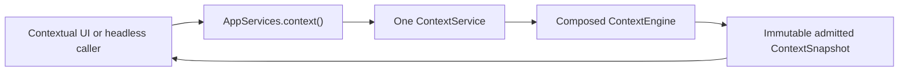
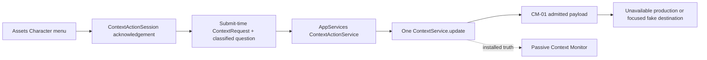
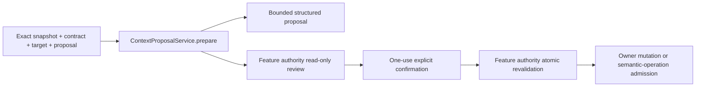
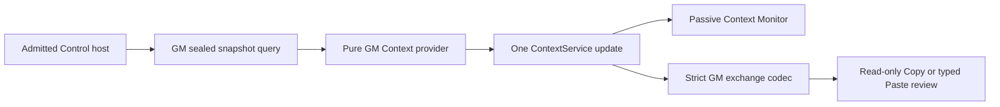
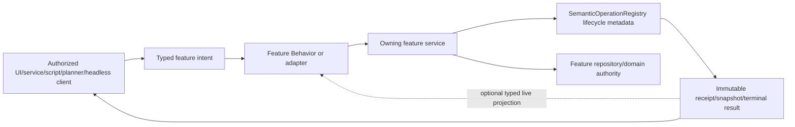
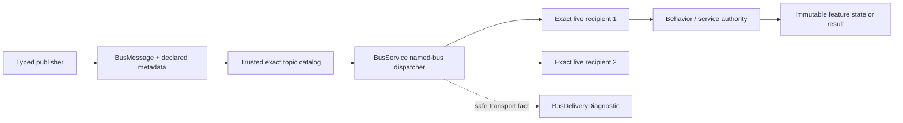

# Action and Consumer Routing

Slice-native direct/headless clients prepare an ObjectFactorySlicePackage and exact SliceSaveRequest,
then call FactoryObjectOperationService.newSliceSave and submit. The addressed completion carries
sliceReceipt, never a fabricated model SaveResult. Native loadSliceDocument is a direct checked read.
This source-only route adds no browser endpoint or automatic Type/Character association.

## Context Management direct-query route

`AppServices.context()` returns the one application-lifetime `ContextService`. CM-02 composes it with the
standard policy; CM-05, CM-06, and CM-07 add pure Assets Character, Adventure/Battle, and Factory providers.
The call is a synchronous local read-only query:

CM-03 adds a typed transient `OPEN_MONITORS` shell request. The Monitors menu and combined title-bar
button route through `ShellUiBehavior` to the one `MonitorsWindow.showMonitor` action; neither route
captures context or bypasses the service.

CM-05 also sends a deduplicated immutable visible Created Things Character selection request directly to the
same service after a settled click. The passive monitor therefore follows current selection without a
screen-to-screen call. A reusable action later installs its own fresh snapshot from the same current
screen authority.

CM-04 adds reusable direct Ask AI/Open in TaliTalk actions. CM-05 registers them for one read-only Created
Things Character pilot:

The destination may accept, reject, or report unavailable; that immediate handoff fact is not an AI
answer, TaliTalk conversation completion, provider result, or mutation. It receives no raw request or
context authority. Later feature owners supply classified request inputs and separately reviewed
destinations rather than constructing another service or payload map. The Assets screen captures the
current Character selection/revision at submit and rejects stale/closed state. The provider contributes
only bounded generic PROJECT metadata and performs no live read.

CM-06 adds a third pure provider route. A feature owner may pass one already-captured immutable Adventure/
Battle value through `AdventureBattleContextProvider.request`; explicit invocation, focus, and ordered
selection remain distinct. The provider performs no feature read, and this body adds no screen action or
passive publisher. Later Adventure/GM adapters must revalidate their own revisions before constructing the
request and continue using the one Context Service and reusable actions.

CM-08 adds a separate direct proposal/confirmation route over the installed snapshot:

Proposal-only contracts stop at the immutable proposal. Confirmed-action contracts must match the exact
allowlist and a registered fixed descriptor, and the owner returns an opaque current-state stamp. Context
rechecks installed snapshot/contract/target, registration generation, and confirmation token, consumes the
pending value, and dispatches at most once. The feature authority alone atomically revalidates its stamp
and decides semantic success. CM-08 registers no production authority and uses the CM-06/CM-07 request
seams with focused fakes only.

CM-09 routes the two agreed live pilots through one `ContextualActionSurface`. Preparation invokes the
originating pilot's submit-time feature capture, installs that snapshot, and retains only an opaque
proposal/snapshot receipt in the surface. Confirmation must return through the same still-available
surface and recaptures the originating target/focus/selection roles before dispatch. A foreign surface is
rejected without consuming the owner's proposal; owner close discards its exact pending receipt without
authority dispatch. The shipped Character and Body Form menus remain
answer-only, and fake test authorities are not production identifiers or routes. Adventure/Battle remains
provider-only.

The service registry's `app.context` and `app.contextProposals` entries are diagnostic discovery of the
same application-owned instances, not second command routes. No bus publication, repository, provider/
live-data read, AI call, screen-to-screen invocation, or production mutation is introduced by CM-02
through CM-09.

The GM Control read-only adapter adds one direct query over the same service:

`GmControlContextExchangeService` captures once for Copy and again for Paste currentness. It exports only
Java-admitted Place/object labels and bounded scalars under
`talisman.gm-control-context-exchange/v1`. Production `authorized_changes` is empty because the GM owner
does not yet expose a per-presence action revision. The /control/ consumer uses the existing admitted
Context Copy/Paste HTTP routes through `GmControlApplicationServerGateway`. The codec/service still has no
browser, clipboard, bus, provider, persistence, Apply or feature-mutation authority. Browser input is never
mapped directly to an action. The current manual consumer is not the deferred generic Shelf Context SDK.

## Shared semantic-operation route

The shared contract defines the service-owned route an adopting feature uses for accepted mutations and
long-running work. Landed bounded adopters include Authoring manifest Script, Assets Factory/UnityFS, and
Adventure ordinary CRUD/reference, reviewed step/encounter preparation, and the reviewed GM admission,
combat-move, and staged-Present families; unrelated legacy routes remain on their prior owners:

An adopting feature service registers its bounded `SemanticOperation.OperationDescriptor`, authenticates the
caller, validates exact target/revision/approval guards, and returns acceptance immediately. It owns all
work, review, cancellation effect, transaction, persistence, and typed domain-result semantics. The
registry preserves only queryable bounded lifecycle truth. A Behavior may publish the same immutable
snapshot over the existing typed bus for responsive stage-by-stage UI, but delivery is not acceptance or
success and a later screen reconstructs from registry state instead of requiring missed events.

No screen-to-screen invocation is introduced. For an adopted operation, closing a screen does not cancel
service-owned work, and headless/UI clients reach the same feature service. Immediate read-only queries and
presentation-only controls remain direct when a bus/operation round trip would add no semantic value.

### Passive joined-observation route

AppServices wraps the one registry in `ObservingSemanticOperationRegistry`. Every mutation still completes
on the delegate first. The wrapper then best-effort projects an owner-private
`SemanticOperationObservation` into `SemanticOperationIncidentHub`; failure loses diagnostic evidence only.
The hub's read-only incident view exposes bounded current active and recent terminal summaries plus factual
drop/expiry counters. It is not a feature query, event bus, retry queue, or result store.

An owner may derive one `SemanticOperationSafeJoin` after receiving exact accepted operation identity and
attach it only to existing evidence: an Activity row, the currently executing recipient attempt, a real
memory job, or a typed factual map-performance stage. No adapter can derive the join from a bus ID, UI
control, thread, time proximity, payload, or label. Later local diagnostic views consume only that opaque
join; they cannot navigate, query, cancel, retry, or claim business completion through it.

## Process-local bus delivery route

`AppServices` installs `TalismanBusTopicPolicies` before product publishers are constructed. The catalog
registers every fixed APP, DTDT, and USER topic by exact constant and trusted owner. A mixed shell action
uses the bounded `BusTopicPolicyResolver`; callers cannot select or override transport policy.

The catalog distinguishes four transport policies:

| Policy | Current route |
| --- | --- |
| mutation command | one live-recipient attempt; no no-handler retention, replay, or core retry |
| UI request | exact active lifecycle epoch plus bounded TTL; expiry is checked at dispatch |
| retained state | opt-in latest-only state, exact owner key/stamp, bounded count and TTL |
| transient event | live-only projection, invalidation, progress, or order signal |

Current product topic registration uses mutation-command and transient-event policy only. UI request
and retained-state contracts are available for separately reviewed owner migrations, but a route that
lacks an exact lifecycle epoch is deliberately live-only rather than given unsafe late delivery. Existing
startup convergence therefore remains direct current-state query or subscribe-then-request. Heavy
Authoring, Viewer, Assets, GM, and Player projections are not stored in the core bus.

APP, DTDT, USER, and custom buses remain serialized inline. Reentrant publication on the active owner is
depth-first; a contended publisher may return while the active owner later drains accepted work FIFO.
RESOURCE keeps one owned worker. A failed recipient produces one failure fact and does not rerun an
earlier successful recipient. `BusObserver` receives only metadata-only diagnostics and cannot alter
delivery by throwing. `DataBaseBusService`, `DebugConsole`, and `BusMonitorScopeState` consume that safe
record without retaining or rendering arbitrary payloads or raw failures.

Bus enqueue and handler-return facts remain transport evidence. A Behavior or service must still validate
exact scope, target, revision, privacy, and current lifecycle before mutation. A delivered command is not
an accepted semantic operation, durable commit, Player publication, or terminal result.

## Adventure Authoring

`AdventureAuthoringPanel` is a standalone product surface whose tree projects
`Worlds -> Seasons -> Adventures`. Compact dialogs create one Adventure, add an exact existing Place
or Created Thing, or record a notable placeholder Place. The dialog closes after the operation; it is
not a permanent asset or Place browser. The panel and direct/headless callers share the one AppServices-
owned `AdventureApplicationService`. Its immutable worker-backed reads return Worlds, Adventures, coherent
snapshots, and exact reference candidates. Its four owner-private v1 semantic operations are Create
Adventure, Update Adventure, Add Exact Reference, and Add Placeholder Place. `AdventureRepository`
remains the sole checked SQL authority; exact World, Adventure, Place revision, or Character/Created Thing
`updated_at` guards are rechecked in the write transaction. Placeholder Places have no source identity,
revision, or geometry implication and are never routed to map/runtime services.

Adventure Contents is the persistent selected-object browser inside the product surface. Adventure
Overview returns to metadata and reviewed planning; an exact Character opens the Character Sheets
pane; an exact geometry-backed Place opens the Map / Place workspace; a placeholder Place opens a Place
workspace that explicitly claims no geometry; and another Created Thing opens a bounded exact-identity
workspace. The Character pane owns a compact identity masthead and the character-local Combat, Statistics,
Images & Description, History, and Relationships Focus Bar. CS-02 populates Combat and Statistics from
exact canonical sheet fields. CS-03 consumes already-admitted Assets media to show one deterministic
primary presentation image, all five exact image roles, and bounded canonical Physical Description/Visual
Direction. Both bodies are read-only projections; editing, image generation/attachment, and the remaining
focus content belong to later reviewed bodies.

Character selection calls `AdventureApplicationService.loadCharacterPane` with the exact Adventure
ID/revision, reference ID, Character ID, and source revision. On the existing service worker, the read
reloads the coherent Adventure aggregate, rechecks the exact Character reference, and loads the active
canonical Character plus `updated_at` through `GameObjectService`. The immutable result is installed only
while panel lifecycle, selection generation, Adventure/revision, and every reference/source identity still
match. Its bounded Combat/Statistics values retain field availability, so a missing canonical value remains
unavailable instead of becoming a guessed zero or derived display-name fact. This route creates no semantic
operation, bus, registry evidence, provider call, or mutation.
The service rechecks the Character revision again after the complete request/document projection capture;
only that confirmed identity record supplies returned masthead facts. A concurrent checked sheet save is
therefore stale and cannot install mixed values or field-presence metadata.
The CS-03 Assets consumer retains exact association and asset revisions for Icon, Full Portrait, Token,
Silhouette, and Best Illustration. It checks role metadata again after bounded decode and exposes no path,
provider, prompt, or credential. Full Portrait, Illustration, Icon, Token, then Silhouette is the fixed
primary precedence; absent or unusable roles remain visible rather than falling through display names.

CS-04 History is the first Character-pane edit route, but it remains Adventure-owned context rather than a
canonical Character-sheet mutation. The pane sends one immutable exact-identity event request to
`AdventureApplicationService`; the service worker delegates to one checked `AdventureRepository`
transaction. The panel owns only immediate busy truth and exact-generation EDT projection. It has no direct
repository mutation, Assets edit, bus, provider, or runtime path.

CS-05 Relationships follow that same route for one exact source Character reference and one exact attached
target reference. The focused editor freezes target kind/ID/source revision/provenance and bounded narrative
fields before `AdventureApplicationService` delegates one checked transaction. Existing targets are not
changed by display name, and a stale/unavailable target cannot commit. Completion is projected only to the
still-current Character/content generation.

The service preallocates opaque Adventure/reference identities and owner operation identity before effects,
keeps normalized prose owner-local, and places only bounded IDs, revisions, digests, lifecycle, and exact
result references in `SemanticOperationRegistry`. Same-key/same-fingerprint admission reconstructs the
original retained operation; conflicts reject. Cancellation and owner deadlines are honored before the
committing lifecycle phase; after commit, exact committed truth wins. Panel close detaches guarded
projection only and does not close the AppServices-owned service. This family does not invoke planning,
media, GM/Player runtime, Walkthrough, or encounter preparation.

Planning first builds an `AdventureContextPackage` from the exact Adventure, World, Place ancestry,
attached placeholder Places, and attached Characters. Entries expose only bounded, allowlisted metadata
and Character-sheet facts; raster bytes, geometry payloads, and unrelated database content are absent.
`AdventurePlanningResources` reloads the versioned prompt, YAML response contract, fixture, and rubric
from packaged text resources for each request.

Adventure Authoring exposes no provider selector. `Plan with AI` opens a separate modeless
`AdventurePlanningWorkbenchPanel` titled `TaliTalk — Adventure — <exact adventure name>`. Each window
owns one isolated `AdventurePlanningWorkbenchSession`, provider selection, context selection,
conversation, Talk Inspector, response history, and actionable candidate. Multiple windows can coexist
without sharing conversation or candidate state. Provider choices in that workbench are exactly Codex,
OpenAI, OpenAI Image, and Ollama. Codex keeps its dedicated-conversation adapter. The other three are
injected through one fresh `TalitalkPlanningProviderSession` opened by `TalitalkService` for that window.
It reuses the existing TaliTalk Ollama endpoint/model/client and OpenAI Image client, and adds only the
official OpenAI Responses text client. Capability comes only from a registered adapter and its exact
configuration/credential state; an absent or unavailable adapter cannot dispatch through a substitute.
Adventure performs no independent port/model probe and never represents a credential value. Model and
endpoint edits remain window-local, Health is explicit, and only the provider identity is remembered as
a presentation preference.

The Talk Inspector is the exact text sent for a turn: provider/system instructions, Adventure request
and Answers, selected context entries and stamps, prior conversation, current message, and output
contract. `CodexAdventurePlanningProvider` consumes only the public bounded
`services.codex.CodexConversationAdapter` and requests schema-free plain text. OpenAI sends the same
inspected text to `/v1/responses`; Ollama receives the same inspected text through its existing resident
client, and OpenAI Image returns bounded real image bytes to `TalitalkResponsePanel`. The workbench reuses
no legacy TaliTalk cache authority. Provider replies remain conversation until the user explicitly
copies a text reply into the separate candidate, validates it, and chooses Accept Plan. Image replies
retain binary presentation and an identity-only textual transcript and cannot become YAML candidates.

`AdventurePlanCodec` preserves the original candidate text exactly, then admits the editable reviewed
Response as pure YAML or one Markdown-fenced YAML plan. Admission rejects unknown or invented targets,
requires explicit new-Character facts, preserves requested counts/levels, admits multiple Characters
and placeholder Places, and prevents attached context names from becoming creation work. Acceptance
checks the exact originating Adventure identity/revision and installs Summary/Questions, Response, and
Ordered Steps only for that identity. Sending, reset, cancel, close, and acceptance mutate no product
data; Approve Plan and each Do It remain mandatory.

`AdventureRepository.loadSnapshot` reads exact Adventure metadata and references in one transaction.
`AdventureAuthoringPanel` installs the whole snapshot behind identity/generation guards, keeps Request,
Answers, original/reviewed Response, Summary/Questions, and plan session keyed by exact Adventure ID,
and resolves dirty metadata through Save/Discard/Stay before selection changes. Late A completion cannot
overwrite selected B. Three persisted and clamped vertical dividers make Request, Summary/Questions,
Response, and Ordered Steps independently useful.

The resident root implements `AdventurePresentationSelection` for observation-only consumers. One
correlated request retains the current persisted Adventure, chooses the stable first existing Adventure,
or targets an exact ID/revision. Immutable polling results expose only lifecycle, exact selected
identity/revision, resident/showing/pending/dirty/quiescent/closed truth, and reference-kind counts.
Dirty, pending, Dictation, running Do It, closed, stale, superseded, and cancelled requests never enter
Save/Discard, planning, provider/media, or repository mutation. READY is published only after the exact
selection generation installs one coherent snapshot; no Adventure prose crosses the contract.

Talk beside Request opens one isolated Dictation review area through
`MacSystemDictationSession`. Adventure captures the exact Adventure ID/revision, Request edit
generation, and selection range before native startup. Only explicit Insert Dictation applies an
accepted result at that captured range. Request edits or Adventure switches make the result stale;
they never redirect it into current state. Talk does not preview, plan, contact a provider, or mutate
an Adventure.

`AdventureApplicationService` owns the bounded `AdventurePlanSession`, exact reviewed response, explicit
approval reference, one current-step reservation, stale-generation rejection, and
Pending/Running/Succeeded/Failed/Skipped/Attention Required state. Any Response edit
during review invalidates approval and steps until exact revalidation. Once a non-review semantic
side-effect starts, the request/response and aggregate mutation controls lock until the ordered plan
reaches a safe terminal boundary. Pending rows lead with Do It then Skip; Running and terminal rows
remove those controls. A Character creation row adds optional Create Icon/Create Token choices; these
are frozen execution conveniences, never provider-authored actions. Failed offers explicit Retry; a
partial Character result enters Attention Required and offers linked Retry or Continue Without. Completed
meaningful results carry
exact artifact identity into `AdventureArtifactViewer`, which opens a modeless reviewed-draft revision
or canonical Character/sheet ID without name lookup or navigation.

Each `Do It` submits one owner-private `execute-reviewed-step:v1` operation to the app-scoped service.
The service worker invokes `CanonicalAdventureActionExecutor`; Character review/create uses
`GameObjectService`, publishes the public Assets library-change event, and the final add uses the exact
created Character ID through `AdventureRepository`. Selected Icon/Token choices
first request the secret-free readiness descriptor, then call only
`CharacterMediaGenerationBus.Client.startWithCurrentSettings` with exact Character ID/revision/role.
Assets owns provider settings, prompt/context, provider dispatch, candidate bytes, checked Keep/reject,
admission, association, and exact Created Things reveal. Adventure keeps the composite parent running
through frozen children and records exact Assets session/result references. Assets exposes no semantic child
operation identity, so partial components keep `childOperation` null rather than fabricating one. A committed
Character plus any declined,
failed, cancelled, or uncertain child becomes immutable partial committed truth; retry runs only incomplete
unambiguous roles against the same Character. Adventure never constructs an Assets provider request.
Successful Character, sheet, and admitted-role work survives later media failure. There is no Show Me,
arbitrary click/code, batch/Do All, or autonomous route.

Reviewed encounter preparation uses the same app-scoped service through the owner-private
`prepare-reviewed-encounter:v1` operation. UI and direct/headless callers freeze one exact Adventure
revision, semantic terrain, catalog level band/version/digest, bounded candidate count, and complete Pi
state. The owner-local coordinator generates deterministic candidates without a runtime Place or screen,
then publishes complete review state. Exact approval of one operation/review generation/candidate/digest
realizes quantities once from its retained Pi continuation and calls the sole checked repository commit.
The result is a dedicated prepared-encounter header plus ordered members and one Adventure revision
advance. The Adventure panel is only a grouped, immediately acknowledging EDT projection: it submits and
queries through the same service, approves/declines/cancels exact retained review identity, detaches on
close, and reconstructs within the service epoch. Owner capacity rejects before semantic admission, and
owner completion retention remains aligned with registry duplicate confirmation. Decline, precommit
cancellation, or local realization failure commits nothing; only checked repository failure is rolled back.
Runtime admission and presentation are absent.

## Prepared encounter runtime admission

GM UI and direct/headless callers share `GmPreparedEncounterAdmissionService` and its sole
`gm-control:admit-prepared-encounter:v1` operation. Preparation freezes the exact project/database/
runtime scope, prepared ID/revision/digest, post-commit Adventure revision, catalog version/digest,
pinned document/version, target Place, Arena/Group/selection/store revisions, placement, formation,
visibility authorization, stable graph IDs, idempotency identity, correlation, approval, and deadline.
Execution reloads prepared and Adventure truth asynchronously through `AdventureApplicationService`;
it never reads Adventure SQL or rerolls prepared quantities. Each ordered member resolves exactly once
by catalog-qualified source identity. Missing, ambiguous, unsupported, lookalike, stale, or changed truth
fails before runtime commit.

After precommit cancellation/deadline checks, the service calls exactly one
`MapRuntimeSessionService.admitPreparedEncounterGraph` boundary. It rechecks every runtime guard under
the session lock, constructs and Place-fits the complete graph detached from live state, and wins one
optimistic `ArenaObjectStore.save`. One member installs one definition and selected target-Place
presence without a Group. A cohort installs every ordered definition/presence, one nonnested
`TEMPORARY_ARENA` Group, one expanded Group presence, and one Group selection with derived highlights.
Only a successful save installs the graph, adds one history entry, advances revisions, and publishes
one runtime state. Checked save failure is rolled back; all earlier failures are not committed. No
partial outcome exists.

Visibility is `GM_ONLY` unless exact frozen authorization requests `PLAYER_ELIGIBLE`. Eligibility only
sets the existing `playerVisible` projection input for an already-live generation; admission never calls
Present, stages a frame, changes `liveGeneration`, or opens browser/relay delivery. Registry state is
owner-private and bounded to IDs, revisions, digests, codes, counts, one cohort reference, and one
selected-target reference. Complete ordered definition/presence IDs remain only in the typed owner result.
`GmRandomEncounterPanel` acknowledges immediately, exposes explicit precommit cancel, and detaches on
close without cancelling app-scoped work; retained same-epoch truth can reattach by operation ID.

## Current-combatant checked movement

The real GM Play panel and direct/headless clients share `GmCombatMoveOperationService` and its sole
`gm-control:move-current-combatant:v1` operation. Preparation freezes exact app/project/database/service
epoch, document/version, active Place, combat revision/round/segment/current activation, current and
inspected presence, not-spent/rules identity, Arena/selection/store revisions, exact position, retained
route digest, movement-cost digest, idempotency/correlation, and deadline. One activation/presence accepts
one in-flight move; the same key and fingerprint reconstructs, while a mismatch conflicts and a new
service epoch never replays an earlier process-local request.

After precommit cancellation/deadline checks, `CombatRuntimeSessionService` rechecks exact encounter
truth and calls one `MapRuntimeSessionService.commitCombatMovement` boundary. The runtime computes a
detached candidate from current terrain geometry/elevation/cost, saves it optimistically, then installs
position, retained route, one history entry, and Arena/store revisions. Combat installs movement-spent
truth without ending the activation or starting global playback, then the runtime publishes one coherent
state. A newer runtime revision makes deferred publication an idempotent no-op; it never replaces the
newer projection or changes an already-committed operation to failed. No route, zero allowance, or no
effective movement succeeds as `NO_CHANGE` without save, revision, or spent truth. A stale guard or
precommit cancel/deadline is `NOT_COMMITTED`; checked save failure is `ROLLED_BACK`; a commit-winning
cancellation is `TOO_LATE`. No partial or externally uncertain outcome exists.

The typed owner result retains exact position, distance, cost, budget, route-remainder, combat, Arena,
selection, and store stamps. Shared registry evidence is bounded `OWNER_PRIVATE` identity/revision/digest/
scalar truth and excludes names, stats, effects, full route/map/terrain payload, Player-private state, UI,
Viewer, paths, SQL, and raw errors. The transient Combat bus only acknowledges and projects the result;
it never establishes acceptance or commit. Present, Player generation/transport, and Viewer gestures are
absent.

## Local Switchboard status and Master refresh

The loopback-only dashboard under `scripts/status-dashboard/` reads one Switchboard-maintained JSON
snapshot. Product rows never infer state from Git or task prose in the browser. A `Working now` click
may record only the exact selected task ID as a pending detail question; the next explicit manual
status update refreshes that task's passed/remaining summary without exposing its transcript or logs.

The page has no automatic reload, timer, heartbeat, polling loop, or recurring continuation watchdog.
`Update Status Now` is the sole status-refresh route: its token-checked POST invokes one fixed,
duplicate-safe continuation of the existing Switchboard task, whose fixed prompt permits only passive
inspection and one atomic snapshot update. The browser cannot supply a task ID, prompt, command, or
interval. The request never messages, wakes, continues, or mutates an owner task, creates recurring
work, or contacts Journey. Leaving the page open consumes no Codex turn.

Expanded task detail is presentation-only. Its close control and Escape route remove the `detail`
query with browser history, restore document scroll and opener focus, and do not mutate or archive
tasks. The browser document is the sole vertical scroll owner: detail and task rows remain in normal
flow, while only genuinely wide table content receives an independent horizontal viewport.
`Waiting for user` is the one status route that leaves the dashboard: after validating the exact
snapshot-owned pinned Codex task ID and selecting the first ordered user-action gate, its summary pill
shows the exact authorization/decision and opens `codex://threads/<task-id>`. The top gate callout
offers the same route. A missing question or invalid/missing identity retains the passive detail route;
the dashboard never guesses an owner, sends a prompt, or wakes the task merely to obtain detail.
For blocked, waiting-user, or otherwise gated tasks, that presentation puts the exact gate first:
user action before dependency/external environment before technical or monitor infrastructure.
Coordinator failures are explicitly status-monitor infrastructure, never an unlabeled product
blocker. Ungated active and idle details render no empty gate section.

A pinned Full Test Suite owner routes through the same task table and detail controller as product
owners. Every currently pinned owner remains visible regardless of completion or runtime-loaded state;
unpinned owner history stays in the snapshot but is not rendered. Its snapshot-owned test-run
projection keeps immutable tested branch/worktree/commit identity plus report-derived phase, elapsed
time, counts, completion coverage, and grouped failures.
Assertion failures remain product failures; worker/JVM/report aborts remain execution-infrastructure
failures. Passive refresh may read existing reports but must not wake or mutate the suite.

`Relaunch Talisman` is a distinct guarded administration route. The page first renders an immutable
review from the canonical root `version.properties` and snapshot-declared exact landing candidates.
If the review gate is unavailable, its button remains click-responsive but opens a presentation-only
dialog with the exact blocker and confirmation that no request was sent; it cannot reach the POST.
Confirmation immediately disables repeat submission and paints an accessible `Relaunching Talisman…`
acknowledgement before the POST. The redirected page preserves that heading plus the exact durable
stage while the controller is running, then renders the terminal success or failure result.
The token-checked, single-flight controller revalidates published-tip, focused-verification, clean,
upstream, and current-main ancestry gates before any landing; advances only the canonical Alpha build
and reviewed notes; publishes main; then performs exactly one fixed login-shell Gradle launch. Each
stage writes atomic local status, and any failed stage prevents later stages and remains visible.
There is no arbitrary command, test, Workbench, maintenance, database, or public-network route.

## Interface localization

`AppServices` creates one `LocalizationService` from the startup `UserPrefs` snapshot. It owns the
effective process locale, packaged UTF-8 lookup, English source fallback, parameter formatting, and
missing-key diagnostics. Centralized UI owners consume that service; screens must not load bundles
or invent fallback rules independently. During incremental migration, every lookup carries its
legacy literal as the final usable fallback.

Talisman Settings owns `ui.interface.language` through the typed `InterfaceLanguage` choice. Apply
persists the requested language but does not mutate open Swing trees; the next application start
resolves it once. Unsupported system locales fall back to English with structured startup logging.
The application Settings action opens that modal dialog directly without opening or making TaliTalk
its owner. One bounded non-resizable size remains stable when credential status completes, and long
credential guidance wraps inside its column rather than widening every Settings control.
The migrated application shell covers Settings, all shared menu-bar chrome, Help, and DTDT
view/tab/control metadata. Dynamic product/user names remain data; localized patterns provide the
surrounding UI wording. The Activity monitor localizes its own window chrome and progress patterns,
while operation descriptions remain producer-owned runtime content. Additional locales and
remaining screen-specific literals are later bodies.

The Authoring Saved Selections popup localizes its chrome and action guidance through the same
service. Saved selection labels remain user-authored Region data and are never bundle keys.

The Character 3D-model inspector localizes its controls and status patterns. Asset display names,
triangle counts, DB-owned bytes, and STL parsing remain data/service concerns rather than keys.

Resource-key parity is not visible-UI completion. `scripts/i18n/audit_visible_ui.py` deterministically
reports selectable-locale key gaps and likely unkeyed visible literals across Java Swing/AppAware
construction, DTDT metadata, and Player Web resources. Its versioned allowlist is limited to reviewed
proper names and technical tokens. Coverage reports identify completed screen bodies and the remaining
candidate baseline rather than describing the whole product as localized.

Settings now routes its remaining widget-edge accessibility name, credential progress/status/guidance,
refresh action, Keychain service pattern, and color-chooser titles through the process localization
service. About uses the same service for its semantic title, accessibility identity, subtitle,
locale-formatted creation date, and section heading. The canonical release identity and bounded
newest-first release history remain product/version data. About keeps the current release first in a
scrollable history and retains prior releases from the canonical root resource. Product-window and
About DTDT titles retain English literals only as
compatible fallbacks paired with `titleKey` metadata.

Shared custom window chrome receives that same process localization service from DTDT popup and
Scripts-window owners. Its resize tooltip and accessibility name therefore follow the selected
locale without making the chrome a locale or preferences owner.

The Authoring 2D command bar resolves its complete navigation, save-state, Control handoff, zoom,
selection, brush/height, terrain-choice, tooltip, accessibility, and locked-state presentation through
the process localization service. Zoom Out, Fit, and Zoom In remain explicit controls, but the bar
composes no numeric zoom-percentage readout. `MapEditTool` and `TerrainType` remain domain
identities; renderers localize their visible labels without changing persisted enum names or command
payloads.

The shared Authoring/GM Control Region Tree uses the same process locale for search, recent Places,
authoring context actions, deletion/export/conversion feedback, runtime read-only titles, and
accessibility. Place names, nicknames, IDs, and unavailable reasons remain document/domain data and
are inserted only through localized patterns.

Geo Tables acquisition localizes its complete import/capture/generate/accept workflow, worker and
validation states, detail/operation renderers, tooltips, status, and accessibility through the
process locale. Generation detail and operation enums remain persisted/provenance identities; only
their combo-box presentation is localized.

The shared Authoring/GM Control Parent Overview localizes its stable title, mode and
zoom/camera/layer controls, empty-canvas presentation, pan/view tooltips, and accessibility through
the process locale. The second identity row is the exact displayed parent Place name, without a
localized status prefix; Place names remain document data. Presentation mode, zoom, divider, and
layer-visibility persistence are unchanged. The persistent
The overview exposes exactly one local-only Display Layers filter: canonical visibility remains in
the Authoring Layers inspector or Control Play Layers surface. The reused Display Layers popup
receives locale from that overview owner; its title and empty state are localized while Layer labels
and kinds remain document/domain data.
The GM Navigation `Show Layers` action still reveals the embedded Play Layers surface; it is separate
from the Overview toolbar and does not add a second layer-stack button there.

The modeless Heightmap Adjustment palette receives the Authoring command bar's process locale and
localizes its complete tool guidance, mode/control labels, enum presentation, unit patterns, dynamic
Apply states, tooltips, and accessibility-adjacent text. Persisted `MapEditTool`, flatten-mode, edge,
unit, brush, selection, and document identities remain unchanged.

Korean uses canonical language tag `ko` and is selected through the existing restart-to-apply
Settings preference. `LocalizationService` loads the UTF-8 Korean bundle and falls back per key to
English. Missing keys and invalid message patterns are separately diagnosed; invalid localized
patterns attempt the English pattern, then the safe caller literal, without showing diagnostics in
ordinary UI. After theme installation and before UI creation, `LocalizedFontResolver` preserves
every capable per-role Swing font and replaces only fonts that cannot display the Korean mixed-script
sample, choosing from installed families by glyph coverage rather than a hard-coded family.

German, Polish, and French use canonical language tags `de`, `pl`, and `fr`. Their Settings choices
and UTF-8 resource roots use the same restart-to-apply and per-key English fallback contract;
reviewed surface translations can therefore land incrementally without exposing missing-key text.

The SRD Creature creation dialog localizes its title, field labels, and persistence choice through
the process service. Definition identity and name, Campaign value, and multiline notes remain data;
the existing bounded text columns and word-wrapped notes area are unchanged.

## Offline Help

`AppServices` owns one `HelpService` loaded from the packaged English index and Markdown topics.
The Help menu delegates Contents, Search, and Context Help to that owner. One
`AppWideHelpShortcutService` intercepts F1 and supplies the current Swing focus owner; the service
walks stable component names through containment to the nearest indexed context, then falls back to
`application.getting-started`. Individual screens do not install Help listeners.

One modeless `HelpWindow` is reused and raised across requests. It owns topic/search presentation,
Back/Forward/Home history, internal `help:` links, and UI-only `UserPrefs` geometry. Help resources
are application content, never campaign/database state, and require no network access. DTDT
`helpId` metadata is copied to built Swing components and takes precedence over stable component
names during context resolution. DTDT `titleKey` metadata resolves view, tab, and control titles
through the process `LocalizationService`; absent keys retain legacy literal titles.

Help selects its locale-scoped catalog from the process effective locale. Korean loads packaged
`app/help/ko` YAML and Markdown; an absent locale catalog falls back atomically to the English
catalog, while semantic topic IDs, aliases, contexts, and navigation remain language-independent.
Each catalog declares schema version, content version, and one compatible installed-release prefix.
`HelpService` rejects unsupported schemas and invalid parent/related edges, classifies topics as
concept, task, or interaction reference, and exposes release alignment plus missing requested IDs as
support diagnostics. Missing IDs still open the home topic without placing diagnostics in ordinary
Help prose. `HelpWindow` renders validated related-topic edges through its existing history owner.
Help topics and User Assets Markdown payload previews render through one shared read-only
`MarkdownDocumentViewer`. The component owns Markdown-to-HTML presentation and top-of-document reset;
Help retains history/link navigation, while Assets retains worker loading, stale-result checks,
selection, and preview-mode ownership.
The canonical catalog expands in coherent reviewed slices. The first broader slice describes the Help
browser itself as linked concept, task, and interaction topics, so search, contextual F1, history,
related buttons, internal links, version display, and missing-topic fallback are documented by the
same stable graph they use. Locale catalogs retain identical semantic IDs and edges; an untranslated
slice points explicitly to its reviewed English resources instead of presenting unreviewed copy.
The first application-area slice links Authoring's workspace concept, checked Place-tree navigation,
and Navigation-menu/Command-L/Command-P interaction reference. The MAP.EDITOR and
MAP.EDITOR.LAYERS names remain existing semantic component contexts resolved by the application Help
service; the Authoring package neither registers a parallel listener nor owns a Help window.
The next application-area slice links GM Control's workspace concept, Player-safe Present task, and
Play/navigation interaction reference. APP.GM.CONTROL.ROOT and APP.GM.CONTROL.PLAY remain existing
semantic component contexts. Help documents the landed projection and visibility boundaries without
adding a publication route, runtime listener, or feature-owned Help window.
The Assets slice links its workspace concept, Files-to-managed-content import task, and navigation/
picker interaction reference. USER.ASSET.IMPORTER.ROOT and USER.ASSET.IMPORTER.MEDIA remain existing
DTDT contexts. Help records the canonical managed-bytes/provenance and guarded picker boundaries but
does not scan, import, attach, select, or create another Assets service/window owner.
Deeper Control Help adds linked Combat, Object Repository, and Groups graphs. Those topics preserve
the runtime boundaries above: encounter state versus reusable definitions, Place presence versus
Delete Everywhere, and durable Campaign versus play-only Group membership. They add no commands.
Deeper Player Help separates the privacy-filtered presentation concept, browser endpoint task, and
local Follow interaction reference. It adds no endpoint, frame publication, camera, or process owner.
Deeper Authoring Help links isolated Layer editing/generation, checked Accept/Discard, and stale-result
interaction guidance. It documents the existing editor/document boundary and adds no command or worker.
Installed modules may expose `HelpTopicContributor` service providers. `HelpService` discovers them
without a central module list, orders them by stable module identity, requests the process locale,
and merges their immutable topics before globally validating topic/alias uniqueness, parents, and
related edges. Providers own reviewed locale content and truthful English fallback; Help retains one
search, context, diagnostics, fallback, and window owner for the combined catalog.
Diagnostic and error presenters reuse `HelpTopicLinkButton` for explicit semantic deep links. The
control carries the same stable Help ID used by contextual F1, localizes only its action label, and
delegates activation to the application `HelpService`; it neither owns a second Help window nor
places internal diagnostics into ordinary topic content.
The audited inventory now includes Arena-reset failure and blocked managed-store rebind. The latter
retains exact missing/mismatched/store-identity detail and links to `assets.source-repair`; activating
Help cannot retry or mutate the blocked operation. Other presenters require a matching reviewed topic
before migration rather than receiving a generic link.
Deeper Assets Help covers Created Things role attachment, Generative acceptance, and VTT inspection
without adding an asset transaction, provider request, persistence route, or preview owner.

## Players / Control / Author / Assets / Factory / Adventure shell presentation

`ApplicationWindowManager` owns the persisted `Separate windows` / `Combined window` choice and
all EDT-confined migration. `DTDTRegistryService.createPopupShell` rehosts an already-built content
root with normal menu, icon, geometry, and close cleanup ownership; migration detaches before shell
disposal, so it never rebuilds or duplicates any combined product component graph. Combined mode maps
Player Presentation, Control, Author, Assets, Factory, and Adventure to one ownerless root, while
`CombinedProductContent` owns the active card,
one retained selector group hosted by the managed `TalismanWindowChrome` title bar (or the Swing
menu bar when managed chrome is unavailable), and literal Control-Tab switch. Managed chrome is
the exclusive selector host, so native/global menu rebuilds cannot reparent the controls. The active
role is persisted, and selector state, visible card, focus, and menu routing change atomically.
Focus and menu routing resolve the active role, and follower/auxiliary windows remain role-owned.
Named Workspace Layout application restores shell mode before opening its declared windows, then
restores the selected combined surface. Separate windows retain their complete
independent rectangles while combined mode uses its own stable popup geometry. The exact live Asset
Manager root is rehosted rather than rebuilt, so its workspace state and application-scoped services
survive mode and selector changes without duplicate listeners, scans, or admission routes. The exact
Factory root follows that retained lifecycle while sharing the canonical Assets workspace state and
keeping its transient editor draft local. The exact Adventure Authoring root likewise retains its
selected Adventure, plan state, and services across separate and combined hosts.

Observation-only consumers may acquire one `ApplicationWindowManager` transient product-selection
session over the already-open combined shell. The session changes only the retained
`CombinedProductContent` card on the EDT: it does not write the active-role preference, open or close a
window, change shell mode, or invoke a product action. Only one session may own the exact shell
identity/generation. Close restores the captured role only when the shell remains current and no user or
other owner has selected a newer role; otherwise that newer selection wins.

`ProductWindowTitlePresenter` routes each product's exact active Place name to its separate window
or to the retained per-role title in `CombinedProductContent`. Selector changes apply the displayed
role's stored title atomically, so a hidden product cannot overwrite combined-shell identity.

All collapsible `DTDTSplitter` instances default to double-clicking the divider to collapse the
smaller allocation; a tie collapses the second allocation. The detached pane remains live behind a
single-click drawer that restores its prior expanded allocation. Authoring and Control keep their
outer left/right docks normally draggable with their established anchored allocations and collapse
behavior. Only each immediate 2D/3D local control-bar-and-canvas split declares a 52-pixel fixed first
side and a non-draggable semantic divider. That divider retains the default pointer, paints one thin
control-bar disclosure arrow instead of a resize grip, and keeps double-click collapse/reopen attached
across theme reconstruction. Declarative drawer labels provide friendly collapsed captions; Authoring
and Control opt their shared first-side Places drawers out of the ordinary direction glyph so the
visible vertical caption is exactly “Places”. The option changes presentation only: the whole drawer
remains the restore action, and its tooltip, accessible name, vertical orientation, and exact child
component IDs remain intact. The GM
product-level screen bar uses divider-free stack composition, so it does not add another separator
above the map display. Authoring's non-collapsible combined splitter is the explicit exception: its
retained controller compares the
actual semantic 2D and 3D allocations, selects the larger surface's existing standalone tab through
the canonical DTDT tab owner, and selects 2D on an exact tie. Theme reconstruction retains the
splitter-owned callback; no pane collapses or root is recreated.

`CombinedMapLayoutController` presents one responsive mutually exclusive selector in exact order:
2D, 3D, 3D Left, 3D Right, 3D Top, and 3D Bottom. Authoring and Control retain their DTDT tab roots
only as invisible cards; the selector activates those exact standalone or combined roots and never
recreates a canvas or camera. All six choices use the same themed icon-only button presentation;
the standalone orthographic-map and perspective-terrain artwork remains distinct from the four
arrangement icons while shared sizing, selected borders, tooltips, accessibility, and Icon Labels
stay catalog-owned. The shared Authoring/Control Place Overview and desktop Player popup
project the same selector and exact 3D-side semantics. Existing stored mode plus orientation values
migrate deterministically to one selected choice, while horizontal and vertical divider allocations
remain independent. Follow consumes its stamped source choice without exposing local controls.
Authoring's one retained workspace top bar places the selector immediately after its three-button
Navigation block, followed by Undo/Redo, Cursor plus Micro, and the five ordinary Selection actions.
The five icon actions no longer share equal-width layout with transient text decisions, so every icon
keeps the shared standard toolbar dimensions across wrapping, resize, and shell rehosting.

## Performance Workbench lifecycle routes

| User action | UI owner | Worker owner | Replacement/target boundary |
| --- | --- | --- | --- |
| Update & relaunch Talisman | Workbench Controls | `MapPerformanceTargetProcess` | isolated Talisman only |
| Update & relaunch Workbench | Controls | self updater | main update/build/handoff |
| Restart Workbench | Controls | restarter | same invocation, no update/build |
| Capture Hang Report | Controls | target/capture worker | read-only bounded incident bundle |
| Include intrusive follow-up | Controls checkbox | target/capture worker | live histogram/JFR only |
| Capture Data State | New editor | capture controller | read-only probe |
| Inspect semantic memory | Memory | target worker/source | cached probe or atomic file |
| Control semantic memory | Memory | target worker/probe | exact-instance baseline or release |
| Open Memory & Large Bytes | Talisman menu | Swing EDT | retained modeless monitor |
| Start focused analysis | Performance Analysis | analysis control worker | owned synthetic 4 GiB child only |
| Review baseline candidate | Performance Analysis | analysis control worker | checked private run evidence |
| Accept reviewed baseline | Performance Analysis | analysis control worker | append-only private baseline ledger |
| Review finding decision | Performance Analysis | analysis control worker | checked current finding evidence |
| Apply reviewed decision | Performance Analysis | analysis control worker | append-only private finding ledger |
| Review fixed verification | Performance Analysis | analysis control worker | exact run-owned checked proof |
| Apply fixed and verified | Performance Analysis | analysis control worker | append-only proof-digested decision |

The two Workbench actions share one launcher gate, retain the selected profile, and never call the
target process. `MapPerformanceWorkbenchSelfUpdater` owns update/build and
`MapPerformanceWorkbenchRestarter` owns both replacement handoffs.
`MapPerformanceWorkbenchBuilder` runs only the build/spec task and supplies the exact new Java 25
invocation to the existing token/PID readiness handoff. Immediately before either replacement
launch, the handoff snapshots and flushes all live Workbench dialog bounds. A failed checkpoint
aborts the replacement and keeps the current Workbench running.

The separately installed macOS **Talisman** Desktop applet resolves the canonical sibling
`talisman-main` worktree at installation time. A double-click checks the exact Talisman main-class
process signature and starts `./gradlew --no-daemon run` with the canonical runtime preferences only
when no Talisman process is already running. It never updates Git, builds as a separate preliminary
phase, stops a process, or launches a second Talisman instance; detached output goes to the canonical
Workbench runtime log directory.

`AppServices` owns one `MemoryTelemetrySnapshotPublisher` beside the process-scoped telemetry core.
Its daemon worker serializes one already-bounded immutable snapshot and atomically replaces
`runtime/workbench/diagnostics/talisman-memory-<instance>.json`; old derived publications are bounded
without touching application data. `MapPerformanceProbeServer` returns the exact cached serialized
value at `GET /map-performance/memory` with schema, instance, and stale headers, so its HTTP worker
never calls the telemetry core, traverses payloads, or forces collection. The Workbench target worker
requests that endpoint and also scans validated instance files. `MapPerformanceMemorySnapshotSource`
rejects incompatible, oversized, partial, corrupt, or filename/instance-mismatched publications,
de-duplicates live and file views of one instance, and keeps stale files inspectable after a target
stops. Only the immutable selected snapshot crosses to the Swing EDT, where the Memory tab presents
freshness, process/heap/system facts, categories, top/all owners, closed-owner obligations,
jobs/reservations, warnings, coverage, Copy All, and exact JSON save. Workbench never derives semantic
owners from RSS or other OS measurements.

The complete grouped summary and Overview/Residency/Owners/Jobs/Events/System presentation lives in
the Workbench Memory tab. During its evaluation, Talisman also retains the original modeless monitor
menu/window over the same telemetry and residency owners. Fresh and stale instance files remain
read-only in Workbench. Only a selected live endpoint enables baseline and confirmed
eligible-byte release controls. Each POST carries the selected publication's exact instance UUID;
the probe rejects a restarted instance, applies only its fixed action allowlist, republishes
immediately, and returns no payload objects.

`MapPerformanceDiagnosticCapture` extends the existing Capture Hang Report route rather than adding
a second diagnostics system. Its normal phase calls one bounded command boundary in fixed order for
process/CPU/RSS, three JVM thread dumps, heap, swap, pre-collection histogram, NMT, macOS sample and
virtual-memory evidence, semantic snapshot, logs, then launch configuration. Each step produces
separate output/error files and an honest manifest record; failure never short-circuits later steps.
The unchecked intrusive follow-up runs only afterward for the live-only histogram and JFR dump.
Heap dump has no Workbench route. The capture directory and sibling zip remain derived diagnostics.

Workbench checklist review and manual `New…` use separate
`MapPerformanceWorkbenchDialogLifecycle` owners. Each owner keeps one independent modeless
top-level window that is not owned by the main frame, raises it on repeat invocation, and restores
independently persisted usable-screen-clamped bounds. While either is visible, returning to the main
frame stays inside Workbench and does not run the Talisman companion-focus transfer. Review actions
continue to call the canonical checklist mutation and bug-declaration routes. Approved, More
Clarity, and Wait each call a separate atomic mutation; none toggles either of the other two. Wait
does not enter the Not Fixed or manual-entry route. Manual Save returns
through the panel's asynchronous manual-entry prompt to
`MapPerformanceRecentChangesPanel`, which performs the existing loader mutation only after the
modeless editor completes.

`MapPerformanceChecklistSemanticAppearance` owns presentation-only review precedence across the
compact queue and Checklist Review: Wait blocked yellow, else More Clarity semantic green, else
ordinary theme presentation. It reads both retained states and never calls the canonical loader.

`Capture Data State` is an injected asynchronous action in the manual complaint editor. The
Workbench worker requests one partial bundle through the existing localhost probe, stages only
same-stamp allowlisted PNG evidence under `runtime/workbench/data-state`, and returns an editor
result to Swing. The editor appends the typed context below existing prose and adds staged images
through its existing attachment request model; Save remains the only canonical mutation. Missing,
timed-out, failed, or stale roles remain visible. GM 3D images are always identified as omitted by
privacy policy and never enter the attachment model.

## Scripted Walkthrough routes

`ScriptedWalkthroughWorkbenchPanel` is the presentation owner inside the existing Workbench. It
loads or edits versioned YAML, presents the ordered timeline and deterministic report, and delegates
dry-run and pause-aware execution to `WalkthroughPlaybackEngine`. Dry run queries the target
capability allowlist but executes no action.

`ResidentWalkthroughCatalog` additionally exposes the immutable classpath **Showcase Walkthrough**.
Workbench selects its own existing Scripted Walkthrough tab on the EDT before loading that source.
The bundled resource has no filesystem path or save target; editing detaches to an unsaved draft and
Save chooses an external destination.

`HttpWalkthroughTarget` crosses the dedicated localhost `ScriptedWalkthroughProbeServer` boundary.
After UI composition, `AppUiBootstrap` binds one `TalismanWalkthroughTarget` to that probe. The target
maps named product roles through `ApplicationWindowManager`, safe component aliases through live
DTDT instance names, and named window/mode/component states through the same owners. It never uses
screen coordinates or arbitrary reflection. Guided presentation adds a temporary synthetic cursor
and highlight in the resolved control's layered pane, then invokes the real Swing button action.

Every semantic action receives an operation ID. Workbench may save that ID and wait for its exact
terminal outcome; unrelated completion cannot release the wait. Version 1 permits window open, mode
activation, and four non-destructive Map tool actions. Window close is understood by the YAML model
but omitted from target capabilities, so validation rejects it until confirmation policy exists.
Stop and Escape request cancellation through the same target boundary. Checkpoints ask Talisman to
render the named product window to PNG and Workbench writes the bytes under its runtime directory.

The resident Showcase adds the separate `presentation.show` action. It is observation choreography,
never an alias for `component.invoke`: a narrow owner adapter may
transiently reveal an existing safe surface, return an immutable readiness result, display a guided
cue, or run a presentation-only gesture. Optional content returns correlated SKIPPED truth and
playback continues. The report attributes later operation-wait skip/failure to its originating screen
and lists visited screens, skipped screens with reasons, and failed required steps separately.

Combined-shell role changes, nested product tabs, asynchronous previews, and Viewer gestures use their
owners' transient observation sessions and exact identities. Walkthrough does not write preferences,
open missing resident content, infer readiness from widgets or delays, or use a generic tab helper.
The resident YAML contains no window open/close, generic invocation, checkpoint, capture, provider,
network, persistence, or video step.

For Assets and Factory, the resident choreography begins `AssetsFactoryObservationSession` against
exact canonical scope `USER.ASSETS.WORKSPACE`. Assets reveals only Media, Generative 2D, Generative 3D,
VTT Import, Data Import, and 2D/3D Search; Cut & Paste remains a correlated skip. Media and Factory
selection use one identity returned by `availableSelections`, copied into an exact-ID/revision request.
The Factory step waits for the matching immutable READY snapshot before requesting the
capability-minimal Viewer Showcase orbit. Missing, stale, unavailable, and failed owner truth is never
replaced by a display-label or elapsed-time guess.

`PerformanceScriptedProfileContract` does not replace the product-probe route. It binds only fixed
candidate sources whose repository path, SHA-256 revision, semantic action/state allowlist, synthetic
fixture, and display mode all match. Candidate inclusion alone is not run authority. The closed
`PerformanceAnalysisWorkloadCatalog` admits only `scripted-smoke-author-select-v1`, whose exact selector
uses a fake semantic target inside the owned 4 GiB child. Its output is orchestration evidence, not a
product responsiveness claim. The other candidate remains non-executable; arbitrary YAML, live-project
context, selector, fixture, mode, and capability expansion fail before admission.

## Authoring composition root

`MapEditorScopeRegistry` leases one `MapEditorScopeState` per semantic map scope.
`MapEditorBehaviorBundle` installs scoped `MapEditorRegionBehavior`, `MapEditorSourceBehavior`,
`MapEditorHeightBehavior`, `MapEditorPipelineBehavior`, `MapEditorWorkspaceBehavior`, and
`MapEditorDocumentSyncBehavior` subscribers. DTDT panels render the shared state and publish typed
`MapEditorBus` commands. They do not mutate `MapDocumentSession` directly.

`MapEditorScopeState` remains the large composition/publication owner. It holds the installed Region
graph, selection, caches, editor history ordering, composition pairing, pipeline/geology workers,
status, and document bridge. `MapEditorHeightmapExportCoordinator` is its first internal extracted
workflow; the ScopeState facade and behavior/view API remain unchanged. Later extraction work must
preserve this public contract and move one cohesive workflow at a time.

Ordinary document mutations capture one revision-stamped structural snapshot at the ScopeState boundary.
`MapDocumentService` owns coalescing and off-EDT deep-copy/comparison/persistence; latest Layer-display
state coalesces by exact scope/Place/Layer. A stale worker result cannot replace a newer live scope state,
and an explicit flush/isolated operation remains the only route allowed to wait for pending document work.

Layer update commands carry the exact active Place identity captured by their Authoring control.
`MapEditorSourceBehavior` rejects a command after active-Place navigation instead of applying a
same-named structural Layer ID to the newly active Place.

`MapEditorScopeState` owns one transient active Layer editor session per semantic scope.
`MapEditorLayerEditorRegistry` explicitly admits Heightmap, Geology, Terrain, Surface, and Image
Overlay independently from legacy editable defaults. The Layers toolbar's selected-state **Edit**
action publishes `CMD_LAYER_EDIT` with exact Place, Layer, and Layer-revision identity. With no pinned
target it pins the browsed Layer; with another row browsed it deliberately switches targets; with the
pinned row browsed it unpins. Ordinary row browsing, visibility, pointer, and opacity actions remain
independent and never retarget or close the editor. The pinned row stays visibly identified even when
hidden or while another row is inspected. Both retained 2D hosts project the same session through
`MapEditorActiveLayerPanel`; pure 3D constructs no editing panel.
The scope copies the exact target once into an isolated working payload with bounded two-step local
history. Retained 2D rendering and Authoring's attached read-only 3D capture substitute that payload
at the canonical Layer's normal stack position, including editor-only presentation of a hidden target,
without changing persisted visibility. A transient composition revision makes the attached 3D host
cancel stale builds and recapture the latest working texture/height; persistent and non-Authoring
captures continue to read the canonical Region.

`CMD_LAYER_EDITOR_RESOLVE` carries the exact session and request sequence for the active panel's sole
Accept control. Accept uses
`MapDocumentService.commitIsolated` with document-session, Place, Layer, kind, and baseline-revision
guards to replace the exact canonical Layer in one document transaction. Discard makes no document
mutation, restores the current accepted Layer, clears local history, and advances the request sequence.
Asynchronous editor tokens add a monotonically increasing request identity; only the current BUSY
token can install, while later requests, Discard, navigation, and canonical revision changes reject
late results. Dirty deliberate switching or exit presents localized Save Changes / Discard Changes /
Keep Editing; only successful checked Save or explicit Discard can close or switch, while Keep
Editing, stale context, and failed Save retain the exact target and working payload. The requested
destination Layer is held separately through accepted-Layer refresh, so Save or Discard continues to
that exact target while ordinary row browsing never prompts. Place navigation,
Layer reset, and Layer removal likewise require explicit resolution. Place navigation presents one localized
Save Changes / Discard Changes / Cancel decision at the scope boundary. Save reuses the exact checked
Accept transaction; Discard invalidates late work without canonical mutation; only a successful exact
resolution continues to the still-current destination. Cancel, stale context, and failed Save retain
the source Place and working payload. `MapEditorTopBar` projects COMMITTING as one centered,
input-blocking `MapEditorSaveActivityOverlay`; it is installed and painted before synchronous checked
persistence begins and removed only after the scope publishes the terminal Accept result.

The top Authoring Undo/Redo route orders Selection, active-editor working changes, and accepted
document history. Each working mutation adds one `WORKING_LAYER` position beside its bounded payload
snapshot, so the top command dispatches the chronologically latest kind without substituting a
Selection undo. Accept collapses the working positions into one accepted document transaction;
Discard or editor exit removes them. The removed undo-shaped local Discard button is not a second
Undo authority.

The Heightmap provider is hosted directly by `MapEditorActiveLayerPanel`. Shared Freeform Selection,
Grid Selection, Square Brush, Round Brush, and Micro controls remain in `MapEditorTopBar`;
operation-specific controls are owned by `MapEditorHeightmapEditorPanel`. Brush shape is a top-level
tool choice, not a provider checkbox, and Radius applies to either brush. Feathered and Hard edge
falloff are explicit working-brush choices. Brush commands and Apply
Operation mutate the isolated typed raster
and temporary elevation range only when the exact canonical semantic Heightmap remains visible and
active. Apply Operation consumes the current canonical `RasterSelection`; contour-derived masks need
no alternate Heightmap writer. Hidden semantic Heightmaps reject Brush and Apply without working or
canonical mutation. Retained 2D and attached 3D rendering consume that same working Region projection.
Smooth runs on the scope worker and requires the exact current editor request plus Selection revision
before installation. Accept commits the raster and elevation range together once.

The Geology provider is hosted by that same panel and reuses the existing categorical import,
parent-capture, and Pi generation engines. `MapEditorGeologyEditorPanel` owns presentation and
worker cancellation; `MapEditorScopeState` captures the exact editor/source request and installs only
the latest result into the isolated `GeologyLayerRaster`. Shared Brush publishes
`CMD_GEOLOGY_STROKE`; Select applies the chosen `GeologyClass` through the same working-payload
history. Paint writes only the selected class. Smooth uses a stable neighborhood majority inside the
square/round footprint and active Selection intersection, and can emit only valid Geology classes.
Import, capture, generation, Brush, and Selection all apply the canonical water/no-data exclusion.
Accept remains the only canonical document transaction and carries reviewed provenance.

The Terrain provider follows the same route through `MapEditorTerrainEditorPanel`. The panel reuses
the existing image conversion, parent projection, five-scale altitude-aware Pi generator, Operation,
and exact Water-mask constraint. Its direct category picker is restricted to the nine approved land
types. Shared Square/Round Brush and Select replace only the isolated working `TerrainLayerRaster`;
Paint writes one valid category, while Smooth regularizes boundaries by class majority without
numerically interpolating IDs and respects the current Selection. Generation
captures exact editor, Place, Layer, Water-mask, request, and seed identity. Only the latest result
installs, and the common Accept command is the sole document/persistence boundary.

The Surface provider is hosted by `MapEditorSurfaceEditorPanel`. Import, exact ancestral footprint
capture, and `GeographySurfaceGenerator` results replace only the isolated working
`ImageLayerRaster`; retained 2D and attached 3D render it before the shared Accept transaction.
Generation binds exact accepted Terrain/Geology Layer and raster revisions, physical cell scale,
internal seed, and instruction. Capture binds exact ancestor Place/Surface/revision. Late or changed
inputs cannot install or Accept, and accepted generated Surface status becomes stale without
discarding its last pixels. `MapEditorImagePaintPanel` adds Paint, Blur, Sharpen, Smooth Edges, and
Sharpen Edges through `CMD_IMAGE_STROKE`; Square/Round, Radius, Strength, Hard/Feather, Micro/Grid
addressing, and active-Selection clipping replace only the exact pinned working raster.

The Image Overlay provider is hosted by `MapEditorImageOverlayEditorPanel`. It reuses the same direct
working-pixel panel without exposing generation controls. Layer-row opacity remains the sole opacity
control and mutates the exact isolated working Layer; retained 2D and attached 3D consume temporary
pixels and opacity until common Accept. Add Layer remains the sole Source-admission route, ordering
and removal remain their existing checked Layer commands, and dirty active-overlay removal cannot
discard working data.

The retained workspace `MapEditorTopBar` alone uses `AdaptiveTopToolbarLayout`. Navigation, six-way
View, history, Cursor/Micro, and Selection remain indivisible ordered groups on one horizontal line.
All use standard dimensions when they fit; constrained widths compact non-recent icon groups while
retaining the most recently used fitting group or groups at full size. A compact icon's ordinary
action and group promotion share one click, and widening restores every group without replacing
action, selection, disabled, tooltip, accessibility, or semantic-icon state.

## Authoring action routes

| User action | UI owner | Command group | Mutation owner | Consumers |
| --- | --- | --- | --- | --- |
| Select/open Place | Region tree/top bar/canvas | `CMD_REGION_*` | region behavior/scope | all views |
| Change Place structure | Region tree/context UI | `CMD_REGION_*` | region behavior/scope | tree, 2D, 3D |
| Move Place subtree | Region tree reviewed dialog | `CMD_REGION_MOVE` + exact working revision | region behavior/scope | shared trees, all Place consumers |
| Edit Place nickname | Region inspector | `CMD_REGION_NICKNAME` | region behavior/scope | shared trees, child-name suggestions |
| Create footprint child Place | canvas pre-commit dialog | `CMD_REGION_CREATE_SUBREGION` with name, exact footprint, capture choices, and revision | region behavior/scope | tree, 2D, 3D, captured child Layers |
| Create independent child Place | selected Place-tree node pre-commit dialog | `CMD_REGION_CREATE_CHILD_PLACE` with name, capture choices, and revision | region behavior/scope | tree, captured child Layers |
| Edit footprint/link | parent UI/canvas | footprint commands | region behavior/scope | navigation |
| Remove Region marker | exact footprint context menu | `CMD_REGION_REMOVE_FOOTPRINT` + working revision | region behavior/scope | canvas, tree, navigation |
| Pull child Heightmap into parent | exact footprint context menu or child Region inspector | `CMD_REGION_WRITE_HEIGHTMAP_TO_PARENT` + exact Place/footprint/Layer/document/Selection revisions | scope projects the exact child semantic raster directly through the persisted footprint into parent semantic-raster pixels; document service commits | parent 2D/3D, history, persistence |
| Pull parent Heightmap into child Selection | exact Selection context menu | `CMD_REGION_PULL_HEIGHTMAP_FROM_PARENT` + exact parent/child/footprint/Layer/document/Selection revisions | region behavior/scope working payload when editing; otherwise document service | selected child pixels, history, persistence |

The parent-to-child command accepts either an exact persisted child footprint or the existing exact
full-parent mapping of an independent child Place. With the exact child Heightmap editor open, the
same Geography sampler mutates only that editor's working raster and enters one top-ordered working
history position. Undo/Redo restores the exact before/after working Heightmap without changing the
Selection; Save/Discard/Stay protects Layer and Place navigation. Without that editor, the existing
isolated document commit remains the sole raster mutation.
| Change grid/extent | Region inspector | Region/grid commands | region behavior/scope | raster/views |
| Change Sources | Sources/Layers views | `CMD_SOURCE_*` | source behavior/scope | preview/scripts |
| Create/update Layer | Layers view | Layer/overlay commands | source behavior/scope | 2D/3D/runtime |
| Pin/switch/unpin active Layer editor | Layers-toolbar Edit action + browsed Layer | `CMD_LAYER_EDIT` + exact Layer revision; checked dirty transition | source behavior/scope | retained 2D editor panels/canvas |
| Resolve active Layer work | active editor Accept; dirty Save/Discard/Keep Editing decision | `CMD_LAYER_EDITOR_RESOLVE` or exact scope session/request | source behavior/scope + document service | retained 2D panels/canvas, persistence |
| Edit working Heightmap | shared Brush or Select + active provider operation | height stroke/selection command + exact active session | height behavior/scope working payload | retained 2D + attached 3D preview |
| Edit working Geology | active provider acquisition or shared Brush/Select | exact editor request or `CMD_GEOLOGY_STROKE` | height behavior/scope working payload | retained 2D + attached 3D preview |
| Edit working Terrain | active provider acquisition or shared Brush/Select | exact editor request or `CMD_TERRAIN_STROKE` | height behavior/scope working payload | retained 2D + attached 3D preview |
| Edit working Surface | active provider import/capture/generation or shared image brush/Selection | exact editor request, `CMD_IMAGE_STROKE`, and source/input revisions | scope working image payload | retained 2D + attached 3D preview |
| Edit working Image Overlay | shared image brush/Selection or Layers opacity selector | `CMD_IMAGE_STROKE` + exact active session/baseline Layer revision | scope working image payload | retained 2D + attached 3D preview |
| Parent Capture | Layers view/dialog | capture commands | source behavior/scope | child Layer/render |
| Paint Heightmap | canvas/palette | height commands | height behavior/scope | 2D/3D/persistence |
| Adjust selected Heightmap | canvas/dialog | selection operation | workspace behavior/scope | 2D/3D/history |
| Export Heightmap | Layers metadata | `CMD_HEIGHTMAP_EXPORT` | scope export coordinator | Place Source |
| Paint Terrain | canvas | terrain stroke | workspace behavior/scope | 2D/runtime |
| Run manifest Script | Script Manager | immutable invocation | operation service | lifecycle + result |
| Run legacy Pipeline | legacy pipeline UI | pipeline command | pipeline behavior/scope | Layer/Source |
| Select/move | 2D controls/canvas | selection + target identity | behavior/scope | overlay/history |
| Undo/Redo | top bar/menus | ordered Selection + active working Layer + accepted document history | scope/document service | all Authoring views |
| Zoom/pan | owning canvas | zoom/view commands | canvas-local/scope | owning 2D view |
| Overview view | overview controls | local zoom/fit/top | overview camera store | overview |
| Filter Place Overview Layers | shared overview Display Layers | none | overview-local override | overview only |
| Open auxiliary window | shell/Layer UI | `MapEditorWindowBus` | window registry | Script/Arena3D |

`MapEditorRenderSupport` owns transient 2D Grid presentation. It obtains `GridGeometry` from the
exact rendered Place and streams only geometry intersecting the Swing paint clip. Square grids draw
bounded visible edges directly; hex grids retain no logical-cell list and deterministically sample
visually dense detail to a fixed per-repaint cell bound. This presentation rule never changes Grid Layer
visibility, logical cell identity, terrain/overlay rendering, or persisted Place data.

The manifest-driven Script Manager supersedes the former hard-coded six Pipeline tabs. Its modeless
Place-pinned window owns a searchable catalog lane, generated typed run form, runtime choice, package
metadata, and Import/Reload/Starter/Folder/Remove actions. `ScriptRegistry` publishes one immutable
catalog snapshot assembled from bundled manifests and validated schema-version-3 packages under the
user Script Manager directory. A user package replaces only the same `(script id, runtime)` catalog
entry; removal reveals any bundled entry underneath it. `ScriptPackageManager` admits a bounded
folder, ZIP, direct Python file plus companion manifest, or direct Python manifest through a staging
copy; traversal, symlinks, non-regular files, oversized trees, and ambiguous package roots are
rejected before atomic replacement. Package mutation controls are disabled while a Script runs.

For manifest execution, `MapEditorScopeState` is the UI adapter and scope port, while direct/headless
clients use the same public `AuthoringScriptOperationService`. Both submit one immutable invocation and
receive the same addressed receipt, snapshot, cancellation, and terminal-result truth. The service owns
operation identity, atomic same-scope admission, the retained scope lease, and lifecycle arbitration.
`MapEditorScopeState`, `ScriptExecutionRevisionToken`, and `MapDocumentService.commitIsolated` retain
capture, worker, revision, checked mutation, history, persistence, and publication authority. Existing
pipeline bus events remain presentation compatibility signals, not operation identity or completion truth.

Python entry points run as child processes through `PythonService`. Imported Java source is compiled
into a content-addressed cache and loaded as explicitly trusted in-process code through the public
`com.moondance.talisman.sdk.script` API. The SDK exposes request metadata, typed raster helpers,
parameters, cancellation, diagnostics, logs, and declared result artifacts—not a mutable map or app
service. Python is process-separated but not an operating-system sandbox; Java has full in-process
trust. Both runtimes publish the same versioned `ScriptProtocol` result and therefore enter the same
isolated output validation, dependency fingerprint, and checked document commit.

The six legacy `MapPipelineOperation` identities remain compatibility/runtime routes, not parallel
UI. One scope worker rejects overlapping work, streams one transcript into the persisted south log,
and applies only revision-checked results. Heighten and Smooth use integer Intensity; Heighten maps the
1–255 control monotonically onto its bounded upward-only curve, while shared brush falloff remains
full through the selected radius and reaches zero exactly at three radii.
The structural Grid's symmetric inset defines the active raster rectangle for typed Script Layer
inputs. Script materialization crops to that exact pixel rectangle, raster outputs must return its
exact dimensions, and raster-coordinate Contour Features are translated into the matching inset
world extent. The Grid inset is therefore a Script geometry dependency, not display-only state.
Manifest execution stages an isolated candidate and accepts it through one dependency-checked
document commit. Terrain, Heightmap, and Contour are singular semantic targets; regeneration keeps
the stable target identity, selects the principal committed result only in the still-active Place,
retains one undo entry, and preserves the canonical Contour-above-overlays and Heightmap-below-
Terrain order. Script context, output dimensions, diagnostics, protocol logs, and completion remain
published through the App Logger.
Generated vector Contours are singular, locked/read-only presentation. Their independent ordinary
and every-fifth-major colors and screen-space widths are captured in `ContourLayerProperties`;
each width is bounded to 0.5–10 px at the shared model boundary and survives project persistence.
Pointer inspection remains available, but Contour output never becomes an editable map target.

Application-level About has two inputs with one owner: the Talisman menu item and the supported
macOS Desktop About handler both publish the same canonical shell `OPEN_POPUP` request for
`ABOUT.TALISMAN.WINDOW`. The platform handler never falls through to Java's runtime About panel.
Application bootstrap publishes that same request once after persisted product-shell restoration,
using the restored primary product window as the About owner. About is excluded from ordinary popup
restoration so it cannot open early or acquire an ownerless shell.

macOS owns exactly one native application menu. `AppAwareMenuBarService` therefore omits the
otherwise portable Swing Talisman menu from every per-window and fallback bar on that platform,
and registers canonical Desktop About, Settings, and clean Quit handlers. Default and per-window
menu reconstruction use the same policy, so popup focus, rehosting, or restoration cannot add a
second application menu. Native Quit cancels the platform's immediate exit and schedules the
existing clean application lifecycle on the Swing event thread.

Place geometry has one structural invariant owned by `RegionCellGeometry`: physical width divided
by grid width equals physical height divided by grid height within its canonical relative tolerance.
`RegionGridDraft` shows both scales and keeps invalid loaded Places unchanged; its labelled Apply
Grid Resolution action remains disabled until an explicit preview repair adjusts width, height, or
grid counts. A root or child repair that would exceed `RegionCellGeometry`'s supported logical-cell
budget remains an unchanged preview with an explicit Width/Height or smaller-resolution alternative.
Scope validation repeats both guards before the one ordinary history/persistence mutation. New child
Places require a square-cell parent and derive extent from the exact footprint and parent cell scale.

The live image-derived Script routes are dependency-free and intentionally separate. Guess
Heightmap invokes `JavaGuessHeightmapScript` and stages only a typed Heightmap Layer result. Extract
Water invokes `JavaExtractWaterScript` and stages only a transparent managed Water Map PNG Source.
Neither route implicitly creates, replaces, or reclassifies the other's document target.

### Place navigation

The Places tree and Authoring top bar own visible active-Place identity. Downward navigation accepts
one selected child footprint or contextual link only when the target still exists. Parent navigation
uses the persisted hierarchy, not a visual guess. A Region footprint is owning geometry; a contextual
link is non-owning navigation. Independent child Places may have a parent relationship and aligned
capture mapping without a parent footprint.

The Place-tree `New Child Place…` route derives its parent from the current selected Region node,
not a transient popup coordinate. The canvas footprint-child route retains its exact active Place
and applied working-revision guard; an asynchronous composition refresh alone cannot invalidate an
already-open pre-commit dialog. A changed active Place or document revision rejects the action with
an explanation and no mutation.

The exact-footprint context menu can remove a Region marker only after a concise confirmation names
the parent and child and says the Region is kept. `CMD_REGION_REMOVE_FOOTPRINT` requires that exact
parent, child marker, active Place, and working revision still match; it removes only the parent
footprint, then publishes one structural document mutation. The child Place, hierarchy, payload,
and ordinary Delete Place route remain unchanged, and the absent footprint cannot later navigate.

The same exact-footprint menu can review `Pull Heightmap from Child…` without navigating away from
the parent. The confirmation names both Places, identifies the affected parent footprint, and says
the child remains unchanged. The command is one checked document transaction: any changed parent,
child, footprint, Heightmap Layer revision, document revision, or optional child Selection rejects
before commit, and only a durable isolated commit publishes the replacement parent Heightmap.
The exact pointer hit composes that footprint command beside the complementary Selection-owned
`Pull Height Map from Parent — <exact parent>` command. Overlap exposes both, each with its own exact
source identity and checked disabled reason.

`MapEditorCanvas` arbitrates button-specific double-click routes before other tool gestures. Left
double-click selects and enters one exact-hit enterable child or contextual Region footprint through
`MapEditorBus.CMD_REGION_SELECT`; it does not require prior selection. Right double-click publishes
one exact normalized `ProductMapViewBus.CMD_FOCUS_CHANGED` target at the invocation point. GM 2D
uses a generic empty-map
left double-click after Arena Object and child-Region priority; its first empty click is deferred so
a recognized double-click does not clear Arena Object selection. GM right double-click bypasses that
left-button gameplay arbitration and publishes the same exact target to its single or combined 3D
pair. The focus command carries owner, pair, source surface, intent, Place,
working/composition/source-capture revisions, and a monotonic focus revision. Matching visible
embedded 3D consumers retarget only their camera target and preserve orientation, distance, zoom,
Place, selection, and document/history.

The shared Authoring 2D/embedded-3D surface context menu is intentionally selection- and
Region-focused. It conditionally offers Copy Image, Add the exact named Region Shape to Selection,
Fill In Selection, provenance-guarded Remove from Mask, Create Sub-region, Attach to Region, and
for an exact child marker, Pull Heightmap from Child and Remove Region Marker. Copy Meta,
Synchronize/Spawn/Follow 3D, generic Adjust Heightmap, and the duplicate Link to Existing Region
route are not surface-menu commands; their independently owned tree, top-bar, or gesture routes
remain unchanged.

GM mouse-wheel zoom applies its pointer anchor locally before publishing the runtime viewport. The
visible canvas retains that latest local viewport until the runtime projection acknowledges the
exact value; older serial echoes are ignored so they cannot overwrite a newer wheel anchor. A Place
change clears the pending acknowledgement, and an unowned external viewport remains applicable.

GM 2D gives Arena Object, route, and cohort handles priority over child-Region footprints. A plain
footprint/link hit then publishes `MapRuntimeBus.CMD_GM_CHILD_REGION_SELECT`, which retains one
private read-only navigation target without changing canonical object/marquee selection. The shared
`Enter Selected Region` arrow and both GM 2D/embedded-3D child double-clicks converge on
`MapRuntimeBus.CMD_GM_CHILD_REGION_ENTER`. `MapRuntimeBehavior` requires the exact retained target,
parent Place, runtime document version, and monotonic active-Place navigation revision before it
changes the active Place. Working/composition checks remain at the displayed 2D/3D producer. An
ordinary empty 2D single click clears after the double-click window; Place/document/target changes
repair the target immediately. The selection adds no edit handles, Authoring selection, map
mutation, history, persistence, or Player projection.

An exact-current terrain or Peak-label double-click in embedded Authoring or GM Arena3D retains
Arena Object activation and child-Region navigation priority. A generic hit focuses the source 3D
camera and publishes the same normalized point with `CENTER_TWO_D`; the matching visible 2D pair
centers at its current zoom and clamps only to ordinary scroll extents. Commands with a stale pair,
Place, working/composition/capture tuple, or focus revision are rejected. Follow receives the
resulting authoritative camera stream, while Spawn, pinned, Player, hidden, and mismatched pairs do
not consume focus commands or steer an owning 2D surface.

`MapEditorSurfaceContextMenu` is the single Authoring map-surface context-action owner. The 2D
canvas supplies its current normalized point and grid cell directly. Embedded Authoring Arena3D
supplies the same pair only from the exact current terrain mesh after matching Place, capture,
working, and composition stamps. Both surfaces therefore reuse the existing commands, guards,
dialogs, and action order without a second bus route. Arena Objects, cohorts, Peaks, detached terrain,
and nonterrain nodes retain their higher-priority routes and do not fall through. GM, Player,
Follow, Spawn, pinned, and standalone viewers do not install the Authoring context consumer.

Navigation publishes the Place change before consumers refresh. `ProductMapViewBus` carries a
separate stamped 3D camera transfer for downward navigation. A saved child camera wins; the parent
transfer initializes only an unsaved child. Navigation never makes a delayed Script or selection
result valid for the new Place.

`MapEditorRegionTree` is the shared Authoring and GM Space-list consumer. Its scope-keyed Recent
Places history records only confirmed active-Place transitions: Authoring observes canonical scope
state, while GM observes a matching `MapRuntimeBus.EVT_STATE_CHANGED`. `Open Recent` expands only
ancestor paths required to reveal retained entries and does not select or activate them. Choosing an
entry reuses `MapEditorBus.CMD_REGION_SELECT` or `MapRuntimeBus.CMD_ACTIVE_REGION_SET`; `Clear
Recent` changes only the per-user history.

The same tree's Search replaces passive breadcrumb navigation. A case-insensitive name-or-ID query
expands every matching ancestor path and highlights every result without changing the active Place.
Tree selection/navigation remains a separate explicit action, so Search is equally read-only in the
shared GM consumer.

`MapSpaceMetadataPanel` is the single shared Authoring/GM Place Details presentation. It keeps the
selected Place's geometry, grid, elevation, and Layer facts in the upper **Geography** section and
placed-object plus pointer inspection in the lower **Game Objects** section. One persisted horizontal
`DTDTSplitter` keeps both exact scroll roots, supports ordinary dragging, and double-click collapses
the smaller section into its friendly named drawer. The labels never replace component IDs, and this
presentation split does not change the existing owner/revision arbitration or navigation route.

`MapEditorParentContextView` is the shared Authoring/GM Parent Overview route. Local mode, 2D
pan/zoom, combined divider, and overview-camera changes remain inside that component and its
product-scoped stores; they emit no map, selection, history, gameplay, or `ProductMapViewBus`
command. Its 3D camera group mirrors the ordinary Authoring Zoom In, Fit, Zoom Out, and Top View
order. Top View invokes the overview's existing `Map3DSceneController.topView()` operation and keeps
Display Layers outside that camera group. A 2D or 3D double-click inside the exact displayed map
resolves either that parent/context Place or one exact persisted child footprint; padding and
single-clicks remain inert. The 3D callback carries the exact displayed context, captured footprint
IDs, working/composition revision, and runtime owner revision. A handled semantic click bypasses the
ordinary surface-focus fallback, preserving the current camera. Authoring reuses
`MapEditorBus.CMD_REGION_SELECT`. GM Overview publishes
`MapRuntimeBus.CMD_GM_OVERVIEW_REGION_TRANSFER` with the displayed context ID, target ID, and
canonical document version. `MapRuntimeSessionService` accepts only a current revision whose target
is that context or one of its exact child footprints, then reconciles and selects once; stale,
wrong-context, unrelated, and missing targets publish nothing. Other GM navigation retains
`MapRuntimeBus.CMD_ACTIVE_REGION_SET`. Runtime visibility supplies the overview's initial selection
even when the context is the active Place's parent.
The overview-local `Display Layers` popup reuses the ordinary popup presentation but not its
document command: Authoring and GM can temporarily override the current overview composition for
every exact Layer belonging to the displayed Place. GM starts from the authoritative runtime
visibility but this local filter never changes runtime state. Overrides clear when the overview
context changes or closes and never enter map/runtime persistence.

### Layers, Sources, and lower-stack acquisition

Sources are non-rendering immutable inputs. Layers are ordered semantic/rendering owners and may
reference one Source. Removing a Layer does not remove its Source; removing a referenced Source is
blocked or reconciled by the Source workflow rather than leaving a dangling dependency.

Every Place owns one stable Background, Heightmap, Geology, Terrain, and Surface identity. Loaded
documents repair missing/duplicate roles and the relative Surface → Terrain → Geology → Heightmap →
Background anchor order without moving auxiliary slots. Core semantic Layers cannot be reordered,
duplicated, or removed. Reset to Neutral preserves the exact Layer ID and position while replacing
only its content/provenance through the ordinary checked document mutation. Explicit Add Layer
offers supported repeatable auxiliary kinds only; Image Overlays enter immediately above Background
and may move between semantic anchors without crossing the structural top band or Background.

Background is the singular colour and raster-geometry owner; it does not own image content. The
Sources action labelled `Make Background Overlay` creates a 100%-opacity, unlocked Image Overlay
immediately above Background without changing Place geometry or other raster payloads. It remains
an ordinary movable Layer. Imported file and VTT artwork use the same semantic boundary.

The Regions Layer's numeric 2D/3D appearance editors update their Swing text immediately and
coalesce intermediate editor-document changes at `MapEditorLayerStackView`. One settled value then
publishes the existing `CMD_REGIONS_PRESENTATION_UPDATE` command for the exact unchanged Place and
Regions Layer. A Place, Layer-selection, or component-lifecycle change rejects the pending draft,
so map/Arena3D presentation work never precedes the visible edit or crosses contexts.

Each Authoring Layer row groups Visible, Pointer Enabled, and a compact percentage opacity dropdown
on the left before Layer name and metadata. Visibility and Pointer Enabled reuse the exact
`MapEditorScopeState` mutations; Edit remains one selected-Layer toolbar action and publishes an exact
Place/Layer/revision command to the scope-owned one-target editor session. Persisted Lock remains a
detail-owned safety constraint and disables editing rather than competing as a primary row action.
Mouse hit zones and tooltips belong to the list, while the app-wide Icon Labels service inspects only
visible renderer rows so the normally icon-only controls remain discoverable without
materializing the whole list.

`MapEditorLayerStackView` is also the single editor owner for opacity across every applicable Layer
kind. Each row renders the same bounded non-editable percentage selector; the lower details pane no
longer duplicates it. Opening the dropdown or moving through the Layer list mutates nothing. An
explicit menu choice projects legacy integers only when committed and publishes `CMD_LAYER_UPDATE`
with exact active Place, Layer, and expected Layer revision; `MapEditorSourceBehavior` rejects stale
context and the scope state performs one no-reselection/no-op-aware opacity mutation before the
ordinary history/persistence/render route. Option-Down opens the selected row's same choice menu.

Terrain generation defaults to manual category ownership. `Respect water mask` is enabled only for
an exact active-Place typed Water Mask with materialized pixels. When checked, the immutable request
carries Place ID, Layer ID, Layer revision, label, and pixels; Water classifications follow that mask,
adjacent enabled land-category weights respond to its boundary, and only conflicting manual Water
checkboxes are disabled. When unchecked or unavailable, manual Water categories remain eligible.
Working revision plus exact mask identity/revision are rechecked before the one lower-stack commit.
The feature-scale selector exposes Broad, Coarse, Balanced, Detailed, and Intricate. Legacy
STANDARD and FINE names normalize to Balanced and Detailed before generation or new provenance
is written. Domain-warped cellular fields and smooth multi-scale noise avoid lattice seams while
continuous altitude, slope, and tree-line affinities guide category weights without quantized bands.

The in-place Geology, Terrain, and Surface providers own their separate acquisition controls. Every
Generate, Capture from Parent, or Import route produces an immutable candidate envelope; parent
capture additionally records exact ancestor Place, Layer, and revision before world-transform
sampling. Results remain isolated working content until common Accept routes the current candidate
through the scope-owned stale-revision check and one history/persistence commit. The former Layer
Generation launcher and tabbed modeless window have no product route.

Surface is a singular locked image-raster presentation immediately above Terrain. Its Java generator
materializes a scale-sensitive visual patina from exact Terrain and Geo Tables inputs. It is the
view/play presentation, not a third semantic classifier, and records both input Layer IDs and raster
revisions in generation provenance.

### Heightmap, masks, and selections

`MapEditorCanvas` resolves Select ownership before choosing geometry. A calculated Mask hit keeps
its existing Mask-selection route. Otherwise Cursor Grid owns a rectangle and Cursor Freeform owns a
lasso, corner-bounded oval with Shift, or press-centered oval with Shift-Option, independent from the
Grid Layer's Visible and Pointer Enabled controls. The active editor's session-wide Micro toggle owns
addressing for both cursors and Brush: enabled resolves exact raster pixels; disabled resolves whole
Region-grid cells. Grid+Micro is still a rectangular selection. Hidden,
transparent, or pointer-disabled Regions footprints and selected Legends cannot intercept this
selection path. Press captures the geometry and Replace/Add/Subtract/Intersect/Toggle operation for the
whole gesture, then release publishes the resulting typed selection command to the canonical
scope/history owner. After Authoring window focus returns, non-destructive Select claims the first
press immediately through that same arbitration. Brush, Height, and other data-edit tools retain the
one-press focus-only shield; its complete press/release lifecycle performs no raster or document
mutation, and the next gesture uses the ordinary tool route.

The primary tool surface exposes mutually exclusive Cursor Freeform, Cursor Grid, and Brush controls
rather than an interaction-mode dropdown or a hidden Grid-pointer dependency. Returning to Brush
restores the last terrain or Heightmap brush. Legacy
persisted `MASK_SELECT` state normalizes to Select; there is no separate interactive Mask tool, while
Mask Layers, saved Selection Layers, Save/Update, and explicit Mask/saved-selection restoration
remain intact. Plain gestures replace; Freeform consumes Shift and Shift+Option for its two oval
shapes, while Grid retains its existing selection operations. Control/Command owns calculated-Mask
selection and exact-pixel toggle routes. Geometry, addressing, and operation are captured on press. Logical Grid
replacement can remain cell-based; mixed or raster set algebra converts through authoritative
raster pixels so preview and committed selection agree exactly.

Selection Reduce captures the exact immutable logical/raster pixels, active Place, and Selection
revision on the EDT, then runs the unchanged morphology on the scope's existing single user-action
worker. Only the latest request may return to the EDT and install through transient Selection
history. A newer Selection request, another Reduce request, tool change, or scope close cancels the
worker; a completed result whose Place, request, or Selection revision is stale installs nothing.
Request, worker duration, cancellation, captured/current revision, and install disposition remain
correlated in the Map performance log. No Layer raster or document revision participates.

With a visible editable Heightmap and a Height tool active, plain canvas-wheel input changes the
bounded brush radius; Control/Command-wheel remains zoom. Move, press, and drag share one hover
update route. Micro-enabled cursor and stroke points resolve against the selected raster's exact pixel
extent; Micro-disabled points, preview footprints, and mutations resolve through complete cells of the
effective Region Grid. The immutable stroke command carries that addressing choice through dispatch.

An Authoring Place with no visible Layer paints no map content and rejects wheel, pointer, selection,
and brush interaction. Grid is the sole symmetric-inset authority. The effective Background paints
one opaque black-by-default base colour before its raster image; Background opacity applies to that
image, not to the foundational colour.

`HeightLayerRaster` owns unsigned-16 samples and content revision. Height edits operate on a copied
candidate, update the Place elevation span when required, and install one coherent document change.
Height adjustment, water grading, smoothing, and flattening use the active raster selection identity;
a mismatched Place, selection revision, working revision, or raster geometry rejects the result.
Visibility is also an edit-authority gate: a hidden Heightmap contributes neither height shading nor
an editable raster target. Adjustment sessions, canvas brush gestures, and direct height-stroke
commands all reject it until the Layer is visible again.

Grade to Water Level treats an explicitly selected raster Mask Layer as the user's authoritative
shoreline input regardless of its optional semantic Mask kind. The selected Layer's materialized
`ImageLayerRaster` wins over any associated provenance Source; when no raster Mask Layer is selected,
the first compatible typed-WATER Mask is the fallback. A current Heightmap selection limits the
non-water ground changed, while no ground selection applies across the compatible Heightmap extent.
The editable Heightmap, current adjustment session, and exact raster dimensions guard the one
document-history mutation; the Mask and its Source remain unchanged.

The transient selection is owned by `MapEditorScopeState` and has independent Undo/Redo entries woven
chronologically with active working-Layer and document actions. An unmodified direct press inside the
current Selection enters the unified editor in `MapEditorCanvas`; calculated Mask hits and modified
selection gestures keep their earlier priority. Scope state stamps the one active edit session, and
the existing top selection group routes Smooth, Cancel, and Apply to its exact current canvas draft.
The canvas retains the complete exact raster mask, projects at most 256 adaptive perimeter controls
through `SelectionEditModel`, and previews interior
translation, four-corner whole-selection scale, local boundary sculpting, and controlled smoothing.
Those controls never become the rasterization authority, so unchanged pixels, holes, and disjoint
contours remain exact instead of being reconstructed from a dense vertex polygon. Cancel or Escape
discards only the preview. The canvas paints no second inline action strip. Apply asks
`MapEditorScopeState.applySelectionEdit` to install one changed Selection-history entry only while
the captured scope, Place, selected Layer/revision, working
revision, Selection revision, and Select tool remain current. Any mismatch or scope close rejects the
preview; source imagery, Layer raster content/revisions, document history, and persistence are not
inputs or outputs.

An ordinary left click on the editable canvas padding outside the exact rendered-map bounds clears
the transient Selection and cancels any active Selection edit preview through the existing Selection
command/history owner. A scale or reshape handle protruding beyond the map retains gesture priority;
map pixels and other components never enter this path. The gesture does not change the selected Layer,
saved Selection/Mask Layers, raster bytes, document version, or persistence.

Selecting an exact semantic Contour Feature preserves the current transient Selection. The shared
Authoring surface menu exposes **Add Contour to Selection** only for that selected Feature and gives a
specific disabled reason for open, hidden, wrong-Heightmap, or ambiguous input. The action captures
the exact scope, Place extent/raster, Selection revision, Contour Feature/points and Layer revision,
semantic Heightmap Layer/raster revision, and source-Heightmap binding. It inverts the
Contour's Region-world coordinates through the generated pixel-center contract, fills closed rings
with even-odd parity, and unions the exact pixels through ordinary Selection history. A direct
Contour-line hit wins over an overlapping Selection Mask only for this semantic Contour route; other
Feature, Mask, and unified Selection-editor ownership stays unchanged. Revalidation rejects stale
input before install. The Contour, Heightmap, document, Layer revisions, and source imagery are never
mutated, and no contour-specific Heightmap writer exists.

Saved selections and calculated mask selections live on Layers as
`SelectionMaskIndex` content and are document-persistent. New saved selections also persist
`SavedSelectionTarget` identity and the popup exposes it; current target revision and addressing
compatibility gate restore. Legacy saved selections remain Region/dimension checked. Mask
component/run caches are derived and must be invalidated when Layer/raster revisions change.

`Smooth Selection` is a transient-selection mutation, not a Layer raster edit. It converts the
current logical or raster Selection to the active Place raster, applies a bounded symmetric local
majority filter using the shared Selection Strength as its radius, and installs only a changed
result through the same Selection Undo/Redo boundary as Expand and Reduce. Empty and already-stable
boundaries are no-ops; map bounds are authoritative, while document, working, Layer, and Heightmap
revisions remain untouched.

Selected materialized Heightmap metadata exposes one `Export…` action. It proposes a safe PNG Source
name inside the current Place. An unused name creates and associates a new immutable managed Source;
a conflict is resolved explicitly as replacement of the one exact eligible Source, creation of a
distinct copy, or cancellation. Replacement never writes an external provenance file and is denied
when the target is not Heightmap content, is ambiguous, or is used by another Layer.

Preparation encodes exact unsigned-16 samples plus sample-domain and elevation-range metadata on the
user-action worker. EDT application rechecks Place, working, Layer, raster, current association,
target Source identity, name availability, and Source usage. The admitted artifact and Source/list
association enter one document history mutation. Failure, cancellation, or staleness retracts the
prepared artifact and does not mutate the live Heightmap, its Parent Capture recipe, or other
captured rasters. The scope-owned
`MapEditorHeightmapExportCoordinator` owns this plan/worker/checked-completion sequence;
`MapEditorScopeState` retains the public command, status, persistence, and publication facade.

### Parent Capture

The Layers view publishes create/update/apply commands with explicit selected parent Layers. Scope
state captures immutable parent inputs, materializes child-owned Source bytes and typed rasters, and
uses an isolated document commit. Parent IDs, Layer IDs, revisions, interpolation, sensitivity, and
the last result remain provenance/recapture recipe data. The child never renders live parent pixels.
If a parent Layer owns a materialized raster, those pixels are the authoritative capture and
Selection Mask input; an associated Source remains provenance/input and cannot replace that raster.
Same-size captures copy exact ARGB values without a rendering pass, and typed Mask classification is
carried into the independent child Layer.

Before activity or worker submission, scope state preflights the exact parent and child square-cell
invariant. An unrepaired Place leaves all data unchanged and publishes its name, current X/Y cell
scales, and the Region Details Grid Resolution repair action. The worker repeats that check only to
reject a geometry race through the same user-facing status; it never turns the prerequisite into an
uncaught UI exception. The Layers view requests that same message before opening Capture from
Parent and presents it as a bounded wrapping Talisman warning. The dialog separates the problem,
exact Place/cell values, and ordered repair steps, uses shared managed window chrome where supported,
and retains one nearby standard OK action. An invalid capture therefore cannot look like a silent
closed dialog or expand into a screen-wide native message strip.

Unreadable or stale individual inputs may be skipped while valid selected inputs commit. If no valid
input remains, document structure is unchanged and composition readiness is settled. Unchecked or
failed choices retain the last successful child content.

## User Assets action routes

`UserAssetsWorkspaceState` is the scoped presentation owner. Asset panels publish
`UserAssetsMonitorBus` commands; `UserAssetsMonitorBehavior` coordinates cancellable work and calls
`UserAssetsService`, which owns repository/file mutation and publishes `UserAssetsBus` content
events.

`LocalFileApplicationGateway` is an additive public dependency boundary, not a User Assets command
or mutation route. A worker caller supplies one exact regular file and optional application/bundle
hints. Discovery returns zero, one, or multiple immutable exact `.app` identities without choosing a
default. Open revalidates the chosen application identity and asks Launch Services to hand that exact
file to that exact app. Request acceptance says nothing about editor save, reviewed return, or import;
the caller retains all export-file, temporary-file, UI, model, review, and persistence ownership.

Factory ZOF means zero degrees of freedom: exact kind, dimensions, orientation or grid, openings,
segmentation, and material version reproduce one candidate. Wall and Floor/Ceiling generators each
create one validated indexed positions/faces/normals/UV/material mesh by extruding a bounded
two-dimensional profile. The version-1 Rectangular Table generator creates that same mesh authority
from one box top and four stable straight legs. Version-2 Round Table creates a bounded
faceted-cylinder top and four deterministic outward-splayed square-prism legs. Each table remains five
independently closed outward-wound shells; Factory does not claim they are one Boolean-unioned solid.
`FactoryModelCandidate` is the
common exact mesh, physical-UV, artifact, recipe, and hash boundary; Viewer, OBJ, geometry-only STL,
export, and Accept derive from it. A Surface uses one optional square physical grid across X/Z and
admits only exact-grid outer/opening dimensions when that grid is enabled. Tables use explicit top
dimensions, overall height, square leg size/inset, units, tile scale, and optional exact material.
Round Table additionally owns diameter, radial segments, and splay angle plus one versioned built-in
Dark Walnut uniform material when no managed diffuse texture is selected. A strict classpath catalog
also offers eight reviewed Poly Haven CC0 construction materials with stable versions, compatible
families, physical repeat scale, and exact offline Diffuse/OpenGL-Normal/Roughness-or-ARM map
evidence. Factory is one first-class product role, not an Assets acquisition tab. Its west browser
projects exact stable Factory Objects and current managed-asset metadata; its east side rehosts the
one existing transient editor and Viewer. Browser selection does not load or mutate the draft.
Explicit Edit Selected validates the exact Object/asset/recipe revision before loading it. Parameter
edits, New Object, Preview, and reviewed filesystem exports remain transient. Save creates the first
stable Object or advances the exact loaded Object, while Save As requires a distinct reviewed name
and creates a separate identity. The panel and direct/headless callers submit those three commands to
the one AppServices-owned `FactoryObjectOperationService`. It freezes exact scope, Object and candidate
guards, owns process-local idempotency and cancellation/commit arbitration, and returns immutable
bounded terminal truth. Private candidate bytes never enter the semantic-operation registry.
`FactoryObjectLibraryService` joins
`FactoryModelAdmissionService` in one transaction: it creates/reuses the immutable managed model,
appends the logical Object version, advances the exact current-version reference, and ensures current
Objects-collection membership. Existing collection assets without a logical row remain exact legacy
projections and are adopted only by explicit first Save. Success applies an exact Media delta while
Factory and its current draft stay selected. `Reveal in Media` is the only navigation action. An
unchanged Save that repairs membership reports a committed update; only a save with no version or
membership effect reports `NO_CHANGE`. A post-commit projection failure is warning-only and cannot
rewrite committed operation truth. An export never creates a User Asset or association. The Factory
Viewer floor/reference grid is a separate
presentation node and never enters indexed mesh, exported bytes, candidate identity, or persistence.
The Viewer surface owns middle-drag pan and an immutable pitch/yaw/zoom/pan snapshot for actual
presentation replacement. Factory Save does not replace or restore the live surface, so orbit,
pan, and zoom performed while its worker transaction runs remain authoritative. Each new candidate
opens in its canonical fitted upright view. Reset and Fit both clear pan and return to that canonical
view. No camera action publishes an Assets command.
The optional editor lane may use the gateway only for one-way exact-app Open and must
not claim reviewed return, Blender scripting, GLB conversion, save detection, or reimport.

The Factory product's separate Body Form mode routes Build, Reference, Skeleton, and Skin intent directly to
one `ObjectFactoryBodyFormSession`. The session admits typed selection, node/Part transform and dimension,
view-plane movement, explicit keep-world/keep-local reparent, reference, and undo/redo commands; each Form
replacement must pass OF-01 compilation and OF-02 Rig requalification before it becomes current. Swing
projects the returned immutable complete state and never edits mesh arrays or Rig internals. OF-04 Skin
actions remain direct local calls to `ObjectFactoryAppearanceSession`: Form/atlas selection is synchronous;
projection and exact compatible-PNG intake run on the panel's bounded worker and install only its current
generation. OF-05A New Draft remains local, while Save New, exact Save, and Save As capture one immutable
`ObjectFactoryNativePackage.Candidate` and submit separate typed operations through the existing
AppServices-owned `FactoryObjectOperationService`. Reload uses `FactoryNativePackageService` off the EDT
and installs only an exact still-current Object identity. These routes do not change the ZOF draft, publish
a bus command, install Viewer source, or call a provider. CM-07 adds
`ObjectFactoryBodyFormEditorPanel.captureContext`: a synchronous EDT query that returns immutable bounded
scalars after the panel's own visible/open and exact revision/target guards. Semantic tree/list popup routing
asks the panel to stamp the exact Space Node, Part, Rig joint, or Skin-region target without changing ambient
selection. The Context-owned pilot revalidates that stamp only at submit, then gives explicit/pointer target,
editor focus, and ordered ambient selection to the pure provider. Passive changes and reusable Ask AI/Open in
TaliTalk actions install through the same Context Service; unavailable production destinations call no
provider and neither route re-reads or adopts Factory authority.

The narrower Body Form transfer prerequisite stops before that submission route. One explicit
`BodyFormCaptureIntent` identifies the exact owner-held session and selected Object, carries a complete
bounded node/Part graph, and pins Form/Rig/Appearance/Puppeteer revisions plus Save/Save-As, idempotency, and
correlation identity. `FactoryBodyFormCaptureGateway` rejects missing, foreign, stale, incomplete, or closed
input before returning the existing immutable strict Native Package transfer envelope. It performs no HTTP,
authentication, replay-epoch admission, operation submission, persistence, durable reload, or UI update.

OF-06 Pose intent routes directly to `ObjectFactoryPoseSession`: joint rotation, target, pole, supported
pin, reset, candidate application, and bounded history are synchronous transient commands. Match captures
the exact immutable Form/Rig/Pose/deck revisions and submits only pure local matching on one bounded worker;
the EDT installs its candidate only when generation and session revision still match. Missing/queued/
in-flight Front returns `WAITING_FOR_FRONT` and submits no worker, queue, provider, or Critter command.
`Save Pose` alone captures one complete Pose at the current session revision and delegates an exact Native
Package Save through the existing durable host. Ordinary package save never promotes the transient Pose.

OF-07 Puppeteer intent routes directly to `ObjectFactoryPuppeteerSession`: mode, complete-Pose dot place,
move, rebind, delete, selection, cursor, undo, and redo are synchronous transient commands. Each structural
edit compiles the complete proposed Field before committing its revision. Perform evaluates only the
current compiled Field and projects the immutable result through existing forward kinematics. Record is
disabled for OF-08A; no command reaches persistence, AppServices, Critter, a provider, or live data.

OF-08A routes armed press/drag/release observations into the same toolkit-neutral session as monotonic
microseconds and quantized Field coordinates. Record, replay tick, integer trim, split-domain support, loop
qualification, and explicit bake are synchronous local commands. Save Performance captures an immutable
exact Field/Pose/Path/Clip graph only when the loaded Object/Form/Rig/session revision is unchanged, then
uses the existing typed Native Save operation. Immediate busy truth disables duplicates; no Critter,
provider, live-data, layer/mask, or alternate persistence action exists.

OF-09A has one direct typed `ObjectFactoryTemplateEngine.CompileRequest` query route. It carries an immutable
Template, stable Form-variant identity, and bounded scalar parameters. The pure engine returns the complete
compiled Form/Rig/Atlas result or rejects before exposing a candidate. There is no screen-owned behavior,
bus delivery, worker acceptance, progress stream, cancellation, provider, database, or durable action. The
biped fixture follows the same route as a reduced-cardinality proof; anatomy is Template data rather than an
engine command branch.

OF-09B adds no new command route. The quadruped and `dragon.basic` definitions enter that same immutable
`ObjectFactoryTemplateEngine.CompileRequest`; the unchanged pure engine returns the complete semantic
Form/Rig/Atlas result or rejects
before exposing a candidate. Appearance replacement remains an ordinary exact-candidate local OF-04 action
and cannot mutate Template, Form, Rig, Pose, or Behavior authority. There is no UI, bus, worker, persistence,
provider, Critter, import, or paid-action adapter in this body.

OF-UI-01 adds presentation intents only on the existing Application Server detail route. The nested Object
Factory Shelf's Shader and Puppeteer Shelf Items toggle only their Boxes. Select Body Form Type chooses one
immutable catalog revision;
proportion input recompiles bounded browser projection values; Use Stance applies one declared Skeleton
layout; Capture Current Stance retains browser-local review state. These actions replace the visible
Skeleton projection atomically and do not mutate the six image-observation maps. Shader keeps the landed
mapping controls and adds **Paint Guide** as a presentation-only composite toggle over the exact generated
envelope, projected controls, segments, labels, region/mask, stance, and face-camera truth. It issues no
generation or persistence action. Shader keeps the landed
mapping, camera, UV/coverage, and reviewed regenerate routes unchanged and cannot issue a Body Form intent.
Stable `data-of-component`, `data-of-shelf-item`, `data-of-box`, and `data-of-intent` values are the explicit
later DTDT/Java translation seam. This body adds no Native Package command, Creature assignment, bulk
235-Creature action,
controller/database write, queue admission, provider call, bus route, or application service.

OF-UI-ACTIVATE-05 adds only local Shelf move/open and overlay intents. A Shader/Object/Puppeteer Shelf Item
activation opens or focuses its Box; explicit Box-header Close compacts the layout and returns focus. A
thresholded pointer drag, named move action, or Alt+Shift+Left/Right reorders the same stable item/Box pair.
Invalid restored order, Escape, pointer cancellation, and outside release reject before order adoption.
Projected rig reads the current Form profiles and Skeleton projection; Outline reads only pixels already
loaded for the active exact role. No released browser intent crosses the Application Server or reaches
Critter, Factory Save, provider, queue, database, or another Shelf. The separately declared delegated
Body Form Save/Save As descriptors remain unavailable until a bounded complete-package transfer activates
the typed Factory gateway.

OF-UI-ACTIVATE-06 supersedes only that presentation activation policy. Batch/Gallery/Creature are one
fixed-order `SINGLE_CURRENT`/`SELECT_OR_FOCUS` Destination Shelf projected across three hosted routes;
reactivating current focuses its route Box, while another item navigates to its declared route. Creature's
depth-one Shader/Puppeteer/Object Shelf is `MULTI_OPEN`/`TOGGLE_OPEN`: each activation synchronously flips
one local visibility value, reparents retained open Boxes in current item order, and focuses the opened Box
or closed item. Empty Creature's Choose Creature navigates to Gallery; disabled New/Save emit nothing. The
removed flat Puppeteer sub-Shelf has no replacement action until the shared bounded-recursion contract lands.
No action reaches Factory save, Critter selection/generation, provider, queue, database, or server lifecycle.

OF-UI-BODY-FORM-31 makes Body Form the direct disclosure intent for the complete retained catalog,
manufacture, load/save/exchange, metadata, and current Creature Morph composition. It opens or closes exactly
like Views and Image Data; there is no Type intent, child-shelf activation, or nested focus transfer. The
Proportions disclosure independently opens the left-side 2D drawer and emits no Form edit. A point drag
remains one shared-Form intent. When its control declares a mirror partner, the same intent updates that
partner by exact X reflection before the common 2D/Object render; controls without a mirror relationship emit
no companion edit. Segment taper, envelope, and outline-fitting intents use the same relationship to update
the opposite mesh geometry without changing either Object camera.

OF-UI-INTERACTION-32 routes two presses on the same visible segment, within the bounded double-press
window, to the existing local Form insertion before ordinary selection/drag replaces the hit node. A
different or late second press remains ordinary selection. Native Stance input/change commits always issue
one immediate Object repaint; provisional menu observation remains change-only. Stance fitting preserves a
manually rotated unnamed camera without asking for a nonexistent canonical preset. Object Fit aligns to the
active 2D face, frames the complete selected stance, and projects world zero as its green baseline. Undo and
Command/Control-Z restore the preceding complete Form snapshot and repaint Shader and Object together.
Membrane hits select one stable arm/body/web panel rather than a left/right wing aggregate. Dragging that
panel submits only its defining controls with descendant traversal disabled; Thickness changes only the
panel's owning geometry field and its declared mirror partner.

OF-UI-TABLET-33 adds no new action. Existing peer Shelf toggles still mutate one checked open-state vector;
the projector exposes its open count to responsive styling after every toggle, restore, reorder, or close.
Tablet layout consumes the same retained DOM order and cannot reserve a missing named Box as a gray cell.

OF-UI-COPY-12 narrows Copy Opposite to one synchronous pure presentation intent. The active destination and
its declared opposite select the exact canonical transform. Front/Back keeps each `.L/.R` identity and mirrors
screen X once; Left/Right alone resolves the opposite near-side mirror identity. Confirmation still precedes
replacement, and the source observation map remains unchanged. No command, host request, or domain mutation is
emitted.

OF-UI-MIGRATE-02 Gallery and Creature pages begin at page bootstrap, select declared typed Critter reads,
and project their safe results. Gallery filters current assets locally and opens Creature by stable entity
key. It joins `critter.current-asset-catalog/v1` with one all-current
`critter.operation-progress/v1` projection; it never queries operation history as Gallery. Creature routes
`critter.monster-detail/v1` and `critter.managed-media/v1` through the hosted client. Exact-role generation
and cancellation stay disabled in the exact read-only host body. Page close aborts reads only. The browser
cannot dispatch through legacy path-shaped image, controller-token, direct generation,
database, provider, or `8766` fallback routes.

OF-UI-ACTIVATE-04 supplies the guarded successor presentation intent without changing those authorities.
The existing Shader control sends `entity_key`, `role`, `additional_instructions`,
`client_operation_id`, `expected_asset_revision`, `control_metadata_package`, and
`silhouette_guide_package` only after bootstrap declares exact POST/session/CSRF/server-plus-manifest-epoch/
idempotency availability. The hosted client keeps CSRF private, adds the three exact host headers, validates
response stamps and matching immutable operation identity, then revalidates bootstrap. Page load emits no
intent; close aborts only browser transport; cancellation remains unavailable. TAS owns HTTP enforcement and
SRD owns every admitted result.

OF-GENMETA-11A adds no separate presentation intent. Present metadata is canonicalized before scheduling,
bound to the client operation by SHA-256, and rendered only by the provider adapter as a data-only appendix.
Changed package evidence on replay fails before another provider entry.

OF-SILHOUETTE-GUIDE-30 makes the same explicit **Generate image** action prepare one exact guided intent.
Before transport, Shader renders the current view's complete Mapping triangles into a bounded PNG and composes
matching semantic-control and silhouette packages from one Body Form identity. Invalid raster, hash, package,
Creature, role, view, Mapping stance, or Body Form agreement fails before provider admission. The provider
receives the silhouette as first-image layout authority and may receive accepted Front as second-image
appearance reference. There is no separate Mapping toggle, analysis action, upload, or automatic provider
call.

OF-MAPPING-ANATOMY-22 adds one local **Analyze image** intent. It snapshots the exact current image digest,
asset revision, face, Body Form type/revision, and Mapping stance, then fits the canonical named-control graph
to the bounded silhouette. A changed identity discards the result. Acceptance updates the shared Form,
opposite face projections, 2D outline/control evidence, and Object projection together while preserving
locked controls. The result prepares, but does not itself transmit, the strict control-metadata package;
generation fails closed until the Application Server advertises the separately owned transport capability.

OF-10 has one explicit reviewed command route. **Review Request** directly captures an immutable
request intent plus current shared provider settings and exact local Factory evidence; it performs no
transport. **Generate Appearance** calls `begin(reviewRevision)`, receives one immutable invocation, and
submits it to the injected `ObjectFactoryAppearanceProvider` on the provider worker. The adapter may make
exactly that one configured masked edit. Current terminal bytes return to `complete(operation, result)` for
local validation and transient preview. Reject/Revise/Cancel never touch accepted Appearance. **Accept**
delegates only the current preview and its pinned prior Appearance revision to `acceptGenerated`; the
existing Native Save actions are the sole durable route. No provider result can issue a Form, Rig, Pose,
Behavior, Critter, or database command.

OF-P01A has one preview-only direct route. **Select Source** reads and rechecks one bounded regular STL or
OBJ-family set on the Factory-owned worker, then drops every path and retains defensive bytes only. **Build
Candidate** captures the reviewed source/unit/orientation/provenance/recipe snapshot and calls
`ObjectFactoryImportedModelStagingService`. The current generation alone may install source/candidate
comparison, metrics, capability losses, deterministic artifacts, and the unsigned receipt. Clear, changed
source, or close invalidates adoption and releases the transient body. **Accept Conversion** remains
disabled by construction; no semantic operation, Asset admission, Object/Native Package membership,
database command, provider, Viewer-owned source, Blender, or Dwarf action exists before OF-P01B.

UnityFS conversion is a separate Assets-owned post-acquisition service route. A direct/headless caller
submits one exact reviewed local regular-file identity, digest, source generation, lawful-acquisition
decision, and optional exact association to `UnityFsBundleOperationService`. The worker reads and rechecks
the original, invokes the bounded embedded-type-tree converter, verifies a deterministic OBJ/MTL/five-PNG/
manifest package, stages only code-owned names, and delegates one atomic commit to
`ManagedObjAdmissionService`. The original bundle remains the immutable provenance parent. Viewer receives
only the existing canonical mesh plus one bounded diffuse image; the other maps remain Assets artifacts.
Unsupported profiles, unsafe paths, ambiguity, stale state, failure, or effective pre-commit cancellation
returns structured terminal truth and commits nothing. This route performs no provider acquisition, Unity
code execution, general project import, UI navigation, or Viewer lifecycle action.

The right-side `VTT Import` tab is an intentional exception to that mutation route during Phase 1.
`UniversalVttImportPanel` opens one external `.dd2vtt` file locally, delegates format work to
`UniversalVttReader`, and receives one persistence-independent `CanonicalMapDocument`. The panel
then gives that document to `UniversalVttPreviewCanvas` for read-only image/grid/LOS/portal/light
inspection. Open, clear, pan, zoom, fit, layer visibility, opacity, selection, and diagnostic
inspection are panel-local actions: they publish no command, call no User Assets service, create no
Place or User Asset, and perform no database write. A later persistent-import phase must define a
new explicit reviewed route from this canonical evidence rather than quietly extending Preview.

`UniversalVttReader` delegates embedded PNG/JPEG/GIF/BMP/WebP/TIFF bytes to `MapRasterDecoder`.
That shared map-import boundary detects the real signature, selects an explicit runtime codec, and
returns only a bounded decoded raster plus format metadata; it never owns or rewrites source bytes.
The checked persistent route reuses the same decoder after exact-byte extraction and Source admission.

| User action | UI owner | Command group | Mutation owner | Consumers |
| --- | --- | --- | --- | --- |
| Add/name/locate source | Files/source manager | source commands | monitor/service | tree/scanner |
| Repair unassigned provenance | startup/add/restore/locate | exact evidence | service/repository | tree |
| Stop/restore source | source manager/tree | tracking command | User Assets service | selectors/scanner |
| Select Media root | exact Source node | source-select command | workspace state | Files source scan |
| Select Media descendant | folder/asset node | Media selection only | workspace state | Media preview |
| Scan/select files | Files candidate deck | file commands | monitor/state | preview/import |
| Import/restore | candidate/acquisition UI | immutable EDT selection; worker import/restore | monitor/service | exact candidate status + library/browser |
| Make OBJ | exact Files STL/UV preview | source/hash/color/generation + optional accepted texture | `ManagedObjAdmissionService` transaction | Files/Media/Created Things/provenance |
| UnityFS convert | source digest/rights | generation/target | operation → commit | model/lineage |
| Preview Factory model | kind + draft | recipe | generator | Viewer/grid |
| Export OBJ package | candidate | generation/revision | atomic files | OBJ/MTL/PNG paths |
| Export STL | candidate | generation/revision | atomic files | geometry-only STL path |
| New/Edit Object | ID + revision + recipe | explicit load | transient editor | Viewer only |
| Save Object | candidate + ID/revision | exact guards | checked transaction | browser + Media delta |
| Save As Object | candidate + name | exact guards | checked transaction | new Object + Media delta |
| Generate model texture | reviewed UV inspector | current-yaw Front + exact model generation + Character/No Character references + shared provider settings | one Front call, approval, sequential remaining-view calls, approval, then local UV bake | transient Viewer preview until exact acceptance |
| Manually project generated Front | locked Viewer camera + aligned image | exact model/UV/view/image identities + brush samples | one transient shared working UV texture | live Viewer and UV preview until Accept |
| Attach OBJ | result + model target | target/slot revisions | checked attach | refreshed association |
| Import Character files | Files review | exact target + preview token | package service transaction | Files/Selected Item |
| Edit tags | candidate/asset inspector | tag command | monitor/service | asset views |
| Delete managed asset everywhere | Created Things leaf menu | complete preview token + typed confirmation | User Assets transaction | tree/gallery/Media/request refs |
| Attach Selected | Created Things destination + Media/Files selection | exact target/destination/asset/source revisions + preview token | `CreatedThingAttachmentService` worker transaction | checked association/role delta + indexed owner/tree/gallery projection |
| Remove exact attachment | selected association leaf | exact association + revision | asset state/service | entity projection |
| Generate for Created Thing | Generative review | target-bound acquire command | monitor/provider | candidate deck |
| Read current Character generation readiness | `CharacterMediaGenerationBus.Client` | request ID + Icon/Token | Assets shared settings + canonical credential/readiness boundary | secret-free provider/model/size/seed/public endpoint/Auto descriptor |
| Generate Character Icon/Token from another product | `CharacterMediaGenerationBus.Client` | exact Character/revision/role/session; Assets supplies current provider request | existing monitor/provider/review/package transaction | identity-only review/status + exact Character change/reveal event |
| Keep generated result | candidate deck | captured request/target/revision/role | package transaction + verified projection | Media/tree/gallery |
| Keep & Replace role | Generative candidate | captured request + role-slot token | presentation lifecycle transaction | active leaf + numbered history |
| Rename/promote role history | Created Things leaf menu | exact association + revision + reviewed base name | User Assets service | tree/gallery/renderer |
| Remove exact role association | selected image/leaf | exact association + revision | User Assets service | no implicit promotion |
| Assign Type presentation default | Asset Manager Type selection | replace exact role | `UserAssetsService` | Type media panel |
| Resolve effective role | Created Thing ID + role | exact fallback order | resolver | UI/consumers |
| Create Character | Quick Import or reviewed Guided Builder | validated canonical source + transaction | `GameObjectService` + `CharacterStandardPackageService` | Character Card + settled media slots |
| Complete standard Character package | exact Character menu | Character/slot/revision preview token | `CharacterStandardPackageService` | Created Things/inspectors |
| Delete selected Created Things | focused tree/menu | exact entity/association revisions + preview token | `CreatedThingsDeletionService` | tree/inspectors/Media |
| Edit canonical Character sheet | Character Card | Character + association + asset/content revisions | `GameObjectService` + `CharacterStandardPackageService` | Character Card/projections/tree |
| Read presentation readiness | worker consumer | exact-ID scalar query | `CreatedThingPresentationReadinessService` | immutable roster |
| Select Created Thing association leaf | Created Things tree | exact owner/association selection | `CreatureCatalogPanel` | existing Files/Images/3D inspector |
| Transfer Created Thing content | association leaf/inspector | exact owner/asset local copy flavor | compatible semantic/reference target | request-only context |
| Add Generative Reference Media | exact managed leaf, hierarchy picker, or external text chooser | target/request + content/association/file revisions | request model only | ordered prompt review |
| Reveal associated media | Image gallery button/double-click | exact asset ID | monitor/state | exact occurrence or canonical Media leaf |
| Pick for Source | `AssetBrowserPanel` | picker result | Authoring Source route | Source/Layer |
| Preview Universal VTT | `UniversalVttImportPanel` | local file read + shared bounded raster decode | none; canonical memory document | local 2D viewer/inspectors |
| Import Universal VTT | reviewed preview action | document revision + reviewed new-Place options | `PersistentMapImportService` | complete/partial new Place + Source-bound Image Overlay + exact Place selection |
| Select/move constructed Feature | exact visible 2D Feature hit | Layer/Feature identity + point or translation preview | existing Map Editor Feature commit route | persistent Layer repaint/history |

Model-texture generation is a visual review route, not a blind provider action. The Images tab keeps
three owning columns: exact interactive Model / Front, perspective-first review, and Texture Map. The
middle owner places Create Perspectives, Generate Selected, Generate All, Approve View, and Copy Image
in one compact top bar above the calculated deck, and keeps supporting associated images at the bottom.
The radial set uses the established fixed six-view default; no count editor is user-facing. Copy Image
shares the application full-resolution alpha-preserving clipboard command between the selected generated
card and its popup preview. Reset and Fit remain Viewer actions above the bright model on black. Front
establishment
locks pitch; `Generate Front Image` captures current path-free model generation, selection, and yaw as
one identity. Its one provider request uses that exact neutral target plus included associated images;
it does not prepare or validate a perspective orbit. The geometry mask creates alpha without treating
black pixels as background. Explicit Front approval unlocks full preview orbit and gates perspective
creation.

Silhouette authority is per calculated model view. The calibrated renderer retains one immutable
camera-bound neutral target, inverse provider edit mask, and antialiased white-model object-presence
mask for each view. Associated and generated imagery supplies appearance only. The provider receives
the matching edit mask, and the returned image is clipped by that same view's presence mask before it
can replace the card. Completion also checks the immutable render/edit-mask/presence-mask identity,
so no Front, neighboring, selected-index, or stale silhouette is reusable across view identity.

`Create Perspectives` is disabled until the current generated Front is explicitly approved. It then
constructs and validates the fixed six-view Front-relative orbit: approved Front plus five deterministic
yaw targets. It makes no provider call. Selected generation colors one target;
Generate All submits missing targets sequentially. Every later request puts the approved
colored Front first, then included associated references from one immutable reviewed snapshot. Each
current result requires approval; failed retries preserve prior approved evidence, while successful
replacement invalidates only the replaced approval. Only a fully approved current ring enters the
deterministic geometric projection bake. Existing UVs must be usable and non-overlapping at atlas
resolution or the deterministic unwrap replaces them. Each image projects through its exact camera
and first-visible triangle/depth evidence; occluded, back-facing, and grazing contributions are
rejected. The finished atlas is rendered back through those cameras to report silhouette-local
mismatch and unresolved coverage. The map remains visible in the right pane; Apply is transient, and
one current map entry replaces itself on rebake. Generate, Apply, Accept, and Cancel remain one final
transaction bar; Accept alone passes the exact package to the checked Assets Make/Attach route.
Ordinary close hides and retains the exact current-model review session; reopening that model resumes
it with AppAware-preference geometry, dividers, and scroll positions. Cancel explicitly abandons it,
and changed model/revision identity disposes rather than restores stale evidence. Global Talisman theme
defaults and refresh own the dialog, popup viewers, menus, controls, collections, status, and scrollbars.

The right pane starts with the current checkerboard UV atlas and later shows the single generated
atlas. Continuous atlas hover resolves all containing UV triangles and shows every matching red
surface marker; overlapping islands are explicitly ambiguous. Continuous model hover uses the
visible JavaFX face plus its barycentric point to show one red model marker and the matching atlas
point. Both routes clear on exit/miss and reject replaced model/UV revisions. The Viewer-owned
Wireframe toggle above the model keeps the solid material and texture, overlays the same shared
TriangleMesh edges, and adds bounded explicit vertex markers only while density remains readable.
It preserves camera, fit, hover, perspective, approval, and texture state and is restored through the
dialog's existing AppAware window preferences. None of these inspection actions edits or persists
mesh, UV, material, or texture content.

Manual Front calibration is a separate reversible route over that same exact model/UV identity. The
right image review owns independent Fit/Zoom. `Lock Position` restores the generated Front camera and
prevents orbit/zoom while the Viewer superimposes that immutable result at one explicit screen
registration. Background drag and overlay scroll change only registration. A circular screen-space
brush resolves first-visible triangles and perspective-correct barycentric UVs, rejects transparent
or occluded samples, and updates one shared working texture with bounded interpolation. The visibility
lookup uses the exact current model-viewport aspect, while source RGBA uses the generated image's
separate fitted/translated/scaled rectangle; a non-square host therefore cannot displace a visible
model stroke into an empty lookup region. Each gesture reports changed triangle/texel counts or its
exact no-op reason. Undo restores one completed stroke, Redo reapplies it, and Clear Paint restores the
edit-session starting texture. Apply is transient; Cancel restores the accepted texture and Accept
alone enters the checked Assets transaction.

Texture presence is independent from UV correspondence. A raw STL begins with neutral pixels but no
active diffuse map, while a managed OBJ may begin with its exact verified supplied texture. The model
toolbar's `Clear Texture` action detaches any supplied or generated diffuse map and clears only the
transient working pixels. It does not remove or rewrite UV coordinates, source geometry, or accepted
data. The existing final Accept remains the only route from this working state to checked packaging.

UV target, edit mask, and UV guide remain internal bake evidence and are not user-facing cards.
Provider/model/size/seed, prompt, target, Front, reference, cancellation, and supersession guards reject
mixed or late results. `No Character` remains an explicit reviewed choice.

The Created Things `3D Model` group is a presentation label over canonical role `model_3d`. Its exact
group selection supplies the same checked destination as an active model leaf; display-key ordering
must not create the incompatible alias `3d_model` or leave Attach disabled after preparation.
Tree reconstruction restores the active unnumbered leaf by stable owner-and-role slot identity; its
retained history remains keyed by exact association ID. The rebuilt active leaf then republishes its
current entity/association/asset/revision snapshot. Attach therefore uses the leaf currently visible
after a Media or committed-state refresh rather than the association that replacement just archived.

Platform Delete/forward-Delete is installed by `FocusedSemanticDeleteSupport` on exact Assets
domain trees/galleries. In Created Things it delegates to the same visible, previewed multi-selection
command used by the popup; Character/Creature roots and real association leaves carry exact IDs and
revisions. Place roots, folders, empty slots, stale/empty selections, ancestor fallthrough, and popup
ownership are rejected. Text editors keep normal character deletion, and dangerous global
managed-asset deletion is never present in a keyboard action map.

Guided Character creation commits the Age and level spinner editors before it reads the reviewed
proposal. This matters on macOS because clicking the modal OK button need not transfer focus from the
active formatted field. Malformed pending text remains in that exact editor, Character validation
names its field and accepted range, and the next modal cycle restores focus there. A valid reviewed
proposal is rendered and parsed once more through `CharacterSheetDocument` before the dialog returns
one canonical creation; validation and preview do not write Character rows.

Attach Selected has two independent selections: the exact Created Things node is the destination,
while the managed Media picker supplies the canonical content. The adjacent Files lane imports disk
occurrences into managed Media and cannot directly supply attachment content. A role or document
leaf fixes the destination; a
broad entity/group requires a reviewed role; an additional-content group never promotes the asset.
`CreatedThingAttachmentService` previews and reapplies the exact entity revision, association or role
slot token, canonical asset revision or Source occurrence, and UI selection guard. Available Source
bytes are admitted into database-owned content before the association is committed in that same
transaction. Failure rolls back admission and association together. Success is announced only after
the exact association exists. Completion returns the exact committed association or presentation-role
slice, writes managed metadata and membership through the shared workspace projections, and patches
the selected owner's attachment cache without an owner-wide reread. Media label changes resolve
asset nodes through the tree's asset-ID index and measure only changed visible rows; Type and Created
Thing projections receive targeted subtree changes. Full workspace reconciliation remains available
for startup, recovery, and genuine catalog structure changes.

Random Encounter's opt-in presentation filter loads the immutable readiness roster off the EDT.
Each result's existing canonical SRD definition identity must resolve to an imported Arena
definition's exact Created Thing ID; the filter then admits only exact
`CreatedThingPresentationKind.CREATURE` entries stamped
with the roster association revision and both required roles present. Unchecked generation and pi
cursor advancement are unchanged, and excluded rows still consume their deterministic draw.

In picker mode, `UserAssetsWorkspaceTreeView` owns exact tree hit resolution. A primary
double-click on an asset leaf selects that exact tree path before passing its stable node/asset identity
to `UserAssetsWorkspacePickerPanel`; the panel then reuses the `Use Selected` availability guard
and result callback. Media Store tiles use the corresponding exact-cell route. Non-leaf, blank,
non-primary, removed, missing, or otherwise unavailable targets never emit a picker result.

The provenance-repair route is repository-transactional and non-interactive. The service considers
only one unambiguous named-source relative-path plus exact SHA-256 match. The repository changes the
occurrence's source/parent mapping without changing content or relationship identity. Unproven rows
remain visibly Unassigned and require a later user source choice; no display-name match is accepted.

`CreatedThingsProjection` is the one semantic owned-content presentation model for canonical Types,
Characters, Creatures, and Places. The Types tree supplies direct Class/Creature Type associations;
Created Things consumes exact game-object identities, the canonical `TerrainRegion` order/parent
graph, and the selected entity's exact managed associations. Character nodes project settled Game Images
(Icon, Token, optional 3D Model) plus Other Images; `CreatureCatalogPanel` presents their canonical
sheet through Character Card, giving exactly those three visible Character areas. Legacy image roles
remain managed associations in Other Images and do not become mandatory slots. Creature nodes retain
their existing semantic groups. Places recursively retain canonical ancestors/children and add Map
Content without deriving ownership from Files Sources or provenance paths. Empty semantic groups
remain discoverable. Class and Creature Type nodes project Game Images (Icon, Token, 3D Model) and
Other Images from direct `srd_definition` associations without materializing inherited instance rows.
`CreatureCatalogPanel` restores owner/group/leaf expansion and selection by stable IDs in both source
trees, routes leaf selection into the shared inspectors, and never publishes an active-Place
navigation command. A Place search result retains its canonical ancestors so hierarchy does not
collapse into a false flat match list.

Character association loading is explicit rather than projecting a false empty Game Images state.
Once the selected-entity snapshot arrives, its committed Icon, Token, and 3D Model associations
replace that loading state together. A Character 3D Model leaf stays inside Game Images: its tile
uses the bounded existing STL-inspector projection, and selecting it opens that inspector's existing
interactive Reset/Fit view. Creature and Place model leaves retain their dedicated 3D inspector route.

New Characters also project the standard package slots owned by
`CharacterStandardPackageService`. An empty typed leaf says Empty and remains a valid future
replacement destination; an association whose canonical managed bytes cannot resolve says Managed
content missing. Token presentation falls back to Icon only at read time and never aliases or copies
the stored role. The explicit Character menu repair first builds a tokenized read-only proposal on
an Assets worker, rechecks the selected Character identity/revision on the EDT, and only then sends
the unchanged proposal to the transaction owner. Character Card saves carry exact Character,
association, asset/content, and revision identity; invalid or stale source preserves the last valid
sheet and neither route guesses by label or overwrites an existing slot.

Class and Creature Type selection exposes Icon, Token, Illustration, and 3D Model defaults through
the same checked association route. Created Thing leaves label inherited Type defaults and generic
fallbacks. Selecting an inherited leaf targets a new exact instance override; removal is disabled so
an instance cannot delete the shared Type association. Removing a real instance override reveals the
current inherited value on the next committed snapshot.

`CreatedThingsDeletionService` owns one read-only aggregate preview and one unchanged-token
transaction for exact Character/Creature definitions and owned association leaves. Whole-definition
deletion covers sheet/profile, Type links, group memberships, search/facet, context, standard-slot,
and owned attachment rows while preserving canonical assets/content bytes and historical Arena
snapshots/presences. Whole Place deletion is rejected so generic Assets actions cannot bypass the
protected Place/map authority; an exact child association beneath a Place remains removable without
changing Place data.

Managed deletion first asks the injected `MapDocumentUserAssetDependencyResolver` for current
Background uses of the exact content/occurrence identity. The resolver reads structural working
copies only. Assets either performs the requested file/repository mutation or leaves all state
untouched and reports the owning Place plus `Clear Background Image`; it never clears Authoring
state on the user's behalf.

Source commands always address immutable source IDs. `UserAssetSourcesDialog` exposes independent
Rename, Change/Locate Location, Stop Tracking, and Restore Tracking actions. Stopped sources remain
in persistence for provenance but are absent from active selectors/scans; missing tracked roots stay
visible as unavailable. The chooser's exact destination path reaches the source command unchanged.

Generative acquisition is snapshot-bound on the EDT. `UserAssetsAcquisitionPanel` divides the created
thing workflow into a draggable upper Context pane and lower Generation pane. Context owns the exact
target identity/summary, automatic sheet or README contribution, request-only Additional Direction,
one stable ordered Reference Media list, and reviewed prompt. Generation owns provider, model,
endpoint, output role, role-sensitive Size/Auto, meaningful Seed, Create, Results, and Keep actions.
The review and acquisition command use that same exact target, prompt revision, reference order,
provider capability state, and role. Returned candidates retain the submitted target key and request
revision. A later target change disables attachment; later request attempts do not invalidate an
earlier immutable successful result for the same exact current target.

One provider/model policy owns the affirmative generation-canvas choices. Auto chooses only a
supported size for the selected role, keeps Icon and Token square, and never copies Reference Media
dimensions into the provider request. Unknown or unsupported choices fail locally before provider
dispatch. The panel renders width/height labels while commands retain provider wire values. Exact
attempt status is independent from the retained Results deck: its persistent wrapped pane sits
directly below the Create controls, late attempt completion is request-stamped, and a failed later
attempt cannot erase or disable a previously successful selected result.

Reference discovery loads one read-only all-association snapshot on a User Assets worker and projects
managed image and readable document leaves through the canonical hierarchy. A reviewed chooser may
also add bounded UTF-8 external documents. Picker and accessible actions copy request context only;
they do not attach, rename, duplicate, or persist external files. Managed references retain exact
asset/association revisions. External references retain exact path, size, modification time, and
SHA-256 for stale validation. Document content and purpose enter the reviewed prompt, while provider
dispatch rereads and verifies only canonical image bytes. Changing the target clears all Reference
Media and request-local state atomically. Keep & Attach requires the candidate's captured target
revision, prompt, request revision, and role; later edits cannot rewrite the immutable result snapshot.

The Asset Manager 2D / 3D search route is also command-snapshot-bound. `FreeSearchSiteStore` owns the
enabled identities from a fixed code-owned provider catalog; `UserAssetsAcquisitionPanel` groups enabled
providers and snapshots
them with independent 2D/3D choices into one acquire command. `ExternalAssetDiscovery` recognizes
only exact reviewed official routes, normalizes format, price, license clarity, creator, canonical
listing, and fetch evidence, then fails closed before payload access. Endpoint and adapter-format
editing is unavailable; legacy custom/lookalike entries cannot impersonate a built-in. The exact
official Poly Haven adapter keeps search
metadata-only, retains visible provider credit and exact file/dependency evidence, and defers its
payload until the user has reviewed a destination. The exact official Smithsonian adapter resolves a
secure api.data.gov key, retains record/media/resource CC0 and creator/source evidence, advertises
GLTF/GLB/OBJ, and defers only exact-host JPEG/GLB bytes; dependency-bearing model formats stay
link-only. The hardened exact Wikimedia adapter uses a contact-bearing User-Agent, retains canonical
file/creator/attribution/license/size/SHA-1 evidence, exposes Commons' current STL-only 3D support,
and defers only affirmative-rights image/STL bytes from exact Commons hosts. The exact official
Openverse adapter searches 2D metadata anonymously or with an optional secure registered-client
token, retains rate, source/provider, creator, thumbnail, upstream-listing, attribution, and claimed
license evidence, and deliberately exposes no automatic payload route because Openverse does not
verify upstream license accuracy or hosting-platform terms.
The exact official Sketchfab adapter searches public 3D model metadata, retains creator/profile,
canonical listing, license, price/access, downloadable flag, advertised archive, approved thumbnail,
attribution, provider-credit, and rate evidence, and deliberately exposes no payload route. A generic
API token does not satisfy Sketchfab's required in-app end-user OAuth Download API flow.
Its one URI builder produces the exact encoded public-v3 query used by both transport and the
read-only URL beneath the selected provider controls. HTTP request rejection is distinct from strict
JSON syntax or top-level/result-shape failure, so provider status never calls a rejected request a
malformed response.
The exact official Thingiverse adapter requires its registered Developer API Bearer and retains only
creator, Thing listing, preview, declared license, file count, and advertised 3D formats. The exact
official MyMiniFactory v2 adapter requires its registered API key and retains only designer, object
listing, preview, license/use signals, store/account state, and advertised 3D formats. Both adapters
remain payload-free; MyMiniFactory API-key search specifically ignores OAuth-only archive/file URLs.
`ExternalAssetFederation.search` isolates each selected provider route, interleaves normalized
results, removes duplicate listings, and retains raw
reachability, latency, result, metadata, thumbnail, format, license, purchase-link, attribution, and
failure evidence. Unknown, ambiguous, account, paid, restricted, unsupported, and provider-failed
items remain payload-free link-only candidates. The panel filters format/license/access, shows
provider-local status and result provenance, and routes link-only selection to its canonical listing.
The result surface is a responsive horizontal-wrap card deck. Cards show only a human title,
provider, media/format, license clarity, access/price state, and a provider-approved preview or themed
placeholder. Exact candidate/provider IDs, hashes, and technical suffixes remain internal. Selecting a
card reuses its cached provider preview in `Selected Result Preview` or requests that image separately;
it never fetches the asset payload. Selection-only state publication preserves the existing deck model.
Manage Providers Add reveals disabled supported definitions, Disable hides one without deleting its
code-owned definition, and Save persists enabled identities. Primary double-click opens the exact
built-in provider's official site in the desktop browser. Built-in endpoints and formats are read-only.
Download & Review is enabled only for candidates carrying the common affirmative eligibility marker.
The immutable save command carries candidate IDs, normalized destinations, and reviewed replace
choices; `UserAssetsMonitorBehavior` rechecks eligibility, refreshes deferred Poly Haven manifest,
Smithsonian exact-media evidence, or Wikimedia exact-file evidence, and assembles declared
dependencies before rollback-safe exact-byte or package save.
Success retains every search result, reports exact paths, and offers Reveal in Finder; this route
performs no managed-Media admission, User Asset creation, association, Media refresh, or conversion.
The current exact Type, Created Thing, or equipment definition separately supplies only its useful
name and compact semantic tags to search. One exact eligible result may publish an immutable
acquisition-attach command with the current target/revision and reviewed image or 3D role.
`UserAssetsMonitorBehavior` reacquires provider bytes, rechecks target identity, and delegates one
atomic admission/association to `CreatedThingAttachmentService`; the Files save command remains
filesystem-only. Completion refreshes the exact target in place and never consumes the result or
navigates away from the selected owner. An absent or unsupported target remains valid for unbound
search but disables only Attach with a truthful reason.
Durable Character Context is distinct from that request-only lane. A document checkbox publishes
`CMD_CHARACTER_CONTEXT_SET`; `CreatureAssetsWorkspaceState` checks the Character revision on its
worker, and `UserAssetsService` checks the document revision plus live association before updating
`entity_asset_context`. Committed attachment reload refreshes the tree, Files check state, Context
summary, and the source-backed Generative document contribution together.
The compact prompt summary opens one exact request editor. Accepted managed-asset provenance
rehydrates user-authored Additional Instructions separately from assembled/submitted prompt text
only for the exact request/target revision; historical absence is explicit. Its saved draft is
target-local and request-only; changed inputs are signaled without silently overwriting the draft,
explicit rebuild restores deterministic assembly, target/request changes discard the binding, and a
stale dialog save is rejected visibly.
Keep & Attach passes the candidate's captured Character/Creature revision, captured role, exact
bytes, and generation metadata to `CharacterAssetPackageService`. Admission of canonical
content/User Asset and the exact Created Thing association is one transaction. A role-slot token
rejects a replacement reviewed against different active/history state. Role validation joins
the transactionally admitted managed rows rather than consulting pre-commit workspace state.
`CreatureAssetsWorkspaceState.refreshCommittedAssociation` then verifies the exact asset/entity/role
projection before success; the immutable session result remains available and the refresh does not
clear the current hierarchy through a
second target-select cycle. The refresh reloads the exact Character/Creature row and one complete
profile/sheet/media snapshot. That snapshot replaces the selected inspector only while the same
immutable entity ID and selection revision remain current; choosing another Created Thing during the
transaction never steals focus back. The navigation owner captures the active Types/Created Things
source, stable selected owner/leaf, expanded paths, viewport anchor, and focus before the checked
refresh. A current success rebinds the same exact Type or Created Thing and may reveal the exact new
active-role association; failure restores the prior view. A deliberate source/owner selection change
suppresses late restoration while the committed backing snapshot still updates. The committed Media
projection preserves its independent selection. Character Card rename
follows that identity through its sorted tree rebuild and restores the canonical sheet caret only for
the still-selected Character. The
synchronized Generative target revision remains the target authority during that refresh; the
selected result's captured request revision remains admission evidence, and a temporarily blank
association projection cannot falsely reject the checked request. Shared Created Things state
listeners always enter Swing consumers on the EDT,
including when selection or commit signals originate off-thread. Failure leaves the generated
candidate available with a visible retryable error. The panel states why a selected result cannot be
kept. Human display names
omit candidate IDs and use deterministic numeric collision suffixes. Concurrent duplicate clicks are
suppressed, while an exact-content retry is idempotent. Created Things presents image roles beneath
one `Game Images` group without changing association or content identity. When a role is occupied,
the action is Keep &amp; Replace: commit archives the previous active association under the next
stable number and installs one explicit unnumbered active slot. Exact association/revision commands
rename retained history, promote it only into an empty slot after reviewed confirmation, or remove
one relationship without deleting bytes or auto-promoting another row.
Associated-image single click owns local selection/preview. Explicit Reveal in Media and primary
double-click publish the same exact asset-ID command in the shared workspace scope. The right-side
Acquisition Media owner activates its containing tab, clears filters, and selects an
unambiguous occurrence when available, otherwise its canonical Preserved/Unassigned leaf. The old
active User Root and external provenance never constrain canonical Media reads or reveal eligibility.
The left workspace has only peer Types and Created Things tabs above one contextual inspector; it
does not own a second Media tree or a second selection scope.
After a successful Character create, the committed Character selection activates Created Things
and reveals that exact entity. Character Card keeps its canonical sheet Save action in the header
and enables it only while the visible source differs from the loaded document revision.
The right Media tab owns one side-by-side workspace: managed Media and its internal preview on the
left, Files candidates and their candidate preview on the right. Those preview modes keep independent
selections while sharing source/library refresh state.
Selected Item and Generative action rows use width-aware control bars. Lists retain the available
width above those bars, and actions wrap to additional rows rather than being clipped or changing
their existing command ownership.
Selected Preview decoding uses a bounded worker lane separate from list/tree thumbnail decoding, so
large visible directories cannot queue a small selected image behind their thumbnail backlog. Exact
preview keys and generations still prevent an obsolete decode from publishing after selection moves.
Markdown results are handed to the shared read-only `MarkdownDocumentViewer` only after that exact
generation check; the viewer does not read files, select assets, or publish workspace commands.
Viewer-owned canonical-model preview orbit, zoom, Reset, and Fit are local presentation actions. They
publish no Assets command and change no selection, bytes, managed record, provenance, or association.
The optional resident Showcase enters only the Viewer's exact-ready presentation handle. Walkthrough
owns discovery, skip, correlation, and cancellation; Viewer owns the generation/model-guarded JavaFX
orbit and exact-camera restoration. Neither route exposes model bytes or gains Assets persistence.
`AssetsFactoryObservationSession` is the Assets-owned admission seam for that resident observation.
It binds one exact window/session epoch, selects only allowlisted nested Assets tabs without writing
preferences, and addresses one already-projected Media asset or Factory Object by canonical ID plus
expected revision. Its immutable readiness snapshot and current-ready Viewer handle add no reveal,
navigation, bytes, material, repository, persistence, or mutation command. Guarded restoration uses
opaque same-owner tab state plus exact tree/Object identity and rejects a newer deliberate user choice.
The same Swing-embeddable surface can be hosted by Files or managed Media without creating another FX
realization path. Its primary drag and the Created Things/Game Images model inspector both use the
same direct-manipulation convention: the model follows the pointer horizontally and vertically.
The Asset Manager acquisition `DTDTTabGroup` explicitly disables preferred-width expansion on tab
clicks. The owning `DTDTSplitter` alone retains user divider and restoration authority; Generative's
larger preferred content scrolls inside that allocation and cannot renegotiate surrounding geometry.

`CharacterAssetPackageService` owns the explicit Character Files and Character/Creature
generated-result transaction. Its preview hashes the target kind/revision, candidate paths/source
occurrence identity, roles, hashes, and sizes. Apply rechecks
that scope inside one transaction, validates STL through `ArenaObjectStlParser`, inserts/reuses
`content_object` and `project_asset`, retains distinct occurrence evidence, ensures the source STL's
single canonical OBJ derivation, and inserts idempotent Created Thing associations. Attach Selected
performs the same ensure step before a legacy managed STL's first checked 3D-role association. A
conversion or stale-identity failure rolls the caller's whole admission/association transaction back.
The Selected Item 3D inspector reads only the exact associated managed content. Canonical
`model/obj` metadata dispatches those bytes directly to bounded OBJ admission and one canonical
mesh; the inspector never passes an OBJ through STL admission. A preserved legacy STL continues
through bounded STL admission and labels its checked canonical OBJ presentation derivative when
available. Conflicting/unsupported metadata and unreadable content produce bounded unavailable
state rather than a parser guess from the source filename or display label.
It never resolves a target from a folder or filename.

For reviewed bulk import, `UserAssetsWorkspaceCandidateDeck` projects selected available leaves to
`CharacterPackageImportService`; the first source-relative folder is package identity only. The
review dialog captures one explicit Create New / Update Exact Existing / Skip / Resolve Ambiguity
decision per package and per-image roles. Existing targets require exact case-sensitive name plus
stable Character ID/revision; new targets pass the full Character builder result. Apply coordinates
`GameObjectService.createCharacterInTransaction` and
`CharacterAssetPackageService.applyInTransaction` inside one transaction per package, then refreshes
the source evidence and selects a committed result by returned Character ID. Neither preview nor
apply consults the mutable Created Things selection, so a selected Beld cannot become Dara's target.

Scans, provider work, and preview decoding run on owned workers. A later request supersedes an older
generation. Service content events refresh separate browser selectors and trigger a checked
display-safe refresh for open Authoring Layers linked to changed User Assets.

Workbench Capture Data State registers the product-owned
`UserAssetsProductDataStateCaptureAdapter` through the generic bootstrap lifecycle. One short EDT
read verifies the Asset Manager is showing and projects the already-live
`UserAssetsWorkspaceState` summary: stable workspace identity, safe selected occurrence/display
identity and type, and exact content/presentation revisions. It does not open or refresh a view,
read paths, hashes, repositories, or file bytes, publish a command, or return visual evidence.

## Runtime and consumer routes

`MapRuntimeUiCoordinator` owns one `MapRuntimeBehavior`, `ProductMapViewBehavior`, and browser-frame
publisher for the application scope. `MapRuntimeBehavior` adapts `MapRuntimeBus` commands to
`MapRuntimeSessionService`. The session owns state; behavior publishes immutable projections.
The immediate read-only `captureGmControlSnapshot` query deliberately bypasses the command bus while
remaining on the same session authority: it accepts no UI or browser payload, mutates nothing, and
returns one bounded immutable current result. A later Application Server adapter must recapture and
compare its service/document/Place/visibility/selection/Arena/Group/store stamps before accepting
any distinct intent;
the capture itself is never mutation or Present authority.
Authoring's explicit Control handoff uses only
`MapRuntimeBus.CMD_AUTHOR_TO_CONTROL_REGION_TRANSFER`: the session first captures one stable
canonical structural snapshot, verifies the exact requested Place exists there, then installs that
snapshot and selects the requested Place before publishing one GM projection. Ordinary
`CMD_ACTIVE_REGION_SET` remains pinned-snapshot navigation and therefore continues to reject
unreconciled structural Place IDs; it never silently reconciles.

Workbench Capture Data State registers the product-owned
`AuthoringProductDataStateCaptureAdapter` through the generic bootstrap lifecycle. One short EDT
read projects only the showing Authoring root's active Place, semantic 2D/3D/combined mode, and
visible Layer IDs/labels. When the requested evidence includes `MAP_3D`, the adapter selects only
the showing standalone or combined `MapEditor3DCanvas`; that owner asynchronously snapshots its
already-displayed JavaFX Scene and returns owned PNG bytes only when the retained presentation,
scene, selection-overlay, and camera identity remains exact. No view is opened, refreshed, or
traversed for pixels; 2D and overview evidence stay absent until an equivalent rendered-frame owner
exists.

Workbench Capture Data State registers a product-owned `GmProductDataStateCaptureAdapter` through
the generic bootstrap lifecycle. The adapter reads only the coordinator's last published immutable
GM projection and semantic shell state. `ProductMapViewBehavior` atomically checks the retained 3D
presentation/camera pair and current runtime object/control/highlight identity, and the complaint
adapter receives only a sanitized scalar stamp. A separate GM-private renderer handoff may receive
the complete immutable presentation after that same exact coherence check, then wraps it in the
byte-free `GmControlRenderProjection` manifest plus current-stamp asset resolver. The adapter maps the
actual GM 2D/3D/combined canvas layout rather than preview policy, returns no selection, and emits no
command. GM `MAP_3D` image evidence is intentionally omitted while the safe textual partial result
remains available.

The render manifest fixes exactly three component identities: `control.overview`, `control.view.2d`,
and `control.view.3d`. `MapRuntimeUiCoordinator` exposes the current 2D/3D pull source without inspecting
live component trees or reusing Player presentation. The independent shared Overview owner must supply an
exact immutable overview presentation; until then that component is truthfully empty. The 3D Viewer owns
the browser mount/update/resize/dispose and newest-generation realization API. Make JavaScript owns only the
retained host/rehost composition. Old manifest, owner, Place, visibility, Arena, selection, or close stamps
reject asset reads before bytes are returned.

| User action | UI owner | Command | Session change | Consumer |
| --- | --- | --- | --- | --- |
| GM select Place/parent | runtime navigation | active Region commands | pinned Place ID only | GM views |
| GM select/enter child Region | GM embedded 3D + header arrow | `CMD_GM_CHILD_REGION_SELECT` then `CMD_GM_CHILD_REGION_ENTER` | checked GM active Place only on enter; 2D footprints are render-only | GM views |
| Toggle Grid (platform menu + G) | shared Navigation action + product adapter | GM `CMD_LAYER_VISIBILITY_SET`; Authoring `CMD_LAYER_UPDATE` / `SET_VISIBLE` | active product Grid visibility | product Layer publication |
| Toggle Regions (platform menu + R) | shared Navigation action + GM adapter | `CMD_LAYER_VISIBILITY_SET` | GM presentation visibility; disabled in Authoring | GM/Follow publication |
| Show Layers (`Control+L`) | shared Navigation action + GM adapter | none | activates Play and reveals embedded Layers without mutation | `GmRuntimePlayPanel` |
| Enter Control Play | `GmRuntimePlayPanel` showing boundary | `CMD_LAYER_VISIBILITY_MATCH_AUTHOR` | one-way refresh from exact active-Place Authoring visibility | embedded Background Layers + GM projector |
| Authoring Show Layers (`Control+L`) | shared Navigation action + Authoring adapter | none | none; restores inspector and selects semantic Layers tab | existing Authoring Layer list |
| Authoring Layers (`Command+L`) | app-wide workspace navigation + Authoring adapter | none | brings Authoring forward, then selects semantic Layers | existing Authoring Layer list |
| Authoring Place (`Command+P`) | app-wide workspace navigation + Authoring adapter | none | brings Authoring forward, then selects semantic Place | existing Place/Region inspector |
| Asset Files (`Command+F`) | app-wide workspace navigation | `CMD_ASSETS_WORKSPACE_ACTIVATE` / Files | brings Assets forward, selects combined Media, focuses Files search | Files lane owner |
| Asset Media (`Command+M`) | app-wide workspace navigation | `CMD_ASSETS_WORKSPACE_ACTIVATE` / Media | brings Assets forward, selects combined Media, focuses managed Media search | Media lane owner |
| GM layer visibility | embedded Play Background Layers row | `CMD_LAYER_VISIBILITY_SET` | explicit custom GM visibility saved for the active Place | GM/projector |
| GM Play Objects visibility | embedded Play Layers row | `CMD_LAYER_VISIBILITY_SET` | per-Place hidden Play overlay preference; no Arena mutation | GM 2D/3D render and hit projection |
| Reconcile structural map | `Apply Map Update` | `CMD_RECONCILE` | runtime snapshot | GM/Player stage |
| Present staged map | GM controls | Follow shell broadcast + `CMD_PRESENT_STAGED` | live generation | local Follow + Player/browser |
| Move/place object | GM 2D/3D/repository | object/cohort commands | presence/history | GM/Player |
| Import Created Thing | Object Repository | `CMD_ASSET_DEFINITION_IMPORT` | inactive source-stamped definition; no Place presence | repository/Active Objects |
| Generate creature | Random Encounter | create + checked repair | sourced definition/history | GM/Player |
| Delete active object | Active Objects | checked active-delete command | deactivate + presence/route cleanup/history | GM/Player |
| Create/edit Group | Active Objects/Groups UI | Group commands | Group repository/presence | GM/safe Player |
| Play/pause movement | GM controls | movement commands | playback state/routes | GM/safe Player |
| Choose combat activation/roster row | combat navigation/roster | retained state or `CMD_COMBATANT_REVEAL` | no combat advance for row inspection; exact viewport reveal at current zoom | GM 2D canvas |
| Follow | GM shell | distinct window launch + stamped shell/source events | no new map state | display-only local Player Follow |
| Player Presentation | compact GM entry → managed workspace | typed Local commands + async relay controls | Local endpoint, relay listing/invitations/endpoints | safe frame/status + private GM invite actions |
| Capture Data State | Workbench probe | none; retained read only | none | typed safe snapshot |

Arena Object footprint policy is resolved at the Place projection boundary. Canonical physical feet
remain on the definition. Physical mode divides by axis-specific Place cell dimensions with a
one-cell floor; Playable mode takes the larger of that result and the square root of the configured
tactical-cell dimension; Exact configured minimum retains the linear configured minimum; Legacy
cells preserves raw stored cells. Object Editor uses the same pure calculation for its active-Place
preview and promotes a pure-physical draft to Playable only when the GM changes a configured
dimension. The calculation does not mutate the canonical definition, Place, history, or renderer
state.

GM Control exposes one top-level **Follow** action. Every press opens a distinct display-only local
Player Follow window; no embedded GM Arena3D Follow or Spawn control and no public runtime viewer
launcher route remains. Authoring retains its separately owned viewer actions. The GM 3D toolbar is
a responsive presentation-only consumer of camera commands and the canvas-owned programmed Views.

`GmRuntime3DCanvas` owns one reusable `ProgrammedViewControls` instance for GM composition beside
its local camera controls. The component asks its host for the exact currently displayed Place and
current normalized camera, persists only that Place's six slots, and routes a saved slot back through
the host's animated camera action. Pinned viewer dialogs compose the same control seam locally;
display-only Follow windows do not. GM Control owns final placement of the exposed component and
does not duplicate its persistence or stale-identity rules.

Runtime-only Places that deliberately have no Authoring `TerrainRegion` cross the 3D boundary as
one immutable `RuntimeMap3DRegionPresentation`. `RuntimeMap3DSceneCapture.capture` converts its
exact render canvas, grid, heights, axis-specific extent, and revision into an owned scene request;
it does not query `MapEditorScopeState` or make runtime-only content persistent. GM owns creating,
ending, projecting, and persistence-filtering the temporary Place.

The GM 2D marquee publishes one revision-stamped `TemporaryBattleMapSelection`. Runtime admission
filters residents by exact object-presence or group-presence ID, translates centers and movement
paths into crop coordinates, and retains one immutable `TemporaryBattleMapPresentation`. Both the
2D runtime canvas and embedded Arena3D consume that same resident-bearing canvas until End restores
the durable active Place. Passive telemetry brackets the existing synchronous materialization as one
job, estimates the retained canvas arrays plus independently owned Region raster equivalents without
copying them, and releases that single presentation row on End or runtime-owner close.

### Canonical/runtime split

`MapDocumentSession` publishes a canonical version only after successful storage. Display-safe
versions refresh the runtime pinned snapshot without resetting GM or Player viewport state.
Structural versions mark reconciliation pending and stay off the runtime projection until explicit
reconciliation. Present then freezes permitted images and publishes a new Player live generation.

### Objects and Groups

`MapRuntimeSessionService` owns campaign-wide `ArenaObjectDefinition` rows, per-Place object
presences, durable Groups, temporary active cohorts, Group presences, ordered selection facets,
routes, movement, and a separate bounded 100-command history. Definitions are not Place presences.
`MapRuntimeBehavior` retains one defensive pinned workspace copy per rendered document version.
`MapRuntimePresentationProjector` keys immutable static GM map materialization by exact document,
Place, visibility, and reveal state; object/group revisions replace only dynamic overlays and do not
copy unchanged Heightmap/Geology payloads or reconvert unchanged Geology on the EDT. Its Region
list projection uses the same root-first depth-first hierarchy as Authoring rather than raw storage
order, so the Control header's bounded Previous/Next targets return through the exact pinned Place.
Removing a presence keeps the definition; deleting a definition removes its presences through the
canonical command. Object Repository `Delete Everywhere` confirms the complete repository
multi-selection, expanding selected definition folders to their exact children, and aggregate
Place-presence count, then publishes the exact definition set with Arena and selection revisions.
The session accepts only the still-current complete canonical selection, including inactive
repository-only definitions with no Place presence, removes every selected definition/presence/route
and repairs Group membership in one checked save/history/publication; stale input or persistence
failure changes nothing and unselected definitions remain. `Delete from Active Objects` is a third,
explicit boundary: it validates the
active Place, Arena Object revision, selection revision, and selected definition identities; marks
those definitions inactive; removes all of their Place presences/routes; repairs canonical
selection and temporary play cohorts; and commits once. Reusable repository definitions and durable
Campaign Group definitions/membership remain available for later reactivation.
Plain platform Delete has no application-wide or root-pane binding. `GmFocusedDeleteSupport`
installs component-local bindings only on the exact Active Objects, Object Repository, Campaign
Groups, and Group-membership selectable views. macOS backward Delete and forward Delete map to one
local action; Windows/Linux forward Delete maps to that action. The focused owner delegates only to
its visible enabled command: Active Objects uses `CMD_ACTIVE_ARENA_OBJECTS_DELETE`, Object Repository
uses the existing aggregate `CMD_ARENA_OBJECT_DELETE`, Campaign Groups uses
`CMD_ARENA_GROUP_DELETE`, and the member list removes only the visibly selected draft member. Text
components retain character deletion. Empty, mixed, stale, nonfocused, hidden, and popup-owned
selections are no-ops, except that Object Repository definition folders deliberately expand to their
exact children. No first/last/default row or ancestor action can fall through.
The maintenance reset and other broad destructive actions remain unbound.
The behavior appends `GmRuntimePlayLayer.ID` after projected authored Layers. Its visibility command
returns to `MapRuntimeSessionService.setPlayLayerVisible`, which remembers only the active Place's
hidden state. A hidden overlay leaves the canonical Arena graph untouched but publishes an empty GM
render list, control/highlight sets, cohort overlay, and 2D/3D hit source. Player projection remains
independent and unchanged.

Complete Arena/Object Repository reset remains session- and store-owned. The development-authority-
gated `Dangerous Maintenance` menu exposes `Reset Arena / Object Repository…` without a keyboard
shortcut. `ArenaObjectResetMaintenanceController` runs its reads and backup work off the EDT and
keeps one modal workflow open at a time. Its first dialog shows the canonical fresh full-graph
preview plus explicit preserved-category counts. Continuing creates a dated online project backup,
independently reopens and verifies its integrity, foreign keys, size, and SHA-256, then shows the
path and exact literal confirmation phrase.

`ArenaObjectResetMaintenanceService` revalidates the preview token, document generation, full target
graph, protected-row fingerprints, and verified backup immediately before calling
`MapRuntimeSessionService.resetArenaObjects`. The session revalidates again under its lock, commits
one empty checked `SqliteArenaObjectStore` snapshot, clears selection/playback/history, and publishes
one coherent runtime change. Postflight verifies the empty target, project integrity/foreign keys,
and byte-sensitive protected categories before presenting the result. Menu/dialog code owns no SQL
or broad deletion bypass; cancel, phrase mismatch, stale state, backup failure, unsafe database, or
duplicate workflow cannot reach execution. The headless `ProjectStorageCommand` remains a checked
service-boundary alternative and likewise owns no deletion SQL.
Reset failure presentation retains the exact localized safety/error text and adds one semantic
`maintenance.arena-reset` Help link. Opening Help does not retry, prepare, execute, or otherwise
change the failed maintenance transaction.

`Add Existing…` resolves one exact Asset Manager Character or Creature on its source worker. It
copies the canonical record, distinct exact active Icon and Token images, and a
transaction-consistent optional `CreatedThingPresentationRole.MODEL_3D` snapshot for the exact
Created Thing ID. The import worker resolves the checked canonical OBJ and optional accepted diffuse
PNG, then bounded toolkit-independent admission accepts owned triangles and texture pixels before
publishing `MapRuntimeBus.CMD_ASSET_DEFINITION_IMPORT`; private Asset IDs, paths, hashes, and
provenance never enter the command. The checked session command deduplicates by Created Thing
identity. The adjacent 2D admission reads only the exact active Icon association and canonical
DB-owned bytes; obsolete local/provenance paths and generic artwork are never fallback authority.
The session stores the source stat block, distinct Icon and Token snapshots, presentation payload,
physical size,
resident kind,
and normal ground movement as one inactive definition without a Place presence. Reuse preserves
later GM repository edits. `CMD_ASSET_DEFINITIONS_UPDATE` carries the full selected definition/source
set; the session revalidates Arena revision, selection revision, exact selected IDs, and exact source
IDs before refreshing all source-owned values in one save/history step. Rendering and selection
consume only the durable Arena definition and never read or repair live Assets/SRD state.
Control 2D uses the admitted Icon. Arena3D uses an admitted textured model when present; otherwise its
crossed-plane standee uses the admitted Token as an alpha cutout. Both surfaces preserve source
ARGB transparency and add no panel or background material. Stored Silhouette compatibility payloads
do not select either route.

Random Encounter creature references carry an ecology-linked source name independently of their
display label. `GmRandomEncounterPanel` resolves only that name and the exact linked SRD name through
`IndexedMetadataService.creatureDefinition`, then publishes source UID/name and normal ground speed
with `MapRuntimeBus.CMD_ARENA_OBJECT_CREATE`. A later zero repair uses
`MapRuntimeBus.CMD_GENERATED_CREATURE_MOVEMENT_REPAIR`; `MapRuntimeSessionService` accepts it only
for the same Arena Object revision, physical movement mode, exact generated provenance/source, and
still-zero value. Object Editor saves become user-owned defaults and are not repair candidates.

GM 2D and 3D cohort interactions preview locally. On release they emit one command stamped with the
displayed Place, scene/capture/working revision, object revision, ordered IDs, and Group identity.
The GM adapter rejects any mismatch before the runtime session changes.

### Player privacy and modes

`MapRuntimePresentationProjector` resolves only permitted bytes and removes Source paths, asset IDs,
database selectors, generation metadata, terrain classification, hidden Layers, and GM-only state.
`PlayerRuntimeState` and `PlayerPresentationBundle` are the delivery boundary. Player components
subscribe only to Player-safe events/text topics.

For browser delivery, `PlayerPresentationFramePublisher` composes one complete Player-safe Local
raster with equal 2D and 3D panes plus separate Internet 2D/3D PNGs. The 2D pane comes from
`PlayerRuntimeState`; the 3D pane comes from a
hidden `PlayerRuntime3DCanvas` fed only `PlayerPresentationBundle`. That hidden Player scene follows
the GM Control camera through `ProductMapViewBus`; initial handoff and later changes require the
same Place and a newer process-monotonic camera revision, but do not compare the unrelated GM
working-revision and Player presentation-revision domains. No browser command can orbit, pan, zoom,
or otherwise become a camera authority. `TerrainHeightFieldCapture` supplies the same bounded local
height samples to Control capture and the provenance-free Player presentation/source projection,
while both canvases retain the shared mesh limit, transform, and default exaggeration. The LAN
browser chooses 2D, 3D, or combined display locally from that composite; Internet endpoints fetch
only their selected latest pane from the relay. The
publisher admits runtime states monotonically by `liveGeneration` and their exact Place/document
stamp. A late older state cannot replace its latest state, and only the newest exact render request
may install a complete frame, so an exact Place replacement advances both the Local endpoint and
manager preview without stale 2D reinstallation. The
compact GM Player top bar opens the singleton managed `PlayerPresentationManagerPanel`; Local
Start/Stop/Copy/Open/Retry remain typed commands to the publisher, while relay actions call the
app-scoped client asynchronously. Closing or rehosting the manager never stops either transport.
The Local service owns one canonical non-loopback LAN host/port/private-session identity across an
ordinary Stop/Start when it can bind that endpoint again. Open, Copy, QR, private browser status, and
same-origin client recovery use that exact URL; no-LAN start fails explicitly, while an unavoidable
replacement rotates the private token and returns a credential-free reshare notice to the manager.
Before registration, the manager validates required Title and Game system values plus bounded
optional metadata and names every invalid field without sending a relay command. Its lifecycle and
action surfaces show only sanitized actionable relay failures; raw exception or response text never
enters Swing. A resident-only `PlayerPresentationObservationSession` may select exactly Players,
Requests, Invitations, or Game Listing without invoking those controls. The lease is a direct local
presentation control rather than a mutation command: it cannot construct or rehost the manager,
start either transport, traverse components, or return tab contents. Merely selecting the four
eagerly built tabs has no network or business effect; every relay and Local action remains behind an
explicit manager control. Nonresident managers therefore return a deterministic skipped result.
Private Local and Internet invitation URLs appear only in GM-only link actions and status and never
enter Player state. Open URL runs on the browser lifecycle worker and reports platform-launch failure
separately from frame-retry state.

The standalone `moondance-server` subproject owns the Internet relay without any desktop toolkit or
Talisman runtime dependency. `MoondanceRelayApplication` exposes `GET /health`, the sanitized public
directory, invitation redemption, selected Player-safe pane resources, and authenticated GM/player
WebSocket routes.
`GmAuthenticator` verifies the configured bearer credential before upgrade.
`RelayGameSessionRegistry` then owns public/unlisted/private registration, an opaque public game ID,
a separately hashed reconnect credential, connected/reconnecting state, and bounded expiry.
`RelayEndpointTransportRegistry` owns digest-only invitations and endpoint credentials, endpoint
display modes, and one latest complete frame per pane. Only `PublicGameListing` crosses the public
directory route.

The public client under `websites/moondance-web/moondance.com/` is a same-origin consumer of those
routes. `/join/{invitation-token}` keeps the opaque token in the current URL only long enough to
post `RedeemInvitation`; it accepts only the server-owned clean `/player` redirect and never reads
the resulting HTTP-only endpoint cookie. `/player` uses that cookie implicitly for the endpoint
session, selected pane resources, and Player WebSocket. The browser can publish only
`ENDPOINT_MODE`; it has no GM credential, camera command, campaign route, or authoring route.
The Player-page CSP names only the canonical Moondance WSS origins in addition to same-origin HTTPS;
successful HTTP bootstrap is not treated as proof that the live WebSocket subscription exists.

`AppServices` owns one `MoondanceRelayClient` as the desktop-side outbound GM transport. Its daemon
worker resolves
`MOONDANCE_GM_CREDENTIAL`, authenticates WSS before HELLO, creates/resumes the ephemeral session,
correlates game/invitation/endpoint controls, and publishes only shared
`PlayerPresentationPaneFrame` values. Public callers receive credential-free `MoondanceRelayStatus`
snapshots and asynchronous command results. The upload queue permits one frame in flight plus one
newest pending frame per 2D/3D pane; reconnection retries only those newest complete values. This
client does not read map/runtime persistence or accept GM camera commands. The publisher feeds it
only complete Player-safe panes, and the managed workspace projects its credential-free lifecycle,
listing, endpoint, acknowledged-pane, and error status plus separately private active invitations.
Invitation expiry is parsed directly from the required ISO-8601 or numeric-epoch value without an
optional Jackson time module. A timeout, transport loss, or invalid success response makes that outcome
uncertain; the client blocks another invitation create until the GM resets the Internet session, so
an unseen successful invitation cannot be duplicated by an ordinary retry.

Follow mirrors the GM source Place, safe presentation, 2D viewport, and matching stamped 3D camera.
During a pending projection, `MapRuntimeBehavior` republishes a retained complete source only when
its Place and document still equal both the active Place and pinned GM presentation. A newly opened
Follow therefore waits instead of accepting content from the prior Place, then commits combined 2D
and 3D only after the exact new scene is ready. Each distinct popup publishes
`MapRuntimeBus.CMD_PLAYER_FOLLOW_VIEW_REQUEST` with its consumer identity. The consumer accepts a
targeted or broadcast `MapRuntimeBus.EVT_PLAYER_FOLLOW_VIEW_CHANGED` only when its process-monotonic
source revision is newer, and joins its 2D/3D/combined mode, orientation, and first-pane divider ratio
only to the exact matching Place/document bundle. A Follow persists no competing shell choice and
exposes no mode, arrangement, navigation, zoom, Fit, camera, or splitter input. The separate GM
Control header answers each targeted request and broadcasts an updated immutable shell stamp when
its exact Place/document, mode, orientation, or divider changes. `Present to Players` forces that
broadcast even when no network Player is connected; the complete source bundle continues through
the runtime publisher independently of network client count. The Player consumer never inspects the
GM component tree. Opening Follow is a desktop-window action and never starts the separately owned
browser endpoint. Legacy Player Spawn accepts one complete targeted safe bundle, freezes that source, and
owns independent Place, viewport, camera, orientation, and divider state. Later source navigation
cannot silently retarget it.

### Arena3D route

Authoring `MapEditor3DCanvas`, GM `GmRuntime3DCanvas`, and Player `PlayerRuntime3DCanvas` are distinct
screen owners sharing immutable viewer DTOs and `Map3DSceneController`. The controller knows scene
geometry, camera, hit testing, and overlays; it does not know map persistence or runtime repositories.

The terrain texture is always the final registered visible geography composition captured by the
owning Authoring or runtime route, never one constituent image. Grid, Legend, Selection chrome, and
Arena Objects keep separate presentation/mesh owners and do not enter the immutable base texture.
The shared worker-side terrain builder keeps
exact registered top projection on flat/gentle faces. `TerrainTextureAtlasLayout` gives every
transitional or steep triangle an independent non-overlapping side-projected island, smoothly blends
35–70 degree faces from their exact plan sample toward bounded locally matched composite colour, and
repeats fully steep evidence vertically instead of enlarging an overhead strip. It invents no unseen
side detail and does not mutate the Layer stack. `TerrainRenderCache` keys immutable JavaFX-ready
geometry/layout by exact scope/Place, Heightmap revision/content, texture dimensions, extent,
exaggeration, and detail; the current final composite is freshly baked on the cancellable worker. A
same-size final-composite-only revision reuses that CPU geometry and each live controller's installed
JavaFX terrain and unchanged child-Region meshes while replacing its diffuse atlas. Authoring,
Control, Follow/Spawn, Place Overview, and Player use this same route; camera/resize-only changes
reuse it without texture work.

Terrain render UVs are presentation-only. `Map3DSceneController` hover/context/navigation and
`Map3DDropHit` placement derive normalized geography only from the installed terrain's intersected 3D
X/Z position through `TerrainSceneTransform`; side-atlas coordinates can never become semantic map
coordinates. Arena Objects retain their independent mesh/material textures and do not enter the
terrain baker.

Authoring capture also freezes visible persistent Barrier, Portal, and Light Features into
`ConstructedSceneSnapshot`. The JavaFX controller consumes only that immutable snapshot, using the
shared terrain transform for conservative wall prisms, associated portal openings/panels, and scene
lights. It never reads a mutable `TerrainRegion` or creates a second constructed-feature authority.

Each controller is independently visible in passive memory telemetry under its exact surface role and
host identity. Host workers bracket their existing terrain-build generations, while FX application
reports only current CPU texture/height inputs, JavaFX image/GPU estimates, mesh buffers and geometry
counts, materials, replacement, and close release. The observer neither retains those objects nor
changes scene admission, rendering, cancellation, camera, or disposal routes.

Legend, Regions, and other completed Authoring composition changes continue to the live Follow even
while Authoring is showing only its 2D tab. The hidden combined `MapEditor3DCanvas` publishes one
stamped content refresh after FX scene apply and EDT identity revalidation; it never saves or emits
a camera. `ProductMapViewBehavior` joins that content to the retained authoritative same-Place
camera and emits one complete presentation. GM's single embedded canvas already publishes each
completed runtime visibility scene independently of its showing state. Existing Spawns ignore both
later routes and remain frozen.

`MapEditor3DTopBar` deliberately composes no Spawn 3D control on either the standalone or combined
Authoring surface. The detached `Map3DViewerLauncher.spawn` implementation and its frozen-window
registry semantics remain available to independently owned or legacy routes, but they are not an
Authoring toolbar action. GM source Spawn ownership, Follow, pinned viewers, embedded surfaces, and
Player shells remain separate.

Authoring terrain has no direct edit gesture or editing mode in Arena3D. Passive Selection display
is allowed. `Map3DSceneCapture` captures only the current logical or authoritative raster Selection
into `SelectionSnapshot`. `Map3DSelectionTextureBuilder` uses the canonical 2D fill/halo/stroke
painters to compose an owned transient copy, then bakes it through the exact installed terrain atlas
layout; it does not create raised Selection triangles, boundary ribbons, or persistent Layer content.
`Map3DSceneController` swaps that atlas into the terrain diffuse map and restores the immutable baked
base atlas when Selection is
hidden or cleared. Embedded Authoring and live Follow can refresh this passive component; an
already-created Spawn remains frozen. The embedded Authoring surface may open the canonical 2D
surface context menu for one exact current terrain hit; any resulting operation remains owned and
validated by the existing Authoring command route. GM object/drop/cohort gestures return normalized
results asynchronously to Swing and then publish `MapRuntimeBus` commands.

Peak elevation labels are pickable world-space billboards owned by `Map3DSceneController`. After
Arena Object activation priority, a label double-click resolves the normalized anchor retained in
its current `PeakLabelSnapshot` and enters the same child-navigation-then-surface-focus route as an
exact terrain/X double-click. A detached label from an older scene is rejected; no label-specific
camera, selection, document, or runtime command exists.

### GM Control Talisman Basic encounter route

Control Play publishes typed `CombatRuntimeBus` commands. `CombatRuntimeBehavior` is retained by the
app-scoped runtime coordinator and is the only bus consumer that mutates
`CombatRuntimeSessionService`. Start admits exact active-Place PC/NPC presences through the narrow
Arena adapter, resolves source combat values with safe defaults, and stops continuous movement.
Initiative uses the pi-backed random adapter; Roll/Previous/Next/End Activation use the independent
encounter revision; current/inspected changes select only the exact Arena presence. Reconstructed
Play panels and GM 2D canvases request the retained immutable combat state. Activation changes reveal
the newly current presence once at the retained zoom; a revisioned roster reveal precedes checked
inspection and never advances the encounter. Cancel/End clear only runtime combat state.
The same revisioned route owns exact HP correction, effect add/remove, and action selection. Effect
instances remain service state; `TalismanBasicCombatRules` returns typed availability for the four
stable actions, so `GmCombatPanel` contains no condition-specific permission rules.

`CMD_MOVE` is distinct from ordinary action selection. The combat session accepts it only for the
exact current and inspected activation, then calls the narrow Arena adapter to spend one physical
per-round allowance along that presence's existing route; it neither starts global playback nor ends
the activation. `CMD_TACTICAL_LAYER_VISIBILITY_SET` owns the implemented GM-only Gradient preference.
`GmRuntimeCanvas` accepts the derived field only for the exact current document/version/Place.

### Switchboard Full Test report route

### Easy Tale comparative timeline route

The read route is direct because it is an immutable local query:

`TimelineQuery -> EasyTaleTimelineGateway -> EasyTaleTimelineService ->`
`existing StoryProjection + WorldCalendarService -> TimelineWorkspace`

The projection carries exact work/batch/revision/calendar identity, ordered lane selections, semantic scale,
and optional selected mark. The Swing panel prepares or reprojects on its owned worker, then installs only
the current immutable result on the EDT. Lane controls never mutate story records. Saving a named set is a
separate save-set command routed by the same service to the sole `EasyTaleRepository`; it returns one exact
committed snapshot or stale failure. No bus, provider, network, playback, or second repository participates.

### Easy Tale recorded-history route

The read route is one immutable composition:

`StoryProjection -> EasyTaleHistoryGateway -> EasyTaleHistoryService -> HistoryWorkspace`

The workspace keeps source claims, canonical events, narrative treatments, conflicts, participants,
citations, continuity issues, and unresolved dates distinct. Mutation is an explicit three-step route:

`ProposeCorrectionCommand / ReviewCorrectionCommand / CommitCorrectionCommand ->`
`EasyTaleHistoryService -> EasyTaleRepository -> exact HistoryStateSnapshot`

Each command carries the expected work revision and signed epoch-millisecond operation stamp. Commit also
requires an approved, resolved proposal with the exact calendar definition. The Swing client provides
same-turn feedback, runs the operation off the EDT, and reloads only after the next exact revision returns.
No source row, narrative treatment, provider, network client, timer, playback clock, or second repository
participates.

### Shared Application Server route

The fixed lifecycle command starts one exact LAN process at `0.0.0.0:3002`; the current LAN URL is
http://192.168.68.105:3002/. GET health, manifest,
process identity, per-page health/bootstrap, registered page, and exact asset routes call
`ApplicationServerManifestStore.load` directly because they are immediate immutable local queries. Each
request receives one complete manifest/asset epoch; an invalid reload fails closed without replacing it
with a classpath or arbitrary filesystem fallback.

Declared delegated/unavailable capability routes return `talisman.problem/v1` with capability, server
instance, and manifest identity. They do not invoke work. Feature GET routes require an app session. The
implemented but unavailable Critter POST routes additionally require bootstrap CSRF, exact server/manifest
epoch headers, bounded JSON, explicit replay identity, and owner-specific cancellation policy. HTTP is not
admission, operation, cancellation, or commit truth.

The available `POST /api/object-factory/body-forms/capture` route is a narrower capture adapter. It admits
one bounded `BodyFormCaptureIntent` only after the same App Session, CSRF, exact server-instance/manifest
epoch, and per-workspace idempotency checks. `ApplicationServerController` passes that typed intent unchanged
to `FactoryBodyFormCaptureGateway` through its injected adapter and returns the exact immutable strict Native
Package transfer envelope. Factory alone resolves the session, applies the semantic graph, verifies
currentness, and compiles the package. The adapter has no database, Save/Save-As, component-byte, browser
recovery, provider, worker, bus, or lifecycle authority; missing composition returns a retryable path-free
unavailable result.

The Critter declaration order is Batch `critter.image-batch` at route /critter-image-batch/, Gallery
`critter.gallery` at route /critter-gallery/, then Creature `critter.creature` at
route /monster-detail.html. Batch
does not embed Gallery. A browser bootstraps its exact page, retains the same-origin app-session cookie, and
issues one direct typed GET to `ApplicationServerController`. The controller validates capability and
session identity, then `CritterApplicationServerGateway` delegates to the existing SRD authority and returns
one immutable path-free projection. Gallery/Creature progress is compact; media requires opaque identity
plus SHA-256. The implementation is present but reads remain delegated until reviewed activation.
Individual generation and cancellation handlers are fake-proven behind unavailable capabilities. `8766`
remains untouched and
`cutover_authorized` is false.

Available owner pages serve only an explicitly named HTML entry asset; no directory index or entry point is
inferred. The landed/equal Easy Tale package is registered under the same host at route /easy-tale/,
including its page-relative state module. The server installs its page/asset/bootstrap/capability binding
only; every
Easy Tale domain operation continues through an owner adapter to existing Java/AppServices authority. Body
1 exposes no routable browser/application bus.

The owner-local `easy-tale.browser-read/v1` gateway supplies pure synchronous workspace, Sources,
manuscript, and Story queries for the declared `easy-tale.bootstrap.read.v1`, `easy-tale.sources.read.v1`,
`easy-tale.manuscript.read.v1`, and `easy-tale.story.read.v1` capabilities. Each query fixes the canonical
work/batch identity; paged queries also carry the exact expected work revision, stable cursor, 1–50 page
size, and 0–4,096 Unicode-code-point excerpt limit. The gateway reads one coherent repository snapshot and
returns deterministic path-free values or one closed safe rejection. TAS now owns only an injected,
session-authenticated GET decoder/encoder for these four registered-but-DELEGATED capabilities; it maps
the closed rejection vocabulary to HTTP without opening a repository, parsing raw bytes, inferring semantics,
or activating a production route. No browser or HTTP route calls persistence directly.

The ET-WEB-03 owner-local mutation route is:

`bounded exact-revision save/recovery -> EasyTaleBrowserCommandGateway ->`
`EasyTaleBrowserCommandService -> EasyTaleManuscriptService -> EasyTaleRepository transaction`

The gateway returns only an immutable accepted manuscript snapshot, exact-current stale result, closed save
failure, or an exact-revision reviewed recovery result. Recovery never auto-installs. The required opaque
idempotency key is retained for a future server-instance replay adapter; this owner route has no replay cache
and exact revision prevents duplicate canonical effects. The production POST remains UNAVAILABLE; no
HTTP/session/CSRF decoder, route activation, provider, or network action is implied.

Canonical Seasons document materialization is a local checked maintenance route, not an HTTP or UI action:

`database path + exact epoch-ms -> EasyTaleSeasonsMaterializationCommand ->`
`EasyTaleSeasonsDocumentMaterializer -> EasyTaleRepository -> immutable materialization receipt`

The command reads the current canonical work revision, while the materializer fixes the exact admitted
batch and extraction manifest. The repository rechecks revision and source truth in one transaction. No
bus-delivery claim, screen lifecycle, browser session, provider call, or transport result is involved.

Canonical Seasons semantic materialization is the next local checked maintenance route:

`database path + exact epoch-ms -> EasyTaleSeasonsSemanticMaterializationCommand ->`
`EasyTaleSeasonsSemanticMaterializer -> EasyTaleRepository -> immutable semantic receipt`

The materializer reads the ten exact editions and 5,715 anchors, requires every accepted character and
alias surface to occur in source, and submits one deterministic evidence-first payload. The repository
alone rechecks source/revision truth, owns the transaction, and returns terminal receipt truth. Event,
date, place, relationship, and unmatched-name claims remain pending or unresolved; no UI, server, bus,
provider, worker, timer, network route, or second store participates.

Shelf AS-S1 plus P1/P2 make page `talisman.shelf-workspace` available at route /shelf/ with an explicit
entry and page-local state kernel. Page bootstrap is the only session-creation route: it sets one HttpOnly
SameSite cookie and returns a distinct opaque workspace ID, generation, expiry, process locale, truthful
system theme, and server generation. The cookie authenticates
`GET /api/application-server/status`; missing, unknown, expired, or restart-stale sessions return a bounded
`talisman.problem/v1` result. The live status adapter reports only this process and admitted manifest counts.

The loopback Switchboard dashboard owns the only browser route to the Full Test Suite Gradle HTML
artifact. The reports/full-test-suite route resolves beneath the fixed canonical report root, admits only
regular files whose resolved path remains within that root, and serves HTML plus relative CSS,
JavaScript, package, and class pages read-only. Traversal, symlink escape, directory listing, arbitrary
filesystem paths, and writes are rejected. Full Test Suite detail alone publishes the new-tab control
when the index exists, paired with its tested commit/snapshot and report completion time; missing or
unsafe artifacts remain an explicit timestamped unavailable state. This route reads verification
artifacts only and has no Talisman process or product-data authority.

### SRD Monster image batch route

The threaded loopback Critter Image Creation controller translates Start, Do next image, exact-role
Regenerate now and
direct cancellation, model/concurrency change, Pause, Resume, Both comparison selection, retained
single-model reconciliation, batch cancellation, and stale-recovery form intents into typed service
calls. One exact stopped one-model retained operation may
also be dismissed to abandoned evidence/READY without provider, canonical-role, or database authority.
The rendered Cancel form resolves its enclosing explicit action, then keeps the exact initiating control
busy through the immutable `CANCEL_REQUESTED` projection. It owns CSRF/origin validation and presentation
only. `SrdMonsterImageBatchService` is the UI-independent shared-lane authority and publishes immutable
machine-readable lane, operation, status, and gallery projections. One deterministic priority scheduler
shares one live applied one-to-six provider ceiling across continuous batch work and direct operations while
one service-owned writer alone installs canonical Seasons files and exact database associations. Its
read-only exact-next
query reuses the admission queue decision. Start or Do next atomically moves that identity into Current
and publishes the successor Next before provider entry; a browser-side immediate promotion is reconciled
to that server projection or rolled back on rejection. Role prompt Save/Restore routes create atomic
independent revisions for future reservations, while the inline instructions remain the full generic
role template. Exact creature-specific resolved requests/hashes are absent from public Current/Next and
in-progress projections; persisted candidate/current-image metadata exposes them only inside the matching
card's technical-details disclosure, while admitted work keeps exact resolved provenance. External usage observations enter an
append-only informational ledger on a separate worker and have no admission authority. Only Start, Do
next image, and Regenerate now admit provider work; preview, prompt inspection, usage ingestion,
reconciliation, cancellation, and direct status/gallery reads never construct the image client. The
Switchboard page
embeds this exact controller rather than implementing a second mutation route.

Direct POST accepts a client UUID, checkpoints one QUEUED admission without waiting for a provider lane,
and returns the same operation for uncertain repeats. `GET /api/operation` reconciles that exact identity.
The shared-host successor uses the same route through `SrdMonsterApplicationGenerationService`: TAS first
validates app session, CSRF, server/manifest epoch, exact bounded JSON, and client-operation replay identity,
then passes one typed individual-generation request from `SrdMonsterApplicationContract` to SRD. The
facade retains all five reads on the same service
instance after admission so hosted progress and direct lookup cannot split from accepted operation truth.
Construction and GET are inert; cancellation is not part of this successor facade.
`GET /api/image-record-resolution` is the zero-admission actionability preflight for external
gallery/detail controls. It and `POST /api/regenerate-image-record` call the same exact existing-Creature
database resolver; source path is bounded provenance only. An unresolved or ambiguous record fails closed
before a paid action is rendered or admitted.
The scheduler remains direct-first/FIFO independently of the controller feed's newest-activity ordering.
`GET /api/gallery` is the operation feed; it never returns the ordinary alphabetical current catalog.
Missing current Icon or six-view Token detail cards use the same direct route with Generate wording. A
missing Left/Right/Top/Bottom/Back admission also admits or promotes one deduplicated Front Token
prerequisite and returns QUEUED immediately; the dependent view waits outside all provider lanes until
Front is accepted, then uses its exact bytes in a separate reference-guided edit. The rendered
controls page adopts `srdMonsterControls` only from a blank/already-matching window name.
The separate concurrency action remains valid during queued or active work: raising it immediately
schedules eligible direct-first work, while lowering it preserves every admitted call and drains without
replacement above the new ceiling. Its authority-confirmed value is checkpointed and restored before the
next controller can schedule direct work; startup restoration does not route a Start intent. Start full
missing-image sweep remains valid beside independent direct
work, skips exact reserved roles, fills free capacity immediately, and backfills released direct lanes
without changing scheduler priority.
Ordinary controller options default dry-run, failure-only, write-later, and no-database false, reject true
compatibility parameters, and expose no browser-controlled fields for them; specialist typed service
options are outside this normal UI route.

Workboard current, historical, Animals, and other existing Creature cards share
`POST /api/regenerate-image-record`. The adapter
passes the displayed monster name, selected role, source path, and client UUID; the service resolves the
exact existing `srd_definition` identity by name. Source path/ruleset remain provenance only and cannot
reject an otherwise exact update. Automatic Start and Do-next use every actionable database Creature,
currently 235 Monsters plus 95 Animals, and discover all seven exact roles. A pending concurrency draft
visibly marks its live Apply action until the
authority-confirmed response changes it to Applied; model and queue configuration retain their
safe-boundary route.

The Workboard-owned Critter Gallery filters its existing Animals-and-creatures asset feed locally by
immutable wire role: All, Icon, Token, or Token Back. It uses `role_label` for presentation and
does not emit an admission, mutation, semantic-bus event, or provenance filter. The controller's
`GET /api/gallery` remains an operation feed and is not a second current-asset catalog.
The gallery adds no Left/Right/Top/Bottom paid buttons; its existing Build Back and Rebuild Front+Back
actions remain. Exact seven-role direct controls belong to the Critter detail window.

### OF-08B Behavior composition route

The Behavior Mixer invokes one synchronous pure `ObjectFactoryBehaviorComposer.compose` call with immutable
exact-Rig values whenever selection or its bounded timeline changes. No bus topic, semantic operation,
subscription, worker, retry, cancellation, or provider route is involved. Layer edits rebuild one complete
immutable Behavior revision; invalid order, repeat, mask, root ownership, source, or exact-Rig truth rejects
before replacement. `Save Behavior` is the only durable acceptance intent and delegates the captured exact
revision to a host that must reuse the existing Native Package operation. Immediate busy text and duplicate/
late-close guards are presentation truth, not commit authority.

### OF-11 runtime publication route

Publish for Use captures one exact Character/Object revision, Native Package version/fingerprint, Behavior
revision, target consumer, and optional required exact-motion signature. The durable adapter first loads the
exact current Native Package through its existing checked reader; stale/missing identity returns visible
rejection. The pure publication owner validates package capability and exact Rig, then a consumer supplies
one bounded ordered tick request. The existing Behavior composer and forward kinematics return immutable
start/progress/end posed-OBJ truth. Viewer, GM, Player, and Scripted Walkthrough adapters only project that
already-evaluated result plus the unchanged canonical OBJ/MTL/diffuse payload. They cannot advance motion,
write persistence, emit semantic events, call a provider, or mutate Factory, Critter, GM, or Player state.

### OF-MORPH-CATALOG-45 direct read route

The Object Factory browser or a headless client bootstraps one App Session, then calls either
`GET /api/object-factory/morphs/catalog` or
`GET /api/object-factory/morphs/current?morph_id=<identity>`. The controller performs bounded route/query
admission and delegates directly to `FactoryCoreMorphApplicationServerGateway`; the gateway reads the
`CoreMorphCatalogService` immutable database projection. The catalog returns ordered human-readable stance
and motion summaries. The selected result is the complete current source revision. No bus, operation registry,
screen callback, mutation, provider, copy, or inherited-resolution route participates.

## Geography numerical input foundation — GCP-01

`ElevationReadRequest` -> `NumericalElevationTiffDecoder.decode` -> immutable `NumericalElevationGrid`
is a direct typed read-only query, not a UI action or an import command. It validates bounded exact TIFF
bytes against caller-reviewed geometry and source evidence. The existing general visual raster route
is unchanged. `GrandCanyonElevationProfile` owns fixed pure request recipes; the separate developer
acquisition script is not an application service. No Geography import Behavior, source admission or
place mutation is implemented here. A future coordinator must own worker dispatch and checked import.
`SeasonsHeightContext` is detached W1 evidence, not permission to read storage or choose a real site.

## Geography prepared-height and exchange query — GCP-02A

Reviewed receipt and exact bounded bytes -> `EarthTerrainPackageCodec.readHeightEvidence` ->
`EarthPackageHeightValidator.validate` -> immutable height/binary-mask evidence is a direct caller-worker
query. It is not an import command or bus acceptance. Canonical pixels are re-derived from the reviewed
TIFF through `EarthHeightPreparation`; self-declared archive hashes cannot create source trust. The
current result explicitly withholds authored-river, native preview, destination and commit approval.
No screen, provider request, subscription, Sources promotion or document mutation participates.

## Geography authored Water and shared source preview — GCP-03

`AuthoredWaterRecipe.edit` accepts a typed revision-checked Move, Insert or Delete on a bounded immutable
source-area polygon. `AuthoredWaterRasterizer.rasterize` returns an immutable `AuthoredWaterMask` on the
same north-up area-cell grid as `PreparedEarthHeight`. This is a direct, worker-local preparation query:
there is no screen, asynchronous acquisition, command bus, application service registration or durable
mutation to route yet. A draft revision check is not a world-document revision check.

`EarthTerrainPreview.prepare` uses `TerrainAreaCellSampler.capture` and the existing
`TerrainMeshBuilder.build`. `TerrainHeightFieldCapture.captureAreaCells` exposes the same opt-in capture
without changing ordinary vertex-sampled Place capture. `EarthTerrainPreview.topView` returns the bounded,
registered neutral Height/Water illustration, not a screenshot or new rendering backend.

`EarthTerrainPackageCodec.readPreparedSource` pairs strict typed recipe decoding with independent
source-height, exact Water-pixel and exact registered-preview checks. Its immutable source result grants
neither Seasons placement nor import authority. The later checked importer/Behavior owns source admission,
worker lifecycle, destination revisions, canonical Source/document transactions and UI state projection.
No Import Earth Place screen or native Water-bank controls are claimed in this body.

## Shared browser Forest theme

The static /forest/specimen/ page and /assets/talisman-forest/v1/ bundle use the existing
`ApplicationServerManifestStore` -> `ApplicationServerController` asset route. Forest owns namespaced
presentation tokens and retained font licences; no command, bus, feature service or mutation is involved.
Fonts are same-origin WOFF2 admitted by the static media allowlist and HTML `font-src 'self'` policy.
The opt-in CSS does not own Shelf or product-screen composition. Browser clients retain normal font-loading
and document disposal; the theme installs no subscription, worker, persistence or cancellation machinery.

## Control saved layout client route

`src/main/resources/app/control-screen/control-main.js` invokes an initial layout read only after a
successful admitted current-Place response. Save layout is explicit. `control-layout.js` routes complete
presentation through the public Shelf v2 store and `control-layout-transport.js`, which uses only the
existing client, exact private memory route and declared capability. No browser principal, Place data,
Context payload, renderer-private state, feature command or guessed endpoint is accepted.

Restore/open/close/rehost/resize remain page-local presentation, not semantic commands. A saved Place
Objects open flag is not permission to enter an editor or remove an input shield; the shell rejects that
whole restoration. Existing P0 admission, current Place and opaque top-level Object navigation remain.
Full map rendering, selection, navigation and manual Context integration are not supplied by this increment.
