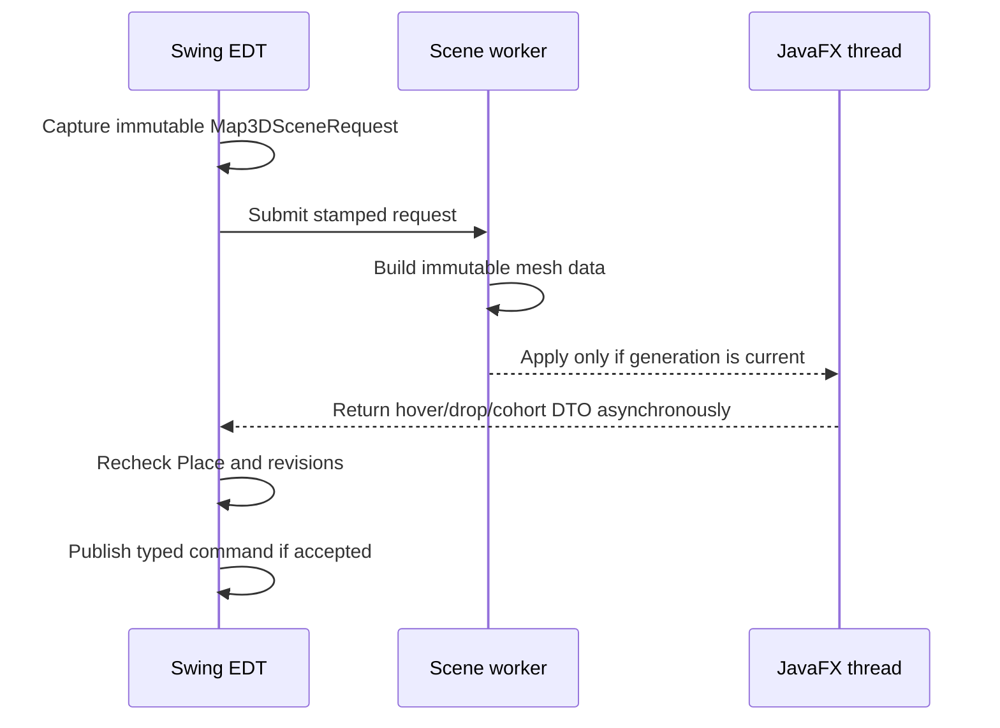

# Events, Revisions, Threading, and Lifecycle

Slice-native saves reuse the existing Factory operation worker and cancellation-before-commit lifecycle.
No UI, EDT/JavaFX bridge, timer or listener participates. The registry retains process-local observation;
the Native transaction separately stores durable exact-key/request receipts. Reload uses one database
snapshot; destination versions and source revisions remain distinct. Later transport and UI adoption
must preserve exact caller scope and disposal/currentness.

## Context Management application lifetime

`AppServices` constructs one `ContextService` and closes it during application shutdown.
Capture and update run synchronously on the caller thread over immutable inputs. A successful
update installs current truth before failure-isolated passive listeners run.

CM-03 adds atomic current replay for presentation attachment. `ContextMonitorPanel` listener work updates
only the toolkit-neutral model and queues rendering on the Swing EDT. An attachment generation rejects
queued callbacks after hide/detach; detach closes the registration and clears retained current/previous
snapshots. Reopen subscribes and atomically replays the service's current truth. The shared window closes
before `AppServices`, and no worker, JavaFX bridge, retry, timeout, or cancellation lifecycle is added.

CM-04's Swing action session publishes its STARTING state synchronously on the EDT before queuing request/question
construction and the immediate local submission back to the EDT. This makes the request a submit-time
capture rather than menu/popup-creation state. Duplicate activation is disabled while submitting. A
generation token rejects queued capture after owner close and stale completion after lifecycle change;
close also releases suppliers, listeners, and destinations. The destination contract is immediate and
must hand off later session/transport work rather than block the EDT. The application action coordinator
is synchronized with the Context Service and closes before it; no provider worker, retry, cancellation,
JavaFX bridge, or paid call is introduced.

CM-05 keeps visible Assets live-data capture on the Swing EDT. The right-click target identity/revision
is fixed when its popup opens, but `AssetsManagerContextPilot` builds every role reference from the
current already-loaded `CreatureCatalogPanel` projection only when the reusable action submits. A target
removed from selection, changed revision, missing Character projection, screen close, or popup close
invalidates capture before `ContextService.update`. The provider is pure and synchronous. The normal
service listener path queues the passive Context Monitor projection; unavailable production destinations
add no worker or session.

Close is synchronized and idempotent. It clears the current snapshot and listener registrations, waits
behind an in-progress synchronized capture/update, and makes later capture, update, policy mutation, or
listener registration fail closed. This prevents a closed application from exposing plausible stale
context while leaving CM-01 serialization and future screen/provider lifecycles unchanged.

CM-06 adds no toolkit or worker handoff. A caller constructs one immutable bounded Adventure/Battle capture
only after its feature owners have established current revision truth; request construction and provider
composition are synchronous over that value. The provider does not subscribe, cache feature state, retain a
screen, read a repository, or cross EDT/JavaFX/worker boundaries. Later screen integration must define its
own lifecycle generation and reject changed Adventure, Place, Battle, turn, participant, or condition
revision before `ContextService.update`.

CM-08 proposal preparation and confirmation are immediate synchronous calls over immutable values on the
caller thread. They add no bus, worker, EDT/JavaFX bridge, retry, timeout, or cancellation lane. The
coordinator retains at most 64 process-local pending proposals. Snapshot advance, authority removal or
replacement, token mismatch, replay, and application close fail closed. A feature authority's review is
read-only; its confirmation callback must atomically compare the opaque review stamp with current owner
truth before mutation or semantic-operation admission and must return immediately if it hands off longer
work. AppServices closes the proposal coordinator before the action and Context services.

CM-09 keeps proposal presentation ownership on the Swing EDT. Each shared surface invokes its feature
request factory only at preparation, tracks at most the service's bounded set of opaque proposal/snapshot
receipts, and confirms synchronously through the application coordinator. Character open-state and Factory
hidden/closed capture gates are rechecked before confirmation. A changed current snapshot fails in the
coordinator; screen close closes its pop-ups and discards its exact receipts without dispatch. No worker,
retry, timeout, provider, JavaFX bridge, or production authority is added.

## Atomic GM Control capture

`MapRuntimeSessionService.captureGmControlSnapshot` is one short synchronous read under the existing
runtime lock. It copies the pinned workspace and freezes session, active Place, visibility,
selection, Arena/Group/store revisions, root-first hierarchy, Layers, exact-Place objects, Groups,
and residents
before releasing that lock. Returned collections are immutable and bounded; the workspace accessor
produces a new defensive copy for each caller. Capture publishes no bus event, enters no
Swing/JavaFX loop, starts no worker, reads no external content, and changes no runtime or Player
state. Close waits
behind an in-progress
capture and makes later capture fail through the ordinary open-session guard.

The GM Context provider, canonical exchange codec, and Copy/Paste coordinator remain synchronous on the
calling thread. Copy performs exactly one sealed owner capture before one `ContextService.update`; Paste
strictly parses both documents, performs one fresh sealed capture and one update, then compares the entire
immutable semantic base before returning a non-applying typed delta. Closing the application-owned exchange
service rejects later work before owner capture. There is no EDT, JavaFX, worker, bus, retry, cancellation,
provider, clipboard, HTTP, or mutation bridge in this body. A later browser host must separately own Box
generation, hide/reopen, and disposal guards.

`GmControlRenderProjectionSource` is likewise a synchronous read boundary, not a bus. Capture receives
already-immutable current 2D and exact-coherent 3D renderer inputs, encodes owned copies, and atomically
replaces one retained manifest. Same semantic input reconstructs the existing generation. Asset resolution
checks both manifest ID/digest and a fresh `GmControlRenderProjection.SourceStamp` before copying bytes;
newer state or close fails before release. Browser mounting, resizing, rendering, resource release, and
asynchronous delivery remain 3D Viewer/Application Server consumer work and cannot change GM truth.

## Checked staged-map Present

`GmStagedPresentationOperationService` acknowledges UI/headless admission immediately and performs
snapshot copying, Player-safe projection, exact read-only content resolution, encoding, hashing, and
terrain capture on one AppServices-owned worker. It rechecks external content before entering
`SemanticOperation.OperationPhase.COMMITTING`; cancellation or deadline is effective before that phase
and is `SemanticOperationRegistry.CancellationState.TOO_LATE` after install.

`MapRuntimeSessionService.installGmStagedPresentation` synchronizes one checked install. It rechecks the
runtime/session epoch, document version, active Place, visible/revealed policy, captured snapshot content,
and prior live generation, then installs exactly prior+1. Current-state publication is best-effort after
commit and cannot rewrite installed truth. `MapRuntimeBehavior` is an immediate-status bus adapter only;
Control close detaches without cancelling the app-scoped operation. Authoring working state, JavaFX,
Follow, Player frames, endpoint/browser/relay, and connected-client evidence never arbitrate success.

## Prepared encounter admission

`GmPreparedEncounterAdmissionService` performs prepared/Adventure reload, exact catalog resolution, and
semantic lifecycle work on one owned worker. It never blocks or joins the Adventure worker; continuation
resumes only after exact asynchronous reads complete. The Swing panel acknowledges before read or commit,
projects completion on the EDT, suppresses duplicate activation, and may detach without cancelling work.

`MapRuntimeSessionService.admitPreparedEncounterGraph` is one synchronous checked commit under the
runtime lock. It rechecks captured document/Place/Arena/Group/selection/store guards, builds a detached
candidate, and saves before live install. Only a successful save installs graph/selection/history and
publishes one projection. Cancellation/deadline is effective before
`SemanticOperation.OperationPhase.COMMITTING`; a durable winning commit is terminal truth and later
cancellation is `SemanticOperation.CancellationState.TOO_LATE`. APP bus ordering and panel lifetime own
no acceptance, replay, commit, cancellation, or rollback authority.

## Current-combatant checked movement

`GmCombatMoveOperationService` acknowledges UI/headless admission immediately and performs the checked
move on one app-scoped worker, never the Swing EDT. It serializes one operation per exact activation,
publishes immutable registry snapshots, and permits process-local same-key reconstruction. Cancellation
or deadline is effective only before `SemanticOperation.OperationPhase.COMMITTING`; once the optimistic
local save begins, commit truth wins and cancellation becomes
`SemanticOperation.CancellationState.TOO_LATE`.

`MapRuntimeSessionService.commitCombatMovement` runs synchronously under the runtime lock. It rechecks
the frozen document/Place/presence/Arena/selection/store/position/route/cost guards, computes a detached
candidate, saves before live install, and emits no state event. `CombatRuntimeSessionService` then installs
movement-spent truth without ending the activation, after which one deferred runtime event exposes the
coherent result. No-change emits no persistence or publication. Panel close detaches the guarded callback
without cancelling app-scoped work; direct/headless clients retain the same terminal result. Bus delivery,
Viewer visibility, and Player transport never arbitrate the operation.

## Adventure planning and semantic steps

Adventure ordinary World/Adventure/candidate reads and create/update/reference operations run on the one
`AdventureApplicationService` serial worker. The panel acknowledges an initiating control immediately,
then installs immutable completion on the EDT only while panel lifecycle, operation generation, exact
selected identity/revision, and current user choice still match. Exact aggregate selection returns one
metadata/reference snapshot; default resident observation also resolves its stable first persisted target
through the service rather than depending on asynchronous tree population. Panel close invalidates UI
projection generations but does not cancel accepted AppServices-owned work; direct/headless clients can
reconstruct retained terminal truth during the service epoch. Planning
request construction is immutable and side-effect free. `AdventureAuthoringPanel` opens each
`AdventurePlanningWorkbenchPanel` as a separate modeless window with its own session and provider
instances. Each Send runs on that window's Swing worker; the shared Codex adapter serializes its own
dedicated conversation turn and manages the app-server worker/event lifecycle. Completion returns only
to the originating workbench EDT state. Reset or close invalidates only that window and closes its
session-owned adapters. OpenAI credential readiness, explicit Health, Responses/Image requests, and
Ollama requests also remain off the EDT through the same per-window worker boundary. Send, Repeat,
Apply, and Health acknowledge immediately in their initiating controls and stay disabled/busy until
that worker returns actionable success or failure. Close cancels the current Swing worker and closes
the isolated provider session; late completion cannot update or accept a candidate.

Adventure Contents selection is an immediate EDT presentation transition. Character selection installs
stable loading acknowledgement before `AdventureApplicationService.loadCharacterPane` uses the existing
service worker. Completion returns to the EDT only while the content generation, selected Adventure
ID/revision, reference ID, Character ID/source revision, and panel lifecycle remain exact. Selecting
another object, installing a newer Adventure snapshot, or closing the panel invalidates the old generation;
a late Character A read cannot replace selected Character B. Local Character Focus changes are same-turn
presentation changes and dispatch no worker, provider, bus, or mutation.
CS-03 keeps canonical Assets association lookup, owned-content read, decode, and bounded scaling on that
same service worker. The consumer compares exact role/association/asset metadata before and after decode;
a mismatch fails stale. Only the still-current Adventure/reference/Character/source/lifecycle generation
may install the immutable media and description projection on the EDT.

CS-04 History uses that same service worker for one checked Adventure-local event save. The initiating Save
changes to a stable busy label and disables duplicate activation before the handler returns. Repository work
never runs on the EDT. Completion returns through the panel and pane only while exact Adventure, reference,
Character/source, event, content-generation, and lifecycle guards still match. Switching selected content or
closing the panel invalidates projection only; a late completion cannot install into another Character.

CS-05 Relationship Save follows the same immediate busy/duplicate-disable and service-worker handoff. Its EDT
completion additionally guards exact target reference identity/source revision and installs History plus
Relationships under one committed Adventure revision. Selecting another Adventure Contents row or closing
the pane invalidates projection without cancelling already accepted repository work.

`AdventurePresentationSelection` may be called from any thread and marshals its bounded start, poll,
and cancel methods to the EDT. The panel returns LOADING before an asynchronous aggregate read and
publishes READY only from the matching install generation after exact identity/revision validation.
A newer selection, caller cancellation, or panel close invalidates the generation; late completion
cannot install or revive the immutable terminal receipt. Cancellation affects only the observation
load and never cancels Dictation, planning, media, or a semantic step.

Provider response, editable candidate, validation, and acceptance are distinct states. Candidate edits
invalidate validation. Accept reloads the originating Adventure snapshot and rejects any changed exact
revision before installing review state under that Adventure ID. A window for A may finish while B is
selected, but its accepted state remains keyed to A and cannot overwrite B. Sending, reset, cancel,
window close, and acceptance perform no repository or product mutation.

The app-scoped reviewed session separates its revision from the Adventure row revision. Approval applies
only to the exact plan digest. The service freezes one action/generation and selected media roles, reserves
the current step, and runs semantic work on its serial worker. Succeeded and Skipped advance the cursor;
Failed remains retryable; a partial Character result remains Attention Required until linked retry or
Continue Without. The panel polls immutable service snapshots and installs completion only for the exact
session, operation, Adventure selection, and projection generation. Panel close detaches projection only;
service work continues and a reopened panel reconstructs retained session/parent/child truth.

Optional Character media begins with the public Assets current-settings readiness request before Character
mutation. After exact Character commit, the Adventure parent remains running while Assets-owned Icon/Token
children generate, await explicit candidate review where needed, admit, and associate. Child updates return
to the Adventure service worker only when exact Assets session, Character ID/revision, and role match; they
never flow directly to Swing. Post-commit cancel
is too late for the Character and forwards only to unfinished children. A failed, declined, cancelled, or
uncertain child settles the parent as immutable partial committed truth; uncertainty blocks blind retry.
The panel projects those exact stages and review choices on the EDT. Canonical Character creation publishes
the public Assets library-change event after commit, and exact viewer reads remain presentation workers.

Reviewed encounter candidate generation and approved preparation run on the existing Adventure service
worker, never the EDT. A complete immutable candidate set enters `AWAITING_REVIEW` and releases that serial
worker; query, approve, decline, and cancel use exact owner-local operation and review identities. Approval
enters the committing lifecycle phase before once-only quantity realization. Cancellation is effective
only before that boundary, and checked commit truth wins afterward. Panel close detaches projection without
closing the app-scoped service; retained operation/review/artifact truth remains queryable within the
service epoch.
No runtime bus, GM/Player state, provider, or presentation event participates in this route.

Request Dictation uses the shared `MacSystemDictationSession`. Adventure shows its isolated capture
component on the EDT before the shared seam starts standard macOS Dictation on a dedicated daemon
worker. Startup and terminal results return on the EDT. The consumer identity contains exact Adventure
ID/revision, Request edit generation, and selection range; accepted text is inserted only while that
identity remains current. Request edits and Adventure switches therefore reject late text. Closing the
panel cancels the active handle and stops its owned worker.

## Offline Help lifecycle

The application installs exactly one `AppWideHelpShortcutService` keyboard dispatcher and closes it
during shell shutdown. F1 resolution and all `HelpWindow` creation/navigation remain on the Swing
EDT. The modeless window is reused while displayable, persists only UI geometry on close, and neither
starts workers nor reads project/live data.
Catalog metadata and related edges are validated once during application-service construction.
Runtime missing-topic diagnostics use one synchronized insertion-ordered ID set; topic fallback and
all visible related navigation remain on the EDT and introduce no worker or persistence lifecycle.

The application likewise installs exactly one `AppWideWorkspaceNavigationService` dispatcher and
closes it during shell shutdown. Exact platform Command-L/Command-P/Command-F/Command-M presses are
consumed before focused controls can install competing meanings. Product-window activation and
Authoring semantic-tab selection remain on the Swing EDT; Assets receives one typed
`ProductWorkspaceNavigationBus.CMD_ASSETS_WORKSPACE_ACTIVATE` request after its root is active. The
matching Media or Files lane owner selects the retained combined Media workspace and requests focus
for its own search field on the EDT; it does not change either lane's selection.

## Credential lookup

OpenAI generation and billing consumers resolve credentials through `SystemCredentialProvider` on
their existing workers. Nonblank provider-specific/shared environment variables override one exact
generic-password item under its exact `Talisman-<ENVIRONMENT_NAME>` service and current macOS
account; no lookup enumerates Keychain content. `MacOsKeychainCredentialStore` refuses Swing-EDT
lookup and maps missing, denied/locked,
unavailable-platform, and lookup-failure outcomes without retaining diagnostic output or secret text.

`CredentialStatusManager` owns a bounded asynchronous Settings refresh seam. Each request receives a
monotonic generation, resolves only the four canonical installed identities on daemon workers, maps each
secret-bearing result immediately to immutable sanitized status, and publishes only the latest generation
on the Swing EDT. Closing the modal Settings dialog invalidates pending generations and stops its workers.

`CredentialStore` is the replaceable platform adapter boundary behind `SystemCredentialProvider`.
Environment aliases retain deterministic first precedence; otherwise the provider performs one exact-item
lookup. Store guidance is immutable and secret-free, performs no lookup, and describes only the requested
identity. Resolution retains distinct missing, denied/locked, provider-rejected, unavailable-platform, and
lookup-failure states without diagnostic text. Windows and Linux adapters are deferred from this contract.

## Shared semantic-operation lifecycle

`SemanticOperationRegistry` is a thread-safe, callback-free metadata surface. Each call completes on its
caller thread and does no blocking feature work, toolkit handoff, retry, timeout, repository access, or
listener delivery. The owning feature Behavior/service chooses its worker and marshals immutable snapshot
projection to EDT, JavaFX, an existing typed bus, or a headless caller as appropriate.

Accepted snapshots have strictly increasing operation-local sequences. Publication requires the exact
registered owner handle, current identity/context, allowlisted codes/relations, next sequence, and a legal
explicit phase transition. Equal/older delivery is stale; terminal state is immutable. A consumer may use
live events for presentation, but reconstruction always starts from the current snapshot and bounded
history. Missing history is explicit retention truth rather than implied completion.

The waiting phase, with an external-dependency or retry-backoff reason, may resume the running phase with
the next sequence.
Review-required state is a distinct owner gate, not implied approval. Terminal retention starts from the
registry's own storage clock; owner wall timestamps and observer polling never control expiry or ordering.

Cancellation request, acknowledgement/effect, and terminal cancellation remain separate. The registry
records no thread/Future and invokes no cancellation callback; the owning service performs any cooperative
cancel and publishes the truthful result. Registry close or metadata eviction releases no worker and never
cancels, rolls back, retries, or resumes feature work. A request deadline is inert metadata until the owner
explicitly applies its declared deadline policy.

### Passive joined-observation ordering

`ObservingSemanticOperationRegistry` decorates the one AppServices registry without changing that contract.
It invokes the delegate first, returns the delegate's exact receipt, handle, snapshot, result, or cancellation
truth, and only then asks `SemanticOperationObservationProjector` to emit owner-private evidence. Projector,
hub, or downstream diagnostic failure is caught and counted; it cannot make an accepted operation fail or
make a rejected operation appear accepted. Queries remain delegate-only and do not create observation
evidence merely because a diagnostic client polls.

Each projected record has one process epoch, one monotonically increasing evidence sequence, and the exact
operation-local snapshot sequence when lifecycle state exists. The evidence sequence orders observation
production only. `SemanticOperationIncidentHub` uses the snapshot sequence for per-operation current truth,
rejects stale evidence, never evicts an active operation, and never lets equal or older terminal evidence
refresh its fixed terminal-retention deadline. Terminal mutation is dropped and counted. A missing or
expired observation never implies feature success, failure, cancellation, or replay permission.

`SemanticOperationSafeJoin` is created from an owner-issued operation identity using a process-random salt.
Only its bounded process epoch and lowercase SHA-256 digest may enter optional diagnostic seams. It cannot
be reversed into raw operation, target, revision, idempotency, approval, or result identity and cannot be
used for authorization, cross-process recovery, or duplicate detection.

Activity, bus, memory, and map-performance adapters accept the join only when their existing factual work
already exists. Activity attaches it to the existing active row; `OperationJobMemoryTelemetry` attaches it
to a real measured job; the map-performance adapter emits only closed factual stages. Bus correlation is
attempt-local: a recipient may attach a join only while its own handler is executing. A stack restores the
outer attempt across depth-first reentrant publication and gives the RESOURCE worker an independent frame,
so a join cannot leak to a sibling recipient, nested message, later attempt, or publisher-only diagnostic.
None of these adapters creates work, infers a lifecycle or terminal outcome, or becomes a control surface.

### Current Authoring manifest Script lifecycle

`AuthoringScriptOperationService` is the first feature owner using this shared lifecycle. It atomically
reserves one operation per Authoring scope, then asks the registered `MapEditorScopeState` port to capture
the accepted Script/package and exact map dependencies on the EDT. The existing scope pipeline worker runs
the frozen Java or Python package. Completion returns to the EDT for the existing dependency-checked
document commit and immutable Authoring publication.

The service serializes cancellation and the checked commit gate under its owner lifecycle. Cancellation
before commit produces one cancelled/not-committed result; a commit that wins stays successful and reports
the exact post-apply Layer/Source revisions. Closing or detaching a presentation does not cancel retained
scope work. A later UI or headless client reconstructs current or terminal truth by exact operation ID;
pipeline status/result events remain non-authoritative live presentation signals.

## Event delivery rules

### Core bus policy, ordering, and observation

`AppServices` installs `TalismanBusTopicPolicies` before product publishers are constructed. That
trusted catalog registers every fixed APP, DTDT, and USER topic by exact key and owning product; the
mixed shell action uses `BusTopicPolicyResolver` to classify its bounded typed action. Policy is never
inferred from a `CMD_`/`EVT_` prefix, caller-selected metadata, payload class, or subscriber presence.
An unregistered legacy/default message is an observable compatibility transient and is never retained;
an unregistered caller-declared alternative or a conflict with the trusted catalog is rejected.

`BusDeliveryPolicy` separates four process-local transport meanings:

- `MUTATION_COMMAND` and `TRANSIENT_EVENT` reach only currently eligible recipients. No-handler delivery
  drops the message; the core bus never retains, replays, or retries it.
- `UI_REQUEST` requires an exact active `BusDeliveryPolicy.LifecycleToken` and a positive TTL of at
  most five minutes.
  Lifecycle and elapsed TTL are checked while routing and again for each actual dispatch, so contention,
  close, or epoch replacement cannot turn an old request into late UI work.
- `RETAINED_STATE` requires an owner-stamped `BusDeliveryPolicy.StateStamp` and a positive TTL of at
  most 30 minutes.
  One current value replaces the prior value for the exact topic/source/owner/state key. The default
  service holds at most 256 keys, rejects stale stamps or capacity overflow, and removes expired values.
- A retained-state subscriber opts in on one exact typed route. One cutover barrier joins its targeted
  current-state delivery to later live publication, and the subscriber rejects an older stamp after a
  newer one. It receives no historical FIFO replay.

No production topic currently opts into core retained state. Existing Authoring, Assets, Viewer, GM,
Player, and shell startup therefore continues through its feature owner's direct current-state query,
immediate listener, deliberate republish, or subscribe-then-request route. The shared policy API does
not claim to fix routes that still lack a feature-owned host, window, scope, edit-session, or worker
epoch; those remain live-only and require separately owned migrations.

Delivery is isolated per recipient. Each actual recipient invocation receives a bus-local attempt
sequence; a handler that returns produces a separate delivery sequence. A throwing handler records only
its own failure, later independent recipients may continue, and an earlier successful mutating recipient
is never rerun by the core. Message, attempt, delivery, lifecycle, state, and domain revisions are
separate ordering domains. None is a cross-bus or business-state clock.

`BusObserver` receives only immutable `BusDeliveryDiagnostic` metadata: bounded safe topic/opaque
tokens, declared policy, outcome/reason, service epoch, message/attempt/delivery sequences, thread
domain, and observation time. It never receives `BusMessage`, payload, raw exception objects or text, or
payload `toString()` output. The core diagnostic history is count- and TTL-bounded, reports dropped
evidence, and exception-isolates observers from product delivery. `DataBaseBusService` copies the safe
record to its own bounded worker queue; `DebugConsole` and `BusMonitorScopeState` render bounded metadata
without becoming replay, operation, persistence, or business-result authorities.

APP, DTDT, USER, and custom buses remain serialized inline. An ordinary uncontended publication runs
on the active publisher/dispatcher thread before return. Same-owner reentrant publication is immediate
and depth-first. A contended publisher may return after its work is accepted but before the active owner
later drains accepted work FIFO. RESOURCE alone uses one owned FIFO worker. These transport sequences do
not replace EDT, JavaFX, feature-worker, or revision checks in subscribers.

`BusService.close` atomically rejects new publication and prevents any new handler invocation, while a
handler that already entered may finish. Close clears queued inline/RESOURCE work, retained payloads,
active lifecycles, subscriptions, observers, policy registrations, and bounded diagnostic history; it
records bounded shutdown-drop truth without claiming feature cancellation or rollback. A replacement
service has a fresh service epoch and inherits no message, lifecycle, subscription, policy, or retained
state. Application composition installs the trusted catalog for that new instance before product use.

Product-shell rehosting publishes managed-window close events with replacement intent. The shell
lifetime owner ignores those events for final-window shutdown; only an ordinary close followed by
an empty managed-window registry may deliver the application final-close callback. Resize, hide,
focus, and Separate/Combined migration therefore cannot terminate application services.
Before a live product root is detached, the shell marks its displayability lifecycle as retained;
the destination host clears that mark only after attachment. Child panels therefore do not close
their subscriptions during the temporary undisplayable interval.
`DTDTSplitter` applies the same retained lifecycle transaction while moving its two existing children
between north/south and left/right positions, clearing the retained mark only after the reattach
event turn drains. Embedded Authoring Arena3D treats that interval as a layout move, not a
hidden-view shutdown; an actual tab or window hide still cancels and releases its JavaFX scene.

Managed undecorated macOS frames prepare native maximization in two ordered phases on the EDT.
`TalismanWindowChrome` first resolves the active display's usable bounds and installs them through
Java's Frame.setMaximizedBounds; only then may `AppAwarePopupWindow` request `MAXIMIZED_BOTH`. OpenJDK's
macOS LW peer can therefore read an in-memory rectangle while holding its state lock instead of
synchronously entering AppKit for screen insets. This ordering applies equally to the chrome button,
Workspace Layout `Full-Screen Map`, and persisted maximize/reopen routes. Native AWT still owns the
actual maximize/restore state and events. JavaFX remains an asynchronous embedded-content consumer;
neither toolkit waits through a reciprocal application-level bridge.

Product event payloads are immutable records or are treated as immutable snapshots by their
consumers. Scoped consumers reject a payload whose `scopeId` does not match. Bus delivery does not
grant thread ownership: a subscriber that touches Swing must marshal to the EDT, and a JavaFX scene
mutation must marshal to the FX application thread.

Commands express intent. Events express installed state or a request to reveal/open UI. A view must
not infer that a command succeeded merely because it published the command.

The macOS Desktop About callback is platform-thread-owned. `AppAwareMenuBarService` marshals it to
the Swing EDT before publishing the same shell popup request used by the in-menu About action.
Native Settings and Quit callbacks follow the same EDT handoff. Quit cancels the platform's default
immediate exit before scheduling the existing ordered UI/service shutdown route.

## Easy Tale Body 1 timing contract

`EasyTaleAuthorityContract` is toolkit-neutral and creates no thread, timer, executor, bus topic, or
subscription. Canonical time is signed 64-bit epoch milliseconds. Resolved events order by start, end,
and stable identity; unresolved claims remain outside absolute ordering. Calendar projections require an
exact definition stamp.

Future Easy Tale UI adapters must install specific busy feedback and disable duplicate activation in the
same EDT action turn before dispatch. Result installation requires exact target, revision families,
request generation, and lifecycle epoch; wall-clock age is not stale-state authority. Focus transitions
and gap compaction are one EDT presentation change with zero-millisecond normal and reduced-motion
duration. No Focus timer or Timeline playback scheduler exists in Body 1.

Easy Tale Body 2 implements that timing contract in `DTDTFocusWorkspace`: construction and every open,
expand, close, compaction, overflow selection, status, restoration, and disposal mutation require the EDT
and complete in one zero-millisecond presentation transaction. Closing an earlier rail preserves the later
open sequence; final disposal closes nested closeable Focus content without cancelling accepted
service work. The primitive creates no timer, worker, JavaFX bridge, playback clock, or semantic bus route.
Pointer and keyboard divider resizing, bound enforcement, close compaction, and same-session proportion
restoration occur in the same EDT-only zero-duration route. No watcher, hover delay, animation, or
reduced-motion variant exists.

## Map Editor event catalog

| Event key | Producer | Payload/stamp | Principal consumers |
| --- | --- | --- | --- |
| `EVT_WORKSPACE_CHANGED` | scope state | scope + reason | Authoring panels |
| `EVT_REGION_CHANGED` | scope state | scope + Place + reason | tree, canvases, inspectors |
| `EVT_LAYER_CHANGED` | scope state | scope + Place + Layer + reason | render/layer/source views |
| `EVT_PIPELINE_STATUS` | scope pipeline | Place + status + tool | generation/status UI |
| `EVT_PIPELINE_RESULT` | scope pipeline | Place + Layer + tool | generation/layer UI |
| `EVT_PREVIEW_CHANGED` | scope state | Place + reference + tool | 2D preview |
| `EVT_DOCUMENT_UPDATE_STATE` | document behavior | dirty/history/version/failure | Authoring/runtime status |
| `EVT_DOCUMENT_WORKING_REPLACED` | document behavior | snapshot + work rev + request ID | scope installer |
| `EVT_COMPOSITION_CHANGED` | scope state | composition + working revisions | 2D/3D capture owners |
| `EVT_SELECTION_CHANGED` | scope state | Place + selection revision + shapes | canvas/3D overlays |
| `EVT_SPACE_METADATA_CHANGED` | metadata coordinator | owner + stamped sample | Space metadata panel |
| `EVT_PLACE_DETAILS_CHANGED` | details coordinator | owner + stamped snapshot | Place Details panel |

`EVT_WORKSPACE_CHANGED`, `EVT_REGION_CHANGED`, and `EVT_LAYER_CHANGED` are repaint/refresh signals;
they are not a substitute for revision pairing. A 3D capture waits for installed composition state.
`EVT_DOCUMENT_WORKING_REPLACED` may be overtaken; the composition request ID prevents an older
Layer-display publication from replacing newer live state. Ordinary document-replace requests also carry
a monotonic source revision: the EDT captures only a structural raster-sharing snapshot and returns,
while the document worker deep-copies, compares, coalesces, and persists it. The scope rejects a worker
result older than its latest submitted source revision; a matching local result is acknowledged without
reinstalling the already-owned live raster graph.

2D Grid repaint remains EDT-owned presentation work. `MapEditorRenderSupport` composites bounded
transparent output tiles keyed by exact grid geometry/style/display metrics; a cache miss streams
clip-intersecting `GridGeometry` instead of retaining every logical cell. Visually dense hex detail
uses deterministic bounded sampling. A repaint never allocates an unbounded Place-sized geometry
cache or changes document/runtime state.

## Runtime event catalog

`MapRuntimeBehavior` is the normal producer unless noted.

| Event key | Payload/stamp | Consumers/privacy |
| --- | --- | --- |
| `EVT_STATE_CHANGED` | immutable `MapRuntimeViewState` | GM/private runtime UI |
| `EVT_TEXT_VALUES_CHANGED` | private text map | Authoring/GM labels only |
| `EVT_PLAYER_STATE_CHANGED` | `PlayerRuntimeState` | Player UI/browser publisher |
| `EVT_PLAYER_SOURCE_CHANGED` | complete Place/document-stamped bundle | exact Follow/Spawn source |
| `EVT_PLAYER_FOLLOW_VIEW_CHANGED` | targeted/broadcast stamped mode/layout | local Follow only |
| `EVT_PLAYER_REGION_CHANGED` | consumer ID + safe targeted state | independent Spawn navigation |
| `EVT_PLAYER_TEXT_VALUES_CHANGED` | player-safe text map | Player labels only |
| `EVT_BROWSER_STATUS_CHANGED` | endpoint status | GM browser controls |
| `EVT_BROWSER_TEXT_VALUES_CHANGED` | browser-safe text map | GM browser labels |
| `EVT_ARENA_OBJECT_EDIT_REQUESTED` | selected presence identity | GM editor reveal |
| `EVT_ARENA_OBJECT_DEFINITION_EDIT_REQUESTED` | definition identity | GM editor reveal |
| `EVT_ARENA_GROUPS_STATE_CHANGED` | Group/object revisions + selection | GM Groups/3D adapter |
| `EVT_ARENA_GROUP_EDIT_REQUESTED` | Group identity | GM Groups editor reveal |
| `EVT_ARENA_OBJECTS_REVEAL_REQUESTED` | selection/folder intent | Active Objects tree |
| `EVT_RANDOM_ENCOUNTER_CONTEXT_CHANGED` | Place + terrain | GM encounter panel |

Player components must never subscribe to private `EVT_STATE_CHANGED` or
`EVT_TEXT_VALUES_CHANGED`. `PlayerRuntimeDeliveryBoundaryTest` enumerates the safe event graph and
text keys.

Each configured Follow publishes `MapRuntimeBus.CMD_PLAYER_FOLLOW_VIEW_REQUEST` with its unique popup
identity. `PlayerScreenView` admits a targeted reply or later broadcast only for its scope and
consumer, rejects duplicate/older source revisions, and buffers a newer Place/document shell stamp
until the matching complete `PlayerPresentationBundle` arrives. Close removes the subscription; the
source retains no per-popup presentation payload. Mode/orientation/divider application remains EDT
owned, while existing scene and camera generations continue to guard JavaFX work independently.
`GmPlayerScreenTopBar` answers the request on the EDT from one exact, up-to-date GM projection and
the live Control tab/splitter geometry. It broadcasts later shell changes and a forced refresh before
`CMD_PRESENT_STAGED`; this route does not depend on a browser or relay client count.

Browser-frame refresh uses explicit Swing, JavaFX, render-worker, and lifecycle ownership.
Player-safe runtime/source events coalesce into the single frame worker. The 2D pane renders from
immutable `PlayerRuntimeState` on that worker. The publisher rejects a state below the retained
`liveGeneration` or exact Place/document/revision stamp before it can replace latest state. Each
request carries that complete render identity plus a monotonic request sequence; after rendering,
only the still-newest identity may install, so late older Place work cannot reinstall. A hidden
`PlayerRuntime3DCanvas` is created and fed
`PlayerPresentationBundle` on the EDT; its scene build/camera/object updates remain asynchronous on
the JavaFX thread. The bundle owns a bounded, Present-time Player-safe local-height copy created by
the same pure sampler as Control capture; no later worker reads the mutable Heightmap. For one
composite frame the render worker requests an asynchronous FX snapshot
and waits only on that worker for the owned CPU image, then performs PNG encoding, byte-identical
suppression, and versioned publication. No Swing or JavaFX UI thread waits on the other. GM Control
3D camera events are applied to the hidden Player scene by exact Place and monotonic camera revision,
without comparing GM working revisions to the separate Player presentation revision domain. Browser
HTTP/SSE clients never publish camera commands. Endpoint start/stop remains on the separate
lifecycle worker, which also opens the
private tokenized URL through the platform browser. Platform-launch failure updates only GM-private
browser status and does not enable frame retry.

The Internet relay server uses Javalin/Jetty connection workers, which may process different GM
connections concurrently. `RelayGameSessionRegistry` serializes every session create/resume,
register/unregister, disconnect/end, listing, and expiry transition under one in-memory authority.
One daemon scheduler owns reconnect-grace expiry. A session disconnect generation makes a resumed
connection supersede its previously scheduled expiry; expiry removes the complete ephemeral session
and public listing. `RelayEndpointTransportRegistry` separately serializes invitation redemption,
hashed endpoint credentials, endpoint display mode, and one complete latest frame per game/pane.
Jetty completion callbacks drive each `LatestEndpointNoticeQueue`: one version notice may be in flight
and one newest complete notice may be pending, so slow browser endpoints cannot retain intermediate
movement history. Browsers fetch only the latest resource for a selected pane. Session end/expiry
drops invitations, endpoint identities, frames, and pending notices. GM and endpoint authentication
occurs before WebSocket upgrade, message handlers never log payloads or credentials, and public HTTP
emits only intentional listing, redemption, player-session, and selected Player-safe frame values.

The public Player page handles relay notices on the browser event loop. Each pane owns one
`createLatestFrameQueue`: one HTTPS frame request may be active and only the greatest newer pane
version may remain pending. Completion immediately requests that newest version, skipping
intermediate motion without retaining their responses. A replacement image is decoded before it
replaces and releases the prior object URL; disconnect or fetch failure retains the last complete
frame. Access loss and page unload close both queues and release all retained object URLs.
Its response CSP explicitly admits the canonical Moondance WSS origins, so the initial HTTPS session
and frame fetch cannot succeed while silently blocking the later subscription. Reconnect creates a
new WebSocket for the same endpoint cookie, receives the current complete version snapshot, and then
continues latest-only notice admission without requiring a new invitation or page reload.

The desktop `MoondanceRelayClient` owns one daemon scheduled worker. Credential lookup, WebSocket
session/reconnect identities, request correlation, heartbeats, endpoint snapshots, and frame queue
mutation remain confined there. JDK HTTP-client callbacks hand control to that worker before touching
client state. Status listeners receive immutable credential-free snapshots and cannot block other
listeners. One binary pane frame may be in flight; each pane may retain one newer complete frame, and
replacement immediately releases the superseded payload. Transport loss requeues the in-flight
frame only when a newer same-pane value is absent, fails pending controls, and resumes the session
with exponential backoff. An ambiguous invitation response leaves one worker-confined retry guard;
only a successful response or Internet session reset clears it. No EDT, JavaFX, or relay worker waits
on another UI thread.

`PlayerPresentationManagerPanel` runs only Swing mutation on the EDT. Relay controls return futures;
their worker completions are marshalled back to the EDT, while the Local preview PNG is decoded and
scaled on one manager-owned daemon worker. Closing/rehosting the manager cancels that preview worker
and UI subscriptions without stopping either app-scoped transport. `PlayerPresentationFramePublisher`
keeps its existing one-request render coalescer and emits the complete Local composite plus separate
2D/3D relay frames; the relay client's per-pane queue remains the only Internet upload backpressure
authority. Listing preflight and sanitized error presentation are EDT-only and issue no follow-up
transport request. The manager marshals `PlayerPresentationObservationSession` reads, exact-tab
selection, and guarded restoration onto the EDT. Its immutable result carries only panel, resident
window, and lease generations plus tab/readiness enums. A newer lease, manager close, window
replacement, residency loss, or later user tab selection rejects stale mutation; close/cancel
restores the prior tab only when the same lease still owns the last selection. Players is ready only
when the installed Player-safe preview exactly matches the current Local frame and live generations.
No observation call requests, decodes, or captures a frame.

GM downward navigation uses `MapRuntimeBus.CMD_GM_CHILD_REGION_SELECT` and
`MapRuntimeBus.CMD_GM_CHILD_REGION_ENTER`. Their immutable `GmRegionNavigationSelection` carries
parent/child identity, runtime document version, working/composition revisions, and a monotonic
active-Place navigation revision. Swing 2D publishes directly on the app bus. JavaFX 3D returns its
exact displayed-terrain gesture asynchronously to the EDT before publishing; it never waits through
a reciprocal FX/EDT bridge. The behavior accepts Enter only when the command still equals its current
retained selection.

Authoring-to-Control Place transfer is a separate synchronous app-bus transaction:
`CMD_AUTHOR_TO_CONTROL_REGION_TRANSFER` reaches `MapRuntimeBehavior`, which asks the session to
capture a stable canonical snapshot, validate the requested Place, reconcile, and select it before
the one resulting runtime-state publication. A blank, missing, or superseded request changes no
runtime state and emits no projection. Ordinary `CMD_ACTIVE_REGION_SET` retains its pinned-snapshot
restriction and cannot invoke this reconciliation path.
The GM overview's exact visible-footprint double-click uses its own
`CMD_GM_OVERVIEW_REGION_TRANSFER` route into that same checked transaction; it does not broaden
ordinary GM navigation.

GM 2D right double-click is owned by `MapEditorRuntimeCanvas` and publishes only
`ProductMapViewBus.CMD_FOCUS_CHANGED` with the 2D-to-3D retarget intent. It does not publish movement
playback state. Synchronous runtime publication may update dynamic Arena Object overlays on the EDT,
but exact unchanged pinned map and static raster presentation are revision-reused.

## Product view and Arena3D events

`ProductMapViewBus` coordinates views without making a window the document owner:

| Route | Owner | Stamp/rejection rule |
| --- | --- | --- |
| `CMD_2D_VIEW_CHANGED` → `EVT_2D_VIEW_APPLY` | `ProductMapViewBehavior` | role/view identity |
| `CMD_3D_VIEW_CHANGED` → `EVT_3D_VIEW_APPLY` | `ProductMapViewBehavior` | camera revision |
| `CMD_FOCUS_CHANGED` | Authoring/GM embedded 2D and 3D pairs | owner + pair + source/intent + Place/working/composition/capture/focus revision; stale and hidden consumers reject |
| `CMD_3D_NAVIGATION_TRANSFER` | Authoring navigation | parent/child + scene revision |
| `CMD_3D_PRESENTATION_CHANGED` | embedded source view | presentation/composition rev |
| `CMD_3D_CONTENT_CHANGED` | hidden canonical Authoring 3D source | Place + composition + working rev |
| `EVT_3D_PRESENTATION_APPLY` | retained role presentation | strictly newer presentation |
| `CMD_HANDOFF` | combined/popup owner | explicit role/consumer identity |

The embedded Authoring context-menu route is local rather than another product-view event. On FX,
`Map3DSceneController` accepts only a pick whose node is the installed terrain mesh and emits one
`Map3DContextMenuGesture` stamped with Place, capture generation, working revision, normalized point,
and screen position. `MapEditor3DCanvas` enqueues EDT delivery without waiting, then revalidates the
displayed request, composition, active Place, state revisions, panel identity, visibility, and
lifecycle before showing `MapEditorSurfaceContextMenu`. Menu actions publish the existing canonical
commands. No synchronous FX↔EDT bridge or viewer-role broadcast is introduced.

`Map3DSceneRequest` contains `ViewerKey`, capture generation, working revision, exact final-composite
and Heightmap revision identity, immutable texture, height, grid, footprints, Legend, persistent
constructed-feature snapshots, selection, and selection masks. `ProductMap3DPresentation` adds a
process-monotonic presentation revision, composition revision, camera, and runtime overlays.
`PlayerPresentationBundle` adds the privacy-filtered Player state and exact delivery stamps.

Terrain preparation remains EDT -> worker -> FX. The worker derives slope-aware top/side atlas UV
indices and may reuse one immutable CPU geometry/layout product only when compact Heightmap
revision/content, source texture dimensions, extent, height-exaggeration, and detail identity all
agree. `TerrainTextureAtlasLayout` freshly bakes current final-composite pixels after geometry lookup;
the composite revision/content is never cached as geometry. Cooperative cancellation completes
before a newly prepared geometry product is installed. The access-ordered cache retains no request,
texture, or Heightmap arrays and is capped at 64 MiB. Build generations reject stale work before FX
application. For a same-size texture-only replacement, each FX controller keeps its installed terrain
and unchanged child-Region meshes and replaces/cancels only the diffuse atlas; changed geometry,
hide/rehost, and close release the owned mesh and material. Cache eviction releases the separate CPU
product.

`RenderInvalidation` is the lightweight shared identity read by visible Authoring 2D/3D consumers.
It carries the shared Geometry/Texture/Grid/Selection/Legend/Layout product set. Its general revision
identifies the newest scope notification; its narrower Place, applied-working,
composition, and selection tuple lets asynchronous 3D work ignore UI-only notifications while rejecting
stale render output. Selection capture retains the immutable `RasterSelection` on EDT instead of expanding
source-resolution pixels. One latest-only worker paints a replacement texture bounded by the actual
host width/height, then `Map3DSelectionTextureBuilder` bakes it through the exact displayed mesh's
atlas layout before FX application. The FX controller replaces/cancels the prior image. Resize,
selection, content, hide, and close advance the owning generation or invalidation, so obsolete output
cannot apply or remain queued.

Derived Authoring Layer display rasters are a separate synchronous EDT composition cache owned by
`MapEditorScopeState`. Its key is exact Place/Layer identity plus typed payload revision, elevation
interpretation, and immutable image payload identity, so copied equivalent snapshots reuse one product
while a changed payload cannot be rendered as an old revision. Each display product is bounded by
output pixels; normal pointer/hover activity records only a bounded in-memory
consumer/request/revision hit-or-miss diagnostic, never a normal log message per materialization.

That cache and the external/source display-image cache are now typed facades over the one
process-scoped `LargeBytesResidencyManager`, rather than independent strong-reference maps. The
manager owns their combined byte residency and cross-cache LRU enforcement; Map Editor remains the
key/revision/rebuild owner and receives release notifications only to reconcile metadata. A cache
hit uses the stale-safe `MemoryTelemetryService.accessEntryIfPresent` route because another thread
may complete a budget release between payload lookup and metadata access recording.

`MemoryTelemetryAdapter` is the passive, metadata-only bridge from an existing cache or view owner to
the process-scoped `MemoryTelemetryService`. It records stable owner and entry identities, bounded
current-cache reconciliation, release events, job/reservation state, coverage, and current context;
it never retains a reported payload or changes eviction, cancellation, persistence, or cache behavior.
`MemoryByteEstimator` may inspect a payload only for the duration of estimating its byte count. A newer
revision updates the same stable entry identity, while an absent entry is released from telemetry only.
Every registration event now labels a stable row as created, unchanged refresh, or replaced and carries
bounded cumulative registration/replacement/unchanged counts. The current row still remains singular;
the counters diagnose adapter churn without retaining a historical payload or changing cache behavior.
Named reconciliation groups keep independent caches owned by one component from releasing each
other's telemetry rows. Asset UI adapters mirror the current bounded tree/deck/browser/generated
thumbnail maps, selected decoded previews, managed full-preview windows, and source scan generations.
The Universal VTT adapter mirrors parse/decode jobs and publishes only decoded-image estimates and
canonical path/point/portal/light counts; supersede, clear, failure, and close terminate those rows.
Except for the explicitly migrated Authoring Rendered-2D cache facades, these adapters remain
observers: existing Swing workers, maps, component close paths, and payload owners retain their prior
behavior.

The Media and Files selected-preview workers independently decode the exact selected identity. Their
vertical dividers share only EDT presentation height; selection, worker generation, and preview state
remain separate. Only an exact Media Content Root selection starts a Files source scan; Media folder
or asset selection and Make OBJ completion preserve the Files tree and the prior Media selection.
An exact Created Things entity expansion publishes through the same selection route
as an entity-row click, while content-folder expansion emits no selection command.

`MemoryTelemetrySnapshotPublisher` runs on one application-owned daemon outside Swing and JavaFX.
Every two seconds it obtains one bounded immutable telemetry snapshot, serializes it once, atomically
replaces the application-instance file, then publishes that same serialized object to an atomic
reference. The localhost probe handler reads only that reference and computes a timestamp-based stale
header. `MapPerformanceTargetProcess` performs endpoint I/O and
`MapPerformanceMemorySnapshotSource` performs bounded file reads/full-schema validation on the
existing Workbench worker. The EDT receives only an immutable validated snapshot set; it never performs probe
I/O, file discovery, JSON decoding, telemetry traversal, garbage collection, or payload access.
That same worker obtains one throttled matching-PID macOS process-memory sample through the bounded
diagnostic command boundary. The Memory report supplements, but never rewrites, the semantic snapshot
with RSS, physical footprint/peak, process-swapped bytes, sample age, and a clearly labelled accounting
remainder. A missing tool or permission leaves the affected external scalar unavailable.
Application shutdown stops the probe before the publisher and leaves the last complete file for stale
inspection.

The Workbench build combines a tracked forward-only Workbench version/current-change description
with its generated exact checkout revision and dirty state. The launcher loads that immutable identity
once with its packaged `TalismanVersion`. One Workbench-owned controller installs the native macOS
About handler and supplies the in-window command; both reuse the same modeless, owner-safe dialog.
Workbench version/changes, Talisman release/build, and running code revision remain the primary
selectable content without reading a moving Git reference. Java runtime is secondary diagnostics.
Missing packaged fields remain explicit unavailable values rather than restoring Java's generic About.

The shared Codex service owns the injectable app-server stdio process/JSON-RPC session.
`CodexAppServerClient` performs the mandatory initialize/initialized handshake,
serializes bounded JSON-RPC requests, and publishes notifications from one daemon reader; it never
exposes stderr or credentials. Its fixed process launcher resolves an explicit supported property or
environment override, executable PATH entries, then known bundled macOS ChatGPT locations. This keeps
Finder/Desktop and terminal-launched consumers on one transport without a shell command surface;
missing or invalid configuration produces a bounded actionable error. Workbench's Branches view
lazily consumes that transport for task status. `CodexTaskThreadMapping` persists only a reviewed
exact canonical worktree-and-branch to thread-ID mapping. `CodexTaskStatusService` uses list/read to
verify that mapping
and show stored/live owner evidence without generation. An idle task may be resumed for one explicitly
read-only status turn. An active task is never steered, stopped, or given a competing turn: one
deduplicated request waits for a completion event and a confirming idle read before turn/start.
Swing receives immutable status reports on the EDT, retains the latest successful report per row, and
closes the process/session when Workbench closes.

`CodexTaskLinkDiscovery` shares that same client and mapping store. On one explicit Workbench action it
lists every page of pinned interactive threads separately for each exact normalized permanent-worktree
cwd. Only a unique valid ID is saved; a still-present manual ID wins even when other matches exist.
Main, standalone, unrelated, and generated Codex worktrees never enter discovery. Missing/ambiguous
rows remain unchanged. Discovery issues no read, resume, turn, or owner-visible request.

Every permanent row's **Chat…** action resolves only its stored exact task mapping. An idle or unloaded
task is resumed and receives one ordinary `turn/start`; an active task receives `turn/steer` with its
exact in-progress turn ID because this user-authored chat is intentionally allowed to affect current
work. The row-named modeless dialog streams only matching thread/turn events. Cancelling an owned new
turn interrupts it; cancelling a steered active-owner wait never interrupts that pre-existing turn.

`CodexConversationAdapter` is the separate public product-neutral consumer seam. It creates a new
dedicated thread or resumes only an exact caller-retained typed conversation after a status check; its
default operation refuses active turns, while one explicit method may steer the exact active turn of a
caller-owned dedicated conversation. It never lists, discovers, steers, or selects a permanent owner
task. One synchronized operation
at a time submits only bounded reviewed text plus an optional bounded JSON output schema under
restricted read-only access. Exact thread/turn/protocol identities, authoritative completed agent text,
optional parsed/schema-checked JSON, and bounded streamed deltas return as typed values. Thread/turn
filters reject
late or foreign events. Deadline, cancellation/interrupt, response bounds, malformed output, protocol
mismatch, process failure, and close are explicit terminal states. Current consumer capability reports
text input and structured output only; image and local-image remain unsupported by this seam.
Read-only turns send only the supported `sandboxPolicy.type = readOnly`; the removed legacy nested
`readOnly.access` object is never emitted to current app-server versions.

Workbench Open Chat shares the one Workbench-managed app-server client while owning a separate exact
conversation identity. Its modeless dialog submits arbitrary bounded user text from a dedicated daemon
worker, streams deltas onto Swing's EDT, retains completed exchanges, and supports cancellation or an
explicit new conversation. If that exact dedicated conversation already has an active turn, Open Chat
uses exact-turn steering rather than opening a competing turn; cancellation then stops only the local
wait and never interrupts the pre-existing turn. It never reads the permanent-task mapping or contacts
an owner task.

Finder-launched Workbench child processes prepend standard Homebrew package-manager executable
directories while preserving the inherited PATH environment variable. Release and branch-update Git
commands therefore
allow hooks to resolve installed helpers such as `git-lfs`; no shell command surface or credential
value is introduced. Release push failure still invokes the existing exact metadata/commit rollback.

Workbench-owned Gradle validation, Workbench build, and Talisman launch processes additionally pass
through one mandatory Java 21 resolver before process start. The resolver validates the runtime,
sets exact `JAVA_HOME`, and places its `bin` first on PATH, independently of the Workbench JVM or
Finder environment. Missing Java 21 stops the owning operation before Gradle, commit, push, or
relaunch and reports the override and locations checked; non-Gradle Git commands keep the ordinary
Finder-safe environment.

Workbench lifecycle progress and release results are applied on Swing's EDT to one bounded selectable
status pane. It tracks the available width, wraps exact diagnostics, and exposes longer content through
vertical scrolling rather than expanding the Workbench. Failure presentation applies semantic error
color and emphasis only to the leading summary; the unchanged diagnostic details and ordinary success
states retain normal readable theme text.

One throttled read-only `WorkbenchReleaseService.Readiness` query compares canonical Main HEAD with the
latest reachable Workbench/Switchboard Alpha release boundary on the Workbench worker. Swing applies
the immutable result on the EDT: exact coverage restores the ordinary Make a Release control, while
newer Main gives the real button full-surface theme-success paint through normal, hover, pressed, and
focus states plus explicit `Main has changes` text. Unavailable inspection remains ordinary with a
truthful tooltip. This route never creates a release or mutates Git.

`MacSystemDictationSession` is the shared product-neutral late-insertion guard around standard macOS
Dictation. One process-wide session starts the existing native action on a supplied worker while all
startup and terminal results return on Swing's EDT. Native text targets only a consumer-supplied
isolated Swing text component; explicit complete/cancel returns the exact captured identity and buffered
text. The consumer's current-identity predicate chooses accepted versus stale-rejected, and only that
consumer inserts accepted text at its captured caret/selection. Late AppKit insertion therefore cannot
mutate a newly selected Adventure, Asset, or Workbench record. Unsupported platform, overlapping
session, rejected startup/permission-or-responder state, exception, and cancellation remain distinct.

The Branches metadata/content split is one retained component. Selection, changed-file, Codex-status,
and Refresh updates replace only its top and bottom children, so the live divider and its installed
durable preference owner survive content preferred-size changes without resetting the user's position.

Workbench opens with Branches selected and immediately runs its canonical read-only Git refresh on the
existing Workbench worker. The same startup/Refresh route reads stored status for exact mapped Codex
tasks through list/read only; it never links, resumes, starts, steers, or messages an owner. Manual
Refresh explicitly repeats those reads. `PermanentBranchChangedFilesSource` separately reads the
selected worktree's bounded porcelain status and paths changed from the exact `origin/main`
merge-base. It keeps uncommitted and committed paths distinct, never reads file contents, and reports
missing worktrees, stale Main references, and Git failures without contacting the Codex owner.
`PermanentBranchStateSource` reads every direct,
branch-backed local Talisman worktree plus the one explicitly named sibling repository
`/Users/mmiller/Git/Seasons World Content`; it never scans or adds other sibling Git projects.
Talisman rows derive exact local/published-main metadata, while Seasons compares its checked-out
branch to its own local `main` and `origin/main`. Human work-area
names own list identity while actual branch, upstream, and worktree values remain exact detail
metadata. Per-worktree-and-branch visibility is a local preference, so identically named branches in
different repositories remain independent. Unchecking is a pending view choice and does not remove a
row until Hide Unchecked atomically updates both the panel-owned hidden set and its durable preference.
The panel-owned set is the immediate rendering authority and reloads from preferences on Refresh or
reopen. Show Hidden is a session-only reveal: it restores no preference by itself, resets on Refresh/
reopen, and lets a checked row return immediately to the normal view.
Every entry gives its complete human name and integration truth an unsqueezed first row. All valid
row-owned actions—including archive, exact Codex task linking/status, catch-up, and Main landing—share
a compact width-aware second row that wraps at constrained list widths. The visibility checkbox spans
the entry beside those two rows. Link Task changes only the local exact task-ID preference; it never
changes Git state. Each rebuilt row reads that same preference to show an accessible linked/unlinked
semantic dot, while the review dialog prepopulates the exact stored ID; bulk discovery and manual
relinking rebuild the row immediately. The first row emphasizes the human work-area name and applies
contrast-checked theme success/warning colors only to exact Main/behind truth. Divergence remains
ordinary text unless the refresh-time non-worktree merge preflight positively reports conflicts;
only that explicit state uses error red, accompanied by the plain `Conflicts with main` label.
Every presentation rebuild pins Talisman Main first, then sorts remaining visible rows by ascending
behind-main count, descending last-commit time, and stable human name. Seasons uses its repository's
own `origin/main` divergence, consistent with its displayed integration truth.
The project-row archive actions run on the existing Workbench worker. `ProjectZipCreator` invokes
Git archive for the exact checked-out commit. Full Zip contains every tracked file under its named
project root. Talisman Only Zip additionally excludes the SRD definition tree, every nested patches
tree, both Moondance server/protocol modules, test data, websites, branding, and both the current and
relocated Development Atlas paths. Both controls sit before the Talisman project name; standalone
Spelunk retains Full Zip only. Each writes one
collision-safe timestamped ZIP below the current user's Downloads folder. The EDT receives only the
final path or bounded failure; neither route writes into or changes the source worktree.
Each Refresh freezes exact local-main and origin-main commit IDs before reading rows, so divergence
counts and ancestry cannot observe different moving baselines. The list derives plain integration
truth from matching local-main/origin-main ahead/behind counts; ancestry remains exact metadata and a
live mutation guard. A Bring up to date action appears only for a clean branch strictly behind
matching local and
published main. `PermanentBranchUpdater` rechecks worktree cleanliness, checked-out branch, matching
upstream, exact main equality, and ancestry before an exact fast-forward and matching branch push.
For a clean, fully published diverged branch, that action refreshes origin and uses `merge-tree
--write-tree` as a non-worktree conflict preflight. A conflict leaves the branch unchanged with a
manual-reconciliation message. A clean preview permits one owner-prefixed merge of exact origin/main
into the task branch followed by its matching upstream push, preserving the task's ahead commits.
The top-level Bring All Showing Up to Date with Main action applies that same rechecked transaction
sequentially only to eligible rows currently displayed and reports updated versus skipped/failed
counts. Persistently hidden rows are excluded unless the user invokes the one-shot Show Hidden reveal;
a failure cannot relax the gate for a later branch.
Clean branches strictly ahead of main expose Put on Main only when their exact HEAD equals their
matching published upstream. After explicit confirmation, `PermanentBranchUpdater` refreshes origin
and rechecks the task tip/upstream plus the dedicated `talisman-main` worktree's cleanliness,
checked-out `main`, `origin/main` upstream, exact local/remote equality, and fast-forward ancestry.
Only then may it fast-forward and push main; ambiguous or stale states leave main unchanged.
Dirty tracked work areas expose a Commit signal without implying authority. `PermanentBranchCommitter`
reviews bounded complete porcelain status into staged, unstaged, and untracked paths plus exact
worktree/branch/upstream/HEAD and live origin/Main divergence. After an explicit message and separate
authorization, it rechecks the full review token and Git-operation markers, stages only reviewed paths
through a temporary index, commits locally, and normalizes the real index to the new HEAD. It never
pushes, updates Main, merges/rebases, or includes ignored or newly appeared paths. A successful commit
SHA remains visible even if the subsequent row refresh fails.
Swing receives immutable snapshots and replaces the prior branch/error presentation on the EDT.
Active-design reads use the selected branch's own worktree, select every Markdown file from its exact
human-named folder, and render each in a scrolling Markdown tab below compact adjacent metadata.
For the Talisman Main row, the lower pane instead summarizes prefixed work-area commits reachable
from local Main during the preceding 24 hours. The same manual Refresh worker obtains that bounded
Git log; Swing receives one newest-first immutable summary row per contributing prefix with latest
commit time and count. Main remains explicitly first in permanent-worktree ordering.
This deliberately includes uncommitted design/test-plan files so the view matches the dirty worktree
being inspected. Dirty rows expose uncommitted state directly and disable mutation controls. Missing
folders/documents and failed Git reads produce clear unavailable states rather than stale content.

The Workbench Memory tab applies immutable published snapshots entirely on its Swing EDT while the
existing target worker performs cached endpoint/file reads. A debounced Swing timer may persist
table column order/width changes. These routes retain only bounded metadata and never traverse or
retain raster payloads. Live-only baseline and managed-release requests run on the target worker;
the Talisman probe checks the exact instance UUID before its synchronized telemetry/residency owner
performs the allowlisted action and republishes the result.
The retained Talisman monitor remains EDT-owned: its Swing timer applies an in-process immutable
snapshot while visible, and hiding it stops refresh and releases the panel's metadata reference.

The Workbench Performance Analysis tab keeps its Markdown report read-only. Its explicit Start, Status,
and Cancel controls run laboratory verification and run coordination on a dedicated daemon worker, not
the Swing EDT. The control never attaches to or drives Talisman. Closing Workbench cancels only the
analysis process tree that this control created.

`PerformanceAnalysisRunLifecycle` is the persisted pre-execution state machine for explicit manual
authorization, preflight, warm-up, measurement, settle, release, and terminal classification. Every
change requires the exact prior generation. Scenario progress retains pending/running/complete/failed/
skipped/cancelled identity and exact terminal reasons. Cancellation is idempotent, permits only the
release transition, and then classifies outstanding scenarios as cancelled.

`PerformanceAnalysisExecutor` owns one coordinator and at most one child workload process tree. Every
warm-up and measured repetition starts the fixed `performanceAnalysisFocusedWorkload` Gradle route by
closed workload ID. That task maps the ID to one reviewed test method and gives its test JVM an exact
4 GiB maximum heap. Status stays in generation-checked JSON. Cancellation is cooperative first and may
destroy only descendants of the owned Gradle process; existing Talisman and unrelated JVMs are never
enumerated, attached, stopped, or restarted.

The same coordinator times every owned child repetition and samples only that process tree's available
CPU duration. It never samples another PID. Each result is published atomically before scenario state
advances. Terminal report synthesis reads persisted state and samples off the EDT; report refresh stays
a separate read-only Swing action.

Terminal synthesis also performs read-only compatible baseline/previous-run comparison on its existing
coordinator. It reads bounded local JSON only and never starts a process or changes a selection. The
separate supervised baseline preview/accept service is synchronized around its small append-only ledger;
Workbench invokes both operations on the existing dedicated analysis-control worker. Only immutable
review/selection summaries return to Swing. Editing reason/workload invalidates the EDT-held preview,
and acceptance repeats generation, digest, evidence, and prior-selection checks before writing. Neither
action crosses JavaFX, starts a process, or touches a database.

Finding review uses the same worker/EDT split but a separate service and ledger. Workbench holds only
one immutable preview token; changing finding, decision, or reason invalidates it. Apply repeats
candidate/run/evidence/prior-state and ledger-generation checks off the EDT, appends one decision, and
returns only a bounded summary. Candidate generation remains report synthesis work, never a human
decision. Neither path accepts a baseline, starts investigation, edits source, or admits fixed and
verified without Body 8C evidence.

Fixed verification uses the same worker but a distinct exact-run service. It reads two checked terminal
run identities, one immutable after-run gate artifact, and append-only review history; it neither starts
nor attaches to a process. The EDT retains one preview token only. Changing accepted finding, after run,
or reason invalidates it. Apply repeats compatibility, chronology, correctness, target improvement,
cost-shift, release, quality, evidence-digest, and ledger-generation checks before appending fixed and
verified. No proof path changes a baseline, source, application, laboratory, or live data.

`PerformanceJfrProfileContract` does not attach or issue a command to a running JVM. It authors one
unique StartFlightRecording argument only for an explicitly authorized measured repetition of the
owned child process. The child owns recording start/stop through process lifetime; warm-up, disabled,
and unauthorized routes produce no argument or artifact. Analysis begins only after the file is closed.
Workbench exposes sampled JFR as an unchecked explicit option. The manual author stamps intrusive
authority only when that option is selected; the executor creates the plan after synthetic-lab preflight
and the fixed Gradle task applies the argument only to its exact 4-GiB test JVM.

`PerformanceSubsystemCounters` is a child-JVM-local scalar registry. Its first call resolves the exact
analysis properties once; normal product mode becomes a volatile-read no-op. Enabled calls synchronize
only bounded enum counters in memory. One owned shutdown hook publishes after measured work, so no event
adds file I/O or crosses into Swing, JavaFX, another process, or the live application.
The executor gives each fixed repetition a unique output path and the fixed Gradle task passes it only
to that owned test JVM. Grid/2D paint and cache owners may emit on Swing or workers; JavaFX mesh owners
emit on the FX thread; each call changes only in-memory scalars. After child exit, the coordinator checks
the bounded snapshot before persisting semantic measurements or linking it from the report.

`PerformanceScriptedProfileContract.Observer` is a prompt callback on the existing walkthrough playback
worker. It records only step identity and monotonic window scalars; it does not dispatch Swing, JavaFX,
HTTP, or worker actions. Terminal completion checks the supplied deterministic playback report and reads
only successful checkpoint files below the exact run-owned checkpoint directory. Stop/Escape remains
owned by `WalkthroughPlaybackEngine` and appears as one explicit cancelled in-flight window.

For the one fixed scripted smoke workload, playback occurs entirely inside the executor-owned child test
JVM against a fake semantic target. The child writes one unique bounded result after playback; no event
performs cross-process I/O. After child exit, the coordinator revalidates the result and checkpoints
before recording a scripted observation. Cancellation remains process-tree-owned and partial/missing
scripted output cannot turn a failed or cancelled iteration into success. Normal product and canonical
test routes do not receive the scripted output property.

Memory/responsiveness incident capture runs serially on the existing Workbench worker. Talisman's
Swing EDT and JavaFX Application Thread do not execute the command adapters, file writes, manifest,
or archive. Each external JVM/OS/macOS command has its own timeout and separate bounded output/error
capture; an unavailable attachment permission or command becomes one manifest failure and the worker
continues. Semantic evidence reuses the already validated cached-endpoint/atomic-file source and does
not traverse telemetry payloads. The optional live histogram/JFR phase follows all normal evidence
and is never selected implicitly.

`OperationJobMemoryTelemetry` is the common passive observer for existing generation, import,
conversion, and other heavy-operation workers. It creates one live job row per active generation and
one persistent zero-byte aggregate row per operation type with started/running/terminal outcomes,
last duration, last/maximum estimated peak, actual tracked bytes, target, and generation. Terminal
jobs leave the core, while their bounded scalar aggregate remains until owner close. Asset provider
and decode work, selected-result upload, clipboard ingestion, managed import, Authoring pipelines,
raster conversion/generation, parent capture, and Selection Mask indexing use their existing worker,
cancellation, stale-result, and close boundaries. The observer receives only stable strings, counts,
timestamps, and estimates; it never retains a request, candidate, image, raster, or result.

The 2D / 3D result-save chooser remains Swing-EDT-owned, then publishes one immutable
`UserAssetsMonitorBus.AcquisitionSaveCommand`. `UserAssetsMonitorBehavior` writes exact candidate
bytes on its existing single operation worker. A deferred Poly Haven candidate re-fetches its asset
and dependency manifest, downloads verified files, and assembles the safe package on that worker only
after destination review. A deferred Smithsonian candidate resolves its credential off the EDT,
re-fetches the exact record/media/resource evidence, and admits bounded bytes only when the same CC0
JPEG/GLB route remains eligible. Cancellation and supersession invalidate publication; the save
JPEG/GLB route remains eligible. A deferred Wikimedia candidate re-fetches its canonical file,
rights, creator/attribution, URL, format, size, and SHA-1 on that worker, then verifies bounded bytes.
Cancellation and supersession invalidate publication; the save service stages sibling temporary
files and rolls back installed outputs before reporting failure. Only a current successful generation
publishes exact saved paths back to Swing.

The separate 2D / 3D Attach action captures target ID/revision, candidate ID, and reviewed role on
the EDT. Provider-byte reacquisition and the canonical checked admission/association transaction run
on the existing acquisition worker. A final exact-target recheck precedes commit; stale or deliberately
changed selection cannot attach or steal focus. Current completion refreshes the exact target and
managed Media through their existing EDT publication boundaries while retaining the search deck.

The preceding provider query uses the same operation generation. `ExternalAssetFederation.search`
runs selected provider routes sequentially on that worker, propagates interruption, converts ordinary
provider/authentication/rate failures into provider-local evidence, and continues other routes.
Openverse resolves its optional client ID/secret and exchanges a configured pair for a memory-only
cached bearer on that same worker; anonymous search remains valid when neither credential is present.
No credential or bearer crosses into the report, Swing projection, status text, or provenance.
Sketchfab public discovery uses the same worker without a token. It stores no OAuth state, invokes no
Download API, and retains no temporary archive URL; cancellation before or during response parsing
prevents any Sketchfab result publication.
The EDT displays the exact secret-free URI produced by the adapter's shared request builder as query
or provider selection changes. The worker classifies HTTP 400 as request rejection before strict JSON
parsing; invalid JSON and missing/non-list `results` remain separate provider-local malformed evidence.
Thingiverse and MyMiniFactory searches resolve their distinct registered credential on that worker,
then call only their fixed official metadata endpoint. Credential, authentication, throttling, and
malformed-response failures become provider-local evidence. No secret enters URI evidence, candidates,
status text, or provenance; no OAuth-only or account-only file URL reaches the payload loader.
`UserAssetsImageAcquisition.AcquisitionReport` carries candidates, evidence, and duplicate count as one
immutable worker result. Only the current generation publishes that report atomically through
`UserAssetsWorkspaceState.setExternalAcquisitionReport`; stale or cancelled reports never update the
Swing projection. Link-only candidates contain no source bytes, so preview and save cannot retain or
write a denied payload.

External result previews use a separate panel-owned three-worker executor with a bounded queue and
bounded positive/negative cache. The panel schedules only currently visible cards plus the exact
selection. Shared in-flight work has independent cancellable watchers; off-screen, superseded,
selection-stale, search-generation-stale, failed, rejected, and closed completions cannot update Swing.
Compressed response size, content type, image dimensions, and pixel count are checked before bounded
decode/scale. Swing renderers read cache state only and perform no network or image decode work.

`MapRuntimeSessionService.projectedArenaObjects()` remains a synchronous Control projection under its
existing session lock. A session observer counts source/projected/rematerialized objects, Groups,
object/Group revisions, calls, elapsed time, concurrent calls, consumed/superseded/failed outcomes,
and estimated list/object transient bytes. It retains no projected object or returned list and adds
no queue, cache, publication, or lock route.

Authoring's two Rendered-2D cache facades now retain payloads only through the process-scoped
`LargeBytesResidencyManager`. Together they use a 128 MiB high watermark and trim to 96 MiB by one
cross-cache least-recently-used order; cache hits update both that order and semantic access age, and
each budget release emits exact `MemoryTelemetryEventType.EVICT` plus reconciled
`MemoryTelemetryEventType.RELEASE` evidence. The Memory & Large Bytes Residency tab previews the
exact manager-owned entry count and bytes before `Clear Unpinned Large Bytes`; confirmation releases
all currently managed clean entries through that same eviction/listener route and reports the exact
result. The control does not invoke garbage collection and cannot release telemetry-only rows,
authoritative document state, or Undo/Redo history. The remaining rendered-2D adapters mirror unbounded
mask-alias and height-derivative maps, each
runtime canvas's unbounded decoded-image map, and the process-lifetime unbounded static Arena token
map. Selection-mask cache rows report zero-byte aliases
because the authoritative `SelectionMaskIndex` payload remains Layer-owned and is accounted by the
authoritative-raster adapter body. Existing Authoring composition request IDs appear as jobs and finish
when their current result is acknowledged or rejected as superseded; this adds no worker or scheduling
route. Every adapter retains only strings and byte counts and releases its rows through the cache/view
owner's existing replacement or close boundary.

The same manager owns clean decoded authoritative pages under a separate 192/128 MiB high/low budget.
SQLite load and page-in remain on the calling document or rendering route; the manager adds no worker.
Typed raster facades retain only the durable handle plus a weak last-read reference, so eviction can
release the sole managed strong reference without rewriting snapshots. Authoring navigation reconciles
its child/parent/root leases before listener delivery. The read-only Place Overview independently
reconciles the GM Control runtime chain from `MapRuntimeBus.EVT_STATE_CHANGED`. A successful current
document completion replaces only inactive live Regions with the repository-returned clean facades;
dirty, failed, superseded, or protected state is never released.

`MapDocumentSession` inventories canonical, working, transaction-base, Undo, and Redo snapshots while
holding its existing document lock at the same state-publication boundary used for owned-Source live
references. The inspection follows only Region/Layer structure and payload identity/size metadata; it
does not copy, decode, materialize a lazy mask index, schedule work, or retain a payload. App bootstrap
attaches the process telemetry service after both services exist, and future sessions inherit that
same observer. `MapEditorScopeState` separately reconciles independent child-creation rollback backups
only when its existing backup map adds or removes an entry. Session/scope close releases their rows
after the authoritative owners complete their existing lifecycle.

Full-snapshot document candidates perform exact unchanged-raster coalescing on the existing document
worker or session mutation route before entering working/history state. This adds no queue or owner;
only genuinely changed raster identities remain independent during a dirty transaction. Before a
successful SQLite commit installs either of the two retained history steps, the repository admits the
exact prior raster content without activating a version and replaces those local bytes with durable
page handles. Non-paging repository history remains owner-protected because it has no reconstruction
route.

Once SQLite supplies durable page handles, `MapDocumentSession` installs its returned clean snapshot
under the existing persistence lock after commit. Undo, Redo, maintenance, isolated, dependency-scoped,
and ordinary flush routes use that same boundary. A superseded flush may install its committed clean
canonical snapshot but cannot overwrite the newer dirty working snapshot. Repository failure returns no
replacement and retains all local dirty bytes.

Each production `Map3DSceneController` instance is also one distinct passive telemetry owner. The
surface identity distinguishes Authoring, GM Control, Player/browser-offscreen, Authoring/GM Place
Overview, and Follow/Spawn/pinned dialogs. Existing host terrain workers publish their current build
generation as a job; they retain sole scheduling, cancellation, and error authority. FX scene apply
reconciles owned CPU texture and height inputs, current JavaFX image/native and GPU estimates,
TriangleMesh primitive-buffer estimates, vertex/face/material counts, Place, capture/working
revision, scene-application count, and a monotonic controller resource revision. Selection-image,
Arena Object, and cohort replacement advance that resource revision and refresh only that controller's
current stable rows, so reports distinguish an actual production-resource publication from an
unchanged telemetry refresh. Controller close cancels any observed unfinished job and releases
all rows after the existing scene cleanup. Resource traversal is FX-thread-local and retains no
request, image, mesh, material, or node.

Every production Arena3D host owns its JavaFX scene lifecycle at the Swing visibility boundary. A
showing-to-hidden transition advances a lifecycle generation, cancels mesh and selection work, clears
captured scene input and completed stale results, and closes the FX controller so its mesh, material,
texture, and scene graph are released. Hidden GM, Player, embedded Authoring, and Place Overview
canvases reject state-driven capture/build work. On a later show, each visible host creates one fresh
current scene; GM requests its runtime projection, PlayerScreenView replays its retained player-safe
bundle, and Authoring/overview recapture from the durable scope. Build generations still reject stale
mesh delivery independently of the lifecycle generation, and no hidden view can reactivate itself from
a bus event.

The process-wide `JavaFxRuntime` claims its first startup request once under a small coordinator lock,
then releases that lock before one dedicated daemon invokes native JavaFX platform startup. Swing showing and
hierarchy callbacks receive a protected readiness future immediately; they never carry the EDT or an AWT
tree lock into the macOS JavaFX/AppKit startup loop. The JavaFX callback alone completes readiness, while
native startup or callback failure completes the same internal future exceptionally. Later callers receive
isolated copies of that one result and cannot cancel or complete process startup.

Each visible Arena3D host layers a centered rendering message and indeterminate activity line above
its embedded JavaFX panel while the existing EDT capture, worker build, and FX apply route produces a
current scene. The presentation holder clears only after the generation-accepted scene apply; a
waiting or failure status remains visible, but does not restart hidden work or retain scene input,
mesh, texture, or controller resources.

Authoring retained rehost/showing callbacks reconcile presentation against the displayed scene,
latest captured request, requested composition, and current scope revisions. A current live scene
clears any redundantly restored rendering activity and performs no build. A genuinely changed or
missing scene retains activity and re-enters the existing capture route; build generations still
prevent an older completion from clearing or replacing the newer request.

The showing Authoring 3D canvas remains the only Authoring camera publisher. When the combined
Authoring canvas is hidden, a completed scene publishes content only. `ProductMapViewBehavior`
deduplicates the two constructed Authoring canvases by Place/composition/working identity, rejects
older content, joins accepted content to the latest retained same-Place camera, and only then emits
the existing complete presentation. Its hidden-controller camera is a deterministic first-scene
fallback, never a camera event or persistence write. Follow consumes the joined presentation;
Spawn accepts only its original complete presentation.

Each world-space Peak annotation is an immutable `PeakLabelSnapshot` containing its normalized
terrain anchor, formatted text, opacity, and canonical marker colour/line width. FX label picks are
accepted only while that snapshot belongs to the installed request, then reuse the existing local
terrain double-click arbitration; they add no EDT bridge or bus round trip.

Programmed-view button gestures remain on Swing. A save stamps the exact `ViewerKey` and a local
operation generation before the host captures the JavaFX camera asynchronously. EDT completion may
persist only while the control is open, the generation is still current, and the host still reports
the same displayed Place. Place change, Clear, or close advances the generation. Applying a saved
slot returns through the host, which rechecks the displayed Place on JavaFX before starting the
existing animated camera move. The control retains no controller, scene, mesh, or camera node.

`ProductMapViewCaptureState` is a separate scalar-only read boundary. Its owner compares role,
scope, Place, presentation/composition/capture/working/selection revisions, exact normalized camera
components, camera revision, and expected runtime projection before returning it. It contains no
scene request, texture, Arena Object/control/highlight payload, or presentation reference.

Scene identity is accepted before a matching camera, object, Group, or cohort overlay is applied.
A→B→A navigation is not considered current merely because the Place ID matches again; generation
and revision stamps must also match.

The shared Place Overview captures its requested Place on the EDT, builds terrain on one owned
worker, and applies on FX. A request is keyed by Place, working/composition revision, runtime owner
revision, and visible-Layer allowlist. The old JavaFX panel is hidden while a replacement is pending;
the shared Arena3D host presents nonblocking build activity for the real 3D and combined Overview
route, and only the matching completed scene becomes visible. Exact-generation success,
cancellation, stale replacement, visible failure, hiding, or close clears that activity; any newer
key cancels/rejects the older build.
Overview camera callbacks return asynchronously to their overview-only preference owner and never
enter `ProductMapViewBus`.

## User Assets events

`MacLocalFileApplicationGateway.discover` and `MacLocalFileApplicationGateway.open` reject EDT use.
The native NSWorkspace completion may arrive on a concurrent system queue and completes only an
immutable future result. Before an open request, the adapter rechecks the caller-owned regular file
and the exact application path, bundle identity, version, and revision fingerprint. The caller owns
any later EDT publication and revision guard. This boundary observes no editor process, file save,
return,
review, import, session generation, or persistence state.

| Event key | Producer | Payload/consumer |
| --- | --- | --- |
| `UserAssetsBus.EVT_CONTENT_CHANGED` | `UserAssetsService` | completed mutation reason/all consumers |
| `EVT_STATE_CHANGED` | monitor behavior/state | scoped immutable workspace state |
| `EVT_OPERATION_CHANGED` | monitor behavior | progress/completion/failure |
| `EVT_LIBRARY_CHANGED` | monitor behavior | refresh separate Media selectors |
| `EVT_MEDIA_REVEALED` | monitor behavior | validated stable asset/node reveal and Acquisition Media activation |
| `CMD_FILE_IMPORT` | Files selection | immutable candidate/tag snapshot; heavy ingestion on Assets worker; committed EDT completion |
| `CMD_PRESENTATION_ASSOCIATION_RENAME` | Created Things exact leaf | association/revision/name checked on Assets worker |
| `CMD_CHARACTER_SHEET_SAVE` | legacy structured adapter | rejected when canonical Character sheet exists |
| `CMD_CREATURE_SHEET_SAVE` | reviewed Stats & Edit pane | exact Creature/revision checked override transaction on Assets worker |
| `CMD_CHARACTER_STANDARD_DOCUMENT_SAVE` | Character Card or exact sheet | Character/association/asset/content revisions checked on Assets worker |

Source scan, provider, and preview generations are superseding: a later request owns visible
completion. Cancellation or close prevents a worker from publishing a partial tree or stale preview.
Associated-image thumbnail and fitted-preview decoding uses the shared preview worker. A stale
gallery selection cannot install an older decode, and Media reveal completes on the EDT only after
the target asset/source occurrence is resolved without ambiguity. The right-side Media panel then
activates its containing Acquisition tab; no left-side mirror event or selection scope exists.

Files import captures candidate identities and tags on the EDT, exposes one truthful busy state, and
returns immediately. The Assets worker owns content reads, hashing, image decode, thumbnail creation,
and the database transaction. Completion removes only the captured candidates from the current
selection, so a deliberate later selection is retained. A committed attachment returns its exact
association or presentation-role slice, updates the shared asset/association and selected-owner caches,
then lets the EDT patch only indexed Media nodes and affected Type or Created Thing nodes. Unrelated
tree roots and rows are not rebuilt or scanned for an association-only delta. Semantic timing records
preview/admission, checked commit, delta projection, EDT publication, and total latency separately.

The Asset Manager selected-entity worker reads the normalized profile, Character/Creature sheet,
and assigned-media projection independently. Their aggregate publishes on the EDT only when the
captured selection revision remains current. A failure in one read becomes truthful component status
without suppressing the other stored components; loading is not projected as a final empty sheet or
`Images (0)` state.

Character-sheet rename and committed association refresh retain the exact selected owner by immutable
ID. Rename reloads the sorted Created Thing row and complete selected details, then restores the
canonical sheet caret only if that entity remains selected. Keep & Attach reloads lists plus the full
profile/sheet/media snapshot on the Assets worker. Before that refresh, the EDT captures the active
Types or Created Things source, exact stable owner/leaf selection, expanded paths, viewport anchor,
focus owner, and source/selection revisions. The EDT installs details and restores that view only for
the captured owner and revisions; an eligible success may reveal the exact committed active-role leaf.
A deliberate later source or owner selection keeps focus while the old Type association slice or
Created Thing backing row still refreshes. Failure retains the captured view, and stale or deleted
targets never rebind focus to a display-name match.

Generative attempt status uses exact request ID/revision plus target and role. Only that current
attempt may replace the persistent Pending/Running/success/failure/cancel pane. Successful candidates
accumulate separately as immutable session results, so a later failure does not change their selected
identity or attachment eligibility. Keep & Attach rechecks the selected result's bytes/hash, captured
request, exact current target revision, role, and duplicate state; it never substitutes the newest
attempt merely because that attempt owns the status pane.

`CharacterMediaGenerationBus.Client` retains the canonical Assets scope for a consumer lifetime and
publishes exact Character/revision/role/session commands into this same worker lifecycle. Public review
events contain candidate identity and hash, never bytes. Provider completion, rejection, cancellation,
checked Keep, and exact Character change/reveal events retain the session guard; stale or cross-target
commands fail without accessing package-private Assets state or selecting a display-name match.

`AssetsFactoryObservationSession` dispatches its read-only host work onto the Swing EDT and reads only
the already-rendered Assets or Factory projection. Exact window/session epochs, canonical selection
identity, expected revision, and owner selection/preview generations reject replacement, missing,
stale, or deliberately changed state. Tab selection is preference-free and owner-allowlisted. A
current-ready Viewer handle hands only the fixed Showcase orbit to the Viewer; JavaFX readiness,
animation, cancellation, and exact-camera restoration remain Viewer-owned. Finish or host replacement
expires late work and cannot restore over a newer user choice.
Current-settings requests snapshot the shared Assets settings before worker-side size, endpoint, and
credential-readiness checks; only the secret-free descriptor or adapted canonical start returns on the
EDT. Consumers never construct the provider request or receive credential material.

Authoring Source previews use the same superseding principle but key requests by active Place,
selected Source, and immutable content identity. Broad editor/progress notifications do not clear,
resubmit, scroll, or repaint an unchanged payload. A genuine replacement retains the last complete
preview until the new envelope is ready; no selection, removal, close, or a stale completion clears
or replaces content outside its exact lifecycle.

`ScriptRegistry.catalogRevision` is a catalog clock, not a document or working revision. Import,
removal, and reload build a complete bundled-plus-user snapshot before publication, then app-scoped
registry listeners schedule scope/UI refresh on the EDT. A catalog refresh never mutates a map and
cannot make an already-running Script result current; map acceptance still depends only on the
captured Script dependency token and existing checked commit boundary. Script Manager disables
catalog mutation controls while the scope pipeline worker is active so package replacement cannot
race ordinary UI-launched execution.

## Threading map

| Thread/executor | Owns | May hand off to |
| --- | --- | --- |
| Swing EDT | Swing UI, scope installation, 3D capture | workers, FX async |
| document auto-update worker | repository store/version publication | EDT notifications |
| document metadata queue | display/mask metadata serialization | document session |
| Script operation owner | admission, lease, lifecycle/cancel/result | scope port, registry metadata |
| scope pipeline worker | frozen manifest runtime; legacy pipeline work | EDT checked commit |
| Script Manager package worker | bounded import/reload/removal, starter ZIP export, folder open | EDT catalog status and complete `catalogRevision` publication |
| scope user-action worker | selection/height/export preparation | EDT checked commit |
| scope geology worker | Geo Tables generation | EDT completion/cancel/failure |
| Geography candidate workers | Geo Tables, Terrain, or Surface preview | EDT preview; Accept only |
| Space metadata worker | coalesced sampling preparation | EDT sample install |
| User Assets workers | scans/provider/preview decode/reference catalog/external text reads | EDT model/dialog events |
| Universal VTT preview worker | `.dd2vtt` JSON stream, SHA-256, Base64 + shared bounded raster decode, canonical normalization | EDT-only document publication and Swing viewer updates |
| Universal VTT commit worker | immutable canonical document + reviewed options + expected revision + shared exact-format raster decode | EDT-only success/error and exact Place action enablement |
| Generative reference validator | asset/association revision + DB-owned image SHA-256 or bounded external text path/hash read | EDT immutable request status |
| Selected detail worker | independent profile/sheet/media reads | revision-checked EDT snapshot |
| Character/Creature sheet worker | immutable Type proposal or exact-revision save | EDT reviewed snapshot/status |
| Standard Character package worker | tokenized completion or exact document save | EDT hierarchy/inspector refresh |
| Character Card save worker | validated canonical source + exact revisions | one committed Character/document projection on EDT |
| Arena source worker | bounded Character/Creature snapshot + STL/image admission | checked EDT command |
| Presentation readiness reader | DB worker only | immutable exact-ID scalar roster; EDT calls rejected |
| Created Things refresh | state worker → EDT | exact details; later selection retained; removed rejected |
| Factory worker | exact kind + recipe → indexed mesh/artifacts | exact Viewer/control state on EDT |
| Factory export worker | checked artifacts/destination | exact result/failure on EDT |
| Factory Object load | exact Object/asset/recipe revisions | transient editor install on EDT |
| Factory panel save adapter | owner-private invocation; off-EDT wait | guarded delta/status on EDT |
| Factory Object operation worker | exact scope/Object guards | checked commit; immutable result |
| Body Form reference intake | one selected regular PNG/JPEG + generation | immutable bytes/image on EDT |
| Body Form Native save | immutable complete candidate + exact Object guard | app worker commit; EDT result |
| Body Form capture | bounded typed session/currentness intent | HTTP admission thread delegates synchronously; immutable envelope only |
| Body Form Native reload | exact Object identity | verified immutable draft installed on EDT |
| Body Form Pose match | immutable Form/Rig/Pose/deck stamps | guarded transient candidate on EDT |
| Body Form Save Pose | exact session + loaded Native Object revision | accepted complete Pose on EDT |
| UnityFS worker | source/digest/profile/cancel | checked package commit; immutable result |
| Assets/Factory observation | already-rendered exact owner projection on EDT | immutable snapshot; exact-ready Viewer orbit on FX |
| GM encounter readiness load | daemon worker | exact roster installed on EDT; filter enabled afterward |
| runtime presentation worker | projection/frozen-image preparation | bus publication |
| runtime motion scheduler | bounded playback ticks | runtime session |
| browser render/lifecycle workers | safe frame render/endpoint lifecycle | status events |
| Place Overview 3D worker | explicit-Place immutable mesh | FX apply after owner-stamp check |
| Workbench worker | lifecycle, data capture, read-only Git, update/build/readiness | Swing result/status |
| walkthrough playback worker | pause-aware timing, semantic HTTP, checkpoint writes | Workbench Swing status |
| walkthrough probe workers | bounded localhost request/response only | semantic target EDT dispatch |
| capture workers | product adapters and timeout aggregation | localhost probe result |
| 3D scene builder | immutable mesh computation | FX scene apply |
| JavaFX application thread | scene graph/camera/hit tests/disposal | EDT async gesture |

`UnityFsBundleOperationService` owns one serial worker for no-follow source read/recheck, bounded block
decompression, serialized-object and BC1/BC3 decode, hashing, conversion, validation, private staging, and
the checked managed admission transaction. Its semantic snapshots contain bounded scalar identity and
progress only. Cancellation is effective only before the committing phase; at or after transaction commit
it is too late and the exact committed result wins. Failure/cancellation removes private staging and cannot
publish a partial managed graph. No EDT/FX object enters the invocation or result, and the operation does
not present, reset, fit, orbit, capture, restore, invalidate, or close a Viewer surface.

Factory Wall, Floor, Ceiling, Rectangular Table, and Round Table drafts share one monotonic panel
generation. A kind, dimension, orientation/grid, opening, leg, or material edit invalidates the prior
`FactoryModelCandidate` before new worker submission. Only a completion carrying the exact current
kind, recipe, texture revision, and generation may update the shared Viewer or enable export/Save.
West-side Object selection is passive; explicit Edit Selected loads an exact immutable recipe on the
worker and installs it only while the same Object ID/revision remains selected. Save and Save As
prepare the candidate when Preview has not already done so, then run the checked Object-version,
Factory admission, and exact Objects-membership write off the EDT. Only their exact completion may
apply the committed Object/asset/collection delta; navigation remains an explicit later action.
Switching family, cancellation, or close releases the prior candidate and prevents late surface or
furniture work from restoring stale state. The opted-in floor/reference grid is retained by the Viewer
independently of candidate invalidation and is released only when its surface closes.
Viewer camera capture and restore stay on the JavaFX application thread. The immutable snapshot holds
only bounded pitch, yaw, zoom, and pan plus the caller's exact generation, selection identity, and
canonical model revision; it retains no scene node. Restore requires the exact currently installed
presentation and the same surface host, so a stale, wrong-candidate, foreign-host, invalidated, failed,
or closed snapshot cannot move a replacement. Factory Save leaves its existing presentation
installed and therefore performs no capture/restore that could overwrite a newer user gesture.

The OF-03 Body Form session is synchronous and toolkit-neutral; typed draft commands compile and requalify
before returning one immutable complete state. Its Swing panel mutates projection only on the EDT. The one
daemon reference lane performs no domain mutation: it reads one encoded-size-bounded source, uses an
ImageReader to admit only PNG/JPEG with positive bounded edges and total pixels before full decode, and
requires decoded dimensions to match the admitted metadata. It then returns immutable exact source bytes,
digest/metadata, and the decoded presentation image to the EDT. A monotonic generation rejects late
results, immediate `Registering…` feedback disables duplicate actions, and close invalidates intake before
clearing session history/reference bytes and all canvas images. No Swing/JavaFX blocking bridge, Viewer
scene node, database worker, provider worker, or durable Save exists in OF-03.

NJOF-02 adds no worker, callback, subscription, timer, cancellation, persistence, or toolkit bridge.
`ObjectFactoryWorkspaceState` transitions synchronously to one complete immutable open/focus snapshot.
`ObjectFactoryNativeWorkspacePanel` constructs and projects only on the Swing EDT, retains the exact five
real surface components for its lifetime, and emits one complete snapshot after a user disclosure/focus
intent. Passive full-state presentation emits no new intent. Box close removes only its wrapper from the
visible grid and does not close the retained component or its session. Final Body Form close removes shelf
listeners and then follows the existing panel/session disposal route; no accepted app-scoped work is
cancelled and no stale asynchronous result rule changes.

OF-04 retains that direct transient boundary. `ObjectFactoryAppearanceSession` owns no toolkit and
synchronously resolves exact UV/triangle correspondence. Orthographic projection and metadata-first exact
1024-square PNG decode run on the same single bounded daemon lane; `Projecting…` or `Importing…` appears
before submission, disables duplicates, and remains until the current generation installs or fails. The
session returns immutable Appearance/evidence snapshots to the EDT. Candidate synchronization resets local
Appearance when Form recipe bytes change, while close increments the generation, stops the lane, releases
atlas/reference images, and rejects late completion. No JavaFX bridge, Viewer mutation, database/provider
worker, Context provider, or durable Save exists in OF-04.

OF-05A captures the complete Native Package candidate on the EDT only after its control has changed to an
active verb and conflicting actions are disabled. `FactoryObjectOperationService` accepts it through the
same app-scoped serialized worker used by legacy Factory saves; database commit and terminal reconstruction
never block the EDT. Reload runs the checked package reader on the Factory workspace worker. A monotonic
durable generation installs only the current completion, exact reload identity is rechecked, and close
detaches the panel while accepted app-scoped work may still finish. No Swing/JavaFX blocking bridge,
provider lane, Viewer mutation, or bus delivery is involved.

The Factory-owned Body Form capture gateway is synchronous and toolkit-neutral. It resolves one owner-held
Body/Form/Rig/Appearance/Puppeteer aggregate, validates exact currentness, applies one complete semantic
snapshot through the Body Form session, synchronizes dependent transient owners, and returns immutable
compiled transfer bytes in the caller's thread. It owns no EDT/JavaFX handoff, worker, callback,
subscription, cancellation, HTTP replay epoch, operation acceptance, or durable completion. Missing,
foreign, stale, incomplete, incompatible, or closed state returns no envelope.

OF-06 manual Pose commands and deterministic IK remain synchronous in the toolkit-neutral session. Deck
matching is the only new feature worker: the EDT first publishes stable `Matching…` feedback, snapshots the
exact session revision and immutable deck, and submits one pure calculation to a single daemon lane. A
monotonic generation plus exact session revision rejects superseded, changed, or closed results. Front
waiting starts no worker. `Saving Pose…` appears before the existing app-scoped Native Save operation;
session commit occurs only after the exact durable completion and rejects a changed Pose revision. Close
invalidates both callbacks. No Critter queue/provider lane, managed writer, or Swing/JavaFX bridge is added.

OF-07 adds no worker or asynchronous callback. Complete-Pose dot edits, deterministic Field compilation,
cursor evaluation, weight disclosure, and forward-kinematics preview run synchronously on the EDT through
the toolkit-neutral session/pure compiler boundary. Close releases the preview and session; later calls
reject. Recording and persistence remain absent, so there is no timer, sampler, database lane, provider
lane, Critter callback, or stale asynchronous result to adopt.

OF-08A samples pointer observations from the EDT's monotonic clock but canonicalizes them only at take end;
playback is stored-tick/time evaluation independent of repaint frame rate and needs no timer worker. Path
edits, loop evidence, and explicit bounded arm-clip bake remain synchronous pure calls. Save Performance
changes its control to `Saving…` before handing the immutable candidate to the existing app-scoped Native
Save worker. The session revision, durable Object revision, monotonic save generation, and close flag reject
changed or late adoption. No provider/Critter lane, JavaFX bridge, live-data callback, or OF-08B timer exists.

OF-09A is a pure synchronous domain call over immutable bounded Template data and one complete compile
request. It has no EDT or JavaFX affinity, worker, progress callback, subscription, timer, cancellation,
replay epoch, or disposal lifecycle. Equal requests return equal complete results; invalid parameters or
same-revision definition changes throw before a Form/Rig candidate is returned. Template identity/revision
and the returned signatures are the only evolution boundary. No application or persistence thread is used.

OF-09B retains that exact synchronous boundary. Quadruped/dragon family construction, semantic-grid Atlas
packing, Rig qualification, compatibility signatures, and density evidence run inside the caller's pure
compile with no Swing/JavaFX affinity, worker, callback, subscription, timer, cancellation, or disposal.
Equal requests return equal complete results. Invalid dimensions and same-revision structural/Atlas changes
reject before a candidate returns; no asynchronous result exists to become stale.

OF-UI-01 runs entirely on the browser event loop over bounded declarative catalog data. Box toggle, type
selection, proportion compilation, stance selection, and local stance capture synchronously install one
complete projection; no worker, callback, timer, subscription, Swing/JavaFX bridge, or service thread is
introduced. Type/proportion/stance work changes no six-view observation map. Existing Shader regenerate
actions retain their controller-owned asynchronous and paid-action boundaries unchanged. Browser-local
Morph Form covers and the composite Paint Guide are synchronous derived SVG projections and start no work.
Draft save is debounced presentation recovery only and is not Native Package, Creature, queue, provider,
or database truth. The delegated Body Form Save/Save As descriptors still perform no browser work: a later
bounded complete-package transfer must invoke the typed Factory gateway off the browser event loop. Closing
one shelf retains the current projection; page disposal retains only the existing browser-local recovery
state.

OF-UI-ACTIVATE-05 adds no thread or callback family. Shelf pointer and keyboard events synchronously replace
one bounded order value and reparent the same Box nodes on the browser event loop. Pointer cancellation,
Escape, outside release, and invalid restored identities install nothing. Image load may synchronously
derive one bounded 256-square silhouette; absence, decode/canvas rejection, or unusable pixels delete that
derived outline. Projected Form cylinders/ovoids are synchronous SVG projection. No worker, subscription,
server bridge, mutation request, or cancellation authority is introduced.

OF-UI-ACTIVATE-06 remains browser-event-loop presentation. OF-UI-SHELF-14 adds only synchronous label-toggle
and Close events for two exact child Shelves. Every transition hides or reveals retained Box nodes, updates
one local open set, announces the stable position, and returns focus to the owning label on close. Closing
Puppeteer evacuates descendant focus before hiding it and retains both child states. Persistence admits the
complete exact-stamp/fingerprint graph or installs complete defaults; it never partially salvages child state.
Root Destination activation synchronously resolves one bounded session-retained Creature route hint before
navigation. Storage failure or an invalid hint falls back to the ordinary keyless route. Surface toggling
synchronously changes only Object rendering; neither path starts a callback, worker, or domain mutation.

OF-UI-BODY-FORM-31 uses that same synchronous Shader label-toggle path. Body Form mounts the retained
compendium composition once and reparents no live content during interaction. Declared point and mesh-envelope
mirror synchronization runs inside the same pointer/input event before synchronous 2D/Object rendering.
The local Proportions disclosure and its contextual control rebuild run on that same browser event loop;
geometry redraw does not request a camera fit. Neither change creates a callback, worker, subscription,
server request, or cross-toolkit bridge.

OF-UI-INTERACTION-32 remains on that browser event loop. The segment pointer owner retains only the last
semantic child and monotonic press time; its second press arrives before selection redraw. Native Stance
input/change renders synchronously after the platform menu commits, while its temporary pointer-open watcher
only detects changed values. Fit accepts both canonical and manually rotated camera state; projected-floor
updates, panel-local membrane selection/deformation, front/back/edge tessellation, and Undo restoration are
synchronous SVG/Form work. No worker, subscription, timer beyond the existing bounded animation-frame
watcher, server bridge, or toolkit handoff is added.

OF-UI-TABLET-33 runs inside the existing synchronous `applyPaneShares` projection. The open-count attribute
and CSS media-query reflow complete in the same browser turn as the Shelf state change; orientation/viewport
changes are ordinary browser layout and add no listener, callback, worker, subscription, or lifecycle owner.

OF-UI-BODY-FORM-39 keeps the Morph label row and Body Form chooser outside the catalog's sole nested
scrollport, while Morph Views remains a fixed sibling Box. Peer widths are normalized from the admitted
Shelf shares and always consume the complete workspace row. Creature startup installs the stable Object
stage host before wheel ownership is registered, then begins the existing exact-stamped detail read; a
startup presentation exception can no longer strand a valid Creature response behind the initial empty
projection. These changes remain synchronous browser presentation and add no service, worker, subscription,
database, provider, cancellation, or toolkit bridge.

OF-UI-COPY-12 adds no callback or worker. One synchronous pure transform creates immutable destination
observation records, which the active browser map installs atomically before render. OF-UI-DIRECT-13 removes
the intervening permission dialog. Source records, image pixels, Form/Rig/Skeleton state, and every
asynchronous route remain untouched. Direct Remake activation still enters the existing immediate busy,
duplicate-disablement, hosted-client request, Front-first prerequisite, and terminal-result route.

OF-UI-MIGRATE-02 runs on the browser event loop. Each bounded GET owns one browser abort controller. After
response, the client reloads bootstrap and adopts only an equal host/manifest/page/session stamp. Busy role
cards schedule compact progress polling only for currently visible Creature cards; unavailable capabilities
schedule none. Page close clears
reads and polling but never calls Critter cancellation. Owner-asset hot replacement is observed on a later
host request without an Object Factory process or server restart.

OF-LINKED-VIEWS-27 remains one synchronous browser-event-loop projection. Mapping drag input mutates the
current transient control graph, rebuilds the 2D projection, invalidates the Object SVG, and requests one
guarded next-frame repaint. Newer drag revisions supersede older queued paints. Control-point and
cross-section visibility are retained local values with no worker, subscription, cancellation, or service
handoff.

OF-WING-SEAM-29 bounds one selected-control translation before applying it to either observations or Form
points. Edit completion invalidates camera fit; membrane retessellation and unrestricted fit-to-content zoom
remain synchronous in the same drag/repaint route. There is no worker, callback, subscription,
cancellation, or stale-result family.

OF-10 Review, Reject, Revise, Cancel, and Accept are synchronous EDT projections over the toolkit-neutral
generation and accepted-Appearance sessions. Generate changes to `Generating…` and disables duplicates
before one daemon provider task starts. The task receives only the immutable invocation and returns one
result; it never mutates Swing or Factory state. Completion queues to the EDT and must still match open
lifecycle, operation generation, exact Form/Atlas, and base Appearance revision/digest before metadata-first
decode or preview adoption. Cancel interrupts the task and advances generation; Form replacement and close
do the same. Close releases preview images and the lane. No synchronous Swing/JavaFX, provider/database,
Critter, or Viewer bridge exists.

OF-P01A keeps file reading, checked STL/OBJ decode, normalization, recipe conversion, native validation,
artifact/receipt hashing, and metrics off the EDT on one daemon worker. Select Source and Build Candidate
change immediately to `Reading…` or `Building…`, disable duplicate activation, and expose equivalent live
status before worker execution. Only immutable path-free bytes or terminal candidate truth cross back to
the EDT. A monotonic generation rejects changed-source, superseded, clear, and close-time completion; close
cancels the task and releases source/candidate bytes. Preview painting uses only the installed immutable
meshes and never crosses to JavaFX, Viewer, database, provider, Assets, Blender, or Dwarf workers.

CM-07 captures Object Factory context synchronously on the Swing EDT from already-resident scalar state.
`ObjectFactoryBodyFormEditorPanel.stampContextTarget` fixes one semantic popup target without changing
selection. `ObjectFactoryBodyFormEditorPanel.captureContext` first rejects closed or hidden ownership, then
compares lifecycle, Body Form session, Appearance, and optional durable Object/native-package revisions and
resolves the exact semantic target. Only a current request returns `ObjectFactoryContextCapture`; rejected
capture performs no session, selection, revision, persistence, Context Service, or worker mutation.
`ObjectFactoryContextPilot` also stays on the EDT. Passive callbacks synchronously capture already-resident
scalars and deduplicate equal values before `ContextService.update`. A popup stores only the feature-stamped
target; the reusable Context action queues submit-time revalidation on the EDT, and hidden/closed/stale/
unknown results fail before update or destination delivery. Context Monitor listeners remain passive and
queue their own bounded projection. No Swing/JavaFX bridge, Factory worker, provider lane, or persistence
handoff is introduced.

OF-11 runtime publication and invocation are toolkit-neutral synchronous immutable queries. A caller owns
its clock and supplies one bounded ordered tick set; the domain creates no timer, playback loop, bus,
subscription, replay epoch, retry, or cancellation lifecycle. Each tick delegates synchronously to the
existing pure Behavior composer and forward kinematics, producing one complete immutable outcome. Consumer
adapters project only that completed result. The grouped Swing review surface captures its immutable request,
installs immediate stable `Publishing…` feedback, and runs publication on one daemon worker. Only the exact
current generation may install on the EDT; close advances the generation, interrupts pending work, releases
its last attempt/delivery, and rejects later use. No Swing-to-JavaFX bridge, semantic event, application
operation, or consumer-owned motion state exists.

Surface import and generation run on the provider's superseding Swing worker. The EDT captures one
exact editor/input request and installs only its current result into the isolated working Layer;
Capture from Parent uses the same source/revision installation guard. No worker publishes canonical
Surface data. The shared Accept transaction is the sole document boundary. Layer display commands
apply only fields whose values changed, so the live projection and document snapshot advance the
same exact Layer revision before an editor session begins.

Image Overlay opacity is a bounded EDT working-payload mutation. Both the active provider and Layers
inspector address the same exact editor session and baseline Layer revision; neither schedules
document persistence before shared Accept. There is no Image Overlay worker or duplicate Source
admission route in the initial provider.

Scripted Walkthrough YAML parsing can occur on the Workbench EDT because input is bounded to 512 KiB,
but capability validation and all target requests run on a Workbench worker or the dedicated playback
worker. Only immutable validation, step, and final-report values return to Swing. Pause freezes active
delay and timeout accounting; it never blocks either UI loop. Stop sets the engine cancellation flag
before the HTTP cancellation request, so Escape remains responsive if the target is unavailable.

Resident Showcase source replacement and Workbench tab selection remain on the Workbench EDT. The
Talisman probe worker starts one correlated `presentation.show` operation; the target marshals only
Swing-owned presentation admission to the Talisman EDT. Owner observation sessions may complete later,
but their immutable terminal result updates only the still-running exact operation. Stop, panel close,
or a newer playback cancels owner handles and rejects stale callbacks.

Assets/Factory admission begins on the Talisman EDT, while the Showcase readiness worker waits only on
the public session futures and immutable snapshots. Each owner call marshals its own already-rendered
projection access to the EDT. The worker never enters Assets components, and the EDT never waits on the
Viewer's JavaFX animation. Stop cancels the exact orbit handle and closes both observation sessions;
their guarded finish restores only when no later user selection superseded the tour.

The localhost probe workers never enter Swing components directly. `TalismanWalkthroughTarget`
preflights, resolves, opens, focuses, cues, invokes, reads state, and captures on the Swing EDT.
Operation snapshots cross back as immutable values. Future JavaFX actions must dispatch through
`JavaFxRuntime`; future browser Player actions must use browser semantic state rather than a direct
Swing-to-JavaFX or coordinate bridge.

The resident walkthrough may borrow an already-open combined-shell card through one EDT-confined
`ApplicationWindowManager.TransientProductSelectionSession`. The lease captures the exact content
identity, generation, and role; rejects overlap and stale calls; and restores only while it remains the
last selector. User intervention and shell migration invalidate restoration. Process death cannot run
close, but no preference was changed, so the next launch uses the prior persisted role; OS focus/z-order
is not recoverable by this in-process seam.

Showcase exact product-state readiness is an exception to EDT dispatch: the probe worker calls the
asynchronous `ProductDataStateCaptureRegistry`, waits only within its bounded capture contract, and
compares two immutable matching revision stamps. It never blocks the EDT. The optional 3D animation
enters only the Viewer-owned exact-presentation Showcase handle; Viewer dispatches and guards every
frame on JavaFX and returns a toolkit-neutral terminal result. No Swing-to-JavaFX synchronous bridge
is introduced.

`CreatedThingPresentationMediaService.loadPresentationPayload` rejects Swing EDT and JavaFX
application-thread calls. It performs one blocking worker-owned read transaction, includes both
Silhouette and 3D Model roles at the same durable association revision, and never calls either UI
toolkit. Consumers explicitly admit the immutable result; rendering and reload do not call Assets.

### EDT → worker → FX sequence

### Forbidden bridges

- JavaFX must not read `MapEditorScopeState`, `TerrainRegion`, Swing components, repositories, or
  mutable runtime session state.
- JavaFX input must not synchronously invoke Swing and then re-enter JavaFX.
- A Swing or JavaFX caller must never invoke native JavaFX platform startup inline; the shared runtime's
  one-shot startup daemon owns that call and returns only asynchronous readiness.
- Swing must not wait for ordinary FX scene updates; `JavaFxRuntime.runAsync`/`callAsync` is the
  normal route. `callAndWait` is reserved for genuinely modal JavaFX APIs, not product scene flow.
- Worker threads must not mutate Swing/JavaFX objects or publish a result before validating the
  captured identity on the owning UI thread.
- `ProductDataStateCaptureRegistry` invokes each adapter on its private worker. Adapters return a
  completion stage promptly, may post independent scalar snapshot reads to their owning UI loop,
  and must never wait, join, or synchronously bridge Swing and JavaFX. Missing, failed, and timed-out
  roles remain explicit partial results; snapshot/image stamp mismatch becomes stale with no payload.
  Evidence kinds absent from the request are stripped. Version 1 also strips GM `MAP_3D` bytes
  before protocol encoding because a GM scene may contain Player-private content; its independently
  safe scalar snapshot remains available.
- The GM adapter reads `MapRuntimeUiCoordinator`'s retained immutable state twice on the capture
  worker. GM tab/displayability events update semantic scalar state on the EDT when they occur;
  capture itself neither traverses Swing nor posts to Swing/FX. Any before/after projection or
  product-view stamp change rejects the result as stale. No GM scene snapshot path exists in v1.
- The Authoring adapter posts one bounded metadata read to the EDT. Optional `MAP_3D` evidence then
  validates the displayed request on EDT, schedules an asynchronous JavaFX scene-snapshot callback,
  copies the pixels into an owned CPU array on FX, and encodes PNG on the canvas evidence worker.
  A final EDT read rejects Place, working/composition, visible-Layer, semantic-view,
  retained-presentation,
  displayed-scene, selection-overlay, camera, component, or lifecycle changes. No stage blocks,
  waits, joins, or synchronously crosses EDT and FX.
- The User Assets adapter posts one bounded scalar read to the EDT, verifies the showing Asset
  Manager root, and reads only `UserAssetsWorkspaceState.dataStateCaptureSummary`. The summary is
  lock-coherent and contains no path, content hash, source, prompt, database payload, or file bytes.
  A changed before/after summary is stale; version 1 emits no User Assets image evidence.
- Repository I/O, image decoding, provider work, mesh building, and whole-scene rendering must not
  block the EDT.
- `CreatedThingPresentationMediaService.loadPresentationPayload` is blocking and may run only on the
  Arena import worker. That explicit import/update copies both exact roles at one association
  revision, decodes them to bounded owned CPU data, and then leaves all render, selection, Follow,
  Spawn, and Player paths independent of Asset Manager and arbitrary files.
- `Model3DImportService` is a separate worker-only, caller-bytes-only admission seam. It converts
  bounded binary/ASCII STL or OBJ geometry into an immutable canonical indexed mesh. OBJ admission
  accepts complete `v`/`vt`/`vn` face seams and deterministically ear-clips polygons on their dominant
  plane; missing or incomplete normal data uses generated normals. It returns no Asset identity,
  persistence write, JavaFX object, or file-system capability. The map-runtime import worker uses
  only the exact active `MODEL_3D` association ID/revision to call Assets' checked canonical-OBJ
  resolver. The resolver returns an attached canonical OBJ directly or the retained canonical
  derivative for a legacy STL, plus an optional exact-hash derived diffuse PNG for a direct managed
  OBJ. The worker admits those returned bytes and copies only the resulting mesh and bounded ARGB
  texture into the durable presentation payload. Association identity, hashes, Asset provenance,
  and source bytes do not leave that worker boundary. Missing, invalid, oversized, or non-UV texture
  content leaves the model on its ordinary one-color material without rejecting valid geometry.
- `Model3DPreviewAdmission` is the path-free Viewer dispatch used by the Assets-owned Selected Item
  inspector. It chooses OBJ or legacy STL only from agreeing canonical extension/MIME/model-format
  metadata, rejects conflicts without probing another parser, and returns the same immutable
  canonical mesh contract. Assets reads exact managed bytes on its selected-preview worker; the EDT
  schedules work only for a changed association/asset revision and installs only the newest selection
  generation. Replacement and close clear the prior mesh reference immediately, and a late worker
  result cannot restore it.
- `CanonicalModel3DObjWriter` is the Viewer-to-Assets derivative contract: it writes one canonical
  mesh as deterministic OBJ source using the inverse OBJ profile and reversed source faces, so a
  later bounded admission restores one coherent canonical mesh with its outward normals. A managed
  material package requires one finite UV tuple per vertex and emits its exact material-library and
  material names; the bounded legacy writer remains available for old non-material geometry. It owns no
  asset identity, provenance, persistence, association transaction, or JavaFX object. The Assets
  transaction calls this pure writer, then persists the exact source/child identities and provenance.
- `StlObjPreviewContract` is the path-free Assets-to-Viewer Files preview boundary. Assets owns and
  verifies exact selected STL bytes, bounded admission, deterministic UV/OBJ/material preparation,
  uniform color, optional accepted texture provenance, and monotonic generation.
  `StlObjPreviewSession` invalidates selection changes and close, dropping obsolete worker results.
  Viewer receives only immutable mesh/color/hash, texture PNG, and neutral-view frames and owns FX
  replacement/release; it receives no path, source/OBJ bytes, persistence, provenance, or association
  capability. `StlObjPreviewPane` reads the selected source and prepares or commits on its Assets
  worker. It enables Make OBJ only for the exact current generation and never attaches during Make.
  Attach is separately enabled for the exact prepared generation and current destination: it either
  uses the existing managed OBJ or passes the captured destination into the same atomic admission
  transaction. Both routes recheck the current Files generation and exact destination.
  An EDT timer changes only the disabled Make button's indeterminate activity label while commit is
  outstanding; a separate EDT timer gives Attach the same indeterminate treatment while its checked
  transaction runs. Conversion, content reads, and persistence never move onto either timer or the EDT.
  Assets composes the Viewer surface west of an EDT-owned texture/UV review pane. Preparation
  publishes the checkerboard atlas there and installs one immutable model/UV correspondence stamped
  with the exact preview generation and selection. EDT atlas hover resolves every containing UV
  triangle and sends immutable centered surface points to FX; FX visible-face hover resolves the
  exact chunked-mesh face and barycentric point and returns one UV point to the EDT. Overlapping UV
  islands remain multiple marked candidates. Exit, miss, revision replacement, and close clear
  markers, and late callbacks fail the same generation/selection gate. The inspection route changes
  no camera, mesh, UV, texture, selection, approval, or persistence state. Generate always opens
  explicit Character/No Character review and uses the
  same observable provider/model/size/seed state as Generative. The orientation surface locks pitch
  while the Viewer asynchronously captures exact current generation/selection/yaw Front identity;
  Swing never blocks on JavaFX. The Assets worker renders one exact neutral Front without constructing
  or validating the later perspective ring. Its provider request includes current associated
  references, and geometry-mask alpha preserves legitimate black model pixels. Front completion leaves
  approval false and no calculated ring. Only explicit current-Front approval enables local creation
  and ordered-orbit validation of the fixed six-view ring: Front plus five evenly spaced yaw targets.

  Each calculated view is one immutable Front-revision/index-bound evidence tuple: exact camera,
  neutral target, complementary provider edit mask, and antialiased white-model presence mask. The
  worker submits and later clips with that same tuple. Recalculation, Front change, or revision change
  drops the complete tuple and generated result together; associated images never become mask input.

  Bake admission carries every current tuple with the matching approved image. The worker verifies
  each target and mask against a deterministic rerender before UV projection, then renders the final
  atlas back through the same cameras for mismatch measurement. A camera, model, mask, or image from
  another revision therefore fails before preview or checked acceptance.

  UV target, mask, and guide remain internal bake evidence rather than Images-tab cards. Character
  selection starts a generation-stamped Assets-worker reference read; superseded completions are
  ignored. Associated references and perspectives remain separate EDT galleries in one middle deck.
  The EDT derives Create, Generate Selected/All, Approve View, and Copy Image enablement from their
  exact current prerequisites. Selected generation sends one target; Generate All processes missing
  targets sequentially. Every
  later provider request puts the approved Front first, then current included references. The returned
  image replaces only its card, and explicit approval admits it to the current bake set. Failed retry
  preserves prior approved evidence; successful replacement invalidates that one approval.

  Generate Texture Map performs no provider work. It passes the current approved Front and every
  approved radial view to the unchanged deterministic baker. The right pane retains the map; Apply is
  transient, while Accept alone passes the exact package to the checked Assets Make/Attach route. The
  dialog displays the same immutable target, references, prompt, and provider/model/size/seed values
  carried by each submission, so work cannot silently rebuild a different request or reread settings
  after review. Provider work, Character/reference reads, local atlas post-processing, and package
  commit stay on the Assets worker. Generation tokens plus Front/workflow revisions reject late Front,
  perspective, or bake completion.

  Manual projection painting keeps the same thread and identity boundary. Swing owns Lock Position,
  image Fit/Zoom, opacity, brush selection, status, and the working-package handoff. The Viewer capture
  worker prepares an immutable per-view frontmost-triangle and interpolated-UV lookup from the exact
  mesh, UV, camera, and current JavaFX viewport aspect. JavaFX owns the locked model camera, the
  generated image's independent fitted/registered screen rectangle, pointer gesture, working diffuse
  image, and changed-pixel application. A coalesced defensive working-image snapshot returns to Swing
  for the UV pane and off-EDT package preparation. Stroke-completion evidence returns to Swing for the
  local tool status. Model generation,
  selection key, view identity, and source readiness reject stale lookup, stroke, notification, and
  package completion. Undo/Redo/reset remain edit-session memory; only the existing Accept route may
  persist the current package.
  Texture-active state travels with that same generation-guarded callback. Raw STL installation keeps
  the neutral working buffer detached from the JavaFX material; verified OBJ texture installation may
  attach it. Clear Texture replaces only the worker-owned pixel buffer, detaches the FX diffuse image,
  and reports a cleared working state to Swing without changing the immutable UV result.
  Control and
  refresh state return to the EDT. The Assets transaction never crosses into the Viewer callback.
- `StlObjPreviewSurface` is the Swing-embeddable Viewer implementation of that callback. Callback
  admission is marshalled to the EDT, while canonical mesh conversion, sRGB material creation,
  full-bounds centering, fitting, scene installation, interaction, and resource release stay on the
  JavaFX thread. The reusable surface provides pointer-following direct-manipulation orbit,
  Arena3D-consistent middle-drag pan, bounded zoom, Reset, and Fit without extending the immutable
  Assets callback or reading an Asset. An exact same-host presentation token can capture and restore
  bounded pitch/yaw/zoom/pan through an explicitly guarded replacement; ordinary replacement remains
  canonical and stale/wrong/closed restoration is rejected. Its toolkit-neutral resident-Showcase
  handle waits on the Swing EDT for one exact showing ready presentation, then owns one fixed bounded
  eased out-and-back yaw animation on JavaFX. Every frame rechecks generation, selection key,
  canonical model revision, visibility, and close state. Completion restores the exact starting
  pitch/yaw/zoom/pan only while that same presentation remains current; replacement, invalidation,
  hide, close, readiness failure, or caller cancellation stops and releases the timer without moving
  a replacement. It
  captures an exact Front orientation or ordered neutral model snapshots without retaining either,
  restores the user's camera,
  and applies or clears an immutable diffuse PNG only for the exact current generation/selection.
  It independently checks the newest generation
  before and after mesh realization, so an invalidation received during a dense build prevents
  installation. Replacement, failure, invalidation, and close detach the old scene and clear every
  retained input handler and mesh/material/node reference; close accepts no later callback.
- Managed Media and Created Things read exact DB-owned STL/OBJ bytes and optional diffuse-texture
  identity on their selected-preview workers. The texture is a verified exact-hash derived artifact,
  not a managed catalog asset. Both consumers admit one bounded canonical mesh with
  `Model3DImportService`, and send the same immutable frames to `StlObjPreviewSurface`. Selection
  generation remains the publication guard; the EDT only installs the current result and switches
  the preview card. Missing texture content falls back to the stored one-color material.
- `Model3DDisplayFitter` is a pure Viewer policy: it derives one uniform scale from authoritative
  footprint cells, scene cell dimensions, the 86% horizontal fill, and the 1.60 height envelope.
  It does not mutate a mesh or acquire an Arena Object, payload, or JavaFX scene. The FX controller
  applies that policy around one explicit grounded model origin shared by every JavaFX mesh batch;
  batch-local bounds never become separate scale pivots. It releases obsolete resources on
  replacement, hide, or close.
- Runtime-only Arena3D capture accepts an already-owned `RuntimeMap3DRegionPresentation` on the EDT
  and creates an immutable scene request without crossing into Authoring state. Terrain mesh build
  and JavaFX application retain their ordinary worker/FX ownership and stale generation stamp.

## Stale-result rejection catalog

| Workflow | Captured identity | Rejection condition |
| --- | --- | --- |
| document replace | source revision + exact structural or Height Place/Layer identity | older command/Layer revision already applied |
| Script output | session + geometry + dependency fingerprints | declared input/output changed |
| In-place Geology generation/acquisition | editor session + request + Place + Layer/source revision | superseded/cancelled/discarded request, identity/revision change, or worker failure |
| In-place Terrain generation/acquisition | editor session + request + Place + Layer/source/Water-mask revision | superseded/cancelled/discarded request, identity/revision change, or worker failure |
| Heightmap export | Place + work/Layer/raster/association/target/name identity | mismatch/close/admission failure |
| Script active raster | Place geometry + Grid inset + declared dependencies | changed inset/dimensions/input/output |
| selection operation | Place + work/selection rev + raster identity | any mismatch |
| unified Selection edit | active + Place/Layer/work/selection rev + tool | mismatch, close, Cancel |
| Contour to Selection | scope + Place/Selection + Contour/Heightmap revs | stale/hidden/binding mismatch |
| Selection Reduce | scope + Place + request/selection rev | newer request, tool change, close, mismatch |
| Space hover | owner/source + work/composition rev | superseded/exit/no-hit |
| Place Details | work/composition + object/Group rev | any older tuple |
| 3D build | ViewerKey + capture/build generation + render invalidation | closed/newer request/Place/content/selection change |
| 3D camera | role + Place + scene/camera revision | scene not ready or older camera |
| GM cohort | Place + scene/work/object/Group identity | any mismatch/order change |
| GM child-Region target | parent/child + document/work/composition + navigation revision | Place/document/target change or older A→B→A visit |
| Player bundle | presentation/composition + active Place/document | older, incomplete, or cross-Place retained bundle |
| User Assets scan | source + request generation | later request/close/cancel |
| Universal VTT preview | request generation + normalized source path | later open/clear/close/cancel |
| Universal VTT persistent import | exact map document working revision | stale revision, failure, or panel close suppresses UI publication |
| Arena media import | Created Thing ID + role/revision snapshot | object/Place revision changed |
| browser frame | render key + sequence | newer pending/published frame |
| relay GM session | session + disconnect generation | resume/end/new connection/grace expiry |
| desktop relay connection | connection generation + newest pane version | stop/new transport/newer pane |
| data capture | role + context/model/presentation/scene/camera stamp | role or evidence-stamp mismatch |
| Authoring 3D evidence | Place + work/composition + capture/selection + presentation/camera | any displayed-frame or lifecycle change |
| GM capture source | published runtime rev + shell/scalar 3D tuple | any source change or incoherent pair |
| User Assets capture | workspace + content/presentation revision + safe selection | close or summary change |

## Lifecycle and disposal

- `MapEditorScopeRegistry.Lease` prevents one window from closing state still used by another.
- `MapEditorScopeState.close` cancels Selection Reduce plus pipeline/geology/user-action work,
  timers, coordinators,
  behavior subscriptions, document listeners, and owned services only after dirty-save protection.
- `MapRuntimeUiCoordinator` owns runtime behavior, product view behavior, frame publisher, and any
  owned browser service; rendered DTDT roots are weak references. Its GM capture shell binding
  removes tab/hierarchy listeners on rebuild, collection, or close and makes subsequent capture
  unavailable.
- `Map3DViewerRegistry` keeps pinned and Follow ownership singular while assigning every Authoring
  Spawn a unique active registry/presentation-consumer identity. Closing one Spawn removes only that
  identity; scope close disposes all matching Spawns. Each viewer closes timers, subscriptions,
  worker futures/executors, scene images/nodes, FX controller state, and its scope lease.
- GM combat gestures and state publication are bounded synchronous EDT work over immutable records.
  Dice and scheduling are pure and bounded; no map raster, database, or worker result enters the
  combat lock. Reconstructed Play panels close their subscriptions while the app-lifetime combat
  behavior retains encounter state. Reconstructed GM 2D canvases request that retained state after
  map state, and exact activation/roster reveals change only the Swing viewport at its current zoom.
- Effect expiry/decrement runs only inside the synchronized committed End Activation transition.
  Previous/Next inspection, Swing rendering, and wall-clock time never advance durations. HP/effect
  commands use the encounter revision and publish one immutable post-mutation state on the EDT.
- Combat Gradient derivation clones and samples the exact logical height grid on one daemon worker;
  a Swing-side request generation plus document/version/Place key rejects late fields. Rendering uses
  only an admitted immutable field. Combat Move remains a bounded synchronous checked Arena mutation
  and publishes after its single ordinary persistence/history commit.
- embedded GM and Player 3D canvases cancel their worker and dispose their controller when closed or
  no longer displayable.
- Arena3D shares identical admitted canonical model geometry within one current controller scene,
  keyed by stable repository-object and association-revision identity. Repeated placement, selection, and
  highlight updates reuse the existing JavaFX TriangleMesh buffers and replace only the per-object
  node/transform/material presentation. A changed association revision creates one replacement;
  removal, an incompatible scene, hide, and close prune and clear unused buffers. Version-1/2 STL
  payloads adapt once to the canonical mesh. Payload v4 adds bounded diffuse pixels while decoding
  version 1-3 content without a texture; the next definition save writes the current form, so later
  scene rebuilds never reconvert legacy triangles. Rebuilding object content and
  closing the controller clear obsolete materials and image references so older Follow content cannot
  survive a newer accepted presentation.
- The embedded Authoring 3D canvas permits one evidence request at a time. A newer request, scene
  replacement, selection-overlay change, hidden/closed canvas, or disposal completes the prior
  request without bytes; close also shuts the private PNG encoder before releasing Scene ownership.
- User Assets workspaces cancel superseded scans/providers and close preview/source executors. Their
  capture content revision advances only when an imported-workspace snapshot installs, while the
  presentation revision advances with visible state publication; capture reads advance neither.
- Closing the 2D / 3D acquisition panel cancels all visible-card and selected-result preview watchers,
  interrupts its bounded preview executor, and clears its transient preview cache and memory evidence.
- `UniversalVttImportPanel` assigns every open a monotonic request generation, parses and decodes on
  one background Swing worker, and publishes only the still-current canonical document on the EDT. A
  newer open, Clear, or close cancels the worker and invalidates its generation; Clear/close also drops the
  decoded preview image and all temporary geometry. No completion crosses into User Assets, Place,
  map-document, or database lifecycle.
- browser endpoint and frame workers are independent and close their status subscription. Stop closes
  current HTTP/SSE resources but retains the inactive LAN session identity for an ordinary stable
  restart; application-service close also clears that retained token/host/port. The packaged browser
  owns bounded reconnect timers and page/visibility/online resume, with no indefinite retry state.
- `MoondanceRelayApplication.close` stops Jetty connections before closing the session registry;
  registry close cancels reconnect-expiry work and drops all ephemeral games and credentials.
- `AppServices` owns one `MoondanceRelayClient`. Its `stop` ends the remote session when connected,
  clears credential/session, endpoint, frame, and control state, and aborts its socket; application
  shutdown calls `close`, which completes the same cleanup and shuts down its daemon worker.
- `AppServices` owns one `ProductDataStateCaptureRegistry`; `AppUiBootstrap` registers
  already-constructed product-owned adapters before launch and closes their exact handles during
  normal application shutdown. The probe never traverses product widgets or repositories.
- `MapPerformanceWorkbenchDialogLifecycle` owns one EDT-confined modeless window per Workbench
  dialog type. These are independent top levels, not main-frame-owned companions. It raises an
  existing window on reinvocation, persists independent bounds on move, resize, and close, and
  clamps restored geometry to the invoking screen. Main-frame activation remains local while either
  dialog is showing, so the launcher never sends an internal dialog-to-main transition through the
  asynchronous Talisman focus-forwarding route. The modeless New completion returns to the
  recent-changes panel on the EDT before canonical mutation.
- Restart and self-update call the restarter's replacement checkpoint on its worker before creating
  or launching a replacement. The checkpoint snapshots live Swing bounds on the EDT, then flushes
  each separate preferences node on the worker. Failure retains the current JVM and launches no
  replacement.
- `WorkbenchReleaseService` owns one serialized off-EDT Alpha release transaction. It fresh-fetches
  and requires clean canonical `talisman-main/main` to equal `origin/main`, derives a bounded
  confirmation from landed commits after the latest release boundary, then shifts release metadata.
  Inspection also compares tracked `patches/APPLIED-PATCHES.md` at that boundary and exact Main.
  Newly appended entries contribute one reserved bounded preview note exactly once; already released
  entries are omitted. Release never stages, clears, or rewrites the ledger.
  The EDT confirmation uses one bounded, wrapping, scrolling, resizable dialog whose saved bounds are
  clamped to the current usable display; release-note preferred width never sizes the window.
  `ReleaseMetadataEditor` and runtime `TalismanVersion` enumerate every contiguous numbered history
  entry rather than imposing a release-count cap. Each release shifts the complete prior history
  downward without loss; gaps, invalid indexes, missing dates, and missing notes still fail safely.

Every user-adjustable Workbench Swing split pane installs `WorkbenchDividerPreferences`. Divider
locations
persist by stable semantic ID, restore after reopening, survive selection/refresh component replacement,
and clamp both sides to usable minimums after window, display, or scale changes. Content preferred sizes
do not replace the user's saved location.
  If every landed subject is infrastructure-filtered or unrecognized, the preview uses one generic
  note containing the exact unreleased Main commit count rather than refusing or inventing behavior.
  Focused version/About validation precedes staging that file alone, commit verification, and push.
  Validation or unpublished-commit failure restores exact prior bytes and Git position. Update &
  relaunch does not stop the target until release success or an exact no-change result.
- Root `apply-patch.sh` accepts only one descriptive ZIP without an exact-HEAD lock. Before mutation
  it rejects unsafe paths, ambiguous or nested layouts, invalid supplied `changes.md`, absent or
  unnumbered patches, and any pre-existing staged state. A legacy ZIP without `changes.md` receives
  a plainly labelled fallback derived from its descriptive name. A temporary worktree-state index
  validates the complete numbered patch sequence while a separate clean index captures only patch-produced
  hunks. Success moves the normalized wrapper contents into a collision-safe `patches/<bundle>/`,
  removes the delivery ZIP, and appends one ledger block containing that folder, count, and exact
  change text. The isolated commit includes only those hunks, folder, and ledger block; unrelated
  unstaged work remains. It pushes only the current branch/upstream, while rejection retains and
  reports the exact local commit without claiming remote publication.
- Restart Talisman uses the same serialized target-lifecycle gate but bypasses workspace update and
  release inspection. Its worker configures the selected isolated profile, stops only the matching
  target, and launches from the current checkout; status and control restoration return on the EDT.
- Branch inspection names only two standalone repositories outside the Talisman worktree container:
  Seasons World Content and Spelunk. Spelunk Main is permanently first and uses only its own exact
  local/published Main evidence. Its Make Zip worker archives tracked exact HEAD without touching the
  repository or crossing into Talisman branch mutation routes.

## Shared Application Server lifecycle

`ApplicationServerController` owns four daemon HTTP workers. Each request synchronously parses and validates
one complete manifest and all registered asset bytes on that worker, then returns one immutable response.
There is no EDT, JavaFX, bus, semantic-operation, provider, database, watcher, timer, or feature worker
handoff. The next request sees changed owner bytes/digests; an in-flight request finishes against its one
admitted snapshot.

`ApplicationServerCommand` launches one child Java process guarded by an OS process lock, exact receipt,
private token, and live process identity. A separate lifecycle-command OS lease serializes start/stop token
and receipt changes. Start probes manifest-independent identity before changing the token. Stop validates
the complete receipt against live service/protocol/instance/PID/process-start/server-start/bind identity
before one token-authenticated loopback request. Manifest failure makes health unavailable but process
identity remains available so the exact owner can stop safely. Page close ends browser polling only;
accepted future feature work remains with its service until explicit owner cancellation.

Managed-handler lifecycle work is synchronous on the command/operator caller that invokes the runtime.
Installation performs bounded file validation/copy; activation starts one private child and polls its private
readiness endpoint until success or timeout before publishing selection. Public managed-prefix requests stay
on the existing Application Server HTTP worker while one bounded Java HTTP exchange is forwarded to that
selected loopback child. There is no EDT, JavaFX, bus, subscription, semantic worker, or synchronous UI
bridge. Each component process owns its internal execution model. Replacement stops the old child only after
the candidate is ready and selected; controller close destroys every managed child, escalating to forced
termination only after the bounded stop timeout.

AS-S1 app sessions live in one bounded concurrent controller map. Bootstrap reuses a current cookie or
creates one random secret plus a distinct opaque workspace identity; the JSON projection never contains the
secret. Expired sessions are removed on lookup/creation, the oldest session is evicted at the 256-client
bound, and controller close/restart invalidates the whole map. No watcher, timer, database, event bus,
provider worker, or Swing/JavaFX handoff maintains session truth.

The delegated Critter read adapter adds no EDT, JavaFX, bus, subscription, or polling owner. Each HTTP
worker performs one synchronous query against the UI-independent gateway and returns an immutable snapshot;
browser pages own their polling cadence and closing a page only ends that polling. Production Critter
composition is synchronized and lazy, so binary load while routes are delegated starts no Critter workers or
product read. After config activation, the first read constructs the existing SRD service; controller close
closes that source and its worker resources. Reads never admit provider work or imply cancellation.

The separately activated hosted generation facade remains lazy until TAS accepts an explicit POST. At that
boundary TAS hands one typed request to the SRD service; accepted identity and every later progress/direct
read remain on that one service instance. Provider work stays on the existing SRD lane workers and final
commit stays on its serialized owner worker. Page close ends polling only. Cancellation is not exposed by
this facade and no browser or HTTP worker owns provider lifecycle.

The hosted browser client holds bootstrap CSRF only in a private field for the page lifetime. An explicit
Regenerate creates one browser abort controller, posts one exact immutable JSON request, validates the
returned host/session stamp and matching operation, and performs one bootstrap revalidation before
installing success. A changed stamp clears CSRF and marks the page stale. Close clears CSRF and aborts
in-flight browser fetch only; accepted SRD work continues. Page bootstrap alone never constructs a request
or admits provider work.

OF-GENMETA-11A creates no new executor or callback family. Strict parsing and canonical hashing occur
synchronously before the existing synchronized admission installs the operation. The immutable package then
travels with that operation to the existing provider worker; only the existing serialized owner worker may
commit a result. Replays compare the frozen hash under the admission lock and reject changed evidence before
provider entry.

OF-SILHOUETTE-GUIDE-30 uses one browser canvas encode and Web Crypto digest while the activated control shows
`PREPARING…`; neither owns work after the POST. TAS parses both packages synchronously on its HTTP worker,
then
the existing Critter admission lock freezes their hashes. The existing provider lane performs one image edit
and the existing owner worker alone may commit its result. Page close aborts an unconfirmed browser request
but
cannot cancel admitted work. Existing asset revision, server/manifest epoch, operation identity, and package
hash replay guards reject stale or substituted evidence; no EDT, JavaFX, bus, subscription, or new worker is
introduced.

OF-MAPPING-ANATOMY-22 keeps image analysis in one bounded browser turn. The control changes to `Analyzing…`
before yielding one animation frame so activation is visible. The immutable result carries the exact
image/Form/view identity captured before calculation; changed image bytes, asset revision, Body Form, or face
discard it before shared-Form installation. There is no worker, subscription, replay, cancellation, EDT, or
JavaFX bridge. Page close retains the existing hosted-fetch abort behavior and cannot cancel admitted Critter
work.

## SRD Monster batch lifecycle and exclusion

The service owns up to six non-EDT/non-JavaFX provider workers plus one serialized owner/writer worker.
Each accepted operation has exact identity, lane, creature, role, purpose, stage, cancellation, and error
truth independent of the continuous batch phase. Direct work has priority, but the atomic reservation key
prevents duplicate creature/role provider entry across purposes. Provider completion may arrive out of
order and
stage privately; only the owner worker installs canonical Seasons files and exact database associations.

Pause/cancel immediately closes new continuous admission, removes queued batch reservations, drains every
already-admitted provider result to durable staging, then serially commits safe non-cancelled work before
publishing PAUSED or CANCELLED and releasing the lease. A direct provider-stage cancellation never hard
kills the call: returned bytes remain privately staged and no canonical or database effect is claimed.
Cancellation after canonical commit begins is truthfully too late. Both produces two noncanonical
candidates and leaves its exact operation paused until selection. Technical alpha/style flags are metadata
only and never delay completion.

The four-thread loopback adapter returns direct QUEUED admission without waiting for lane availability.
Six occupied provider workers do not block a seventh direct HTTP admission; that operation waits in the
service-owned FIFO direct queue and the next free shared lane claims it. Immutable projections expose every
active lane independently. Display activity order is presentation state only and cannot reorder either
direct FIFO or the serialized writer.

The applied ceiling is mutable under the service lock while those workers run. An increase executes the
same direct-first scheduling loop immediately. A decrease does not cancel a future, remove an active lane,
or alter staged/writer truth; each completion observes the lower ceiling and admits no replacement until
the active count is below it. A full background Start may be admitted while direct lanes are active: it
reserves only unclaimed roles, fills unused capacity, and is reconsidered after each direct completion.
The confirmed value is persisted under that same lock. A replacement service validates and restores it
before any reconstructed or newly delivered direct operation can run, without activating a continuous
sweep.

Left, Right, Top, Bottom, and Back share one scheduler dependency without adding an executor. A missing
Front Token is admitted or promoted before a requested dependent view; each dependent remains queued and
consumes no lane until the serialized writer accepts Front. The scheduler then captures the exact accepted
or database-current Front bytes/hash and existing provider workers perform separate reference-guided
edits. Rejection or cancellation of Front terminates only its waiting dependents and admits no edits.

Admission freezes the immutable prompt snapshot internally, then publishes reserved Current plus
successor Next without resolved prompt text/hashes to the cached projection before calling the provider
adapter. Loopback status/page reads therefore remain independent while provider work is blocked. Prompt
saves may run while generation is active, but affect only a later reservation; the current request
retains its frozen snapshot. Usage observation ingestion
runs on a separate daemon worker, records errors as informational projection state, and cannot block,
cancel, retry, or advance the provider lanes or serialized writer.

Canonical refresh under the service lock performs only bounded encoded-PNG structure/hash/evidence checks.
It reuses immutable accepted and legacy-colour analysis by exact file/content identity; it never repeats
ImageIO pixel decode across the growing catalog after each serialized commit. Cold projection is bounded,
and later commits invalidate only the replaced role so controller readers regain the lock promptly.

An exact content/moderation/prompt refusal publishes card-local `PROVIDER_REJECTED`, writes no candidate,
canonical, database, or Seasons bytes, removes that role from automatic scheduling, frees its lane, and
does not pause or auto-retry. A later edited manual Regenerate-now intent receives a new operation identity.
One bounded retry applies only to classified transient failures; three consecutive distinct systemic
provider failures open the batch circuit, while credential, writer, checkpoint, and integrity failures stop
admission immediately.

The OS file lock is authoritative while held; the JSON lease records owner type, PID, process start,
database identity, acquisition time, and state. Talisman startup requests checkpoint stop and waits off
the EDT for at most 30 seconds. Stale recovery requires a dead PID and a separately acquirable OS lock,
then archives prior evidence. A live PID or held OS lock rejects recovery. Crash resume recomputes accepted
canonical files and consumes durable role checkpoints. A retained one-model result is reconciled through
the same authoritative save/association path without another provider call; only Both candidates remain
uncommitted until selection.

### OF-08B Behavior threading boundary

Behavior validation, source sampling, ordered composition, final Rig-limit projection, and bounded biped
fixture construction are synchronous pure computation over immutable values on the caller thread. The Swing
Mixer calls them only on the EDT and owns only widget selection, one transient edited revision, preview tick,
and guarded save-presentation state. A durable host may complete asynchronously; the panel stamps each
request, acknowledges immediately, disables duplicate activation, marshals completion to the EDT, and
rejects a late completion after close. No new executor, bus, callback registry, animation timer, provider
lane, or live-data reader is added.
## Easy Tale Body 6 import lifecycle

`EasyTaleImportService` creates no executor, watcher, timer, bus topic, provider call, or live-data path.
Callers own background dispatch. Extraction observes cancellation before repository admission; repository
admission and review are atomic checked transactions. The Sources Focus rail remains a zero-millisecond EDT
presentation primitive, and stale work revision or calendar-definition stamps fail closed.
`EasyTaleWritingCorpusCommand` first verifies the complete immutable manifest synchronously, then invokes
the local document extractor and performs one checked repository transaction. It creates no timer, watcher,
provider request, network timeout, playback clock, or UI transition.

`EasyTaleSeasonsMaterializationCommand` and `EasyTaleSeasonsDocumentMaterializer` also run synchronously on
their caller. They retain no subscription, callback, worker, executor, replay state, or cancellation state.
The repository validates and commits atomically on that thread; stale revision or corpus identity fails
before mutation, and injected pre-commit failure rolls back all document/manuscript rows and the revision.
The immutable receipt is terminal truth. No EDT/JavaFX bridge, Focus transition, autosave debounce,
animation, provider/network timeout, or playback clock applies.

`EasyTaleSeasonsSemanticMaterializationCommand` and `EasyTaleSeasonsSemanticMaterializer` are likewise
synchronous on their caller. Planning completes before repository admission. The repository then installs
the entire semantic payload and receipt in one transaction; stale/source/relational/pre-commit failure is
terminal with complete rollback. Exact rerun is an immediate receipt read and advances no revision. The
route creates no EDT/JavaFX bridge, worker, executor, timer, watcher, subscription, replay state, bus event,
provider request, network timeout, autosave debounce, animation, or playback clock.

## Easy Tale typed browser-read lifecycle

`EasyTaleBrowserReadService` executes synchronously on its caller. One call opens and closes one coherent
repository read transaction before returning an immutable bounded projection. It creates no EDT/JavaFX
bridge, worker, executor, timer, watcher, subscription, replay, abort controller, bus message, callback
registry, or retained lifecycle resource. Repeated equal reads are deterministic. Expected-revision
mismatch returns stale immediately; invalid cursor/identity/bounds and unavailable or invalid projections
fail closed. TAS has only a synchronous injected GET adapter for the four still-DELEGATED typed reads; it
opens no repository and introduces no worker, retry, timeout, or cancellation lifecycle. Network timeout and
page-fetch cancellation remain absent until a separately authorized active transport composition.

`EasyTaleBrowserCommandService` also executes synchronously on its caller. Input validation, explicit save,
recovery inspection, and immutable result construction complete before return. It creates no EDT/JavaFX
bridge, worker, executor, timer, retry loop, callback, subscription, cancellation lifecycle, provider call,
or network timeout. Exact work revision—not wall-clock age—owns stale truth. The draft's signed epoch-
millisecond occurrence remains the sole commit-time value. Timer-based autosave stays disabled and no
debounce value is inferred.

`EasyTaleFocusShellPanel` owns the desktop client worker. Activation publishes localized busy status in the
same EDT turn and rejects duplicate activation. The worker performs the complete story read and all
list/detail formatting off the EDT. One callback validates exact work, batch, expected revision, request
generation, lifecycle epoch, and complete target set before installing every panel in one EDT turn. Close
invalidates the epoch and cancels without interruption; stale or detached results install nothing. There is
no watcher, timer, hover delay, animation, provider call, network call, or second persistence path, and
reduced-motion behavior remains identical.

`EasyTaleRevisionService` is synchronous on its caller. Capture, request preparation, transcript/edit
admission, name confirmation, rejection, and acceptance create no worker, executor, timer, watcher,
subscription, bus event, microphone, provider call, network timeout, EDT bridge, or JavaFX bridge. Clients
that later dispatch off the EDT retain the existing same-action-turn busy feedback and exact
target/revision/request/lifecycle installation rules. Cancellation is a caller-supplied cooperative check;
exact manuscript revision, captured ranges, and content digests—not wall-clock age—own stale truth.

`EasyTaleTimelineService` is synchronous and toolkit-neutral. Its projection is pure over one immutable
complete-story value plus the exact current calendar definition; named-set commands complete their one
repository transaction before returning. `EasyTaleTimelinePanel` performs initial preparation and later
lane/scale reprojection on an owned Swing worker. It publishes busy status and disables duplicate controls
in the initiating EDT turn, identifies each result by request generation plus lifecycle epoch, installs only
the exact current result on the EDT, and cancels without interruption on replacement or close. No timer,
watcher, delay, animation, playback clock, provider, network, subscription, or cross-toolkit bridge exists;
reduced-motion behavior is identical.

## Core Morph catalog read lifecycle

`CoreMorphCatalogService` source synchronization and reads are synchronous on their caller. Production
composition performs one checked source-to-database synchronization before the HTTP controller starts serving.
Each later catalog or selected-Morph GET executes on the existing Application Server HTTP worker, opens and
closes its own database connection, and returns one immutable projection before the request completes. There
is
no EDT or JavaFX bridge, bus event, retained subscription, callback, watcher, timer, retry loop, cancellation,
idempotency ledger, provider call, playback clock, or screen lifecycle dependency. Motion timing is returned
as
data; the consuming client owns its own playback clock.

`EasyTaleHistoryService` is likewise synchronous and toolkit-neutral. Projection consumes one immutable
complete-story revision; propose, review, and commit each complete one repository transaction before
returning. `EasyTaleHistoryPanel` installs the initial projection and dispatches each correction action on
an owned Swing worker. It publishes a specific busy verb and disables duplicate activation in the initiating
EDT turn, accepts only the exact work revision plus request generation and lifecycle epoch, and discards
completion after detach. Focus open/close/repack remains the landed immediate zero-millisecond EDT
transition. There is no watcher, delay, animation, playback clock, provider, or network timeout, and
reduced-motion behavior is identical.

## Shelf durable presentation-memory lifecycle — TSR-05

`createShelfUserContextDurableStore` owns no executor, timer, watcher, retry, subscription, bus event, or
toolkit bridge. A caller invokes one injected asynchronous read or write and receives one complete result.
The store validates the full response before replacing its accepted state; malformed, stale, foreign,
failed, or conflicting work installs nothing. Application Server owns request cancellation, timeout,
authenticated session, replay, and server-lifecycle behavior at its transport adapter. Its bounded
state-root receipt reconstructs synchronously at gateway creation and is atomically replaced only after one
accepted complete write; it creates no executor, timer, watcher, subscription, bus event, or toolkit bridge.
Page redraw and feature projection remain outside this store and cannot be inferred from a completed
persistence call.

TSR-07's v2 store retains that caller-owned asynchronous lifecycle. Restore checks the extended v2 key first
and validates either its complete v2 envelope or, only while it is empty and no state has been accepted, one
complete legacy-key v1 envelope. V1 migration is synchronous local normalization from checked legacy state
plus checked v2 defaults, retains the presentation revision, and performs no adapter write. Only an explicit
later save advances once and emits v2 through the existing adapter. A conflict, stale read, malformed
component state, or v1 value under the v2 key leaves the last accepted complete state unchanged. No timer,
retry, event, subscription, worker, toolkit bridge, transport, or disposal authority is added.
Any non-empty invalid v2-key result fails closed before the legacy key is consulted. The Shelf-owned
presentation revision and adapter-owned storage revision remain distinct; only presentation revision crosses
the v1 in-memory migration.

## Geography numerical input threading — GCP-01

`NumericalElevationTiffDecoder.decode` is synchronous bounded worker computation. Its future caller
must keep it off EDT/JavaFX threads; no executor, UI dependency, synchronous cross-toolkit bridge, bus
subscription, event publication, lifecycle listener or background continuation is introduced here.
Cancellation is checked before/after ImageIO and during row extraction, not promised to interrupt a
single ImageIO call immediately. The returned grid is immutable; no cancelled partial result is returned.
`SeasonsHeightContext` keeps distinct source/revision stamps for later stale-context checks, but this
input-only body performs no actual storage capture, stale import decision, replay or persistence.

## Geography package/height worker boundary — GCP-02A

`EarthHeightPreparation`, `EarthPackageArchive`, `EarthPackagePng`, `EarthPackageHeightValidator` and
`EarthTerrainPackageCodec` run synchronously on their caller's worker, never by an internal executor or
EDT/JavaFX bridge. Cancellation is observed per row/chunk and around ImageIO, before publishing any
result; ImageIO is not claimed to be instantly interruptible. Inputs are bounded and output sample
buffers are detached. There are no events, subscriptions, lifecycle callbacks, timers, retries or
persistence epochs in this query-only body. A future application coordinator must supply request/lifetime
ownership and revalidate host revisions; the evidence value cannot by itself authorize a mutation.

## Geography Water draft and terrain preparation — GCP-03

All `AuthoredWaterRecipe`, `AuthoredWaterRasterizer`, `EarthTerrainPreview` and prepared-source codec work
runs synchronously on a caller-owned worker, never EDT or JavaFX. No executor, subscription, retained
bus replay, UI construction, synchronous toolkit bridge or service lifetime is introduced. This bounded
read/preparation query is an intentional direct typed route, not a hidden UI-owned business service.

Edits replace immutable bank revisions. Rasterization, capture, mesh work and package validation check
cancellation before returning results and within bounded row/chunk loops. An invalid/stale edit or
cancellation publishes no partial result; the original heights and recipe remain unchanged. Native image
codec calls are bounded but not promised to abort instantaneously. A future application owner must add
request identity, epoch, stale-result disposal, explicit worker handoff and closed-scope handling before
projecting these values into an import UI. These pure helpers do not replace that owner.

## Control saved layout asynchronous boundary

`src/main/resources/app/control-screen/control-layout.js` owns one pending layout interaction per current
Control bootstrap lease, immediate typed busy status, duplicate suppression and disposal. It does not
subscribe to a bus, start a worker/timer, bridge EDT/JavaFX or own an application operation. The shared
Shelf store still has no lifecycle authority. Page close aborts its own fetch only; it does not undo a
server preference write, close services or cancel domain work.

Every successful layout result must match the exact capability and six bootstrap stamps. Expiry,
replacement, admission denial and disposal prevent late installation. New layout or focus intent during
an awaited restore wins; the read may learn the accepted revision but cannot overwrite newer UI intent.
A pending save freezes its click-time value and cannot claim later UI changes were saved. Conflict or
unknown save outcome requires explicit read-back before another write; there is no automatic retry or merge.
On layout change the existing shell notifies its caller after coherent placement, never by a fake renderer
event. A no-op restore does not request resize. Caller disposal remains terminal inside that notification.

## Control manual Context lifecycle

The Control Context panel uses a Box epoch and one borrowed bootstrap lease. Closing, page hiding, refresh,
bootstrap replacement, admission expiry or disposal invalidates the epoch, cancels only that lease's fetch,
and clears display/buffer/review references. Opening or foregrounding captures anew; it never copies to the
clipboard automatically. No owner service close or domain-operation cancellation occurs. Immediate busy state
prevents overlapping UI requests. A delayed Copy/Paste cannot populate a closed or replaced Box.

The Controller rechecks App/GM admission, CSRF, instance/version and manifest digest after bounded body input
and after response encoding. Browser acceptance independently correlates transport stamps and all thirteen
sealed owner-stamp fields with a fresh snapshot. This is a checked captured snapshot, not continuous runtime
subscription: external domain edits invalidate the next operation, not a fictional live feed. The only new
timer clears private Context at the earlier known App/GM expiry. It is not a motion/runtime clock.

Copy uses the platform clipboard only from explicit user action after current admission; plain LAN HTTP or
clipboard denial uses a temporary native manual-copy target. An already-issued platform clipboard write is
not cancellable or recallable, but late completion cannot revive UI. Manual Paste receives clipboard text
without typing/drop authoring and forwards it unchanged to Java. Escape/discard returns only owned acquisition
focus; closing the Shelf delegates outer focus restoration to the existing shell.
