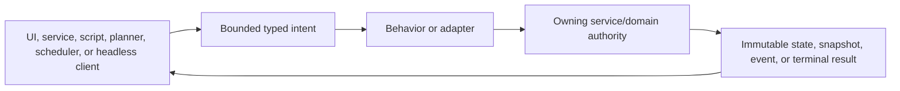
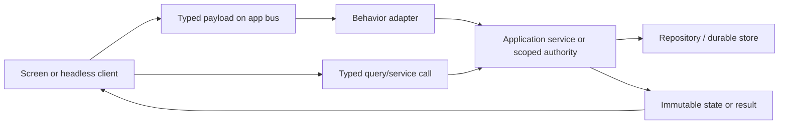

# Service and Command Architecture

Slice-native document storage adds a pure ObjectFactorySlicePackage envelope and a typed SliceSaveRequest
through the existing FactoryObjectOperationService serialized lifecycle. FactoryNativePackageService remains
the public transaction authority; its package-private document store adds no service, listener or model
conversion. The original complete-model UTF-8 is authoritative, and derived inner documents are labelled
as projections. See the [source-only contract](<../design/Active Designs/Object Sing & Dance Factory__/SLICE-NATIVE-STORAGE.md>).
Runtime adoption, Type replacement and consumer compatibility are separate gates.

## Status and scope

This page describes current Talisman service ownership and invocation behavior. It is not a target
architecture. Operations-Atlas remediation is kept separately in the
[Talisman Architecture Operations Atlas](<../design/Active Designs/Talisman Architecture/TALISMAN-ARCHITECTURE-OPERATIONS-ATLAS.md>).

Use this page before adding a cross-screen workflow, background operation, Scripted Walkthrough
action, or AI-planner capability. The other Atlas pages remain authoritative for feature-specific
[action routes](action-routing.md), [events and threading](events-threading.md),
[persistence](persistence-and-content.md), and [focused tests](focused-tests.md).

## Original intent and additive direction

Talisman's bus, Behavior, and service architecture was designed so decoupled clients could request
work without depending on the target screen. A responsible service performs semantic work while
typed process-local routes carry intent and observable state. That design remains the governing
architecture.

The shared semantic-operation contract completes missing acceptance, correlation, lifecycle,
cancellation, reconstruction, and terminal-result truth beneath or alongside those routes. It does
not replace the bus, bypass feature services, or introduce a parallel orchestration framework. Bus
delivery remains transport evidence; only the owning service can accept work and publish its checked
result.

## Mandatory feature conformance

Every new feature or meaningful behavior change must first fit this normal route:

The plan, focused proof, task ledger, and final handoff must identify:

1. the typed command/intent, or the reason a direct typed query is correct;
2. the UI-independent Behavior/adapter that owns routing, validation, lifecycle, and thread handoff;
3. the service/domain authority that performs work and owns revision/persistence guards;
4. the immutable state, progress snapshot, event, or terminal result returned to clients;
5. EDT, JavaFX, and worker boundaries plus forbidden synchronous bridges;
6. subscription/disposal, stale identity, replay/epoch, and cancellation semantics;
7. the smallest event-route, service-outcome, UI-projection, and applicable headless-parity tests;
8. the Atlas, index, package, and source documentation changed in the same coherent body.

Immediate local read-only queries and presentation-only controls need no artificial bus round trip.
Any other route must name its alternative owner and prove that it creates neither UI-owned business
behavior nor a second mutation path. A component may render state, collect intent, and adapt delivery;
it must not become a business-operation owner, persistence authority, worker lifecycle, or cross-screen
orchestration hub.

## Vocabulary that matters

Talisman currently uses four different interaction forms. They are not interchangeable.

| Form | What the caller learns | Typical owner |
| --- | --- | --- |
| Typed service call | Return value or thrown failure from the completed call | application service |
| Bus command | Only that a message was published or enqueued | behavior subscriber |
| State event | A new immutable projection or refresh signal | behavior/session owner |
| Semantic operation | Stable admission, lifecycle, and terminal truth | feature service + shared contract |

A bus message ID identifies one delivery attempt inside one process. It does not identify the logical
operation and does not prove that the requested mutation committed. `BusMessage.id` is likewise a
message UUID unless a caller explicitly supplies one; the core bus does not interpret it as an
idempotency key, correlation ID, or result address.

UI-only requests are a fifth, deliberately limited form. A request that contains an AWT Component or
Window can be a valid shell or dialog route, but it is not a headless business command.

## Application composition and authority

`AppServices` is the process composition root. It creates shared service instances, wires storage and
telemetry dependencies, exposes typed accessors, registers read-only probes, and closes owned
resources. `ServiceRegistry` is a string-keyed diagnostic/probe registry; it is not the preferred
application API.

The direct service route is normal for immediate queries, validation, and transactional calls. The
bus route is normal when several live views need decoupled intent and state publication. A view does
not gain mutation authority merely because it can publish a command.

GM Control's browser-facing source uses the direct query rule. `MapRuntimeSessionService` captures
one `GmControlSnapshot` while holding its existing session lock, so the pinned document/Place/
visibility,
selection, Arena definition/object/Group/store revisions, hierarchy, Layers, and bounded exact-Place
residents cannot be stitched from different generations. The immutable result is GM-private and
read-only. Its workspace copy is defensive source evidence, not a serialization surface; an
Application Server adapter may expose only reviewed bounded scalar fields and explicit
unavailable-field names.

GM render content uses a separate direct-query boundary. `GmControlRenderProjectionSource` joins the
current immutable 2D map projection to `ProductMapViewBehavior`'s exact coherent GM 3D presentation and
normalized camera. Its byte-free `GmControlRenderProjection` names exactly `control.overview`,
`control.view.2d`, and `control.view.3d`, plus opaque content-digest handles. Every asset read rechecks the
same service/document/Place/visibility/state/Arena/selection owner stamp and retained manifest. Replacement
or close invalidates old handles. GM retains state, revision, selection, and privacy authority; the 3D
Viewer owns browser mount/update/resize/dispose and render realization; Make JavaScript owns retained host
composition. No Player frame, managed Asset identity, repository/path, Swing/JavaFX value, or mutation
authority crosses this boundary.

### Service and persistence authorities

| Domain | Live service/authority | Durable authority | Normal clients |
| --- | --- | --- | --- |
| Map documents | `MapDocumentService` and per-scope `MapDocumentSession` | map repository / project SQLite | Authoring and runtime bridge |
| Authoring composition | `MapEditorScopeState` behind scoped behaviors | document service after checked commit | Authoring 2D/3D views |
| GM runtime | `MapRuntimeSessionService` | `ArenaObjectStore` plus pinned map state | Control, Player projectors |
| Combat | `CombatRuntimeSessionService` | runtime/Arena authorities it coordinates | GM Play |
| User Assets | `UserAssetsService` and focused database services | project database and managed files | Assets and checked consumers |
| Characters and SRD | `GameObjectService`, `SrdLibraryService` | project database | Assets, Adventure, runtime import |
| Adventures | app service + repository + review | Adventure/reference rows | UI/headless clients |
| Script packages | `ScriptRegistry` and `MapScriptExecutionService` | installed package catalog; outputs commit through map authority | Script Manager / Authoring |
| Player browser | `BrowserPlayerScreenService` | runtime presentation state, not map document state | GM Control / browser delivery |
| Relay | `MoondanceRelayClient` | in-memory session plus remote relay truth | GM presentation controls |
| Preferences | `UserPrefsService` and focused view stores | preferences | screen-local presentation owners |
| Performance runs | `PerformanceAnalysisRunLifecycle` and run store | bounded private run artifacts | Performance Workbench |
| Read-only product capture | `ProductDataStateCaptureRegistry` | none; returned immutable evidence only | Workbench/probes |
| Easy Tale contract | `EasyTaleAuthorityContract` | none in Body 1 | future Easy Tale clients |

Easy Tale Body 1 adds only the toolkit-neutral `EasyTaleAuthorityContract`. It freezes signed 64-bit
epoch-millisecond ranges, resolved-event ordering, exact calendar-definition stamps, exact
target/revision/request/lifecycle presentation stamps, pre-dispatch feedback readiness, zero-duration
Focus transitions, and the absence of Timeline playback. It owns no repository, DTDT parser/runtime,
Swing component, window, worker, bus, provider, or persistence route. Existing `TimeService` remains the
current world-calendar conversion service; later Easy Tale bodies must adapt through reviewed boundaries
rather than creating an untracked second calendar authority.

Easy Tale Body 2 additively introduces DTDT language version 2 for Focus declarations. `DTDTStructure`
owns parsing and fail-closed structural validation; `DTDTBuildContent` resolves ordinary DTDT component
references; and `DTDTFocusWorkspace` owns presentation-only open, expand, close, packing, overflow,
restoration, accessibility, and disposal. Local presentation events are not semantic-operation acceptance
or committed-result truth. Version 1 DTDT documents keep their existing construction route.
The same presentation owner composes visible adjacent rails with resizable Swing dividers, checked declared
minimums and bounds, and immutable session snapshots. Divider proportions never enter a service, bus,
repository, or semantic-operation contract.

`MapEditorScopeState` remains a UI-package owner with application-like responsibilities. Adventure's
ordinary World/Adventure reads, create/update/reference controls, and reviewed semantic steps instead share
one AppServices-owned `AdventureApplicationService` with direct/headless callers. The service owns reviewed
approval, current-step reservation, execution, deterministic encounter review/preparation, and bounded
reconstruction; the panel is a guarded review and EDT projection adapter. The same worker-backed service
exposes the selected-Character read: it freezes and rechecks exact Adventure/reference/Character/source
revisions, then consumes only `GameObjectService` active Character identity plus canonical sheet facts.
`AdventureCharacterPane` is the presentation owner for the identity masthead, character-local Focus Bar,
CS-02 read-only Combat/Statistics, and CS-03 read-only Images & Description projection, not a second
Character or Assets service or editor. The injected Adventure-owned Assets consumer returns exact role/
association/asset revision stamps and bounded presentation PNGs without paths or provider data.
CS-04 History remains on this same service boundary but is Adventure-owned narrative rather than a canonical
Character edit. UI and headless callers share immutable History reads and one exact event-save request;
`AdventureRepository` alone checks the reference/current Character source and commits the event plus one
Adventure revision advance atomically. The pane and panel only own immediate busy state and guarded EDT
projection. CS-05 Relationships use the same worker/service/repository boundary. One immutable request
freezes the selected Character reference and exact target Adventure reference kind, identity, source
revision, and provenance; one checked transaction commits the bounded relationship plus Adventure revision.
History and Relationships are sibling Adventure context, never Character/Assets mutation authority.
Missing skills,
actions, conditions, and resources remain explicitly unavailable rather than inferred. Production
composition injects the app localization service; raw Character-read exceptions never become UI text.
Canonical request/document capture is followed by a final owner-authoritative Character revision read, so
an intervening checked sheet save rejects stale rather than returning mixed revision facts.
`AdventureRepository` remains the sole aggregate authority and the checked authority for the dedicated
prepared-encounter aggregate and one Adventure revision
advance. Runtime admission remains separate. The AppServices-owned
`GmPreparedEncounterAdmissionService` is the one UI/headless consumer of that artifact. It reads exact
prepared and Adventure truth only through `AdventureApplicationService`, owns the owner-private
`gm-control:admit-prepared-encounter:v1` lifecycle, and delegates one detached checked graph commit to
`MapRuntimeSessionService`; `ArenaObjectStore` remains durable Arena authority. Bus delivery, Viewer
gesture, panel lifecycle, and Player publication are never acceptance or commit truth. Its narrow
`AdventurePresentationSelection` interface is a presentation-only exception: an already-resident root
can expose content-free correlated selection readiness without granting CRUD, planning, or execution
authority and without adopting the mutation-oriented semantic-operation registry.

The AppServices-owned `GmCombatMoveOperationService` and sole `CombatRuntimeSessionService` give the
real Play UI and direct/headless callers one `gm-control:move-current-combatant:v1` route. The operation
owns acceptance, bounded process-local reconstruction, cancellation/deadline arbitration, and immutable
owner-private terminal truth. `CombatRuntimeSessionService` rechecks the exact current activation and
installs movement-spent truth; `MapRuntimeSessionService` remains the sole checked Arena persistence,
history, revision, and state-publication authority. The Combat bus is a UI adapter, not receipt or commit
truth. Once Arena movement and combat spent truth commit, deferred projection is best-effort: a stale
publication is skipped rather than replacing newer runtime state, and projection failure cannot rewrite
the immutable committed operation result. Player/Viewer projection remains ordinary post-commit state
convergence.

The AppServices-owned `GmStagedPresentationOperationService` gives the real Control Present command and
direct/headless callers one `gm-control:present-staged-map:v1` route. Its owner-issued capture freezes the
exact pinned runtime document/version/Place, visible/revealed policy, capture digest, and prior live
generation. `GmStagedPresentationPreparer` performs Player-safe projection and exact content/terrain
preparation off the UI threads; its User Assets branch uses only current-node lookup, exact asset-row
lookup, and DB-owned content reads with metadata/content recheck. `MapRuntimeSessionService` remains the
single checked local live-generation install authority; its legacy public unchecked installer is removed.
Follow, frames, Player endpoints, browser/relay, camera, and connected clients are downstream convergence
only.

Several Assets UI owners also construct focused database services around `DataBaseService`. Those
services retain their own transaction guards, but the complete acquisition/attach workflow is not one
application-scoped operation surface. Factory Object Save is the bounded exception:
`FactoryObjectOperationService` is AppServices-owned and gives the Factory panel and headless clients
one Save New/exact Save/Save As lifecycle, while `FactoryObjectLibraryService` and
`FactoryModelAdmissionService` remain the checked durable authorities.

Object Factory OF-01 deliberately stops before that operation and durable boundary.
`ObjectFactoryNativeFormCompiler` is a pure direct-call domain compiler: equal immutable canonical-foot
recipes return equal immutable geometry and in-memory OBJ/MTL/PNG/region bytes. It owns no AppServices
instance, worker, bus topic, UI state, filesystem, Viewer source, provider, or database transaction. A
later preview, admission, or save route must consume its candidate through the owning service rather than
giving this compiler application or persistence authority.

OF-02 remains inside the same direct-call boundary. `ObjectFactoryRig` qualifies exact OF-01 Space Node and
Part identities with rigid bindings, stable controls/sites/reference segments, complete channel policies,
and hard rotation limits. `ObjectFactoryPoseSnapshot` admits one complete parent-local pose for that exact
Rig, while `ObjectFactoryForwardKinematics` derives parent-first world frames, immutable toolkit-neutral
Skeleton presentation, a posed mesh, and optional posed OBJ. None of those derivatives owns Form topology,
UVs, regions, Appearance, durable state, Viewer presentation, bus delivery, worker lifecycle, or commit
truth.

OF-03 adds `ObjectFactoryBodyFormSession` as one bounded UI-independent transient command and history
authority. Node/Part edits, view-plane movement, explicit keep-world/keep-local reparenting, selection,
reference registration, and undo/redo are direct typed calls because they are synchronous local draft
operations. Each Form edit recompiles through OF-01 and requalifies the same OF-02 semantic Rig identities;
invalid replacement is rejected before session mutation. `ObjectFactoryReferenceImage` defensively owns
bounded exact source bytes, digest, declared Front/Side/Back identity, and independent orthographic
registration. The UI adapter's bounded intake verifies PNG/JPEG reader format, positive edge/total-pixel
metadata budgets, and decoded-size equality before those bytes can enter the session. The session returns
immutable complete state and owns no AppServices, semantic-operation,
bus, filesystem, database, provider, Viewer, or Save route. A future Context Management provider adapter
composes outside this domain owner; it will project only stable IDs, ancestry, selection/edit
summaries, transforms/counts, capabilities, and resolvable references—not mesh/image/track payloads.

OF-04 adds `ObjectFactoryAppearanceSession` as the separate UI-independent transient UV/Appearance owner.
It rasterizes the exact OF-01 indexed UV mesh into stable triangle barycentrics and named regions, projects
registered reference pixels through their OF-03 orthographic registration with visibility/facing guards,
and returns immutable direct/propagated/unresolved source-confidence evidence. Propagation is bounded and
cannot cross a region identity. Reciprocal Form/atlas inspection is a direct typed local query. Compatible
PNG import retains exact admitted bytes, and candidate change resets to the canonical checker. This owner
has no AppServices, bus, filesystem, database, provider, Viewer, Context, or Save authority; the Swing
adapter alone performs bounded file intake and presentation.

OF-05A adds `ObjectFactoryNativePackage` as the pure complete-graph capture/load contract and
`FactoryNativePackageService` as its one durable transaction authority. Strict BODY_FORM and CHARACTER
packages carry ordered required/optional/repeatable component memberships, exact schemas and
revisions, immutable content digests, compatibility signatures, source/prior revision provenance, and a
versioned manifest. Load validates the complete graph and recompiles derived Form/Rig artifacts before an
immutable draft can reach a caller. Separate Native Save New, exact Save, and Save As operation types reuse
the existing AppServices-owned `FactoryObjectOperationService` receipt/idempotency/worker/terminal route;
the legacy ZOF request remains distinct. No parallel store, bus command, provider, Context adapter, Viewer
source, or UI-owned transaction is introduced.

The Factory-owned Body Form capture prerequisite adds `BodyFormCaptureIntent` as one bounded complete
semantic graph plus exact session, Form, Rig, Appearance, Puppeteer, selected Object, Save/Save-As,
idempotency, and correlation currentness request. `FactoryBodyFormCaptureGateway` resolves the authoritative
owner-held edit-session aggregate, validates every stamp before mutation, applies the complete node/Part
graph through `ObjectFactoryBodyFormSession`, re-synchronizes the existing Appearance and Puppeteer owners,
and returns one parsed immutable `ObjectFactoryNativePackageTransfer.Envelope`. The envelope contains the
Java-compiled complete component graph and hashes; it is capture output, not acceptance or durable truth.
No UI, browser/server route, worker, bus, database, durable read, provider, or lifecycle authority is added.
The Application Server's separately injected capture adapter admits the typed intent with App Session, CSRF,
server/manifest epoch, body bounds, and per-workspace replay truth, then delegates without inspecting or
constructing Factory component semantics. It returns the Factory envelope itself; unavailable Factory
composition is retryable and creates no synthetic session or fallback package.

OF-06 retains the direct-call domain boundary. `ObjectFactoryTwoSegmentIk` analytically solves one exact
declared two-segment chain without changing segment lengths, topology, UVs, or Rig authority.
`ObjectFactoryPoseSession` owns only transient complete Pose state, selected semantic Handle, target/pole,
supported pin, candidate, bounded history, and exact Save intent. `ObjectFactoryPoseObservationDeck`
admits one immutable scalar/landmark/silhouette snapshot with exact six camera roles, Creature/current-Front
ancestry, and bounded common registration; `ObjectFactoryPoseMatcher` returns one deterministic candidate
with explicit observation/joint confidence, residual, missing roles, and unresolved channels. None owns a
provider, Critter queue, managed asset, provenance writer, AppServices operation, or database. Optional
complete Pose components enter the OF-05A package only through the existing exact Save operation.

OF-07 also retains the direct-call domain boundary. `ObjectFactoryPoseField` owns canonical reference-only
Field bytes, deterministic integer-coordinate topology/hull projection, and complete-Pose interpolation.
`ObjectFactoryPuppeteerSession` owns only transient Teach/Perform mode, complete-Pose dot capture,
selection, cursor, Field revision, and bounded history. Neither owner can record a Performance Path, add a
Native Package member, submit an AppServices operation, call a provider, or mutate Critter/live data.

OF-08A adds pure `ObjectFactoryPerformancePath` and `ObjectFactorySolvedClip` owners beneath the same
session. The Path is authoritative 60 Hz cursor/timing truth and pins exact Rig motion, Field, evaluator,
chart-Pose, and dot-Pose revisions/digests. The Clip is an optional explicit full-TRS derivative with source,
solver/projector, and measured validation evidence. `ObjectFactoryNativePackage` captures both through the
existing `FactoryObjectOperationService`/`FactoryNativePackageService` transaction; no second operation,
store, provider, Critter authority, or OF-08B composition service is introduced.

OF-09A adds immutable `ObjectFactoryTemplate` family data and one pure synchronous
`ObjectFactoryTemplateEngine` direct-call authority. A bounded typed compile request normalizes only declared
parameters, expands stable node/Part/Rig/Atlas formulas, delegates geometry to the Native Form compiler, and
returns one immutable complete Form/Rig result with independent compatibility signatures and density
evidence. The engine iterates declared cardinalities; the complete biped is data, while a reduced fixture
proves no universal two-arm/two-leg schema rule. Definition changes require a higher Template revision and
structural changes remain explicit. No UI, worker, bus, AppServices instance, Native Package member,
persistence transaction, provider, Critter authority, or OF-08B composition owner is introduced.

OF-08B adds immutable `ObjectFactoryBehavior` definitions and one pure direct-call
`ObjectFactoryBehaviorComposer`. The request carries the exact Rig, incoming complete Pose, immutable
Behavior revision, one global tick, and an immutable catalog of exact pinned OF-08A Path/Clip/reference-Pose
sources. The result carries one complete Pose plus active-Layer, conflict, and final-limit residual truth.
`ObjectFactoryBipedBehaviorLibrary` is bounded deterministic fixture/content over the landed OF-09A family;
it owns no universal anatomy rule. `ObjectFactoryNativePackage` adds repeatable Behavior members to its
existing checked component graph and transaction. No service instance, bus, worker, second store,
retargeter, provider, Critter, or live-data authority exists in this route.

OF-11 adds `ObjectFactoryRuntimePublication` as one pure immutable runtime publication/invocation boundary.
Its typed request carries one exact Character/Object revision, Native Package version/fingerprint, Behavior
revision, consumer, and optional consumer-required exact-motion signature. Publication decodes the complete
package graph and visibly rejects stale, missing, non-articulated, or incompatible truth. Invocation accepts
only a bounded ordered list of caller-supplied ticks and delegates every Pose to the unchanged
`ObjectFactoryBehaviorComposer` and every articulated mesh/posed OBJ to unchanged forward kinematics.
Immutable start/progress/end outcomes are the terminal domain truth. `FactoryRuntimePublicationService`
adapts an exact-current durable read to that pure owner; it writes nothing. `ObjectFactoryRuntimeConsumers`
projects the already-evaluated publication for Viewer, GM, Player, or Scripted Walkthrough without another
clock, composer, state machine, bus, operation, persistence, retry, cancellation, semantic event, or glTF/
GLB adapter.

OF-12A remains a pure direct-call domain route. `ObjectFactoryLizardMappingBodyType` compiles one immutable
reviewed hips-rooted Lizard family into detached closed primitive Form/Atlas artifacts with a fixed semantic
graph, splayed mapping pose, Standing angle set, bounded proportions, and compatibility digests.
`ObjectFactorySixViewMapping` owns one creature revision's six independent observation planes and detached
geometry revision: landmark movement changes one face only, geometry movement changes no observation, and
Copy Opposite is an explicit direct one-time seed. `ObjectFactorySixViewTextureBaker` consumes the landed
immutable settled-deck contract plus exact paired local ARGB pixels. It rechecks exact Creature revision,
current accepted-Front ancestry, common dimensions, role membership, and per-observation identity before it
returns immutable PNG plus per-texel direct/blended/unresolved, contributing-role, confidence, and provenance
truth. `WAITING_FOR_FRONT` remains a non-mutating terminal result. These synchronous immutable values require
no UI adapter, worker, bus,
semantic operation, cancellation, subscription, or thread bridge. This body adds no Native Package role or
durable route; later persistence must pass its exact body/mapping/source/bake revisions through the sole
Factory package/save authorities rather than introducing a second store. It performs no provider, Critter,
database, live-data, or Seasons mutation.

OF-UI-COPY-12 makes the browser proving seam explicit as pure `copyOppositeLandmarks`. Front/Back preserves
stable anatomical semantic IDs and reverses normalized screen X once; Left/Right keeps the established
near-side mirror-identity route. It returns immutable independent destination records and owns no image,
geometry, Creature, service, provider, persistence, or server authority.

OF-UI-DIRECT-13 removes the browser permission layer from Copy Opposite, Save Mapping Default, Reset Mapping,
and Remake Selected Images. Each explicit button now invokes its existing route directly. Disabled,
validation, busy, duplicate, stale, exact-role, Front-first, queue, persistence, and terminal-result authority
remain with their existing owners; name and instruction editors remain data-entry surfaces.

The Critter detail JavaScript remains presentation/proving-ground evidence. Its legacy six-card view now
projects image observations and body-form geometry through separate point maps. One square transform derives
from the actual joint/volume envelope, so it neither adds a hidden 10% inset nor enlarges geometry around an
arbitrary screen center; 2D landmark motion cannot move the green geometry outline. Horizontal 3D dragging
uses object-relative orbit direction consistently in the detail, geometry, and result surfaces. Critter
continues to own the web service, source assets, controller, queue, and any restart.

NJOF-02 gives the native Body Form route one retained Views/Morph/Shader/Puppeteer/Object composition.
`ObjectFactoryWorkspaceState` is complete immutable UI-local disclosure/focus truth; its direct typed
open, close, focus, and toggle transitions are presentation intents and do not cross the process-local bus.
`ObjectFactoryNativeWorkspacePanel` projects that state on the EDT by adding or removing stable Box wrappers
around the exact existing Reference, Build/Skeleton, Skin, Puppeteer, and Pose components. It does not
reconstruct those components or acquire domain, service, persistence, worker, provider, or database
authority. Existing Body Form, Appearance, Pose, Puppeteer, Behavior, publication, and checked Factory
services retain their boundaries. Disclosure close preserves each inner editor and its local state; final
`ObjectFactoryBodyFormEditorPanel.close` remains the sole owner-disposal boundary.

OF-UI-01 recomposes that packaged Application Server presentation as one Object Factory Shelf with
independently open Morph, Shader, Puppeteer, and Object Boxes around one shared 3D result. Morph owns the
six-view reusable Body Form editor, neutral reference, control graph, mesh, proportions, and catalog.
Shader owns Creature-specific image evidence, reviewed generation, and automatic projection onto the
completed Morph. Puppeteer owns named stance and motion work without its own 3D viewport. Object alone
projects the shared surface, camera, Control Point/Skeleton, grounding, and selection state. The catalog
covers Humanoid, Avian, Generic
Quadruped, Horse-like, Lizard, Winged Lizard, Dragon, Serpentine, Arachnid, and Tentacled morphotypes.
Each immutable catalog value names a versioned Morph Form/Skeleton, ovoid/cylinder envelope vocabulary,
and bounded stance commands; its generated skeleton-plus-envelope cover leads the catalog card. Morph's
neutral reference composes that exact Form, stance, face camera, silhouette, controls, regions, and mask
without changing geometry. Shader applies only accepted Creature image observations to that Form.
Stable `data-of-*` component/intent identities are the DTDT/Java translation seam. JavaScript remains
browser-local projection state: pure Template/Lizard compilers retain Form/Rig truth, Native Package
services retain durable truth, and Critter retains the route process, deck, queue, assets, provider, and
Creature authority. The later 235-Creature adoption workflow is reviewed and absent here.

OF-UI-ACTIVATE-05 keeps that route browser-local while making Morph, Shader, Object, and Puppeteer peer
Shelf Item/Box pairs. One checked order controls both item and live-Box placement; moving a Box reparents its
existing DOM node and does not reconstruct feature state. Independent open state, order, divider weights,
and the nested Morph/Shader Shelves remain presentation recovery only. Projected rig and Outline are
synchronous SVG derivatives of the current immutable Form/profile and loaded image pixels. They issue no
service intent
and cannot become Creature, Appearance, Native Package, or persistence truth.

OF-UI-ACTIVATE-06 aligned the owner bytes with the canonical Shelf contract. OF-UI-SHELF-14 historically
introduced checked nested groups; later flattening and OF-UI-MORPH-37 retain that fixed-order admission for
Morph and Shader only. Each owns independent presentation state and exact fingerprint. The parent mount
names the child Shelf; no generic recursion or new feature authority exists. Parent close retains child open
state while evacuating descendant focus. Invalid combined persistence rejects to complete defaults.

OF-UI-DTDT-18 makes those presentation choices checked data under the explicit Shelf Contract v2 successor.
The frozen v1 contract retains its historical group, label, REGION, and layout shapes. Version dispatch admits
only self-identified v2 definitions; the separate explicit v1 validator preserves historical inputs, and
missing, unknown, or cross-version definitions fail before presentation. V2 owns group reorder/disclosure/
occupancy/orientation/overflow/adornment policy, bounded label/group content, and declared child groups.
The browser runtime owns generic state, focus, drag/keyboard interaction, accessibility, and rendering only.
Object Factory provides component nodes and retains every domain intent. Twist-label disclosure is the sole
close route and forbids a duplicate Close.

OF-MORPH-PUPPETEER-SHELF-47 applies that contract to the isolated Core Morph catalog workbench. Its checked
owner DTDT declares the fixed nine-item, vertical, scrolling, multi-open Morph editor Shelf. The front-side
HTML publishes open, close, focus, clear-focus, and divider intents only to its page-local reducer; those
intent names are conversion identities, not production bus delivery or service acceptance. Complete Morph
packages remain source authority, while local disclosure, selected-Morph restoration, and bounded divider
extent remain fail-closed presentation memory with no database or application-service path.

OF-MORPH-PUPPETEER-48 advances that owner definition to canonical manual pointer/keyboard order and replaces
the two parameter Boxes with one Point-keyed hierarchy. Its new Puppeteer Box consumes checked complete
stance endpoints and returns a browser-local normalized inverse-square display blend from an artificial 2D
target. Stance-point placement and target movement are deliberately unrecorded. Shelf order/disclosure and
the selected Morph remain the only admitted presentation-memory fields; the influence field creates no Morph
mutation, production bus, service, provider, or database authority.

OF-UI-BODY-FORM-31 removed the redundant Type disclosure before the later Morph/Shader split. Body Form
directly owns the complete catalog/manufacture/load/save/exchange composition and current Creature Morph
card, without another scroll
or domain authority boundary. Form editing treats the graph's declared `mirror` pairs as one bilateral
constraint: editing either partner reflects its position to the other, while unpaired centerline controls
remain independent. The same pair relationship copies editable segment radius/taper and profile dimensions,
so the meshes generated from those controls remain bilateral too. Proportions is a local disclosure before
Fit and owns a left-side contextual joint/segment drawer; geometry recompilation redraws both Object surfaces
without claiming or resetting camera authority.

OF-UI-INTERACTION-32 keeps segment insertion and Object framing inside those synchronous presentation
routes. The stable delegated pointer owner recognizes two bounded presses on one semantic segment before
the first press's redraw can invalidate native DOM double-click identity, then inserts one unlocked control
through the existing complete Form recompile. A committed native Stance event forces a post-menu Object
render even when provisional menu observation already adopted the value. The fitter preserves an unnamed
rotated camera instead of requesting an invalid canonical preset. Object Fit frames the complete current
stance, including geometry above and below world zero, and draws the green baseline at projected world zero
rather than at a fixed screen edge. One in-memory 50-entry Form history restores the same controls, profiles,
constraints, mesh detail, and stances into both projections; it does not establish a second model authority.
Each projected membrane triangle resolves to one logical arm/body/web panel. A panel drag traverses only its
three defining controls, never their descendants, while shared edge controls keep adjacent panels attached.
Panel Thickness compiles paired front/back tessellation plus closed edge faces and follows declared bilateral
mirror geometry.

OF-UI-TABLET-33 keeps every peer Box under the same `MULTI_OPEN` Shelf authority at tablet
widths. The workspace projects only the count of currently open peer Boxes. Responsive CSS then flows the
retained Boxes in their already-authoritative Shelf order: one fills a row, two share a row, and an odd third
fills the next row. It creates no alternate order, open-state owner, or semantic action.

OF-MAPPING-ANATOMY-22 makes the code-owned Body Form Mapping stance the reusable anatomical authority for
image alignment. One pure browser adapter consumes only the exact loaded-image silhouette and canonical
named-control projection, returning bounded image bounds, per-control source/confidence/visibility, and an
explicit unresolved set. A current image/Form/view identity guards installation; locked controls remain
unchanged. An accepted result updates the one shared transient Form and constructs the existing strict
`object-factory.image-control-metadata/v1` package. The browser adds no provider or persistence route. The
package cannot cross the managed host until the separately owned Application Server optional-field
capability is explicitly available.

OF-GEOMETRY-FIRST-26 removes the image-versus-geometry split from that mapping authority. One transient
control graph and its profiles produce the editable purple rig, the complete triangulated 2D projection,
the occupied-triangle boundary, the paintable Object surface, and every detached Object stance. Refit and
edit completion reproject all visible controls from that same graph; there is no second target graph or
residual comparison layer. Front and Back project body width against height, while true Side projects depth
against height. Morph owns Body Form, Views, and the contextual Proportions drawer beside its interactive
2D viewport.
The versioned `talisman.object-factory.morph/v1` clipboard seam admits one complete control hierarchy,
profiles, mesh-detail pair, constraints, and explicit stance point maps before atomically replacing the
transient Form. It is a local conversational editing and recovery seam, not database, Basic Morph, Creature,
provider, Native Package, or persistence authority. Object stance selection renders from a detached copy and
invalidates its viewport immediately; it never alters the Morph Mapping Form.

OF-LINKED-VIEWS-27 makes the current Mapping graph—not a retained stance snapshot—the Object Mapping
projection authority. Each 2D control drag updates that graph and synchronously invalidates the Object
viewport before the next browser paint. The Object surface may overlay its stance-aware control graph, while
Morph may independently show or hide the named profile cross-sections. Both switches are browser-local
presentation state and create no second geometry, stance, Creature, Native Package, or persistence authority.

OF-WING-SEAM-29 keeps a dragged control and the shared Form on one bounded normalized translation, including
multi-selection at a mapping edge. Wing webbing uses a fixed maximum terminal inset rather than a percentage
that grows with an edited finger, and the Object fit camera has no arbitrary minimum zoom that can clip a
valid stretched Form. A completed Form edit marks that fit stale before repainting. These are synchronous
projections of the same transient graph, not corrective state.

OF-UI-WHEEL-35 gives the stable HTML Object workspace capture-phase ownership of non-passive wheel input.
The host cancels page scrolling and applies one bounded zoom to whichever retained Object camera is visible;
the replaceable SVG presentations no longer compete for the same gesture. Ordinary wheel scrolling outside
the Object workspace is unchanged. This remains browser-local camera state with no semantic or service
route.

OF-UI-MORPH-37 makes the editor boundary explicit. Morph is a peer Box before Shader and owns the reusable
Body Form selector, neutral mapping reference, interactive points/segments/mesh, Views, and contextual
Proportions. Shader has its own synchronized Views and Image Data, displays only the accepted
Creature-specific image, and is the only image source allowed to feed Object texture projection. The neutral
Morph reference may provide silhouette evidence but cannot become Creature texture. One semantic selection
identity is projected into both Morph and Object; selected points, segments, body volumes, or membrane panels
receive the same high-contrast orange treatment. This split is browser presentation composition over the one
transient Form and accepted image deck; it creates no duplicate Form, Creature, provider, database, or
Application Server authority.

OF-MORPH-IDENTITY-38 treats Morph as the self-contained editor for one reusable Body Form package: identity,
descriptive family, proportions, control graph, meshes, Mapping silhouette, and stances. Shader and Object may
render the same in-progress graph while their peer Boxes are open, but neither owns a copy or persists a Form.
Ancient Dragon is now a distinct complete 74-Point source Morph rather than an Adult Dragon alias. Apply
assigns the selected reusable Form to the current Creature. Browser recovery remains explicitly
non-authoritative.
Application Server now declares delegated Body Form Save and Save As descriptors and provides one typed
`FactoryBodyFormApplicationServerGateway` seam to the existing Factory operation service; activation still
requires a reviewed bounded complete-package transfer plus database-lease composition.

OF-MORPH-CATALOG-45 adds the direct read route needed to replace the browser's fixed catalog. Checked-in
complete Core Morph source is the authoring authority; `CoreMorphCatalogService` validates and atomically
materializes immutable revisions plus one current pointer through the existing content store. The
authenticated
`FactoryCoreMorphApplicationServerGateway` returns either the ordered current catalog or one complete selected
package. Reads execute synchronously on the Application Server HTTP worker and return immutable projections;
they create no bus intent, UI-owned domain behavior, mutation, provider call, or alternate store.
Catalog revision 3 contains twelve independent complete Morph packages in declared source order. The
workshop import adapter verifies its exact patch/source digests and emits production resources; it has no
runtime or database authority. Ancient Dragon revisions 1 and 2 remain immutable source history while
revision 3 is current. Eight other changed Morphs advance to revision 2; the remaining three retain revision
1. Humanoid's complete materialized document now retains its exhaustive editor-parameter contract and
parent-to-child capsule geometry.

### Creature-private Morph Save and Base Revision Publication

The authored-save body supersedes the earlier read-only/session-draft limitation when its compatible
host is installed. `CoreMorphRevisionService` is the single UI-independent interactive writer for complete
private and authored-base packages, reusing `CoreMorphCatalogService` validation/content identity.
`FactoryCoreMorphApplicationServerGateway` adapts bounded save requests into this authority on an HTTP
worker; no EDT/JavaFX bridge, provider call, hidden browser writer or BODY_FORM persistence is involved.
The session/csrf/manifest-instance guarded POST returns one immutable idempotent receipt; the browser
then reads the exact committed private/base projection. A lost response retries identical bytes/key.
The UI's ordinary Save promises the Creature's private Morph, not unrelated Creature record fields.
Apply is draft-only; `replace_base` is an explicit replacement guarded by the prior private head identity.
Base publication targets the draft origin, freezes the comparison, and leaves all private copies unchanged.
No browser is required for the service semantics; temporary-database and authenticated HTTP tests cover them.

OF-MORPH-INFLUENCE-39 replaces Morph's source-raster reference with a deterministic derivative of its one
transient Form. Front, Back, and true Side paint the current triangles far-to-near through the canonical
orthographic frames, assign flat colors from stable anatomical mesh ownership, and reuse the occupied-mesh
boundary as the visible outline. The visible canvas and 512-square Shader generation guide share that palette;
neither owns geometry, Creature pixels, persistence, provider admission, or paid work. Shader remains the only
accepted Creature image source for Object texture. Body Form's vertical selector and selected-Form editor are
presentation composition over the same catalog/session; its Save remains browser recovery while the delegated
permanent host capability is unavailable.

OF-OBJECT-SURFACES-40 exposes two Object presentations of that same transient Form. Paint by numbers colors
the actual 3D triangles from Morph's stable anatomical ownership; Generated surface uses only accepted Shader
Creature images. Shader's six canonical views are an enabled, browser-local priority list. For each
triangle, the first enabled loaded projection whose camera faces it and has a valid image hit claims the
texture; later views fill only misses and cannot overwrite earlier claims. Shader selection changes its
preview and Image Data without
moving Morph's editing face or Object's camera. Wireframe and Control points remain independent overlays.
OF-SHARED-VISIBILITY-41 later makes semantic Control points the Object projection of the root Landmarks
control; Wireframe remains Object-local. Surface preference,
projection order, enablement, and selection are local recovery state and create no new service, persistence,
provider, Appearance, Body Form, Creature, or Native Package authority.

OF-SHARED-VISIBILITY-41 makes the root Landmarks, Labels, Segments, Outline, and Overlay controls one
browser-local visibility snapshot shared by Morph, Shader, and Object. Morph remains the source renderer;
Shader mirrors the active orthographic control/outline layers over its Creature image; Object projects the
same semantic control layers plus a view-dependent surface silhouette over its 3D surface. Hiding or fading
a layer never mutates selection, camera, Form, Creature image, projection priority, or surface choice. The
anatomical influence legend is global explanatory chrome in the Creature title bar, while the wider Morph
Proportions drawer remains a contextual Form-editing surface. This is synchronous presentation state with
browser-recovery admission only; it creates no bus, service, worker, provider, or durable-data authority.

OF-SHADER-REGISTRATION-42 makes Morph and Shader consume the same six canonical projection identities.
Morph presents all six as deterministic anatomical-color cards. Shader presents the same six as draggable
image/outline cards whose order is first-claim texture priority and whose checkboxes admit each image.
Selecting a Shader card exposes one independent bounded image-only zoom/pan/axis-scale transform; four edge
bars anchor the opposite image edge, and the inverse registration drives generated-surface texture sampling
without moving its fixed semantic guide. Card order, enablement, selection, and transforms remain
browser-recovery
presentation state. A changed bootstrap stamp disables paid generation until reload and is described as a
page update, not as a missing server capability. No service, bus, worker, provider, database, Form, or
Creature authority is introduced.

OF-SHADER-CAGE-50 extends that browser-local registration without creating another architectural route.
`six-view-texture-mapping.js` owns pure normalization, deterministic cage construction, bounded landmark
movement, and inverse piecewise-affine sampling. Each view supplies Shader and Object with one immutable
derived snapshot keyed by its accepted source image and cage revision; visible/confident observations are
admitted, unresolved controls remain explicit, and fixed canvas anchors prevent an edit from becoming a
whole-image mutation. The source bytes and asset identity remain with the existing Application Server and
asset authorities.

The browser event boundary applies direct pointer edits and coalesces changed-view repaint through its
animation frame. New source, cage, enabled-view priority, global transform, viewport/orientation, or surface
geometry invalidates only dependent registered-image and texture-claim work. Camera orbit, stance, and motion
reuse it. Source/view mismatch rejects recovered registration, Reset returns exact source presentation, and
pane disposal releases active drag and scheduled paint. No service, event bus, worker, provider, database,
catalog, Native Package, Core Morph, accepted-media, or durable Appearance path is added.

OF-OBJECT-GPU-51 changes only Object's browser-local projection adapter. `object-surface-webgl.js` retains
one packed topology in at most seven batches—six canonical source owners plus unmapped—and consumes the
existing immutable first-claim/UV snapshot. Source, cage, geometry, checked-view membership, or enabled-order
changes may rebuild that snapshot; orbit changes only graphics uniforms and Morph pose changes only vertex
positions. Morph remains the sole stance/motion/playback authority, and Object contains no Animation Shelf or
duplicate playback state.

The transparent retained surface is composed above the cheap Canvas2D ground plane and below SVG annotations.
WebGL unavailability, context loss, or draw failure returns to the exact Canvas2D surface route; restoration
may recreate buffers/textures from the immutable packed snapshot, and page disposal releases them. This
introduces no intent, Behavior, service, bus, worker, persistence, provider, accepted-media, or catalog path.

The Morph composition has exactly four vertical rows: bounded control shelf, splitter, toolbar, and the
remaining 2D workspace. Mapping-stance catalog covers and shared-opacity card thumbnails are synchronous
derivatives of the same browser-local Form and visibility state.

Texture sampling keys accepted media by digest when present, then managed media identity, then hosted URL.
Optional digest absence cannot contradict visible-image availability or require a user click after reload.

OF-UNIFIED-VIEWS-43 replaces the separate Morph and Shader compact projection decks with one root Views
Shelf Item over the same six canonical identities. Its browser-local selection synchronously chooses the
large Morph and Shader face and aligns Object, while preserving Object stance and surface. Card order and
enablement remain Shader first-claim texture state; the size slider and open state are presentation recovery.
The large Morph influence canvas now composites its anatomical colors over a translucent dark workspace
instead of an opaque light plate, and shared opacity reaches both it and the compact card. No service, bus,
worker, provider, database, Native Package, Form, or Creature authority is added.

The root Shelf retains one bounded exact Creature key in session storage solely to reconstruct its route
after visiting Batch or Gallery. It never replaces the typed detail read or creates Creature selection
authority; missing and malformed values restore no route. Object's Surface checkbox changes only whether
the mesh or Form envelope renders; Skeleton, controls, selection, camera, and Form remain intact.

OF-UI-MIGRATE-02 packages separate Gallery and Creature browser entries for the canonical Application
Server contract. The browser client consumes only page bootstrap plus typed Critter descriptors, opaque
media identity, and bounded scalar projections. It revalidates exact host/manifest/page/session stamps
before adoption and aborts reads without cancelling work when closed. Its production transport binds
native `fetch` to the browser global receiver while focused fakes remain injectable. SRD-AS-02 supplies
the exact
current-asset, detail, managed-media, progress, and direct-operation value contracts. Application Server
still owns the final Gallery page ID and live wire adapters; Object Factory does not infer or register them.
Critter and Java/AppServices retain every detail, asset, operation, generation, queue, provider,
database-writer, and provenance decision.

OF-09B extends only the immutable Template-content side of the existing pure OF-09A route.
`ObjectFactoryCreatureTemplateLibrary` supplies one bounded quadruped and `dragon.basic`; the engine still
normalizes one immutable request and returns one complete detached Form/Rig/Atlas result. Compatible dragon
dimensions retain declared topology, Atlas, Rig-component, exact-motion, and Rig-family signatures while
Geometry/Bind and density evidence follow shape. Structural changes require higher Template and Atlas
revisions. Distinct Appearance PNGs remain OF-04 state over one exact candidate and cannot change Form,
Rig, Pose, or Behavior compatibility. No UI, worker, bus, AppServices instance, Native Package role,
persistence transaction, provider, Critter authority, import lane, or OF-10 owner is introduced.

OF-10 adds `ObjectFactoryAppearanceGenerationSession` as the toolkit-neutral reviewed-request and
transient-result authority beside, not inside, the accepted `ObjectFactoryAppearanceSession`. One immutable
review captures exact Form, Atlas, base Appearance, intent, guide/masks, selected references, and provider
settings. `ObjectFactoryAppearanceProvider` is a transport-only adapter; the configured implementation
reuses `UserAssetsImageAcquisition` for credential resolution and one masked image edit. Completion returns
untrusted bytes to the generation session, which performs metadata-first exact-PNG admission, local mask
normalization, transparent-coverage rejection, four-pixel region-safe dilation, and immutable preview/
provenance construction. Exact-revision Accept alone delegates the new
accepted revision to `ObjectFactoryAppearanceSession`; `ObjectFactoryNativePackage` remains the single
durable component and transaction authority. There is no bus, second store, Critter route, or automatic
provider action.

OF-P01A adds one pure `ObjectFactoryImportedModelStagingService` around the existing checked
`Model3DImportService` and native `FactoryIndexedMesh` boundary. The request owns bounded path-free primary
and companion bytes, declared inspected family, explicit unit/orientation, provenance scalars, and one
canonical versioned recipe. The result retains untouched source evidence, complete capability/loss truth,
separate collapse/planarization/faceting metrics, one validated native candidate, deterministic OBJ/MTL/
report bytes, and an unsigned receipt. The receipt identity uses domain-separated length framing over the
source-set digest, adapter, full normalization recipe, and target compiler version. The service has no UI,
worker, bus, AppServices instance, Viewer source, file path, database, Asset, Object, Native Package,
provider, Blender, or Dwarf War authority; durable admission remains OF-P01B.

`UnityFsBundleOperationService` is the second bounded Assets semantic-operation family. A typed
direct/headless client supplies one exact reviewed local source identity and optional exact association;
the service owns worker execution, private payloads/staging, process-local idempotency, cancellation, and
bounded terminal truth. `UnityFsBundleConverter` owns only two reviewed embedded-type-tree profiles and
deterministic conversion. `ManagedObjAdmissionService` remains the single checked transaction authority
for the original-provenance parent, derived package, managed model, and optional association. No path,
bundle bytes, Unity strings/tree, private provenance, Viewer object, or provider state enters the shared
registry.

## Core bus behavior

`BusService` owns named process-local buses. `TalismanBusTopicPolicies` installs the trusted fixed-topic
catalog at application composition time: 289 APP topics, 17 DTDT topics, and 6 USER topics. Policy is
registered by the owning application seam and is never inferred from a `CMD_`/`EVT_` prefix, payload
class name, subscriber presence, or message text. The mixed `ShellUiBus.ACTION_REQUEST` topic uses a
trusted payload discriminator because its actions do not all have the same semantics.

The core supports four delivery kinds:

| Kind | Process-local delivery rule | Current product adoption |
| --- | --- | --- |
| `MUTATION_COMMAND` | live only; no retention, replay, or retry | registered mutation routes |
| `UI_REQUEST` | exact active lifecycle token plus bounded TTL, rechecked at dispatch | no fixed topic yet |
| `RETAINED_STATE` | bounded latest value per owner/state key and monotonic stamp | no production topic yet |
| `TRANSIENT_EVENT` | live recipients only; no retention or replay | registered projections and UI intents |

The catalog deliberately keeps current routes that lack an exact lifecycle epoch or complete compact
state stamp live-only. Product owners may later migrate such routes to `UI_REQUEST` or `RETAINED_STATE`
with their own focused compatibility proof. Until then, there is zero core-retained production state;
startup continues through owner queries, direct current-state callbacks, or explicit request/response.

An unregistered/custom topic receives the safe compatibility transient policy and a diagnostic marker.
A message cannot override a registered owner or delivery kind. No-handler mutation and transient traffic
is dropped with explicit diagnostic truth; it is never placed in a late-subscriber queue.

Current dispatch is:

| Bus | Delivery thread |
| --- | --- |
| `BusService.BUS_ID_APP` | inline, on the active publisher/dispatcher thread |
| `BusService.BUS_ID_DTDT` | inline, on the active publisher/dispatcher thread |
| `BusService.BUS_ID_USER` | inline, on the active publisher/dispatcher thread |
| `BusService.BUS_ID_RESOURCE` | one owned worker thread |
| other bus IDs | inline |

Inline delivery is serialized without holding the dispatch lock while subscriber code runs. During a
contended publish, the second publisher can return before its message is handled; the active dispatcher
later drains pending work FIFO. Reentrant publication on that active owner is immediate and depth-first.
RESOURCE remains the one bus with an owned FIFO worker. These are process-local delivery facts, not EDT,
JavaFX, feature-worker, or business-order guarantees.

Delivery is isolated per recipient. A throwing handler produces one `HANDLER_FAILED` attempt and does
not requeue the message, rerun a recipient that already returned, or prevent later independent recipients
from being attempted. The bus makes no exactly-once business-execution claim; feature revisions,
idempotency, transactions, and retry remain feature-owned.

`close()` atomically rejects new publication and prevents new handler starts, clears pending inline and
RESOURCE work, retained slots, lifecycle tokens, subscriptions, topic policy, and payload references,
then removes the instance. A later `getOrCreate` receives a fresh service epoch and empty state. Closing
the bus does not cancel or roll back feature-owned work.

`AppAwareBus` supplies convenient typed subscription and publication methods, but handlers still receive
an Object payload selected by a string topic. Each behavior must check the payload type, scope, revision,
and lifecycle independently.

### What core diagnostics do and do not prove

`BusObserver` receives immutable `BusDeliveryDiagnostic` records for enqueue, per-recipient delivery,
drop, expiry, policy rejection, handler failure, observer failure, and shutdown. Each record contains
only bounded safe scalars: bus/service identity, local sequences, policy/outcome/reason, hashed participant
tokens, safe topic, thread domain, and observation time. It contains no message payload, raw exception, raw
exception text, path, URL, credential, or domain object. Observer failure is isolated from delivery.

Core diagnostic history is bounded by count and TTL. `DataBaseBusService` copies records into a bounded
512-entry queue drained by its own lazy daemon writer. It leaves legacy payload columns blank/zero/null,
persists exact outcome/reason codes, and prunes database history to 4,096 rows and queue state to 1,024
rows. Diagnostic overflow or persistence failure drops evidence and increments a counter; it never drops,
retries, or changes bus work.

`ActivityMonitor` records active operation descriptions and optional percentage on the thread that
changes them. `ApplicationStatusLine` projects a single retained shell summary only while displayable,
marshals revisions onto the EDT, and opens the existing detailed `ActivityMonitorWindow`; neither Swing
surface creates activity truth or retains completed history. Neither diagnostic mechanism is a semantic
command receipt:

- a delivered diagnostic means only that the named handler returned;
- enqueue, delivery, drop, or failure does not prove business acceptance, revision validation, commit,
  success, cancellation, or Player publication;
- `ActivityMonitor.Activity` does not expose its operation ID to the initiating caller;
- completed activities disappear immediately;
- Activity has no result, failure kind, cancellation acknowledgement, owner, or target revision.

`MapPerformanceLog` may propagate trace IDs through map performance records. Those trace IDs are
observability evidence, not a general operation contract.

## Current command and operation profiles

### Immediate service calls

`MapDocumentService`, `MapRuntimeSessionService`, `CombatRuntimeSessionService`,
`UserAssetsService`, and the focused database services expose typed synchronous operations. The caller
receives returned state/result or an exception. Expected revisions and checked transaction tokens are
feature-specific. These calls are suitable for headless clients when they do not require a Swing owner
and when the owning service is exposed through `AppServices`.

This is the strongest current pattern for short local work. It remains the service owner's responsibility
to keep file/database I/O off the EDT when it can block.

### Map Editor commands

Authoring views publish `MapEditorBus` records. Scoped behavior classes validate the scope and delegate to
`MapEditorScopeState` or the document service. Installed state returns through events such as
`MapEditorBus.EVT_DOCUMENT_UPDATE_STATE`, `MapEditorBus.EVT_COMPOSITION_CHANGED`, and
`MapEditorBus.EVT_SELECTION_CHANGED`.

Short mutations are protected by Place, Layer, document, working, composition, selection, or request
revisions as appropriate. Manifest Script execution now has one public Authoring-owned operation
contract, while the six legacy pipeline tools remain on their compatibility route:

- `AuthoringScriptOperationService` issues a globally unambiguous operation ID and immutable request
  before effects, captures exact scope/session/Place/document/working/geometry/Grid/input/output/
  selection/package identities on the EDT, and is shared by the current UI adapter and direct
  headless callers;
- `ScriptRegistry.AcceptedScriptIdentity` binds the accepted manifest, implementation, versions,
  origin, catalog revision, entry point, and package content fingerprint. Capture resolves it once and
  uses its definition for parameters, dependencies, selection, guards, and worker input. Execution
  freezes that exact package and never resolves mutable catalog bytes after admission;
- the feature service atomically reserves per-scope BUSY admission before capture, then owns the scope
  lease, worker scheduling, addressed progress/query/cancellation, privacy, and immutable terminal
  truth. Cancellation and commit/lifecycle publication arbitrate under the same owner lock; worker
  cancellation is signalled only after that decision. The bounded semantic registry remains
  callback-free lifecycle metadata;
- `MapEditorScopeState` remains composition/publication owner. The existing detached candidate,
  `ScriptExecutionRevisionToken`, and `MapDocumentService.commitIsolated` remain the only revision,
  mutation, history, persistence, and durable commit route;
- terminal success cites the atomic committed document/working revision and exact changed Layer and
  Source content revisions captured from the post-apply authoritative candidate inside the checked
  commit boundary. Stale, failed, or effectively cancelled work cites no result and commits nothing;
  a cancellation after COMMITTING is explicitly too late;
- display-only Layer changes are excluded from Script dependency fingerprints and survive; semantic
  input, output, geometry, Grid inset, package, or session drift rejects the candidate.

The current bus events remain presentation compatibility projections; they are not operation identity
or headless completion truth. In particular, the legacy routes still have these limits:

- `MapEditorBus.CMD_PIPELINE_REQUEST` and `MapEditorBus.CMD_SCRIPT_RUN` do not carry a stable operation
  ID (the manifest adapter creates one in the owner service after receiving the UI request);
- `MapEditorBus.CMD_PIPELINE_CANCEL` cancels the current work by scope rather than by operation ID;
- `MapEditorBus.EVT_PIPELINE_STATUS` identifies scope, Place, status text, and tool only;
- `MapEditorBus.EVT_PIPELINE_RESULT` identifies scope, Place, Layer, and tool only.

Do not advertise the six legacy `MapPipelineOperation` actions as semantic-operation clients. They
retain scope-wide cancellation, live-state reads, direct compatibility mutation, and one modal review
path. Each requires a later owner-local adoption through the same immutable checked contract rather
than a wrapper around its current behavior.

### User Assets commands

`UserAssetsMonitorBus` mixes view selection/navigation commands, UI-host requests, and worker-backed
acquisition/import/attach/save commands. `UserAssetsMonitorBehavior` owns one current worker operation,
uses an internal `operationGeneration` to reject obsolete completion, and publishes
`UserAssetsMonitorBus.EVT_OPERATION_CHANGED`.

Generated-image requests carry request and request-revision evidence, and the workspace retains a
`UserAssetsMonitorBus.GenerationAttemptStatus`. General operation events, however, identify only scope,
running state, and display text. Cancellation uses mode rather than a public operation ID. Filesystem
save, external acquisition, attach, and ordinary import therefore have no common caller-queryable
receipt/result contract.

`CharacterMediaGenerationBus.Client` is the stronger exception. It exposes exact session and request
identity, current-settings query, review/keep/reject/cancel phases, guarded Character revisions, and
exact change/reveal events. Adventure Authoring can use that contract without owning Assets workspace
state.

`AssetsFactoryObservationSession` is a narrower read-only immediate-query/presentation-control
exception, not a semantic mutation operation. It binds an already-resident Assets or Factory host by
exact window/session epoch, reads only the owner's in-memory projection, and returns immutable exact-ID,
revision, generation, and readiness truth. Its only capability handle requests the Viewer-owned
Showcase orbit for the exact current ready presentation. It has no registry, persistence, provider,
payload, navigation, filesystem, or database authority, and therefore must not be used as an
acquisition, import, attach, Factory Save, or reveal command route.
The resident Showcase consumes that public seam directly at exact canonical scope, uses only returned
selection identities and allowlisted tabs, and receives only immutable readiness and the
capability-minimal Viewer orbit handle.

### GM runtime and combat

`MapRuntimeBus` and `CombatRuntimeBus` use typed scoped payloads. `MapRuntimeBehavior` and
`CombatRuntimeBehavior` adapt them to `MapRuntimeSessionService` and
`CombatRuntimeSessionService`, then publish immutable state projections. Runtime and combat services
own revision checks, repository transactions, Player privacy, and history.

The service APIs return authoritative state directly. The bus adapters generally do not publish a result
addressed to the command that caused it. A stale or rejected bus mutation can be represented only by the
next state projection, a status field, a thrown handler failure, or no visible change, depending on the
route. Current screen clients are designed around state projection rather than command receipts.

### Strong asynchronous examples

The following feature seams supplied the evidence for the shared vocabulary. They remain independent
feature contracts until their permanent owners migrate one reviewed operation family:

| Owner | Current useful properties | Boundary |
| --- | --- | --- |
| `CharacterMediaGenerationBus` | session/request IDs, phases, cancel, exact guarded result | Assets-owned cross-product media |
| `PerformanceAnalysisRunLifecycle` | durable run ID, expected generation, progress, cancel, terminal classification | supervised synthetic runs |
| `MoondanceRelayClient` | Future command results, status snapshots, ambiguity guard | network relay lifecycle |
| `ProductDataStateCaptureRegistry` | capture ID, async result, timeout, partial/failure/stale truth | bounded read-only query |
| `WalkthroughTarget` | operation ID, status query, cancellation, deterministic terminal report | narrow UI invocation prototype |

These shapes must not be flattened into one generic bus payload. A later adapter preserves each feature's
revision, privacy, persistence, review, and ambiguity rules while using the shared lifecycle envelope.

## Shared semantic-operation contract

`SemanticOperation`, `SemanticOperationRegistry`, and `BoundedSemanticOperationRegistry` provide the
current app-level contract for semantic mutation and long-running work. Reviewed owner services adopt it
one bounded family at a time; unrelated feature services, Behaviors, and typed bus routes keep their
current authority until their permanent owner performs a separately reviewed migration.

Use it at an accepted semantic/worker boundary, not for each brush stroke, visibility toggle, camera or
frame update, latest-only pane projection, local draft edit, or other presentation/state-delivery churn.

### Authority and identity

- The feature service validates the request, interprets every target/revision guard, owns worker and
  review lifecycle, performs checked transaction/persistence work, and declares the typed domain result.
- The registry owns only bounded operation-lifecycle receipts, immutable snapshots, terminal summaries,
  history, retention, and query truth. Registry truth never overrides a document, runtime, Assets, or
  Adventure repository.
- Only an opaque handle returned for a registered owner/type definition can accept, reject, rehydrate,
  publish, or complete an operation. Exact-scope access handles authorize lookup and cancellation inside
  the owning service boundary; caller-supplied owner, scope, or audience text is not authority.
- `SemanticOperation.OperationId` is owner-issued before effects and must be globally unambiguous. Its
  namespace is identity, not an automatic restart invalidation rule; an owner with durable recovery keeps
  the exact ID when rehydrating. Bus, UI, relay, browser, session, and transport request IDs are not
  operation IDs.
- `SemanticOperation.OperationType` is owner-qualified and contract-versioned. It is never a Java class,
  component ID, translated label, bus topic, URL, provider action, log line, table, or repository name.
- Composite `SemanticOperation.TargetReference` values bind each exact target relation/kind/ID to its own
  named opaque `SemanticOperation.RevisionStamp` values. The registry preserves them and never compares
  unrelated revision families.
- The original bounded caller request ID, correlation/run/expanded-step identity, optional parent, exact
  idempotency identity, targets, guards, approval reference, and optional deadline remain in the immutable
  context copied into snapshots and terminal results. Transport/session request IDs never substitute.

### Admission, lifecycle, cancellation, and result truth

Admission has exactly three dispositions: ACCEPTED, REJECTED, and DUPLICATE_CONFIRMED.
UNSUPPORTED and idempotency conflict are structured pre-admission rejection categories. A verified
already-completed request is duplicate-confirmed with the original immutable identity and terminal truth;
it is not a replacement operation. Correlation groups work but never proves duplication, authorization,
acceptance, or success.

An exact-scope idempotency lookup is non-starting: it reports match, conflict, unknown, or expired and
returns current/terminal truth only for a retained exact match. Unknown lookup never admits work. Only the
owner's subsequent checked admission may start an operation; durable replay protection stays feature-owned.
Idempotency never supplies authorization, approval, or a fresh revision/destructive-preview guard; the
feature owner validates those current facts before admission or duplicate confirmation.

Accepted snapshots use strictly increasing per-operation sequences and an explicit legal transition
graph across queued, running, waiting, review-required, committing, and terminal state. Enum ordinal is
not a transition rule. An external-dependency or retry-backoff wait may resume running; review remains a
separate owner action and is not approval by itself. Terminal state never reopens, and stale/equal sequence
publication is rejected.

Cancellation capability, request disposition, acknowledgement/effect, and terminal outcome are separate.
A request is exact-operation and idempotent; unsupported, already-requested, too-late/already-terminal,
unknown, and expired truth remain distinct. The registry neither interrupts a worker nor claims rollback
or remote cancellation. Only the feature owner can publish CANCELLED after proving no committed effect;
known success or genuine external uncertainty wins a cancellation race truthfully.

Terminal outcomes are succeeded, declined after admission, failed, cancelled, or uncertain external
outcome. A success separately classifies created, reused, updated, no-change, or owner-allowlisted partial
effects. Structured local-commit truth distinguishes not applicable, not attempted, not committed,
committed, rolled back, and unknown. Partial results retain bounded typed component/child operation truth;
they are forbidden unless the registered owner definition allows them. Expected revisions never stand in
for committed/result revisions. Every claimed material or no-change effect includes exact result/current
references. Issues keep stable category/code, retry truth, safe message key/typed arguments, diagnostic
reference, and typed evidence separate. Scalar types validate their actual boolean, number, enum, duration,
opaque ID/revision, or safe-digest representation.

### Reconstruction, delivery, bounds, and privacy

The reference registry defines explicit active, terminal, tracked-identity, per-operation-history, query,
and terminal-retention limits. Active work is never silently evicted; capacity rejection is explicit.
Lookup distinguishes found, unknown, and expired. Eviction never cancels work, authorizes replay, or proves
an outcome. Owner-durable recovery remains feature-owned; a process-local registry cannot imply restart
durability. Terminal age/count uses registry storage time rather than owner wall timestamps. An owner may
release an expired tombstone only after certifying its own replay protection; this explicit transfer keeps
tracked identity capacity bounded without letting registry eviction authorize replay.

Registry calls are prompt, synchronous metadata operations on the caller thread. The registry retains no
listener, UI callback, executor, Future, thread, retry, timeout, transaction, repository, payload, or
generic persistence. A feature service may project the same immutable snapshot through its existing typed
bus so an open screen can render live stage-by-stage progress. A screen opened later reconstructs from the
current snapshot and bounded history. Closing or never opening a screen does not cancel service-owned work.

The shared values contain only bounded semantic keys, safe opaque identities/digests, typed scalars, and
classified references. They contain no credential, prompt/private query, provider request/response,
signed URL, path, raw provenance, database handle/row, exception/stack, image/raster/model/frame bytes,
arbitrary map/object payload, or private Player graph. A deadline is owner-applied metadata only; the
registry never turns it into automatic timeout, cancellation, failure, or retry.

Wall timestamps support display and local ordering only. Optional queue, active, and total durations come
from one owner monotonic clock; contradictory or inferred timing is invalid and missing timing stays
unavailable.

## Joined operation observation

`ObservingSemanticOperationRegistry` is the current passive observation boundary around the one central
registry. It delegates first and returns the delegate's exact contract values; afterward it projects only
best-effort `SemanticOperationObservation` evidence. It adds no admission, validation, lifecycle, query,
cancellation, retry, timeout, transaction, repository, or persistence authority. Feature-owned typed
results and repositories remain the only domain-success and commit authorities.

The observation record is always `OWNER_PRIVATE`. It contains a schema version, random process epoch,
monotonic evidence sequence, salted safe join, bounded stable owner/type/version keys, exact operation-local
snapshot sequence and lifecycle classifications when known, bounded progress/timing facts, structured issue
classification, and bounded counts. It deliberately omits raw operation/correlation/idempotency/approval
identities; targets, revisions, guards, result/component references, safe-scalar values, prose, paths, URLs,
credentials, bytes, exceptions, and feature payloads. `SemanticOperationSafeJoin` is therefore correlation
evidence only and cannot authorize a query, cancel, retry, recovery, duplicate decision, or cross-process
join.

`SemanticOperationIncidentHub` is a bounded process-memory diagnostic owner. Active operations are never
silently evicted. Terminal summaries have explicit count and TTL limits, duplicate terminal evidence does
not refresh retention, and stale, immutable-terminal, capacity, expiry, and closed-hub drops remain visible
as counters. Its latest-active and recent-terminal snapshots are authoritative only for the evidence the
hub retained, never for business state or operation-registry lookup.

Optional adapters may attach the safe join to an existing `ActivityMonitor` row, one actual recipient's
bus attempt, one real `OperationJobMemoryTelemetry` job, or closed factual `MapPerformanceLog` stages. They
remain failure-isolated and cannot synthesize work, inspect payloads, infer missing lifecycle/result facts,
or run I/O on the operation path. AppServices owns their composition and closes feature services before the
observation decorator and hub so shutdown does not manufacture terminal or cancellation truth.

## Thread and lifecycle map

| Boundary | Current rule |
| --- | --- |
| APP/DTDT/USER bus | handler starts on the active bus dispatcher, usually the publisher thread |
| RESOURCE bus | handler starts on the bus's owned worker |
| Swing | component reads/writes and UI installation occur on EDT |
| JavaFX | scene mutation and disposal occur on FX application thread |
| Map/Assets/Adventure workers | owner executor performs blocking/provider/CPU work; completion returns to EDT |
| Probe capture | registry dispatcher asks adapters for asynchronous stamped capture; it never blocks EDT |
| Relay | client owns asynchronous network completion and exposes future/status truth |

Bus delivery does not move a handler to the correct toolkit. Every subscriber that touches Swing or
JavaFX must marshal explicitly. A synchronous FX-to-EDT-to-FX or EDT-to-FX-to-EDT bridge remains
forbidden. Long operations must capture immutable inputs, return asynchronously, reject stale identity,
and close executors/subscriptions on the owning lifecycle boundary.

## Cross-screen workflow map

| Workflow | Current semantic route | UI coupling |
| --- | --- | --- |
| Authoring document mutation | view -> `MapEditorBus` -> behavior -> scope/document service | ordinary state route is decoupled |
| Authoring source selection | view -> native chooser or `AssetBrowserDialog` -> typed import command | selection/review is UI-owned |
| Adventure Character media | reviewed parent -> exact Assets session | reusable semantic boundary |
| Adventure CRUD/reference | UI/headless -> app service -> checked transaction | shared owner |
| GM object/combat mutation | GM view -> runtime/combat bus -> behavior -> service | state-oriented, not receipt-oriented |
| GM staged Present | UI/headless -> operation service -> checked runtime install | shared semantic owner |
| Player presentation | GM/runtime service -> privacy projector -> Follow/Spawn/browser consumers | reusable stamped projection |
| Shell/window request | `ShellUiBus.ActionRequest` -> `ShellUiBehavior` | UI-only; may carry an AWT Window |
| Script Manager window | `MapEditorWindowBus.ScriptsOpenCommand` -> window owner | UI-only; carries an AWT Component |
| User Assets source/root choice | monitor bus -> chooser/dialog behavior | UI-only; carries an AWT Component |
| Scripted Walkthrough | Workbench -> probe -> target -> owner adapter | actions + observation presentation |

Direct opening of another product's dialog is a coupling seam, not automatically a data-integrity flaw.
For example, Authoring currently opens the common Assets picker and native chooser, then sends the chosen
content through checked Authoring command/service ownership. The missing capability is a separate
headless choice/admission operation for scripts and other non-UI clients.

## Current scriptability inventory

| Capability family | Headless through the same semantic owner today? | Current limit |
| --- | --- | --- |
| Map/runtime immediate service queries and mutations | partly | service access exists; public safe catalog and receipts do not |
| Manifest Script run | yes, owner-private | addressed lifecycle; legacy pipeline excluded |
| Six legacy pipeline tools | no complete contract | scope cancel and live/modal compatibility paths |
| User Assets Character media | yes, bounded | exact Character Icon/Token seam only |
| Other Assets acquisition/import/attach/save | no complete contract | UI behavior owns worker and public status is uncorrelated |
| Adventure CRUD/references | yes, owner-private v1 | four checked atomic operations |
| Adventure planning execution | yes, owner-private v1 | four reviewed action kinds; one current step |
| Player-safe presentation capture | yes, read-only | fixed roles/evidence policy |
| Relay lifecycle | yes through service | feature-specific futures/status |
| Performance runs | yes, supervised | deliberately limited to reviewed synthetic workloads |
| Scripted Walkthrough | narrow | safe UI actions + resident observation; no domain commands |

Future Scripted Walkthrough, Adventure orchestration, tests, other screens, and AI planners should call
the same semantic service boundary as the UI. Current capability is uneven, so an adapter must not claim
business completion when it has only clicked a control or published a bus message.

## Current safety invariants

1. Screens are clients of the state/persistence authority; they do not become an alternate repository.
2. Immediate local queries and validation may answer synchronously when they do not block a toolkit loop.
3. A bus publish or delivery fact is never business-success truth.
4. Stale/revision rejection belongs to the service or scoped authority that understands the data.
5. Long work captures immutable input and commits only after current-identity checks.
6. Player-safe projections remain separate from GM/Authoring payloads at the type boundary.
7. External/provider ambiguity is explicit; `MoondanceRelayClient` does not silently retry an ambiguous
   invitation result.
8. Offline-first state changes commit through local service/repository authority. No operation assumes a
   remote coordinator is available.
9. UI-only requests may carry toolkit owners, but they are never advertised as headless domain commands.
10. Observability may describe work, but only the owning service can declare the checked final result.

## Context Management application service

The registered [`context-management/`](../context-management/README.md) module defines the contextual
Ask AI contract. Its request is an immediate local read-only query: feature providers retain
domain, revision, privacy, and live-data authority while the reference engine only performs synchronous
disclosure admission and aggregate bounded composition into an immutable snapshot. Distinct interaction
roles, nodes, omission evidence, questions, and handoff text share an explicit snapshot/payload policy;
denied metadata never reaches the monitor or handoff. The monitor model is a toolkit-neutral passive local
projection whose listener failure cannot falsify installed current truth, and the TaliTalk handoff
preserves that exact starting snapshot. Response contracts describe permitted caller behavior but never
grant mutation authority.

CM-01 adds the strict canonical `talisman.application-context` version-one JSON boundary for later
Context Monitor, Ask AI, and TaliTalk adapters. It deterministically serializes only the admitted immutable
snapshot and classified extensions; strict decoding reconstructs the domain values and revalidates
disclosure, provenance, and aggregate character policy. Separate pre-parse UTF-8 byte, nesting, string,
and number ceilings bound the complete transport document. This remains the same immediate local
read-only route: the codec neither captures live state nor invokes a provider, bus, operation, or AI.

CM-02 registers the module as the root `:context-management` subproject. `AppServices` owns exactly one
standard-policy `ContextService`, exposes the same instance through `context()`, registers
it as `app.context` for diagnostic discovery, and closes it during application shutdown. Close clears its
in-memory current/listener state and rejects new work. No bus, semantic-operation registry, persistence,
worker, TaliTalk, or Ask AI transport participates in this composition.

CM-03 adds one application-owned `MonitorsWindow` over that exact service. Its Context tab is a passive
bounded presentation: it cannot capture, mutate, register providers, or grant response actions. The
existing Activity, Memory, and DTDT monitor owners remain separate; the shared shell does not steal their
lifecycle authority.

CM-04 adds one `AppServices`-owned `ContextActionService`. It is a direct typed application query/action
coordinator, not a bus route or semantic operation: each submission calls the existing Context Service
exactly once, builds the matching CM-01 payload from the installed immutable snapshot, and passes only
that admitted payload to an injected immediate destination. Destinations own later session/transport
work and receive no Context Service, raw request, provider, or mutable screen authority. Fixed-capacity
owner-private evidence keeps only opaque action/snapshot identity, kind/phase/time, fixed framework-owned
codes, and drop counts; it excludes destination text and payload/domain/question/exception content.
AppServices closes this coordinator before the Context Service.

CM-05 composes one pure `AssetsManagerContextProvider` into that same service. It transforms only
immutable PROJECT-classified Character references into a deterministic Assets Manager root and bounded
Character children; it owns no database, repository, UI, worker, document/media payload, Adventure/Battle
state, provider transport, or mutation. `CreatureCatalogPanel` and `AssetsManagerContextPilot` remain the
EDT-owned live selection/revision authority and reject stale or closed capture before update. Production
destinations report unavailable; fake-only focused proof establishes payload and passive-monitor identity.

CM-07 first adds `ObjectFactoryContextCapture` on the feature side. The visible Body Form editor captures
bounded immutable Object/native-package, model/Form/session/Rig/rest-Pose, semantic ancestry/selection,
transient edit/activity, and capability scalars on the EDT. It rejects hidden, closed, unknown-target, and
changed lifecycle/session/Appearance/durable stamps before returning a value. It contains no bytes, images,
tracks, paths, payloads, digests, or private provenance and explicitly reports OF-06 Pose/animation/Field/
clip/state-machine capabilities unavailable. `ObjectFactoryContextProvider` is now the separately owned pure
PROJECT-classified projection in the same application Context Service as the Assets provider. Its screen-
lifetime `ObjectFactoryContextPilot` revalidates the Factory stamp at submit, preserves invocation/focus/
ordered-selection roles, and publishes deduplicated passive snapshots for Context Monitor. AppServices owns
only provider composition; Factory revision, persistence, session, selection, and visibility authority never
moves into Context.

CM-06 composes one pure `AdventureBattleContextProvider` beside those landed providers. Its only input is
one immutable bounded PROJECT capture containing exact Adventure/World revisions, root-to-current Place
ancestry, Battle/turn state, participants, conditions, ordered selection, focus, and optional exact
invocation target. It deterministically projects those scalars and performs no repository or live-data
read. Adventure, World/Place, runtime, and combat services retain every revision, privacy, stale-state,
selection, persistence, and mutation decision. No screen, bus, worker, provider transport, or destination
is registered in this body; later feature owners must create and revalidate the capture before use.

CM-08 adds one application-lifetime `ContextProposalService` beside the existing Context action service.
It validates a bounded classified structured proposal against the exact installed snapshot ID, response-
contract ID, effective target, and action allowlist. Proposal-only mode returns no executable receipt.
Confirmed-action mode additionally requires an explicitly registered fixed feature descriptor, a
read-only opaque owner stamp, and a one-use token. It rechecks snapshot, contract, target, registration
generation, descriptor, and token before consuming the proposal and dispatching at most once.

The GM Control adapter composes `GmControlContextProvider` into that same application-lifetime service and
registers one direct `GmControlContextExchangeService` as `app.gmControlContextExchange`. The runtime
session remains the atomic owner query; Context remains disclosure, aggregate budget, installed truth, and
passive-monitor authority. The exchange service adapts only admitted scalar labels and values into the
strict 65,536-byte `talisman.gm-control-context-exchange/v1` document. Its parser accepts reordered JSON
object members but preserves semantic list order and rejects missing, unknown, duplicate, trailing,
oversized, stale, or changed-base input before returning a typed review delta. It registers no production
change authority. The existing Application Server gateway now supplies the /control/ manual consumer,
not a generic Context bridge. The service itself has no Apply, browser, provider, database or persistence
ownership. `GmControlApplicationServerGateway.paste` decodes both envelopes with the existing Java codec to
verify the exact server-created workspace binding, then delegates currentness and delta to that same service.

The registered feature authority remains the only current-state and mutation owner. It must atomically
revalidate its stamp inside its existing feature service before mutating or admitting a semantic
operation, and its bounded result is not replaced by Context status. AppServices registers the initially
empty coordinator as `app.contextProposals` and closes it before the action and Context services. CM-06
and CM-07 only gain request overloads for an explicit response contract; focused fake authorities prove
their exact target/stamp seams. No production authority, UI, worker, bus, persistence, provider, or live-
data route is introduced.

CM-09 adds `ContextualActionSurface` as the one reusable EDT presentation adapter adopted by the existing
Assets Character and Factory Body Form pilots. It composes the application Context, action, and proposal
services but owns none of them. The surface retains only open pop-ups and opaque proposal/snapshot pairs,
rejects foreign-surface confirmation, rechecks feature availability, and discards pending pairs on close.
No production authority, action ID, response-contract ID, mutation, or Adventure/Battle screen route is
registered; focused fake authorities prove the boundary only.

The proposed Shelf Context framework remains outside current runtime behavior. Its active-design checkpoint
keeps this Java service authoritative while defining a future browser Context Workspace/SDK for stable
reference intent, truthful admitted preview, comparison, explicit focus, results, and lifecycle disposal.
Easy Tale is the first design consumer. No Context Application Server route, browser SDK, resolver,
provider, response/action identifier, database read, or mutation currently follows from that design.

## Shared local and hosted Application Server

The local Application Server retains its `0.0.0.0:3002` LAN profile. MW-TAS-01 adds the same
`ApplicationServerCommand` and `AppServices` graph on the Moondance host with an explicit
`127.0.0.1:3002` bind. `TalismanOnlineController` remains the separate loopback `4220` root-login, GM,
Player, and invitation service behind the live Caddy route. Caddy validates that root session before
forwarding the exact hosted TAS page, asset, and declared capability allowlist to `3002`.
MW-TAS-04 adds an explicit hosted-only outer-gate mode. The mode is rejected unless TAS binds to exact
loopback. After Online Server root-session validation, Caddy overwrites one fixed internal marker on the
allowlisted reverse proxy request. The controller accepts it only from loopback and projects one immutable
`moondance-root` GM caller bound to the current App Session and server instance. Local/LAN composition keeps
the trusted-local request/approval/redemption flow unchanged. App Session, CSRF, manifest/server epoch,
idempotency, typed gateway, and service/domain guards remain authoritative; lifecycle, process identity,
health, admission-request, and local-operator routes remain outside the public allowlist.
Moonbeam leaves declared GET/HEAD pages, assets, and reads observable, while Caddy root-validates and marks
only its explicit non-GET/HEAD mutation allowlist. The controller rejects every unmarked hosted unsafe
request, including WebSocket Upgrade handshakes, before managed-handler dispatch or any typed mutation gateway.
The hosted unit relocates Critter artifact and reusable-media roots under its private writable state; the
local profile retains the existing workstation defaults. Both read and generation composition resolve the
same configured `SrdMonsterArtifactStore`, so the hosted process never invents a second catalog authority.
`TalismanOnlineAccessService` owns one preconfigured root session, digest-stored single-use Player
invitations, and in-memory Player endpoint sessions. `TalismanOnlinePresentationService` remains the
UI-independent semantic authority for `PresentCommand(operationId, expectedRevision, sceneId)`. It owns
revision checks, bounded replay receipts, and latest-only subscriptions. The root receives a typed result;
the Player stream receives only the immutable Player-safe state record.

`TalismanOnlineSeasonsService` opens only the database file already admitted by
`TalismanOnlineDatabaseAuthority`. At startup it performs one direct bounded query of the canonical Easy Tale
work and returns at most 24 immutable scenes. Chapter source identity becomes a stable hashed public ID;
browser-visible values are limited to title, season, capped excerpt, and fixed accent. The root-only catalog
route supplies GM choices, while the Player receives only the currently Presented safe state.

`TalismanOnlineDatabaseAuthority` is the separate startup admission/read-identity authority. The root-only
publisher verifies the complete digest, SQLite integrity, foreign keys, current project schema, latest backup
manifest, and content-object count and bytes before immutable selection. Runtime follows that one direct
selector, validates the bounded release manifest, opens SQLite read-only, and checks schema plus matching
backup identity without repeating multi-gigabyte scans. Health receives its immutable path-free identity. It
does not provide a mutation route or replace project-storage authority. No full AppServices graph,
process-local bus, EDT, JavaFX, relay, provider, or browser-owned SQL participates. Closing the Online Server
controller closes streams, sessions, invitations, the presentation authority, and its bounded HTTP executor.

The Operator boundary remains outside HTTP. `talisman-online-operator.sh` uses authenticated SSH to invoke one
reviewed root action with expected current application/database identities. Its closed actions are status,
complete validation, boot-independent activation, controlled restart, and application/database predecessor
rollback. It has no arbitrary command field and never enables the unit. This separation keeps recovery usable
when the Java process is stopped without granting a browser operating-system authority.

`ApplicationServerCommand` owns the `3002` process lifecycle. Its default remains `0.0.0.0` for the LAN;
the hosted service supplies the explicit loopback bind. Its private receipt and live
`ApplicationServerController.ProcessIdentity` must agree on service, protocol, instance, PID, process start,
bind, and initial manifest before guarded stop. Lifecycle token authentication is private to that command
and never enters public browser routes or page assets.

`ManagedHandlerRuntime` is the generic UI-independent lifecycle adapter for component-supplied private
handlers. Its typed operations are install, activate, rollback, start-selected, status, and close. Bundle
admission verifies the complete descriptor/file closure and retains immutable version directories. Activation
assigns a component-private loopback endpoint plus operational state/log/receipt ownership, starts only the
fixed runtime entry point, and requires exact component/version readiness before atomically selecting it.
Replacement failure leaves the prior child selected; startup may use the retained predecessor as bounded
rollback. `ManagedHandlerHttpProxy` dispatches only a selected registered public prefix and strips host
authority/session transport before forwarding. The child receives the canonical AppServices project SQLite
path, not a second component database. Component semantics remain in the component; the Java adapter owns
only admission, lifecycle, routing, and transport. No Swing, JavaFX, process-local bus, or UI owner
participates.

Mandy's managed static-site package is one read-only consumer of that seam. Its builder freezes the complete
Moondance Games source tree and a generic Python handler into one declared immutable bundle. The handler owns
no database and serves only its registered Moondance Games public prefix plus exact health and package receipts.
Tassy continues to own the LAN endpoint, private-child lifecycle, activation, rollback, and prefix routing;
its exact root entry leads to this managed homepage, while the technical inventory retains the named Tassy
route. The package does not contain any linked game application.
The package's presentation-only game shell is a direct local navigation adapter: a launcher-card click replaces
the current page with one allowlisted full-viewport game frame, while one persistent **M** link returns to the
current origin's root launcher. The shell holds no game state, service command, authentication, persistence,
worker, subscription, cancellation, or database authority; the framed application retains all of its existing
owners and lifecycle.

`ApplicationServerManifestStore` is the direct typed query authority for one complete immutable hot
service/page/capability/asset snapshot. It validates schema and manifest versions, stable IDs, owners,
path-only routes, exact source containment, media type, duplicates, security/replay/epoch/error/cancellation
policy, and current asset SHA-256. The controller is a LAN HTTP adapter only. It returns immutable
health, manifest, page-health, process, asset, or structured unavailable results and never becomes an
AppServices, feature, database, queue, provider, bus, or semantic-operation authority.

An owner page may name one exact registered HTML entry asset. Its stable route serves those current bytes;
`page-bootstrap/v1` returns bounded server, manifest, page, bundle, reload, and declared-capability identity.
This contract is sufficient for the next Easy Tale browser-first package without moving Easy Tale Bodies
1–8 persistence, revision, privacy, provider, or domain authority out of Java/AppServices. Front-Side UI
Bus, endpoint directory, direct transport, and relay transport remain separately ordered server bodies.

The exact landed/equal `easy-tale.story-workspace` owner package is registered at route /easy-tale/. Its
HTML, CSS, presentation module, and fail-closed state module remain in
`src/main/resources/app/easy-tale/` and are
served through explicit page-relative routes. Feature capabilities remain delegated/unavailable metadata;
registration installs no Easy Tale handler or authority.

Shelf AS-S1 plus P1/P2 make `talisman.shelf-workspace` available at route /shelf/ with one exact owner
bundle and page-local state kernel. Page bootstrap creates or reuses one bounded process-memory app session
and projects process locale, truthful system theme, server generation, and an opaque workspace-session
identity/generation/expiry. `application-server.status.read.v1` requires that HttpOnly session and returns
path-free live server/manifest/session/count truth only.

TSR-05 adds the reusable `talisman.shelf-presentation-memory/v1` browser boundary for
`USER_CONTEXT_DURABLE`. Shelf owns complete state normalization, definition/key/revision checks, and
whole-envelope rejection. The injected adapter exposes only complete read and optimistic complete write;
it owns no transport, authentication, storage, retry, merge, feature state, or lifecycle. Application Server
later binds application context to its admitted person/App Session and owns CSRF, server/manifest epoch,
replay, and durable-storage truth. The browser never supplies a principal or user identity.

TSR-07 adds `talisman.shelf-presentation-memory/v2` over the same principal-free key family and adapter. Its
key adds the exact state-definition ID and fingerprint. One separately fingerprinted Shelf-owned definition
cross-binds allowed selected-presentation IDs and existing REGION components' internal divider and
disclosure IDs to the Shelf definition identity. These values remain independent of Shelf Group
open/focus/weight state and create no child Shelf or component authority. A complete valid legacy-key v1
value may migrate in memory at the same presentation revision using checked v2 defaults only for new fields;
restore performs no write, the next explicit save advances once under the v2 key, and v1 under that key is a
rejected downgrade.

GM browser admission is a separate controller-owned transport boundary. The plain-LAN `3002` process never
accepts or exposes the reusable `MOONDANCE_GM_CREDENTIAL` through browser HTTP. Process composition resolves
that credential only to establish trusted local-operator availability. An App Session creates a bounded
pending request; only a loopback command carrying the private lifecycle token can approve it; and only the
exact originating App Session can redeem the request for one bounded, server-memory GM cookie.
`GmAdmissionAuthority` owns request/session expiry, one-use redemption, workspace-generation/server-instance
binding, process-close revocation, idempotent pending-request receipts, and stable live-session redemption
receipts.
The controller passes only immutable `GmAdmissionAuthority.GmCaller` identity to a GM gateway. The gateway
remains responsible
for all domain authorization, runtime revision checks, persistence, operation truth, and GM-private state.
GM session transport must not be mistaken for generic App Session authority or a substitute for the existing
owner service's checked mutation route.

TAS-CRITTER-02 declares separate `critter.image-batch`, `critter.gallery`, and `critter.creature` pages.
Object Sing & Dance Factory owns their browser projection. `CritterApplicationServerGateway` is the narrow
HTTP-independent route, while `SrdMonsterApplicationServerGateway` projects the existing SRD service's
typed current-asset/Creature/progress/direct-operation/media DTOs into HTTP-safe snake-case values. Critter
retains domain, provider, admission, cancellation, queue, persistence, and provenance authority. Production
composition is lazy. Manifest v8 activates all five read routes through the landed binary and SRD read
facade. Manifest v10 activates only the guarded exact-view generation route; cancellation remains
unavailable. Raw path media, browser controller tokens, operation feed as Gallery, and generic
provider/database routes are forbidden.

The SRD-owned first Batch Shelf bundle is a presentation-only client of the same shared progress read. It
projects at most 24 latest exact Creature+role rows, leads with active lanes, and labels the source as a
compact projection rather than queue order or retained history. Batch scope, roles, run limit, and lane
count are local review state only. Every provider/queue-changing affordance is disabled, and its client
contains no mutation call. Page bootstrap and progress GET are the only load-time routes; close aborts reads
and polling. Application Server separately owns exact asset registration before the page becomes available.

`SrdMonsterApplicationReadService` is the SRD-owned production query facade for that composition. It wraps
the canonical artifact/database projection, exposes only the five approved reads, installs a provider
boundary that always fails closed, and does not call controller preparation or synchronize prompts. The
Application Server production source owns this facade rather than the mutation-capable service. Its frozen
mutation methods reject unavailable without reaching SRD. Read composition does not acquire or steal the
writer lease; any later mutation remains inside the unchanged SRD authority and OS lease.

Landed TAS-CRITTER-02 supersedes that migration-pending identity: Gallery is `critter.gallery` at route
/critter-gallery/ and Creature is `critter.creature` at route /monster-detail.html.
Both bind the same five read-only Critter adapters over lower-snake-case values. Gallery uses one optional-
filter progress read without `entity_key`. The separately landed browser transport now carries only guarded
exact-view generation; cancellation remains unavailable.

The Gallery/Creature/Batch Destination Shelf keeps only a browser-local complete Manual label order and the
validated retained Creature route hint. The Creature Object Box mounts exactly one 3D viewport at a time;
surface review and editable Pose/Shape projection replace that child without changing Form, Rig, Creature,
generation, or server authority.

The exact database mode is the existing `DatabaseOwnerInterlock` single-owner OS lease with fail-closed
conflict. The current body declares `CRITTER_READ_AND_EXACT_VIEW_GENERATION`; lazy production composition
opens the canonical SRD-owned projection only on the first admitted read and switches authority only on an
explicit admitted generation POST. Activation itself adds no provider call, batch admission, cancellation,
or database mutation. Admitted generation retains the same writer lease inside the existing SRD authority.
`cutover_authorized` remains false; legacy `8766` retirement requires a separately approved
`application-server-cutover-v1` parity and rollback receipt.

`SrdMonsterApplicationGenerationService` is the separately activated exact-view successor facade. It owns
no new domain behavior: one underlying `SrdMonsterImageBatchService` continues to serve all five reads,
exact polling, expected-asset-revision admission, client-operation idempotency, Front dependency, lanes,
and serialized commit. Construction reads existing inventory/recovery state and opens service resources but
admits and schedules nothing; an explicit admitted method is the only provider entry.
TAS must compose it lazily on a validated generation POST, then keep reads on that same instance; page load
and GET remain on the read facade and cannot admit work. Cancellation is absent from this facade.
The TAS production source serializes this one-way authority switch: it closes the read facade before
constructing the generation facade, retains the latter for every subsequent read and admission, and rejects
cancellation without constructing either mutation authority. Manifest v10 declares
`CRITTER_READ_AND_EXACT_VIEW_GENERATION` and makes only generation available after the separately landed
binary and browser client. Cancellation stays unavailable.

The Object Factory hosted client is only the presentation-side typed transport consumer for that successor.
It advertises Regenerate readiness only for the exact available POST/APP_SESSION/REQUIRED-CSRF/
MANIFEST_VERSION_AND_SERVER_INSTANCE/IDEMPOTENCY_KEY_REQUIRED descriptor. Bootstrap CSRF remains private
client state. One explicit control sends the exact scalar request plus the canonical control-metadata and
silhouette-guide packages, and requires a complete current host/session stamp plus matching direct-operation
identity, Creature, and role before projection.

OF-GENMETA-11A introduced the consolidated SRD/Object Factory domain seam. One optional strict
`ObjectFactoryImageControlMetadataPackage` binds an exact Creature/role to Body Form, Morph, Skeleton, stance,
orthonormal camera basis, stable semantic controls, normalized projections/radii, and bounded envelopes. The
batch service freezes its canonical SHA-256 beside the direct operation; the provider request carries the
immutable typed value. It owns no admission, retry, lane, provider, persistence, or cancellation behavior.

OF-SILHOUETTE-GUIDE-30 completes that hosted route. Shader synchronously rasterizes the exact Mapping mesh as
a 512-square, opaque, flat anatomical-influence PNG and pairs it with the control package. TAS accepts only
the strict complete
legacy request or strict complete guided request, bounds the complete body at 64 KiB, and delegates parsing to
`ObjectFactorySilhouetteGuidePackage`. The Critter operation freezes both package hashes under its existing
idempotency identity. The provider uses an image edit with the silhouette first; a required accepted Front
Token follows only as appearance reference for non-Front views. No guide pixels, package JSON, or control JSON
become canonical Creature content or database authority.

## Proposed work is elsewhere

The [Talisman Architecture Operations Atlas](<../design/Active Designs/Talisman Architecture/TALISMAN-ARCHITECTURE-OPERATIONS-ATLAS.md>)
defines the current-contract, result-receipt, runtime-receipt, and gate model plus its phased implementation.
Existing service bodies retain their own owners and status; the Operations Atlas does not reclassify them or
authorize a feature migration. It supplies the compact cross-owner evidence model that later bodies may adopt.
joined-observation core. The legacy pipeline remainder, deferred Player/browser work, Body 7 adapters,
and feature/Workbench observation adoption remain separately owned work requiring their own route.

## SRD Monster image batch

The public product label is `Critter Image Creation`; stable `SrdMonster*` identifiers remain internal
compatibility names. The Workboard-owned current-asset surface is `Critter Gallery`, a read-only
presentation over its existing mixed Animals-and-creatures feed. Immutable asset cards carry exact
wire `role` plus `role_label`, and the presentation-only selector exposes All, Icon, Token, and
Token Back without provenance gating. This current-asset surface remains separate from the controller's
operation queue/results feed.

The ordinary controller page places Generation controls before a dominant dark `Provider queue`.
Current work and every active lane precede the operation feed; counters are last in a collapsed native
Detailed statistics disclosure. Prompt editors and the current generic instruction summary have their
own collapsed Prompts disclosure. Estimated-cost and usage evidence remain diagnostics, not normal-page
copy.

The controller also owns the Critter detail mapper route and its packaged browser resources. The right
pane is the sole landmark-editing surface for Front, Left, Right, Top, Bottom, and Back Token images;
Icon is intentionally absent. The upper-left wireframe is a selectable, rotatable 3D result and the
lower-left surface is a flattened UV preview. Joint selection is shared across every projection, one
image can expand in place and retract with its control or Escape, and the technical paid-generation
action remains collapsed. These browser-only projections call existing read/detail/direct APIs and add
no provider, persistence, canonical-file, or database authority.

The reviewed standalone controller is rollback evidence for migration to the centrally managed Talisman
Application Server. The versioned parity fixture pins the four packaged resource digests, current
page/asset/API routes, initial individual-generation capability, deferred batch controls, and retained Java
authorities. It is evidence, not Application Server registration. Binding remains blocked on that server's
canonical manifest plus authentication, capability, CSRF, replay/epoch, error, and cancellation schema.
The shared presentation exposes a true current-asset Critter Gallery through
`SrdMonsterImageBatchService.gallery`; current `/api/gallery` is the operation queue and cannot be reused as
the asset catalog. Shared media delivery replaces the transitional raw-path query with opaque media identity
while retaining exact current-card authorization and SHA-256 recheck. Browser JavaScript contains no secret,
provider/database transport, queue, canonical-file, or provenance authority. Critter Image Batch, Gallery,
and Creature are three equal Talisman Suite pages; Batch remains focused and never embeds Gallery.
SRD-AS-02 freezes Batch/Gallery/Creature routes, safe values, expected-revision commands, and retained
authority. Application Server must still freeze the Gallery page ID, wire mapping, and session-bound
mutations before the owner bundle claims availability.

`SrdMonsterBatchController` is the loopback Behavior/adapter for bounded controller intents.
`SrdMonsterImageBatchService` owns typed admission, deterministic direct-first scheduling, one live
one-to-six shared provider-lane ceiling, atomic cross-purpose creature/role reservations, cooperative
drain and
exact direct cancellation, bounded systemic breaking, and one serialized canonical/database writer.
Changing the applied ceiling calls that same scheduler: an increase fills eligible lanes immediately,
while a decrease leaves accepted provider calls intact and suppresses replacement until the active count
falls below the new limit. Starting a continuous sweep beside direct work admits its deduplicated backlog
without waiting; direct FIFO remains first and the sweep uses or later backfills only shared free capacity.
The applied ceiling is also a durable controller setting: each confirmed change is stored atomically and a
replacement service restores a validated one-to-six value before direct scheduling. This recovery is
independent of continuous-sweep resumability and never starts the sweep by itself.
The production automatic catalog comes from every actionable database Creature record, currently 235
Monsters plus 95 Animals, while source collection remains provenance. Icon is separate from the six-view
Token deck: Front, Left, Right, Top, Bottom, and Back. Every non-front view shares the existing Front
prerequisite and provider-edit path; it consumes no lane until exact accepted/current Front bytes exist.
The production Application Server read source is the UI-independent
`DatabaseCritterProjectionService`: catalog/detail/media are SELECT-only projections over active exact-role
associations and canonical content objects. Catalog construction performs bounded metadata joins without
loading image payloads; an opaque media request performs one exact slot/hash payload read and byte-hash
recheck. Artifact-store reads remain only behind explicit generation/test/recovery composition.
The separate `CanonicalCritterClosureService` is an operator-only migration authority. It returns an
immutable preview/token and terminal result; `SrdMonsterImageBatchCommand` owns CLI routing plus the
`DatabaseOwnerInterlock` and clone-only backup handoff. The service has no bus, UI thread, subscription,
cancellation, or page lifecycle. Stale preview/file/identity/hash evidence rejects before a slot write;
successful per-slot work uses the existing canonical association transaction and exact post-write DB read.
Before that transaction, apply freezes and validates the complete batch under accepted-root confinement.
`CanonicalSrdMonsterAssociationService.registerFrozenRoles` commits all changed roles atomically through
the existing package/content/presentation helpers; one later-role failure rolls back earlier-role work.
Terminal CANCELLED releases the old sweep and is an immediate fresh-Start boundary: Start recomputes the
eligible queue and run limit, while Resume remains limited to a genuinely resumable paused sweep. Browser
Next-preview latency is informational and cannot revoke that admission capability.
Provider lanes generate and durably stage private candidates; they never install Seasons content or write
the database. The service also owns future-work model selection, Both comparison selection, authoritative
Current/Next reservation before provider entry, and immutable lane/operation/status/gallery projections.
Public queue DTOs omit resolved request text/hashes; persisted matching
image-card metadata alone discloses that evidence. `SrdMonsterPromptStore` owns atomic role-specific
template revisions and admission-time prompt snapshots. `SrdMonsterUsageLedger` owns append-only externally observed usage
evidence on a separate non-gating worker. `SrdMonsterArtifactStore` owns
canonical files, hash-addressed prior versions, checkpoints, and the one-current-card-per-role projection.
Accepted-role refresh uses hash-bound recorded alpha plus a bounded PNG structural envelope and an
exact-file-stamp cache; full pixel decode remains an admission-time check rather than a repeated service-lock
operation. Current-model Icons bypass legacy monochrome review, whose retained exact hashes cache colour
analysis.
`OpenAiImageClient` remains
the single provider/credential seam, constructed lazily only after a paid intent. The production database
adapter delegates source-independent exact record lookup and active-role reads to
`SrdMonsterImageRecordResolver`, then delegates exact verification, pair/single-role registration, and
checked historical-role migration to `CanonicalSrdMonsterAssociationService`, which
creates no definition and uses `CharacterAssetPackageService` plus the existing presentation lifecycle
for active Icon/Token/Token Back roles. Any exact existing Creature record may take the direct route;
current, archived, Animals, or other source is attachment provenance, never update eligibility. Resolver
identity is persisted with the direct checkpoint for restart reconciliation;
no controller, provider adapter, or artifact store opens SQLite directly.

Token Back is a first-class role in that same service and database model, not a paired provider
alternative. The scheduler blocks it outside a provider lane until the exact front Token is accepted,
captures those accepted bytes and hash, and submits one separate GPT-Image-2 reference edit. An exact
active database Token is also a valid accepted front reference. A direct
missing Token Back request deterministically admits or promotes the front prerequisite first; the shared
lane ceiling, direct FIFO priority, cross-purpose reservation, private staging, and serialized writer
remain unchanged.

The service owns bounded provider workers and one serialized owner/writer worker. Direct Regenerate-now
operations remain independent of continuous Start/Pause/Cancel while sharing the same ceiling and
deduplication key. Direct client UUIDs checkpoint before an immediate QUEUED response and reconcile
uncertain repeats/read-only lookups to one operation. The operation-only controller feed keeps stable
operation-keyed cards, orders nonterminal work by newest admission and terminals by newest
completion, and never backfills the alphabetical current catalog. Exact provider rejection is card-local,
non-retried, and excluded from the automatic
loop until a later edited manual retry; only classified systemic or integrity evidence opens the circuit.
Read-only startup compatibility treats the exact sanitized pre-upgrade moderation checkpoint as the same
card-local rejection without rewriting it; fail-closed wording/code/request-ID checks and newer structured
failure precedence prevent general legacy failures from being reclassified.
No Swing or JavaFX object enters this route. Talisman obtains the database-owner lease before scheduling
Swing startup, so
its bounded checkpoint-stop wait is never an EDT bridge. Controller close disposes its server and service;
pause/cancel drains admitted provider work, serially resolves safe commits, and releases the database
adapter/interlock at the truthful boundary.
Technical alpha/style evidence is persisted but is not a service admission or completion gate.
Usage observation availability, latency, lag, reset, or attribution ambiguity is likewise never a
generation dependency.
Easy Tale Body 6 keeps one persistence path: app-scoped `EasyTaleService` and `EasyTaleImportService`
share the same `EasyTaleRepository`. The import service completes deterministic extraction and exact
calendar-stamp validation before repository admission. It creates immutable editions, stable anchors,
separate editable derivatives, and review candidates; candidate decisions cannot directly create canonical
characters, events, dates, relationships, or links.
`EasyTaleWritingCorpusCommand` is the bounded local source adapter for the approved DOC/DOCX-and-image
manifest. It verifies a reviewed union of admitted and explicitly excluded paths before extraction, admits
through that same repository, and adds no provider, UI, network, or second-store path.

`EasyTaleSeasonsMaterializationCommand` is the bounded local intent for the already-admitted canonical
batch. `EasyTaleSeasonsDocumentMaterializer` validates the exact work, batch, manifest, source commit,
document/image composition, extraction digests, and extraction-manifest digest, then submits one immutable
draft to `EasyTaleRepository`. The repository alone owns the checked revision, transaction, replacement
preconditions, durable rows, and immutable receipt. Success projects all ten distinct documents into exact
source editions, anchors, derivatives, and one Winter/Spring/Summer manuscript without creating semantic
story claims. No UI, bus, server, provider, worker, or second persistence path participates.

`EasyTaleSeasonsSemanticMaterializationCommand` is the bounded local intent for the semantic checkpoint.
`EasyTaleSeasonsSemanticMaterializer` validates the exact document receipt and builds deterministic
source-addressed characters, aliases, appearances, corpus-event evidence, unresolved timeline links, and
pending date/place/relationship/name review records. `EasyTaleRepository` remains the sole revision,
transaction, relational-validation, idempotence, and receipt owner. The adapter is synchronous and owns no
UI, server, provider, worker, timer, network, or alternative persistence authority.

Easy Tale Body 7 adds app-scoped `EasyTaleCharacterService` over the same `EasyTaleRepository` and
`WorldCalendarService`. Accepted import candidates and work-local immutable anchors are prerequisites for
literary identities. Optional game-character IDs are navigation links only. Character detail, duplicate
review, and approximate-mention review remain Easy Tale authority; no provider or game-character writer is
introduced.

Easy Tale Body 8 adds app-scoped `EasyTaleManuscriptService` over that same repository. UI and headless
clients share one checked work/part/chapter/scene/block mutation path; local undo history and recovery
encoding stay toolkit-neutral, while canonical commit truth remains the repository transaction. No
timer-based autosave exists until its exact debounce is approved.

`EasyTaleBrowserReadGateway` is the owner-local typed query seam for TAS browser reads.
`EasyTaleBrowserReadService` implements it over one coherent `EasyTaleRepository` read transaction and
returns only immutable bounded `easy-tale.browser-read/v1` workspace, source-page, manuscript-page, and
complete-story values. It pins canonical work, batch, manifest, source, document receipt, semantic receipt,
source-text digest, and exact revision currentness. The story value retains explicit literary, review,
temporal, and evidence authority for manuscript, character, timeline, history, and review content.
`AppServices` owns one instance over the same repository for desktop use. TAS has an injected adapter for the
four session-authenticated GET capability shapes, which remain DELEGATED until a separately authorized
runtime composition. No HTTP controller, session, provider, second repository, or mutation authority enters
this service.

ET-WEB-03 adds `EasyTaleBrowserCommandService` as the app-scoped caller-thread adapter over the already
app-scoped `EasyTaleManuscriptService`. Its immutable `easy-tale.manuscript-command/v1` input carries one
complete bounded draft, canonical work, exact expected revision, signed epoch-millisecond commit time, and
required 1–192-code-point opaque idempotency key. The sole manuscript service and repository retain
validation, recovery staging, revision advance, and commit truth. Recovery is an exact-revision reviewed
projection and never automatic mutation. The owner adapter has no cache, worker, bus, transport, provider,
or second store. The registered POST remains UNAVAILABLE until TAS separately supplies and proves
App Session, CSRF, manifest/server epoch, decoding, and server-instance replay semantics.

Easy Tale Body 9A adds app-scoped `EasyTaleRevisionService` over the existing manuscript and literary-
character services. A local/headless client captures one exact insertion, selection, scene, chapter, or
work scope and supplies already-produced transcript or edit values plus opaque Settings-selected provider
provenance. The service does not select, construct, or call that provider. It returns an immutable review
proposal with exact material/context scope and name decisions. Accept alone delegates the chosen edits to
`EasyTaleManuscriptService`; reject, cancellation, malformed input, uncertain names, and stale revision
return without repository mutation. No bus, second service/repository path, or UI-owned semantic route is
introduced.

Easy Tale Body 10 adds app-scoped `EasyTaleTimelineService` over the existing complete-story gateway,
`WorldCalendarService`, and sole `EasyTaleRepository`. Its immutable timeline query carries
ordered visible lanes, semantic scale, selected mark, exact work revision, and calendar stamp. The service
returns immutable lanes, composable mark traits, synchronized evidence/participant/source/scene identities,
selection/crosshair state, and structural Seasons coverage. Resolved marks preserve canonical signed
epoch-millisecond order; unresolved marks retain source order and no crosshair. The Swing client prepares
and reprojects off the EDT, installs only current immutable results on the EDT, and cancels/detaches its
worker on replacement or close. Its save-set command is the only new mutation intent and returns one exact
committed named-set snapshot. It adds no bus, playback clock, timer, provider, network, or second store.

Easy Tale Body 11 adds app-scoped `EasyTaleHistoryService` over the same complete-story value,
`WorldCalendarService`, and sole `EasyTaleRepository`. The projection keeps immutable source claims,
canonical recorded events, narrative treatments, and editable prose separate while exposing conflicts,
participants, citations, continuity issues, and unresolved dates. The mutation seam admits only explicit
propose, review, and commit commands at one exact work revision. An unresolved proposal can remain under
review but cannot become canonical; a resolved commit requires the exact current calendar stamp. No bus,
provider, transport, timer, playback clock, UI-owned semantic path, or second store is introduced.

## Geography height preparation and exchange evidence — GCP-02A

`EarthHeightPreparation` is a direct, synchronous, UI-independent numerical query from an admitted
`NumericalElevationGrid` and target sampling into immutable `PreparedEarthHeight`. `EarthHeightPng`
uses the existing `HeightmapRasterPngCodec`. `EarthTerrainPackageCodec` is a bounded wire adapter over
`EarthPackageArchive`, `EarthPackageManifestJson` and `EarthPackageHeightValidator`, not an application
service or import authority. Its reviewed receipt plus exact payload yield height/binary-mask evidence
only; river-recipe correspondence, terrain projection, host binding and checked persistence are not
approved by that value. Worker dispatch and any later Behavior belong to the owning application
coordinator. No UI-owned workflow, bus round trip, provider, executor, cache or second store is added.

## Control retained display and saved layout — GCS-01 increment

The private Control page keeps one bootstrap/client and one shell. Its page-local layout adapter borrows
that exact bootstrap identity; it does not establish another session. Direct layout read and explicit
Save layout use the existing GM-session-bound route /api/gm-control/shelf-presentation-memory, terminating
at `ApplicationServerController` and `GmControlApplicationServerGateway.read` / `GmControlApplicationServerGateway.write`.
The page gives the public shared `createShelfUserContextDurableStoreV2` only its exact read/write adapter;
Shelf alone normalizes and accepts whole envelopes, presentation revisions and storage revisions.

Control's separate state definition admits seven selected-presentation IDs, the existing display-region
splitter and Overview metadata disclosure. Actual left Shelf Box weights represent Places/Overview sizing;
there is no fictitious child Shelf or feature state. DOM restoration is atomic after complete validation,
keeps opaque component mount identities, rejects unavailable views and never acquires editor admission.
Private layout setters need no service lookup or bus round trip. Renderer lifecycle and camera/domain
state stay with their existing owners.

This increment preserves the P0 current-Place summary; it is not real map rendering or full GCS completion.
The browser renderer lifecycle and GM manifest/asset HTTP receipts remain separate dependencies. The
independent Control preview label is removed; no proposed/unpublished site-version module is imported.

## Control Tally Talk browser binding

`src/main/resources/app/control-screen/control-context-transport.js` borrows the current Control client and
only four fixed routes: admission status, snapshot, Context Copy and Context Paste. No new service, singleton,
renderer, session, scheduler or bus is composed. The Java services run on the existing HTTP worker. The
Context response reader and private HTTP writer share a 256 KiB UTF-8 outer bound; each canonical exchange
remains at the existing 64 KiB codec bound. Copy/Paste require the existing CSRF and idempotency-key metadata,
but are read/validation calls, not feature operations. The gateway has no keyed receipt-replay signature;
this consumer therefore performs no automatic replay and makes no same-receipt promise.

The browser's Context-contract module checks only trusted response display shape and receipt correlation.
It does not parse incoming proposed JSON, compute a delta or apply changes. Java remains the sole decoder and
admission authority. Compact and expanded displays retain one admitted snapshot; the manual clipboard buffer
contains its exact canonical text, not a second browser-generated encoding. Page-owned English presentation
keys are separate from verbatim Java domain labels. Additional locales remain an acceptance gap.

## TAS component database viewer

The Database Viewer is an immediate typed, read-only query through DatabaseViewerReadService and the
DatabaseViewerApplicationServerGateway. Existing TAS workers and the ordinary App Session own HTTP delivery;
session and manifest identity are rechecked after the read/encoding. The JavaScript page owns only volatile
disclosures, automatic first selection, safe preview presentation and viewer takeover, with
cancellation/stale-response guards.
No new bus, executor, semantic operation, provider or mutation authority is introduced. Source families
remain distinct, and explicit stored IDs are the only relationship joins. See the
[viewer contract and proof limits](<../design/Active Designs/Application Server/DATABASE-VIEWER.md>).
